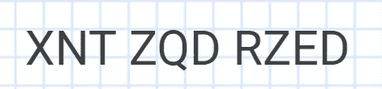
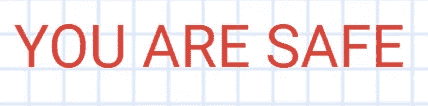
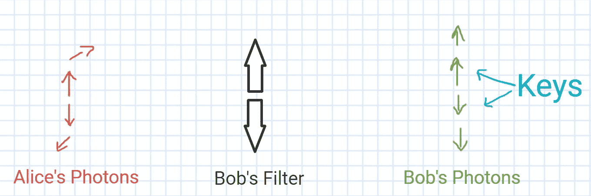

# 密码学新时代的曙光:量子密码

> 原文：<https://towardsdatascience.com/quantum-cryptography-b3b940ea711b?source=collection_archive---------31----------------------->

## 为后量子时代加密做好准备

利亚姆·塔克在 [Unsplash](https://unsplash.com?utm_source=medium&utm_medium=referral) 上拍摄的照片

围绕量子计算和它可以快速解决的用例有很多讨论，经典计算机可能需要很长时间才能解决。

这是一个确定的理论事实(截至目前)。这在谷歌宣布实现**量子霸权**后获得了很大的动力。

但是量子计算可能带来的最大影响或破坏之一是密码学。

詹姆斯·图斯在 [Unsplash](https://unsplash.com?utm_source=medium&utm_medium=referral) 上拍摄的照片

# 当前密码系统

在未知的电子零售网站上输入信用卡号码之前，你总是会小心谨慎或持怀疑态度。原因很明显，你想远离任何形式的欺诈活动。

[Bermix 工作室](https://unsplash.com/@bermixstudio?utm_source=medium&utm_medium=referral)在 [Unsplash](https://unsplash.com?utm_source=medium&utm_medium=referral) 拍摄的照片

因此，任何严肃的道德网上卖家都会遵循加密协议，让顾客感到安全，并避免任何欺诈性的交易活动。

目前使用的加密代码是基于密钥加密系统。

就像当你被困在电梯里时，有人给了你一条如下的加密信息:

神秘的信息

这没有透露任何意义或传达任何信息！

但是，如果有人告诉你对消息中的每个字符都应用+1，那该怎么办呢？那就是取字母表中的下一个字符。

消息解码！

这有道理！

# 当前加密机制

它建立在信任之上。

信任因素是什么？

> 从技术上讲，这个信任因子的基础是 **RSA 算法**。
> 
> 但是为了简单起见，让我们把它称为信任因子，以便于理解这个概念。

在这里，信任因子的意思是，当前的计算机或经典计算机将花费大量时间来预测一个巨大数字的精确质因数。

反过来的情况很容易用传统的计算机来完成。也就是说，它可以很容易地计算或做两个非常大的素数的乘法。但是因式分解是一个棘手的问题！

micha Parzuchowski 在 [Unsplash](https://unsplash.com?utm_source=medium&utm_medium=referral) 上的照片

这是一个可以通过量子计算机或者一种叫做**肖尔算法**的算法来解决的难题。

因此，企业可以为后量子时代做准备。

# **那量子密码是怎么工作的？**

你可能会问，量子密码或它的加密机制有什么特别之处，它们不能被破解吗？

答案在于物理学。

安德鲁·乔治在 [Unsplash](https://unsplash.com?utm_source=medium&utm_medium=referral) 上拍摄的照片

爱因斯坦的理论很棒，但在这里我们要感谢**海森堡的测不准原理**它指出，你试图测量一个粒子的动量或速度越精确，就越难获得它的位置，反之亦然。

爱丽丝-鲍勃安全通信信道

为了实现可靠的加密，窃听者不应该能够获得能够解密加密消息的密钥。

所以通信信道需要防篡改。

在量子加密的情况下，正如你从上图中看到的，Alice 试图向 Bob 发送特定方向的光子。Bob 放置了一个上下方向的滤光器(在中间),这样从滤光器出来的光子要么向上要么向下。即使光子在 Alice 的末端是对角倾斜的，它也是以向上或向下的方向从过滤器出来。

接下来发生的就是一通电话。什么？

杰米·霍顿在 [Unsplash](https://unsplash.com?utm_source=medium&utm_medium=referral) 上拍摄的照片

是啊！

Alice 和 Bob 通过安全通道进行连接，Bob 向 Alice 验证输出。对于爱丽丝和鲍勃来说，那些方向相同的光子被保留下来，其余的都被丢弃了。

那是你的防篡改钥匙。

答对了。

照片由[布鲁斯·马尔斯](https://unsplash.com/@brucemars?utm_source=medium&utm_medium=referral)在 [Unsplash](https://unsplash.com?utm_source=medium&utm_medium=referral) 上拍摄

# 又一个疑问..

如果窃听者试图测量或保持自己的光子过滤器在 Bob 的过滤器中间或之前会怎样？

没什么大不了的！

如果窃听者试图测量光子的状态，这个状态就会崩溃。感谢量子力学和亚原子粒子的核心性质。

Bob 将拥有自己的滤波器和测量值，然后在与 Alice 进行通信后决定密钥，因此窃听者将永远无法猜出用于加密的密钥。

为量子物理干杯！