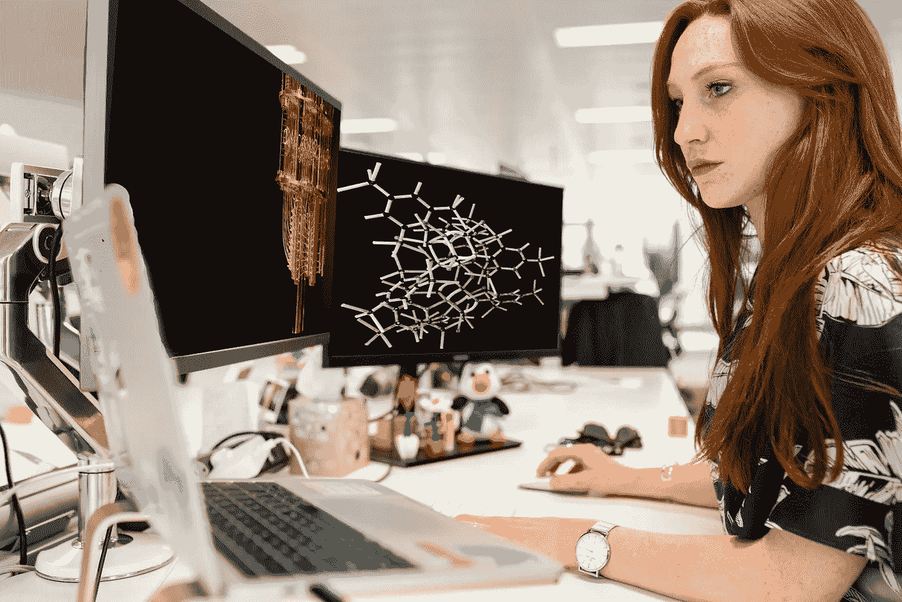
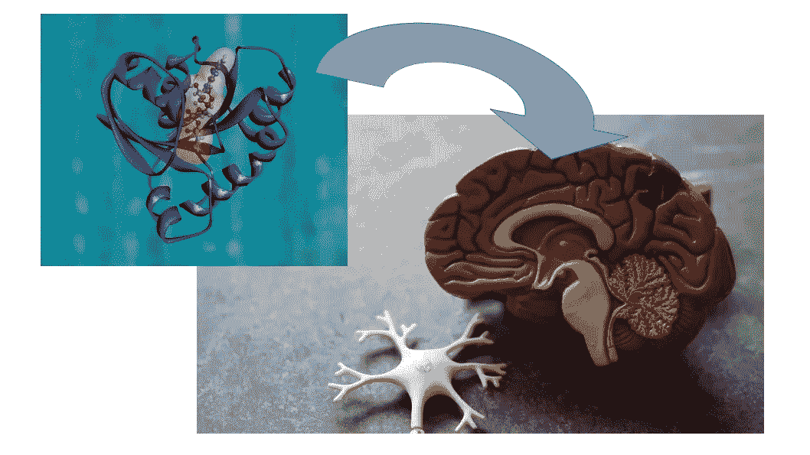
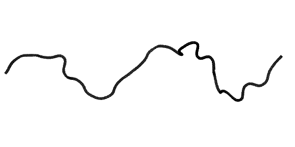
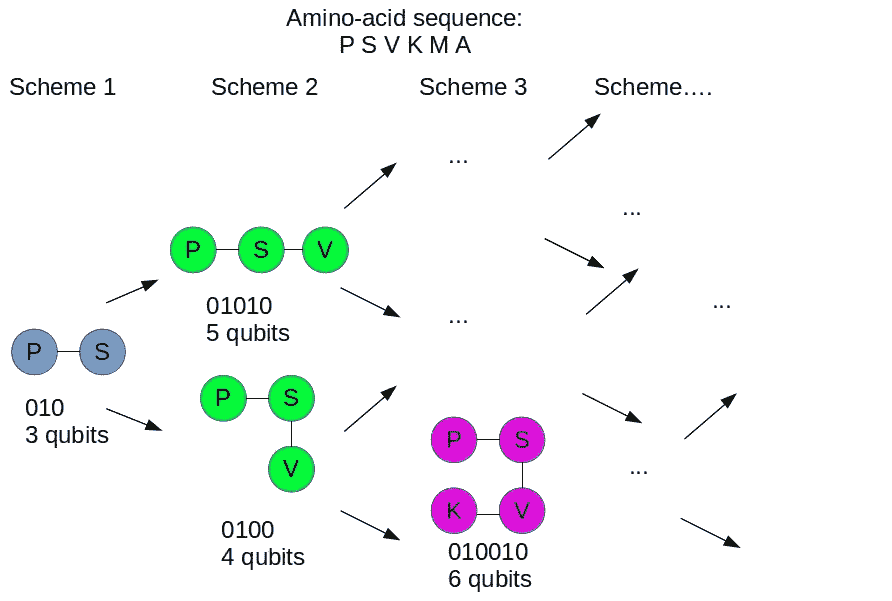
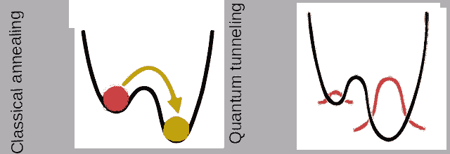

# 蛋白质折叠的量子景观

> 原文：<https://towardsdatascience.com/quantum-landscape-for-protein-discovery-62c0c86fc27e?source=collection_archive---------16----------------------->

## [思想和理论](https://towardsdatascience.com/tagged/thoughts-and-theory)

## 量子计算如何有希望开发治疗神经退行性疾病的药物等等



学分:Unsplash

药物设计的计算方法已经研究了很多年。药物设计的一个关键方面是推断或预测蛋白质的折叠，这将导致识别蛋白质如何相互作用。例如，大多数神经退行性疾病都是基于在大脑中传播的错误折叠的蛋白质，设计能够阻断它们的互补蛋白质有望成为治疗方法。



学分:Unsplash

然而，尽管我们在技术上取得了进步，模拟蛋白质仍然具有挑战性。这种困难源于这样一个事实，即蛋白质由 21 种不同的氨基酸组成(人类的序列多达 400 种)，这些氨基酸可以相互结合，并可以采用几万亿种形状中的一种。在这里，我将回顾目前的公式作为蛋白质折叠晶格，并报告一个例子的折叠可以发现使用 D 波量子计算机。以下部分是:

1.  **蛋白质折叠问题**
2.  **量子退火**
3.  **蛋白质折叠的实用量子退火**

# 蛋白质折叠问题

蛋白质可以以多种方式折叠，因为它们由许多氨基酸链组成，这些氨基酸链组合起来可以呈现几种可能的形状。

据信，蛋白质在稳定状态下折叠自身，这与**最低能量状态有关。**此外，一些疾病被认为是由蛋白质引起的，这些蛋白质不能正确折叠，然后在器官中积累，导致阿尔茨海默氏症、亨廷顿氏症和帕金森氏症等疾病。下图显示了实现的折叠和相应的最小化能量。



蛋白质折叠由蛋白质探索者作者创建

已经尝试使用 NMR(核磁共振)、低温电子显微镜和 X 射线晶体学来精确定义蛋白质的折叠，尽管这些方法仍然非常昂贵和耗时。最近，DeepMind 在机器学习方面的进展导致了 [AlphaFold](https://deepmind.com/research/open-source/alphafold_casp13) :一个能够预测蛋白质属性的神经网络给出了它的基因序列。令人难以置信的结果已经实现(更多信息见视频和下面的链接)

[](https://medium.com/geekculture/5-cool-ai-powered-drug-discovery-tools-1d7e976ffc2a) [## 5 款酷炫的人工智能药物发现工具

### 利用机器学习的力量和开源工具进行药物研发

medium.com](https://medium.com/geekculture/5-cool-ai-powered-drug-discovery-tools-1d7e976ffc2a) 

然而，Alphafold(及其扩展)受到神经网络近似的限制。我们在这里可以提出的问题是，是否有其他方法可以更有效、更快速地预测蛋白质折叠。

> 有理论和实验证据表明，与其他经典方法相比，使用**量子退火**解决经典优化问题具有优势(参见[桑托罗&托萨蒂 2006](https://iopscience.iop.org/article/10.1088/0305-4470/39/36/R01/pdf?casa_token=YHJRZo54nk4AAAAA:abFIyQ3FocfvGcFlFG82q-Nq9g4CaCKjom7drqFSSo-i1z9lDftw5mumHrVMmI44skqLZI-sRT2H4w) )。

现有多项式映射和更先进的量子器件的结合允许模拟更大的晶格折叠和其他相关优化问题。在这种背景下， [D-Wave](https://www.dwavesys.com/) 和 [IBM](https://www.ibm.com/quantum-computing/) 已经率先实现了优于经典计算的量子退火和优化。[例如，青霉素分子有 41 个原子。在经典计算机上对其建模需要 10 的 86 次方位，而在量子计算机上只需要 286 个量子位](https://venturebeat.com/2019/07/14/ibm-research-explains-how-quantum-computing-works-and-could-be-the-the-supercomputer-of-the-future/)(可能定义为耦合团簇或 [sto-ng](https://en.wikipedia.org/wiki/STO-nG_basis_sets) 对额外轨道的估计)。这种(声称的)减少的比特数和计算时间使得量子计算机有希望完成这项任务。

# 蛋白质是一个格子

一个蛋白质的晶格代表了空间中的一个序列，如下图所示，其中的旋转一般用 0 和 1(或者更好的量子位)的序列编码。下面的例子代表了由脯氨酸-丝氨酸-缬氨酸-赖氨酸-甲硫氨酸-丙氨酸(PSVKMA)的氨基酸序列给出的蛋白质，其在空间中可能存在几个折叠。



致谢:作者

# 量子退火

量子退火机(例如 D-wave 计算机)不同于经典计算机和基于门的量子计算机(例如 IBM)。它们只执行一种计算(通过退火进行优化)，而普通计算机和门模型量子计算机运行不同类型的算法。与门模型量子计算机相比，量子退火器更容易构建和放大，它们也没有那么大的灵敏度误差，误差可能会导致一点点次优的解决方案，但它们不会像基于门的量子计算那样破坏整个计算。尽管量子退火器的缺点是它只限于解决优化问题和相关的问题，比如采样。鉴于我们专注于蛋白质折叠预测，退火器是完美的。

> 但是术语“T1”退火“T2”从何而来？退火的概念来自冶金学。

这是一种众所周知的用于增加金属延展性或增加其导电性的方法:
首先将一块金属加热到高于其再结晶
温度的高温，当超过再结晶温度时，金属的原子点断裂，原子开始四处移动。第二个退火步骤只是让金属冷却到室温，因为这种冷却是以一种缓慢而平稳的方式发生的，当原子冷却下来并停留在它们的位置上时，它们可能会形成一个最佳的能量晶格。

从冶金转到**计算机科学，20 世纪 80 年代***模拟退火*被引入解决优化问题，以受益于减少热振动的想法，如蒙特卡洛优化。从某个初始猜测解开始，反复随机改变候选解的值，希望找到一个最优解。与机器学习中使用的传统梯度下降相比，这已经是一项成就，传统梯度下降只能在凸地形中执行。

> 你可以把这个过程想象成一个在山峦和山谷中移动的点，它对应于函数值。有时你需要爬上一座山，才能到达山那边的一个山谷。

在 90 年代，日本物理学家提出了一个想法，即使用量子波动而不是这些经典的模拟热波动来驱动退火算法中的这些转变。如下图所示，与可以推动状态越过能量障碍的热波动不同，量子算法不会导致系统越过障碍，而是让它们出现在障碍的另一侧(量子隧道)。



致谢:作者

可能的解决方案(蛋白质折叠的最佳配置)的数量是指数级高的——对于 m 个氨基酸和每个氨基酸位置的 n 种可能性的蛋白质，存在 N^M 可能的配置。考虑到这个问题的本质(为了找到最优解)，很明显量子力学对于找到一个合适的算法是必要的。

# **蛋白质折叠的实用量子退火**

在 Qiskit 中，有一种东西叫做[量子近似优化算法(QAOA)](https://qiskit.org/textbook/ch-applications/qaoa.html) 在有限或可数无限的潜在解集合中搜索最优解。然而，Qiskit 运行在 IBM 量子计算机上，这些计算机是门，而不是定义上的“退火程序”。

D-Wave 系统是专门设计来通过量子退火寻找解决方案的。此外，人们已经在他们身上测试了著名的罗塞塔打包器的量子版本: [QPacker](https://www.biorxiv.org/content/biorxiv/early/2019/09/02/752485.full.pdf) 。

将我们到目前为止所讨论的内容整合在一起的一般过程总结如下:

1.  创建一个格子网格，其中每个单元是一个量子位，编码有关氨基酸反应的信息
2.  对蛋白质进行常规转[辅助编码](https://en.wikipedia.org/wiki/Ancilla_bit)
3.  基于该编码创建能量函数
4.  使用量子退火找出能量函数最小的地方

氨基酸之间的键由两个量子位给出，这也定义了蛋白质折叠的方向。例如，指向右侧的键定义为“01”，指向下方的键定义为“00”，依此类推。对于一个有六个氨基酸的蛋白质，它的转折顺序可以表示为“0100101011”

可以通过 D-wave 系统 [Leap](https://www.dwavesys.com/take-leap) 实现。通过使用 D-wave SDK，我们可以定义一个求解器，并定义一个氨基酸邻接图。可以按照本视频中的步骤进行配置:

您可以通过 D-wave (1 分钟免费，其余时间付费)或通过 Amazon Braket 请求访问:

[](/use-a-quantum-cloud-for-almost-free-13da8f1dfa34) [## (几乎)免费使用量子云

### 实用量子计算 AWS Braket 101

towardsdatascience.com](/use-a-quantum-cloud-for-almost-free-13da8f1dfa34) 

第一步是导入必要的库

```
from dwave.system import DWevoSempler 
from dwave.system.compositos import EmbeddingComposite, FixedEmboddingComposite 
import dwave_networkx as dnx 
from minorminer import finde_embedding 
import dimod 
from sympy.parsing.sympy_pareer import parse_expr
import json
import numpy as np
import networkx as nx
import matplotlib.pyplot as plt
```

然后，可以使用图形的求解器:

```
solver = DWaveSampler(solver=”DW_2000Q_5”)solver_G = nx.Graph(solver.edgelist)
```

前 3 个量子位必须是固定的，以避免同一图形中多个问题的任何冗余构象。

```
energy_expr_less_00 = preprocess_expr(energy expr.subs({‘q0000’:0, ‘q0001’:1,’q00002',0}), q) 
energy_expr_ot_00_func = lambdify(q[3:],energy_expr_less_00)energy_expr_ot_00 = energy_expr_less_00.as_ordered_terms()
```

下面的步骤是定义嵌入:

```
problem = x.Graph()
for k, v in dict(bqm.linear).items(): 
 problem. add_node(k) 
for k, v in dict(bqm.quadratic).items(): 
 problem.add_edge(*k)num_cores 12 
embedding_list = Parallel(n_jobs=num_cores)(delayed(find_embedding) (problem, solver_G) for jobid in range(num_cores))
```

现在可以求最优解的能量:

```
bst_00 ={}
for j, qj in enumerate(q):
 bst_00[qj] = results[best,j]smpl_00 = dict(zip(list(bqm_00.variables), [None]*len(bqm_00.variables 
for key in bqm_00.variables:
 if type(key) == str:
 k1, k2 = parse_expr(key).as_coeff_mul()[1]
 smpl_00[key] = bst_00[k1] * bst_00[k2] 
 else:
 ampl_00[key] = bst_00[key]smpl_spin_00= ampl_00.copy() 
for key, val in smp1_00.items(): 
 ampl_spin_00[key] — 2*val -1mene_00= bqm_00.energy(ampl_00) 
mene_spin_00 = bqm_spin_00.energy(empl_spin_00)
```

该代码将导致具有最低能量的折叠。

# 结论

蛋白质折叠预测仍然是一个正在进行的研究领域，量子计算的使用仍然是比较新颖的。

仍然需要研究错误折叠的蛋白质，这仍然涉及不完全理解的过程，事实上，在这个方向上关于阿尔茨海默氏病的大多数研究都不太成功。希望未来的研究可以进一步揭示蛋白质是如何错误折叠的，并帮助设计可用于治疗的对接对应物。

# 参考

[Perdomo-Ortiz，Alejandro 等，“通过量子退火发现晶格蛋白质模型的低能构象”*科学报告*2.1(2012):1–7。](https://www.nature.com/articles/srep00571)

【李，】等，“量子退火与经典机器学习在简化计算生物学问题中的应用” *NPJ 量子信息*4.1(2018):1–10。

赖尔、马库斯等人“阐明量子计算机上的反应机制”*美国国家科学院院刊*114.29(2017):7555–7560。

# 想连接就连接


[@ Dr _ Alex _ 克里米](https://twitter.com/Dr_Alex_Crimi)


[@阿列克里米博士](https://www.instagram.com/dr.alecrimi/)


[亚历山德罗·克里米——YouTube](https://www.youtube.com/alecrimi)


[https://web.facebook.com/dralecrimi](https://web.facebook.com/dralecrimi)