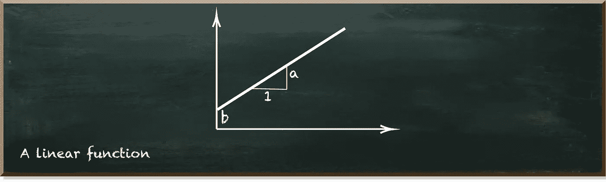

# 量子线性函数

> 原文：<https://towardsdatascience.com/quantum-linear-function-c86985f6118f?source=collection_archive---------32----------------------->

## 量子机器学习基础

量子机器学习要不要入门？看看[用 Python 动手量子机器学习。](https://www.pyqml.com)

让一个平淡的话题变得有趣最简单的方法是什么？

正确！你只要在上面加上“量子”两个字。想看看吗？

线性函数怎么样？它描述了坐标系中的一条线——没什么大不了的。如果帖子是关于线性函数的，我会停止阅读。但是如果我们看看如何创建一个量子线性函数呢？

下图描述了由两个量子位组成的量子线性函数的结果。对于每一步，概率增加一个固定的量，即斜率。

作者图片

在继续用量子线性函数来创建这样的分布之前，让我们回顾一下我们在高中所学的线性函数。

线性函数的形式为 y=f(x)=ax+b。

从图形上看，a 表示图形的斜率。这是当 x 轴上的位置增加 1 时，图形中 y 的变化。b 是截距，即图表与 y 轴相交的点。

作者图片

我们看到的第一个显著区别是，经典线性函数是连续的，而它的量子对应物是离散的。第二是量子线性函数只对两个轴上的正值起作用。

让我们从量子线性函数的概念开始。我们有四个枚举状态。我们坚持二进制数字格式。

我们将每个位置的值分成大小相等的块。因为我们的功能在增加，所以我们每一步增加一个块。所以，我们从零开始。然后，我们在状态 1 添加一个块，在步骤 3 和 4 分别添加另一个块。

作者图片

现在，让我们创建相应的量子电路。我们使用两个量子位。第一个量子位代表状态的右(下)数，第二个量子位代表状态的左(上)数。

我们首先根据上量子位的值来分割状态，并计算块数。当上量子位为 0 时有三个块，当上量子位为 1 时有七个块。

作者图片

于是，我们把上量子位放入状态 1 的概率为 7/10 的状态。因此，它有 3/10 的概率处于状态 0。

接下来，我们只看这些上量子位为 1 的状态。然后，我们拆分这些状态，并计算块数。

然后，我们把较低的量子位放入一个状态，只有在较低的量子位为 0 的情况下，才有 4/7 的概率处于状态 1。

作者图片

我们做同样的事情来划分上量子位处于状态 0 的状态。

下面的清单描述了生成我们在顶部显示的发行版的完整代码。

我们首先从 Qiskit 导入我们使用的函数——这是 IBM quantum 开发工具包。`prob_to_angle`函数获取一个概率，并返回量子位状态向量的相应角度。[这篇文章](https://betterprogramming.pub/if-you-want-to-gamble-with-quantum-computing-e327c11f97e5)更详细地解释了这个功能。

然后，我们用两个量子位定义一个`QuantumCircuit`。电路的主要部分由 RY ( `ry`)和受控 RY ( `cry`)门组成。这些将指定的量子位置于对应于指定角度的状态。

我们遵循我们之前描述的步骤。门`qc.ry(prob_to_angle(7/10), 1)`将上部量子位(在位置 1)置于一种状态，其中角度对应于 7/10 的概率。

只有当位置 1 的量子位为 1 时，门`qc.cry(prob_to_angle(4/7), 1, 0)`将较低的量子位(在位置 0)置于角度对应于概率 4/7 的状态。

如果上部量子位是 1，门`qc.cry(prob_to_angle(2/3), 1, 0)`也将调整下部量子位的状态。因此，我们将它封装到 X 个门中，翻转这个量子位的状态 0 和 1 的概率。所以，我们只在上量子位为 0 的情况下，应用代表 2/3 概率的角度。

当您运行代码时，您会得到下面的结果。

作者图片

# 结论

如果你读过我之前关于[多内核发行版](/how-to-create-quantum-multinoulli-distributions-with-qiskit-cea9021f6cb9)的文章，你可能对这种方法很熟悉。量子部分其实也是一样的。但是将值分成块的概念方法是新的。我们将在下一篇文章中推广量子线性函数时利用这种方法。

量子机器学习要不要入门？看看[用 Python 动手量子机器学习。](http://www.pyqml.com)