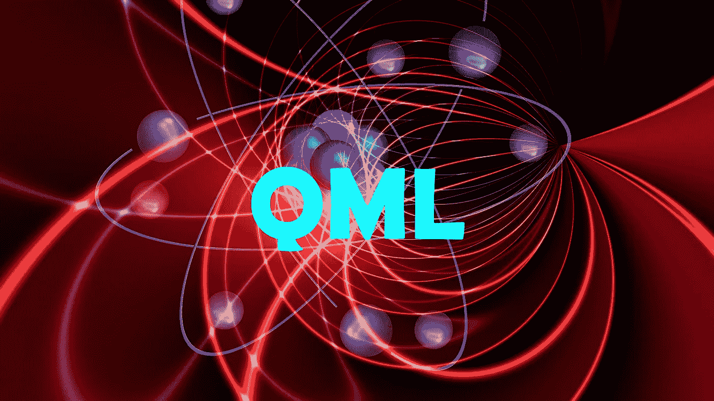
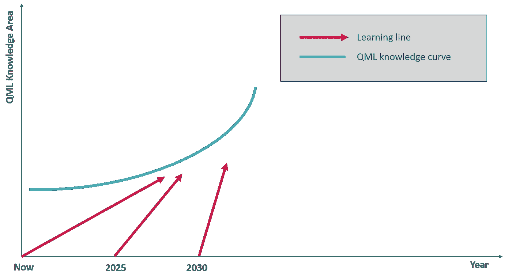
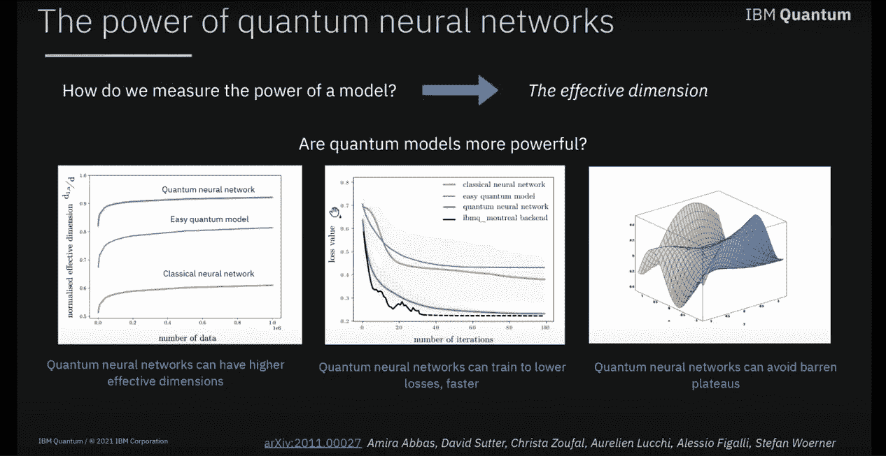
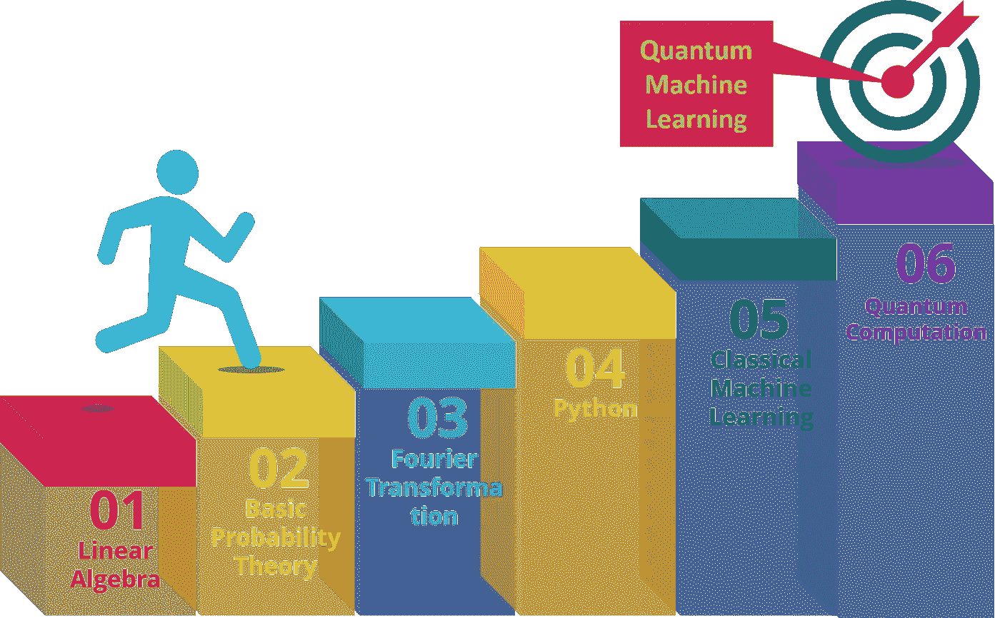
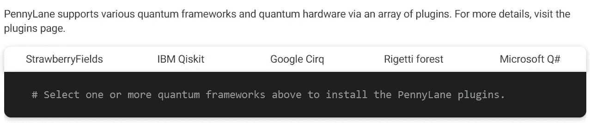

# 量子机器学习——是时候开始了

> 原文：<https://towardsdatascience.com/quantum-machine-learning-its-time-to-start-now-1f5a1ee9bc31?source=collection_archive---------16----------------------->

图片由来自 Pixabay 的 Gerd Altmann 提供

## QML ML 从业者的下一个逻辑步骤

在未来几十年，量子计算将在技术、科学和商业发展中发挥重要作用。随着谷歌声称“量子至上”和对这一主题的指数兴趣，我们离看到许多棘手的问题挑战用量子处理解决的经典计算机不远了。此外，有明确的迹象表明，机器学习和量子计算将在加强彼此的领域中发挥互补作用。

但主要的问题是，为什么现在人们应该深入到像量子机器学习这样看起来复杂而难以学习的复杂主题中。
幸运的是，量子计算和量子机器学习并没有看起来那么可怕。因此，人们可以快速启动，而不必过于担心量子力学中许多令人恐惧的“怪异”函数的复杂性。

# 一个人为什么要学量子机器学习？

以下是你应该认真考虑投身量子计算(QC)然后投身量子机器学习(QML)的几个理由。

作者图片

1.  数学极其优雅，用数学理解量子计算很有趣。
2.  优秀的免费资源和书籍等参考资料可供学习。
3.  学习曲线非常陡峭，最好现在就开始，因为该领域的研究和进步正在爆炸式增长。随着知识领域呈指数级扩展，晚进入将使旅程更加艰难。参考上图；随着时间的推移，学习曲线会变得更陡。
4.  社区每天都在变大；因此，当有人陷入困境时，帮助就在身边。
5.  量子机器每天都在变得强大。任何超级计算机或 GPU/TPU 的任何组合都需要数千年才能实现的复杂计算看起来越来越光明。但是，与此同时，量子计算机将在几分钟内完成。
6.  许多开源软件开发工具可用于量子计算、模拟，甚至连接到量子计算机进行概念验证。
7.  早期研究表明，QML 将在许多复杂的机器学习任务中胜过 CML。例如，下图显示量子神经网络可以有**更高的有效维度，更低的损耗更快，**和**避开贫瘠的高原**。

图片来自 YouTube 视频 [Amira Abbas](https://www.youtube.com/watch?v=yHG2z_BQJ8M)

# 量子机器学习之前应该学什么

作者图片

1.  复数上的线性代数
2.  基础概率和数论
3.  傅立叶变换及其量子版本
4.  Python 将是一个不错的选择，因为 python 中有许多量子计算开源库和框架。
5.  经典机器学习将是理解许多等效或高级 QML 算法的先决条件。
6.  量子计算的关键概念，算法和使用 python 编程的算法实现将为理解 QML 提供必要的基础。

# 一个人应该如何学习量子机器学习？

## 线性代数:

大部分量子计算书都涉及复向量空间中的线性代数。在这个过程中，我主要发现了迈克尔·洛切夫的一本书非常有帮助，因为它有助于建立自下而上的知识。我强烈建议保留这个作为参考。如果哪个题目听起来很复杂，可以回过头从基本定理去理解，然后明白症结所在。这本书还有一个配套的 [YouTube](https://www.youtube.com/watch?v=rT40sxiqHJQ&list=PLMnoxczUtKqWpKZTwpRBHrif_y-xENTfx) 视频，以好莱坞风格呈现。[最后，Qiskit](https://qiskit.org/textbook/ch-appendix/linear_algebra.html) 有一本在线教材，也是对必修的线性代数的极好介绍。来自 Springer 的用于量子计算的线性代数包含了理解量子计算所需的线性代数的关键领域的简明摘要。你也可以试试下面的 YouTube 视频。

布兰特·卡尔森的 YouTube 视频

## 概率和数论

我不会在这里详述，因为关于这些主题有很多资料。

## 傅里叶变换

我再次推荐阅读 Michael Loceff 的书，这本书非常全面，从傅立叶级数、离散和快速傅立叶变换到量子傅立叶变换。YouTube 上也有很多关于这个话题的资料。

## 经典机器学习

人们必须非常熟悉经典的机器学习理论、算法、不同的库和实现。媒体、MOOC、YouTube 视频等提供了大量材料。

## 量子计算

《量子计算圣经》是 Nielsen 和 Chaung 写的一本书。即使过了二十年，它仍然是关于这个主题的最好的书，尽管许多部分现在有点过时了。

 [## 量子计算与量子信息:十周年纪念版

### 购买量子计算和量子信息:Amazon.com 10 周年纪念版

www.amazon.com。](https://www.amazon.com/Quantum-Computation-Information-Cambridge-Sciences/dp/0521635039) 

Loceff 书还涵盖了基本的量子计算概念和强大的算法。我还会推荐几门课程，比如 Edx 的 Umesh Vazirani 课程(你也可以在 YouTube 上找到视频)。

 [## 量子力学和量子计算

### 量子计算是一门非凡的学科，它建立在计算机所基于的伟大计算发现的基础上。

www.edx.org。](https://www.edx.org/course/quantum-mechanics-and-quantum-computation) 

我还会推荐 YouTube 上 John Preskill 的视频课程内容。

约翰·普雷斯基尔的 Youtube 视频

请参考下面的页面，里面有视频、书籍、MOOC、博客等精选列表。，用于量子计算。

[https://qosf.org/learn_quantum/#massive-open-online-courses](https://qosf.org/learn_quantum/#massive-open-online-courses)

https://github.com/desireevl/awesome-quantum-computing

## Python 库

像 IBM、Google 这样的行业巨头支持许多软件工具和开发库。在这里，你可以找到一份全面的清单和详细信息[。我发现 Qiskit 是所有软件中最受欢迎的，并且易于使用，但是像所有其他的软件库一样，观点不同，你可能喜欢 Google 的 Cirq 或者 Rigetti 的 PyQuil。Qiskit 有很多内容，包括一本](https://research.aimultiple.com/quantum-software/)[教材](https://qiskit.org/textbook/preface.html)和 YouTube 频道，很多很棒的视频。

图片来自 YouTube，作者 Qiskit

## 量子机器学习

最后，我们在量子机器学习领域。我们正处于 NISQ(嘈杂的中间尺度量子)时代，理解我们在短期内可以用不完美的量子机器做什么很重要。

Edx 提供了一个 MOOC，其中有量子计算和量子增强机器学习的实践介绍，以及[代码报告](https://gitlab.com/qosf/qml-mooc/)。

来自 YouTube 的量子机器学习 MOOC 视频

有两本书是关于 QML 的，但我发现没有一本真正有价值，因为这两本书都缺乏 QML 地区的深度，而且大部分时间都在解释 QC。

*   *量子机器学习:量子计算对数据挖掘意味着什么，作者彼得·魏特克*
*   玛丽亚·舒尔德用量子计算机监督学习

我还会推荐参考来自 [Penny Lane](https://pennylane.ai/qml/) 的 QML 内容和库。这是因为 PennyLane 支持所有主要的量子框架。

图片来自 [PennyLane](https://pennylane.ai/install.html)

这个 Github 库有一个完整的 QML 算法列表。

用于机器学习的 Qiskit 页面也包含有价值的实现信息。

我为 QML 创建了一个 YouTube 播放列表，在这个[播放列表](https://www.youtube.com/playlist?list=PLSOxlehGDVemvbrCp59GUMIrPeFNHQZyM)中，你会发现 YouTube 上大量免费的 QML 内容。

一个重要的建议是，在你熟悉基本概念和符号之前，不要进入研究论文，否则你会发现很难通读论文。

# 最后一个音符

QC 和 QML 都是蓬勃发展的领域，有很多炒作，希望，有时还有不合理的期望。我试着分享我的经历和我到目前为止的旅程。如果您有任何建议或遇到任何其他可以帮助我们蓬勃发展的社区的内容或信息，我希望收到您的来信。

感谢阅读。你可以在 [LinkedIn](http://www.linkedin.com/in/baijayantaroy) 上联系我。

> 只需每月 5 美元，就可以无限制地获取最鼓舞人心的内容…点击下面的链接，成为媒体会员，支持我的写作。谢谢大家！
> [***https://baijayanta.medium.com/membership***](https://baijayanta.medium.com/membership)

你可能也想看看下面这篇关于量子数据编码的文章。

 [## 关于量子机器学习的数据编码

### 用于量子机器学习的量子数据嵌入方法

baijayanta.medium.com](https://baijayanta.medium.com/all-about-data-encoding-for-quantum-machine-learning-2a7344b1dfef)