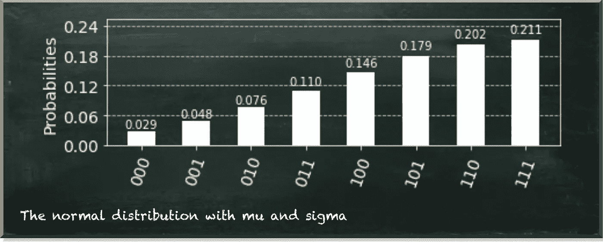
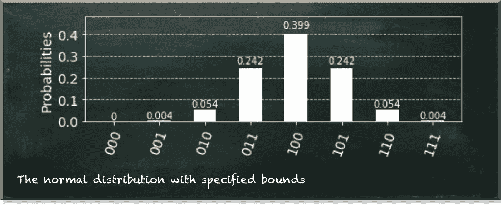
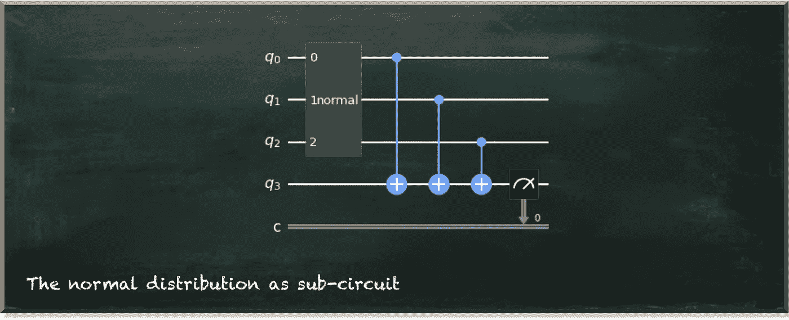

# 量子正态分布

> 原文：<https://towardsdatascience.com/quantum-normal-distribution-cc6710c27879?source=collection_archive---------23----------------------->

## 量子机器学习算法的构建模块

量子机器学习要不要入门？看看 [**动手量子机器学习用 Python**](https://www.pyqml.com/page?ref=medium_normal&dest=/) **。**

> **“我的女王，农民没有量子正态分布！”——“让他们使用量子伯努利分布。”**
> “此后不久无头分析”的首席数据科学家玛丽·安托瓦内特

作者图片

发行版是任何数据科学家或机器学习工程师的面包和黄油。我们每天都在使用它们。没有他们我们无法生存。不像计算机科学家可以奢侈地使用定值变量，我们得到的只是统计描述。话说回来，用分布来表示变量是很有表现力的。它明确了我们信念的概率性质。

所以，我们不要抱怨太多。幸运的是，许多变量来自众所周知的分布。这让我们可以重用现有的函数来创建和处理这样的变量。

例如，高斯正态分布是最常见的分布之一。你到处都能看到它。血压、身高和智商得分遵循正态分布。它符合许多自然现象，因为它在平均值处有峰值，向两端变平。换句话说，更有可能看到接近平均值的值，而不是离群值。

作者图片

有两个参数用于自定义正态分布。这是它的平均𝜇和标准差𝜎.您可以通过密度函数计算曲线上任意一点𝑥的密度

如果你观察单个量子位，[你会发现它遵循伯努利分布](/the-very-first-step-into-quantum-machine-learning-95efdf0d980c)。如果你使用多个量子位，[你也可以创建一个多量子分布](/how-to-create-quantum-multinoulli-distributions-with-qiskit-cea9021f6cb9)。当然，对于离散正态分布是一般多正态分布的特例，我们可以用同样的方法创建它。但是创建多内核发行版相当麻烦。当然，这是因为它没有利用正态分布的任何特性。

那么，让我们来看看如何模拟一个量子正态分布。像往常一样，我们使用 IBM 的量子开发 SDK Qiskit。Qiskit 附带了相当多的实用功能。毫不奇怪，有一个函数为我们创建了一个正态分布。这是`NormalDistribution`。

尽管`NormalDistribution`仍然是 Qiskit 主包的一部分，但它已经被弃用了。因此，我们从它的新位置导入它。这需要我们安装 Qiskit 的财务包。

现在，让我们看看这个函数能做什么。

正态分布函数为我们创造了一个完整的量子电路。我们必须提供量子位的数量作为参数。在这种情况下，我们使用三个量子位。

作者图片

此外，我们可以指定正态分布的常用参数𝜇 ( `mu`)和𝜎 ( `sigma`)。我们必须注意，参数`sigma`等于**方差**，𝜎，而不是标准差。

下图描述了该电路的输出。

作者图片

它看起来并不像正态分布，不是吗？这有一个简单的原因。函数`NormalDistribution`只表示-1 到 1 范围内的分布。因为我们将平均值(𝜇)设置为 1，所以我们在该范围的右侧看到了分布的峰值。但是，我们可以在分布的左下方看到更多细节。

你可能会奇怪为什么峰值的绝对值和以前不一样了。当然，我们为`sigma`指定了一个值。但是，实际上，我们把它设置为 1。这也是默认值。所以，我们什么都没改变。然而，我们的量子系统的所有概率的总和必须是 1。因此，我们不能看到绝对值，也不能在不同的分布之间进行比较，而只能看到分布中心和边缘值之间的相对差异。

在开始测试`mu`和`sigma`的不同值之前，让我们看看可以放入函数的另一个参数。Qiskit 还允许我们指定分布的界限。

当我们指定一个比缺省值更大的值时，我们可以更清楚地看到正态分布的形状。

作者图片

只剩下一个问题:**如果我想在其他门旁边使用正态分布怎么办？**

答案是将正态分布函数创建的电路变成一个定制的量子门。然后，你可以在另一个量子电路中使用这个门，它可以做任何你想做的事情。

我们从我们的`QuantumCircuit`的定义开始。这一次，我们指定它有四个量子位和一个经典位。我们创建另一个电路(`ndc`)来保存我们的`NormalDistribution`。然后，我们将`ndc`附加到`qc`上，我们就完成了。然后，我们可以处理组成正态分布的量子位，就像它们是任何其他量子位一样。

在这种情况下，只有当我们将其他量子位中的一个测量为 1 时，我们才翻转最后一个量子位(不属于正态分布的一个)。

最后，我们测量这最后一个量子位，并将结果放入经典位。

作者图片

下图描述了该电路的示意图。

作者图片

我们看到正态分布像任何其他多量子位门一样工作。

量子机器学习要不要入门？看看 [**动手量子机器学习用 Python**](https://www.pyqml.com/page?ref=medium_normal&dest=/) **。**

在这里免费获得前三章。