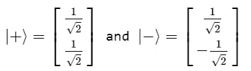
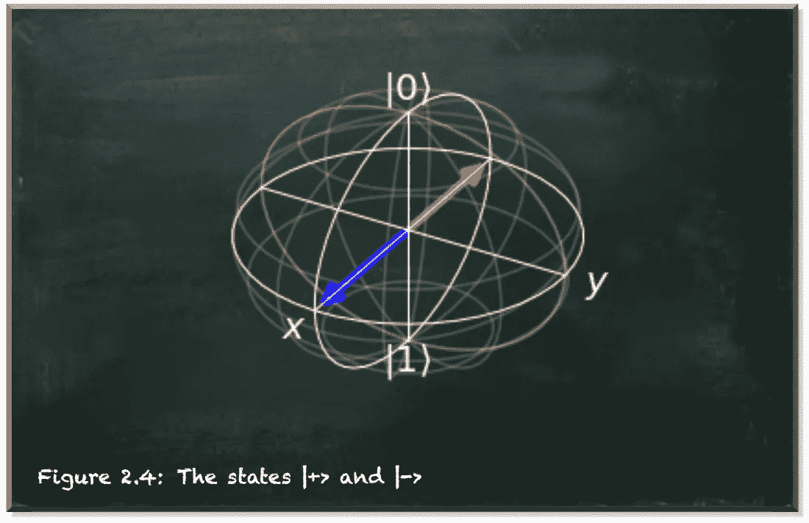
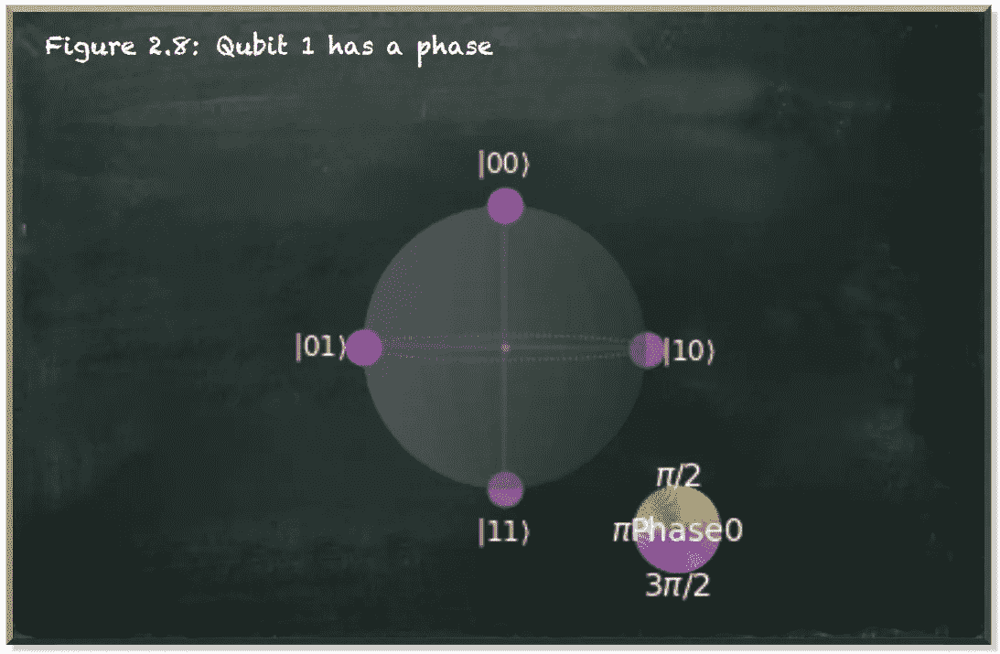

# 量子相位反冲

> 原文：<https://towardsdatascience.com/quantum-phase-kickback-bb83d976a448?source=collection_archive---------6----------------------->

## 我告诉你的是真的…从某种角度来看

本帖是本书的一部分: [**动手用 Python 学习量子机器**](https://www.pyqml.com/page?ref=medium_kickback&dest=/) **。**

量子纠缠是量子力学的惊人特征之一。两个纠缠的粒子共享一个叠加态——不管它们相距多远。

从实用的角度来看，我们可以利用纠缠让一个量子比特控制另一个量子比特的状态。例如，受控非门(CNOT-或 CX-gate)只有在控制量子位处于|1⟩.状态时，才会切换目标量子位的振幅如果控制量子位处于|0⟩.状态，什么也不会发生

这种受控量子门让我们能够精确地操纵多量子位系统。在[这篇文章](/composing-quantum-computing-controls-f1acd83c48a8)中，我们使用纠缠来创建一个细粒度的概率系统。

受控量子门的另一个实际特性是，它们不会触及控制量子位。

下图描述了 CNOT 门的真值表。

作者弗兰克·齐克特的图片

无论我们将哪种量子位值组合输入运算，控制量子位都不会改变。

图片由作者提供，灵感来自星球大战

当我们处理量子位元时，有一个实际可行的量子转换门概念是最重要的。然而，每隔一段时间，我们需要记住量子操作本质上是一种物理操作。CNOT 门也是。

对于物理学中的每一个作用，都有一个相反的反应。因此，我们甚至应该怀疑 CNOT 门的明显片面性。

每当我们在量子计算中挑战我们的直觉时，咨询基础数学是一个好主意。

CNOT 门是一个两量子比特的门。因此，它转换量子位状态，我们用一个四维向量来表示它的状态。

因此，CNOT 门具有 4×4 的变换矩阵。

如果控制量子位(在狄拉克符号中的左边位置)在|0⟩态，就像在|00⟩和|01⟩.态一样，则没有影响

但是如果控制量子位处于|1⟩状态，那么控制量子位就从|0⟩转换到|1⟩，反之亦然。

数学证实了我们的直觉。

当我们用数学公式描述量子态和量子操作时，我们使用|0⟩和|1⟩矢量作为基础。|0⟩和|1⟩表示标准或计算基础状态。这些状态对应于我们在观察量子位时可能获得的测量值。我们绝对确定地测量|0⟩态的一个量子位为`0`。因此，我们测量|1⟩态的一个量子位为`1`。虽然{|0⟩,|1⟩}基础便于数学处理，但它只是基础物理的一种表示。

就像有一个*控制*量子位嵌入了关于量子位状态的偏见，让我们认为操作是单方面的，我们选择的数学基础导致了 CNOT 变换的特定表示。但这不是唯一可能的表示。事实上，还有无限多其他可能的选择。我们的量子位并不局限于这两种状态。量子位可以是两种状态的叠加。如果你不熟悉量子叠加，[这篇文章](/do-you-struggle-with-the-quantum-superposition-86d0f2147bfb)提供了一个介绍。

考虑一下布洛赫球。归根结底，它是一个球体——完全对称，没有一个点比其他任何点更特殊，也没有一条轴比其他任何点更特殊。标准基础也不是特别特别。

下图描述了两个基本状态|0⟩和|1⟩.

作者弗兰克·齐克特的图片

但是我们的两个量子位也可以处于任何其他状态。例如，有几个州

那是[在基态上应用哈达玛门](/quantumic-math-are-you-ready-for-the-red-pill-4860f0ad79bf)的结果。下图描述了这两种状态。

作者弗兰克·齐克特的图片

在数学上，下面的矩阵代表了哈达玛门在两个量子位上的应用。

所以，如果我们把这个矩阵应用在|00⟩态的两个量子比特上，它们会出现在|++⟩.态

输入州|01⟩产生州|+−⟩.

输入州|10⟩产生州|−+⟩.

最后，如果我们在|11⟩态的两个量子位上应用这个变换，我们把它们放入|−−⟩.态

让我们重温一下矩阵向量乘法。当我们将一个矩阵乘以一个列向量(我们的量子态)时，结果是另一个列向量，就像这样:

对于矩阵的每一行，我们将该行中的每个值(列)乘以向量的第 x 个值。如果向量中除了一个值之外的所有值都是 0，而这个值是 1，那么 1 的位置表示我们最终得到的矩阵的列。

现在，让我们把 CNOT 门应用在叠加态的量子位上。我们可以通过将 CNOT-gate 和 H⊗H 变换的矩阵相乘来计算总的变换矩阵。

眼尖的读者可能会注意到，非门切换了 H⊗H-matrix.的第二列和第四列

当我们将这种变换应用于基态的四种组合时，我们可以看到一个有趣的模式。

实际上，如果目标量子位(在右手边)处于|1⟩状态，控制量子位(在左手边)的状态就从|+⟩翻转到|−⟩，反之亦然。

简而言之，我们可以说:

|+⟩和|−⟩这两个州具有与|0⟩和|1⟩.相同的测量概率它们以 0.5 的概率产生任一值。因此，CNOT 门没有任何直接可测量的含义。然而，控制量子位改变了它的相位。它呈现出受控量子位的相位。

对于目标量子位的相位被踢到控制量子位，我们称这种现象为*相位反冲*。

让我们回到实践中来。以下代码绘制了|+−⟩.的布洛赫球体

作者弗兰克·齐克特的图片

接下来，我们对这个状态应用 CNOT 门，位置 1 的量子位是控制量子位，位置 1 的量子位是目标。

作者弗兰克·齐克特的图片

根据数学，不是目标量子位，而是在位置 0 的控制量子位切换其相位。再来看看另一种情况。

下面的电路通过使用 RZ 门在两个量子位上应用哈达玛门，并在量子位 1 上应用相移。类似于围绕 Y 轴旋转量子位状态向量的 [RY 门](https://betterprogramming.pub/if-you-want-to-gamble-with-quantum-computing-e327c11f97e5)，RZ 门围绕 Z 轴旋转量子位状态向量，因此应用一个相位。

作者弗兰克·齐克特的图片

我们看到位置 0 的量子位位于 X 轴上。位置 1 的量子位位于 Y 轴上。我们也来看看这个两量子位系统的四个态的相对相位。

作者弗兰克·齐克特的图片

我们看到量子位 1(在 Qiskit 中，量子位位置从右向左读取)处于|1⟩.状态的那些状态的相移下一步，我们应用 CNOT 门，量子位 0 作为控制量子位，量子位 1 作为目标。

作者弗兰克·齐克特的图片

首先要注意的是相对相位。状态|00⟩和|11⟩处于与状态|01⟩和|10⟩.不同的相同阶段虽然对于控制量子位(Qiskit 中的右手量子位)是|1⟩的状态，相位似乎翻转了，但实际上对于目标量子位是|1⟩.的状态，相位翻转了由于相位是相对的，我们无法分辨哪个相位是原始的，哪个相位是移动的。

但更重要的是要注意转变的程度。颜色表示π/2 的相对位移。这是我们在量子位 1 上应用的相位。因此，当目标量子位是|+⟩或|−⟩.时，CNOT-gate 并不总是翻转半个电路的相位但是“非门”颠倒了|01⟩和|11⟩的状态。实际上，它将目标量子位的相位应用于控制量子位。

# 结论

通常，发展一种量子态和操作的非数学直觉是有好处的。尽管如此，我们总是需要考虑到我们正在处理一个量子力学系统。量子力学常常是反直觉的。我们可以用数学补充我们的直觉。但是数学也不是没有陷阱。

从经典计算和为了数学的方便，我们经常依赖于标准的基本向量|0⟩和|1⟩.但是当处理量子位时，我们需要记住它们并不局限于这些状态，而是可以处于叠加态。

我们知道 CNOT 门不是单方面的行动。它显然有可能影响控制量子位的状态。即使相位不可直接测量，也有办法利用状态之间的相位差异。事实上，突出的算法，如格罗弗的搜索算法，利用了这一效应。我们将来也会。

本帖是本书的一部分: [**用 Python 动手做量子机器学习**](https://www.pyqml.com/page?ref=medium_kickback&dest=/) **。**

在这里免费获得前三章。