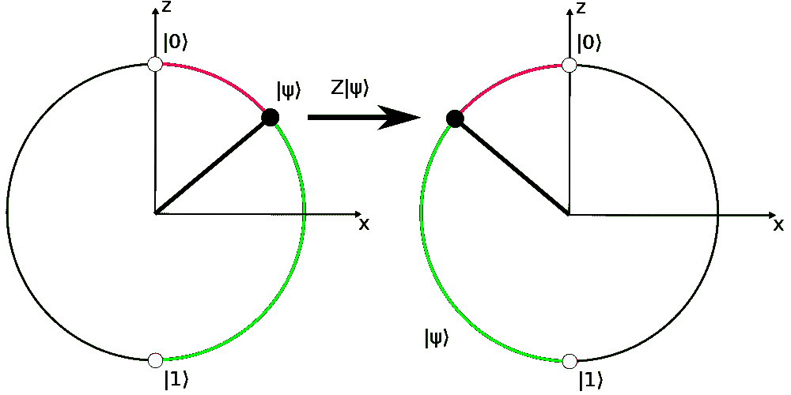

# 量子编程——抽象层次 1:逻辑门

> 原文：<https://towardsdatascience.com/quantum-programming-abstraction-level-1-logic-gates-486f941e831a?source=collection_archive---------25----------------------->

在量子计算机编程的大部分时间里，我们会考虑量子比特的叠加态。现在对我们的直觉有用的是，有一种方法可以将叠加可视化，这样我们就可以分析每个逻辑门对叠加的影响。

[*图片作者*](https://kblagoev.com/blog/quantum-programming-abstraction-level-1-logic-gates/)

1.  从量子力学中抽象出我们自己的量子编程:抽象层次 0
2.  [量子编程——抽象层次 1:逻辑门](https://kblagoev.medium.com/quantum-programming-abstraction-level-1-logic-gates-486f941e831a) (this)

我们之前已经计算出量子计算机对量子位进行逻辑运算，量子位是经典位的量子对应物。我们已经知道，当我们对一个量子位进行操作时，它可以保持在叠加态，然后我们可以在测量时将它折叠到一个确定的状态。因此，在我们花在量子计算机编程上的大部分时间里，我们会考虑量子比特的叠加态。

现在对我们的直觉非常有用的是，有一种方法来观想这种叠加。进入**布洛赫球**。这个工具允许我们用一个(非常简单的)几何形状——单位球来表示单个量子位的整个状态空间。就当是三角学里的单位圆吧。

国家|ψ⟩更有可能崩溃到|0⟩，而不是|1⟩

让我们讨论我们感兴趣的事情。球体的两极(沿着 *z* 轴)我们任意定义为量子位在北极处于 0 状态，在南极处于 1 状态。量子位的当前叠加状态由黑色矢量∣ *ψ* ⟩.定义我们当前的状态是这样的叠加，它更接近 o 态，而不是 1 态。这仅仅意味着，当我们测量这个量子位时，我们将更有可能观察到它坍缩成 0，而不是 1。

现在，令人困惑的是，这是一个三维球体，然而我们的状态只能坍缩成一个一维数字——1 或 0。为什么我们甚至需要一个球体，为什么不只是一条线，一端是∣0⟩，另一端是∣1⟩？长话短说，我们的州实际上是由一个二维向量定义的，例如∣1⟩州，

二维向量中的分量(称为**复振幅**)实际上是复数，例如

总之，这需要 4 个坐标来进行几何描述(每个复数 2 个坐标)，但出于实际原因[我们可以忽略其中一个维度，所以我们剩下 3 个，我们可以将其映射到布洛赫球。](https://quantumcomputing.stackexchange.com/a/14151)

此外，如果我们仔细观察，我们会注意到我们只是用两种不同的方式写了两个相同的状态。这允许我们(为了我们建立直觉的目的)忽略复杂组件的虚部，因此我们可以暂时去掉一个维度，而留下一个圆。告诉过你，你可以想象单位圆。

为了展示坍缩的可能性，我们现在可以去掉第三维

# X 门

那么，为什么我们最终需要一个圆，而不是一条线呢？

X 门相当于经典的非门——它否定了我们量子位的当前值。但它是通过交换状态向量的两个分量来实现的。例如，如果我们将它应用于 0 的确定状态

我们得到了 1 的确定状态。或者当作用于叠加态时，

当应用到我们的圈子时，看起来是这样的

新状态现在与旧状态相反——其向量的两个分量被交换了。

> 因此，在我们的例子中，应用 x 门后，我们的状态向量有相同的概率坍缩为 *∣1⟩* ，就像它之前坍缩为 *∣0⟩* (状态被否定)。

但是为什么我们最终需要一个圆，而不是一条线呢？

请注意，我们也有一个 Y 门和一个 Z 门，它们做同样的事情，但相对于其他两个坐标翻转向量的位置。让我们以 **Z 门**为例来看看。

Z 门没有改变我们量子位的概率

在我们的特定设置中，通过应用 Z-Gate(围绕 *z* 轴的否定)*没有改变我们量子位的*概率分布*！但是为了表示量子位实际上发生了什么，我们需要圆提供给我们的额外维度，相对于简单的一条线。*

> 我们说两个状态具有相同的概率分布，但是不同的状态向量仅在**相位**上不同。

# 哈达玛门

这是一个非常重要的门，从根本上说是量子门，在经典计算中没有对应的门。你可能已经猜到了，H 门是把一个量子比特从一个确定的状态放到一个叠加态的门。假设我们有一个量子位，有百分之百的几率为零。当我们应用 H 门时，它会把它变成 50/50 叠加态。

哈达玛门把一个确定的 0 态变成了叠加态。现在，它坍缩成两种状态的概率相等。

# Rz 大门

这是一扇我想让你注意的门。这是围绕 z 轴门的旋转。它有两个优点——首先，它是一个参数化的门。这意味着它需要一个值，即某个角度，用来旋转向量。第二，我想说的是，这是世界上最具多样性的大门。

想想看，X-Gate 和 Hadamard gate 都做一件它们都不独特的事情——它们将状态向量旋转到球体上的某个位置。Rz 门正是这样做的，但它是参数化的——它将矢量旋转到我们希望它旋转的任何角度。当然，因为我们有 3 个维度，我们可以围绕这些轴旋转，以充分利用向量的能力。例如，阿达玛门实际上是绕着 *y* 轴旋转 90 度或 *π/2* 弧度，然后绕着 *x* 轴旋转 180 度或 *π* 弧度。X 门是绕 *z* 轴旋转 *π* 。所以可以说，

> *所有的门都是绕布洛赫球旋转的线性组合的特例。*

围绕 *z* 轴将名为|+⟩的 50/50 状态旋转π弧度会产生相反的 50/50 状态|−⟩

# I 门

如果你学过计算机科学或线性代数，你会知道存在所谓的身份门(矩阵)。这个操作符什么也不做，它保持状态向量不变。它的两个主要目的是

1.  证明 X 门是它自己的逆。
2.  用于指定“不做”操作，即*不操作*。

其余可以作用于一个量子位的门要么是旋转门的特例，要么是作用于一个量子位的最普遍的门——通用 U 门。

现在让我们来看一个**门作用于两个量子位**的例子，即

# CNOT 门

CNOT 门以两个量子位作为参数，一个作为控制 *q0* ，一个作为目标 *q1* 。该门所做的是有条件地对目标量子位执行一个 **X-Gate** (否定(沿 *x* 轴))，如果控制处于∣1⟩.状态

**当我们的量子位处于确定的状态**(推而广之，如果我们在经典计算机上这么做)，通过*真值表*来掌握这一点变得非常简单

但是如果我们有叠加，让我们提醒自己两件事:

1.  在我们的量子电路中，当一个量子比特处于叠加态时，它同时处于 0 和 1 状态。
2.  当我们改变 1 个量子比特的概率分布时，我们最终改变了整个量子比特系统的状态的概率分布。

这告诉我们什么？嗯，

1.  如果说控制位处于叠加状态，那么它将同时处于 1 和 0 状态。
2.  所以对于整个系统的某些状态，它将是 1。
3.  在这些系统状态中，根据 CNOT 门的定义，目标位将被 X 门否定。
4.  整个系统的概率分布会发生变化。

这就是仅仅通过想象来理解逻辑变得令人难以置信的困难的地方。因此，让我们分析几种使用叠加态 CNOT 的情况。

# 控制和目标都被 Hadamard-ed

正如我们在 [Rz 门](https://kblagoev.com/blog/quantum-programming-abstraction-level-1-logic-gates/#Rz)部分看到的，在我们的圈里，我们可以有两个位置，在那里量子比特有 50/50 的几率坍缩。我们将这两个状态指定为指向 *x* 的∣+⟩和指向 *-x* 的∣−⟩。因此，我们可以将我们的量子位初始化为它们中的任何一个，然后使用 *q0* 作为控制，使用 *q1* 作为目标，对它们应用 CNOT 门。经过相当多的计算，我们将看到下面的真值表

如果我们仔细观察，我们会注意到一些意想不到的事情。记住，在 CNOT 门中，控制位应该保持不变，而目标位应该随时翻转。但在我们的场景中，目标量子位始终保持不变，但控制量子位会根据目标位的状态翻转。

> *突然*控制*和*目标*位的感觉颠倒了。*

这个事实可以进一步扩展，并在构建量子算法时使用。突然新的现象开始出现，如 *CNOT 电路同一性*和*相位反冲*。我们将在下一次更进一步的抽象中探索这些。

# 建立一个贝尔州

当谈到量子位的物理学时，还有一个更奇怪的现象需要探索，它直接来自量子力学——纠缠。

让我们取一个两个量子位的纯确定状态，使得∣00⟩，或者换句话说，两个量子位都绝对为零。我们可以把它写成一个全局状态向量

或者更清楚地说，在 probabilities⁴的一张桌子上

如果我们对控制位应用哈达玛门，使其进入∣+⟩状态，我们得到

我们可以理解为“ *q0* 处于叠加状态， *q1* 处于确定状态 0”。在这种情况下，我们的系统概率表如下所示

**而且我们还可以分别对每个量子位进行推理，即 *q1* 不可能是 1， *q0* 两者都可以。**

最后，将 CNOT 应用于目标位 *q1* ，其仍处于∣0⟩.状态状态向量变成了

或者用我们可读性更强的概率表

我们可以看到，这个系统现在有 50%的几率是 00，50%的几率是 11。

但是，如果我们试图通过将状态向量分裂成两个独立量子位的状态向量来解读这一点，我们将会惊讶得不愉快。

*   假设我们看状态 00。它有 50%的几率，这意味着如果我们只取 *q1* ，我们会期望它自己至少有一些概率为 0。
*   但是如果我们看状态 01，它有 0%的机会。这可能暗示我们认为*Q0*不可能是 1，因此 01 是不可能的。
*   但是状态 11 也有 50%的概率。所以*Q0*T10 可以是 1。

这不再有意义(因为概率加起来不等于 1)，并且具有有趣的含义。我们不能再认为这两个量子位是分离的。衡量一个会影响另一个。

这里只有一种解释——我们已经成功地将粒子纠缠在一起。如果我们只测量 *q0* ，并且它显示为零，我们将确定 *q1* 也为零。

纠缠是我们需要解决的最后一个纯量子概念。现在我们已经建立了一个抽象机器，它允许我们同时操纵单个和多个量子位，并开始看到处理多个量子位如何对我们的计算技术产生极其怪异的影响。从现在开始，我们可以专注于利用这种怪异来构建下一个抽象层次，从而创建实际的代码——电路和算法。所以下次让我们这样做吧！

1.  我想这里需要注意的是，我们上次讲了很多的概率是向量分量(复振幅)的平方。举个例子，如果我们的州是

那么量子位有(sqrt(3)/2) = 3/4 的几率坍缩为 0，有(-1/2) = 1/4 的几率坍缩为 1。当我们把它们加起来，我们得到 1，这是我们对概率的预期。

2.此外，状态由向量表示并不是巧合。我们在量子位上可以拥有的所有门实际上都是线性算子，我们可以用矩阵来表示。你永远不会知道太多的线性代数…

3.整个量子位电路的系统[状态向量](https://qiskit.org/textbook/ch-gates/multiple-qubits-entangled-states.html#1.-Representing-Multi-Qubit-States-)是通过将所有系统状态的概率放在一个 4D 矩阵中创建的。另一方面，使用每个量子位的状态向量的[张量积](https://en.wikipedia.org/wiki/Tensor_product#Tensor_product_of_linear_maps)来计算多个量子位的集体状态。

4.这两种符号实际上显示的是相同的东西，只是状态向量显示了系统状态的复振幅，而概率表对其求平方以获得与该系统状态相关的概率

其中 *a* 是两个量子位 *q1，q0 的每个状态的复振幅。*

*原载于 2021 年 3 月 28 日 https://kblagoev.com*<https://kblagoev.com/blog/quantum-programming-abstraction-level-1-logic-gates/>**。**