# 量子编程-抽象层次 2:状态机和算法

> 原文：<https://towardsdatascience.com/quantum-programming-abstraction-level-2-state-machine-and-algorithms-6afae40a20f?source=collection_archive---------30----------------------->

## 揭开相位反冲的神秘面纱，定义一个状态机，并重新创建一个实际的量子算法

在我们对相位反冲有了直觉之后，我们开始进入实际的计算机科学，通过建立一个状态机，并重新创建一个实际的量子算法。

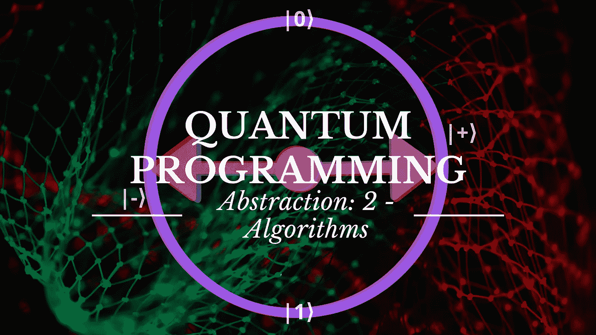

[作者图片](https://kblagoev.com)

1.  [从量子力学中抽象出我们自己的量子编程:抽象层次 0](https://kblagoev.medium.com/quantum-programming-by-abstracting-ourselves-from-quantum-mechanics-abstraction-level-0-62a258b4def0)
2.  [量子编程——抽象层 1:逻辑门](https://kblagoev.medium.com/quantum-programming-abstraction-level-1-logic-gates-486f941e831a)
3.  [量子编程——抽象层 2:状态机和算法](https://kblagoev.com/blog/quantum-programming-abstraction-level-2-algorithms/) **(this)**

到目前为止，我们一直在冒险。让我们回顾一下我们的进展。

*   我们已经证明，通过将信息叠加编码到 n 个量子位上，我们只需改变一个量子位的状态，就可以操纵整个 2^n 态系统。
*   我们用一个简单的 2D 向量来表示每个量子位的状态。
*   我们已经确定，我们可以通过应用不同的逻辑门来改变单个(或两个)量子位的状态，类似于经典逻辑门。
*   我们现在可以看到布洛赫球上量子位(实际上是整个系统)的叠加状态。
*   我们知道如何纠缠两个量子位，使它们的状态相关。

现在是时候开始把所有这些放在一起了。把一些门串在一起，看看会发生什么，这不是很好吗？

好吧，为了看到发生了什么，我们可能希望能够可视化我们量子位的状态流，这样我们就可以看到每个门如何在每一步操纵每个量子位。

# 单位圆状态机

如果你还记得，在上一篇文章中，我花了相当多的时间试图将 Bloch 球简化成一个圆。对你们中的一些人来说，这似乎是一个没有意义的练习；毕竟，一个球体并不比一个圆形更复杂。但是，在这里它变得更有意义。我向你介绍 u *nit 循环状态机:*

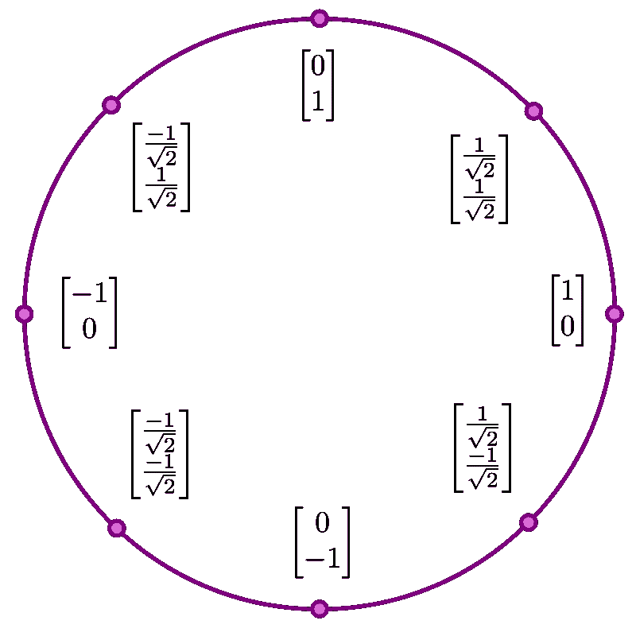

现在我们可以把所有的状态从“布洛赫圈”放到一个单位圆中，这个单位圆是由……嗯，个状态组成的。我认为在这种特殊情况下，圆比球体更容易管理，特别是因为你可能会注意到，我们的状态是布洛赫圆的两倍。例如，我们现在不仅有(1 0)状态，还有(-1 0)。

这些是我们先前描述的具有不同的**相位的状态。事实上，甚至更多，因为如果你还记得，在布洛赫循环中，我们已经有了状态[1/sqrt(2) 1/sqrt(2) ]，它与[1/sqrt(2)1/sqrt(2)]相同，但相位不同。**

*这些只相差一个相位的状态仍然有相同的概率分布。只要我们只谈论单个量子位，它们就互为等价。但是我们很快就会看到，一旦我们的系统中有超过 1 个量子位，相位就变得非常重要。*

*先不说这个，让我们专注于我们新的强大工具。有了它，我们可以很容易地描述**每个** **门如何作用于每个状态**。例如，让我们将 X 门和哈达玛门映射到它们各自的圆上:*

*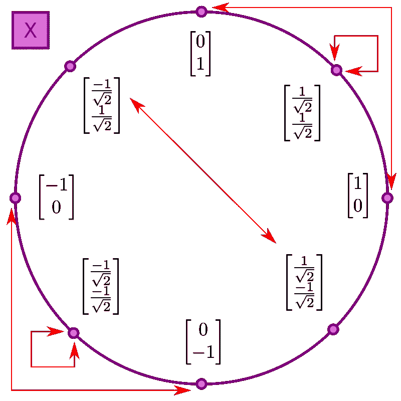*

*通过应用 X 门来改变可能的状态。*

*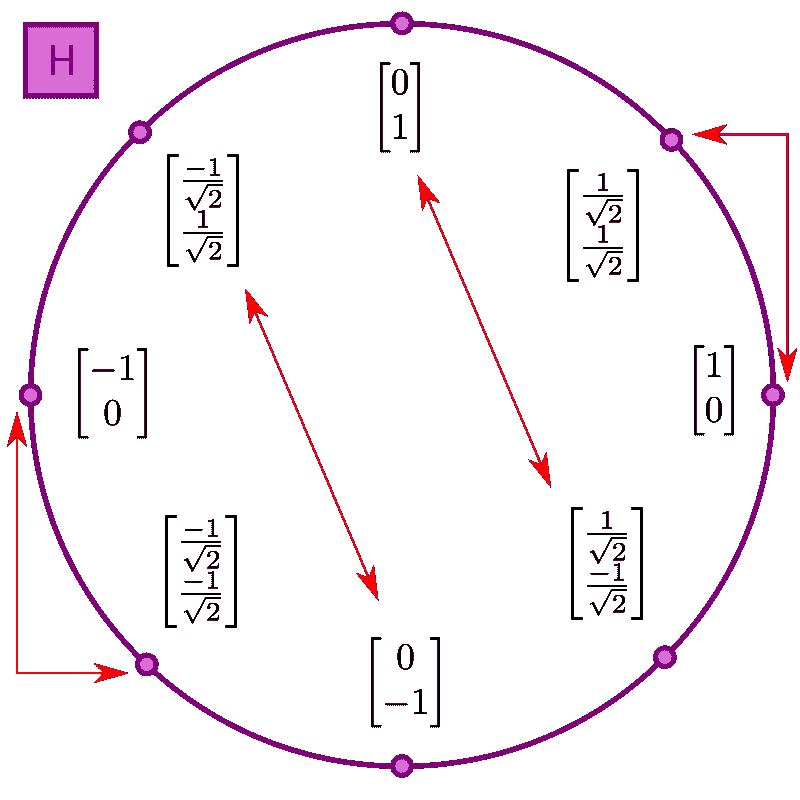*

*通过应用哈达玛门可能的状态改变。*

*根据定义，我们的量子门是可逆的，我们可以在圆圈中来回移动，而不会丢失先前状态的信息。*

# *量子电路*

*现在我们有了必要的工具和知识来开始组装这些门。我们寄存器中量子位的集合，加上我们应用于它们的门的组合，我们可以称之为**量子电路**。*

*通过定义我们的状态机，我们可以看到我们系统的程序流程。我们可以从创建一个 1 量子位的简单量子电路和几个应用于它的门开始。*

**

*因此，通过我们的状态机，我们能够确定，在将门应用于量子位之后，它将以(-1) =1 的概率变成∣0⟩。但是那个负号是什么？*

*正如我们之前所讨论的，[1 0]和[1 0]是彼此相差某个**相位**的状态。由于我们的系统中只有一个量子位，我们可以说这两个状态相差一个全局相位。那种类型的相位在我们的系统中没有意义。*

*但是如果在我们的系统中有多个量子位，并且它们彼此具有不同的相位 w.r.t .，那么我们说是它们的**相对相位** 不同。*

> **相对相位实际上是系统的一个属性，即具有不同相对相位的系统是物理上不同的系统。**

# *相位反冲*

*还记得我们说过的将 **CNOT** 门应用于一对概率分布为 50/50 的量子位吗？我们发现，不是控制位改变了目标位，而是目标位翻转了控制位。*

*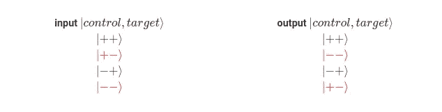*

*但最终这种变化并没有改变这些量子位的概率。两者都仍有 50%的概率坍缩为 1 或 0。改变的是它们的相对相位。*

*事实上发生的是，目标位的相位被应用到已经存在的控制位的相位上**。**我们只需遵循上表中的状态符号，就可以很容易地看出其中的逻辑。*

*当目标位的相位为“+”时，它不会改变控制位的相位，因为*

*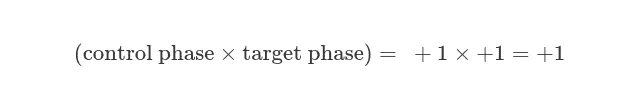*

*和*

**

*因此相位保持不变(见黑色行)。但是一旦目标位的相位为“-”，它的影响就变得明显了(见红色行)，例如*

**

> **这种从目标位到控制位的相位应用就是我们所说的相位反冲。**

*虽然不是算法，相位反冲是量子计算中的一个重要工具。例如，它允许我们跟踪另一个量子位的相位，可以说是复制相位。这种将一个量子位的相位复制到另一个量子位上的机制经常用于不同的算法中。*

*让我们在状态机中想象一下这个相位反冲。*

*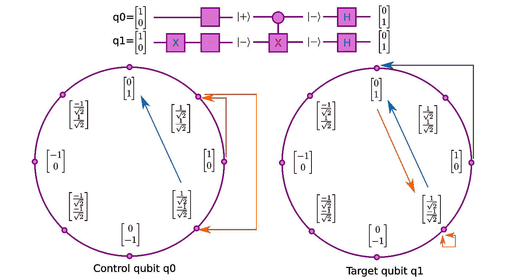*

*CNOT 将目标位的混合状态相对相位应用于控制位的纯状态相对相位，最终将相位从 q1 复制到 q0。在应用最后的 Hadamard 门之后，系统继续崩溃到确定状态 11。*

*让我们打破这个，并解释我们的意图。*

*   *首先，我们将 X-Gate 应用于目标位 *q1* 。*

*这里的想法是，通过将哈达玛门应用于状态 1 的量子位，我们将使它与负相位叠加*。**

*   *相比之下，我们的控制位 *q0* 从 0 状态转换为叠加状态，因此为正相位。*

*这是为我们的实验做准备。下一步是我们的主要工作。*

*   *通过在我们的控制位和目标位上应用 CNOT 门，我们实现了我们设定的目标——将目标位 *q1* 的相位应用到控制位的相位上。*

*并且由于 *q0* 的相位是正的，结果最终是简单地**复制**从 *q1* 到 *q0* 的相位。这正是上面表格第二行中发生的情况。*

*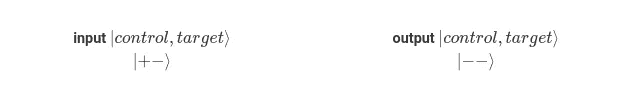*

*   *然后，我们再次对两个量子位应用哈达玛门，将它们从 50/50 的概率转换回确定的状态(记住，门是可逆的，所以哈达玛现在有相反的效果)。*

*就这样，我们演示了量子计算的临界性质，名为*相位反冲。**

# *算法*

*算法是有特定目标的结构。它们的存在是为了解决一个问题，通常是在计算机科学本身之外的领域。事实上，算法通常是在能够运行它们的机器存在之前就被开发出来了。*

*算法通常是计算中真正的第一步，在这一步中，我们可以真正从物理现实中抽象出来，并开始应用更加程序化的思维模式。*

*此外，这是一个抽象层次，在这个层次上，我们可以定义后台程序，在这些后台程序中，流程可以在我们不关心细节的情况下发生，我们只能看到功能的结果(也许还有输入)。*

*因此，在量子编程中存在高度人为的问题，这些问题可以用我们的量子位来解决。我将向您展示一个被过度使用的例子，顺便提一下，我们一直在自然地构建这个例子。让我们来谈谈*

# *多伊奇算法*

*正如我所说，这是一个真正的入门级算法。它通常是关于这个主题的任何书籍或课程中第一个展示的，人们可能会认为这只是因为它很容易展示。然而在现实中，它有两个重要的特征，不管它是否简单或如何做作，都应该知道:*

*   *它表明，即使使用*可逆*门，我们仍然可以对我们的量子位应用*不可逆*函数。这样我们加强了量子计算和经典计算之间的联系。*
*   *这是最简单的算法，它可以不可否认地表明，对于存在的问题，量子计算本质上比经典计算更快——更快的定义是需要更少的步骤来完成。*

*但是即使这些事情是真的，我现在也不想集中精力在这些事情上。我们的目标只是将我们目前收集到的片段连接成一个单一的流，并将其应用于一个易于理解的问题。*

# *问题是*

*有一个函数 *f* 以 *0* 或 *1* 为输入，以 *0* 或 *1* 为输出。*

*因此，该功能有 4 种可能的配置:*

*   *作为输入的 0 和 1 都映射到作为输出的 1*
*   *作为输入的 0 和 1 都映射到作为输出的 0*
*   *输入不变，所以 0 到 0 和 1 到 1*
*   *输入被翻转，所以 0 到 1 和 1 到 0*

*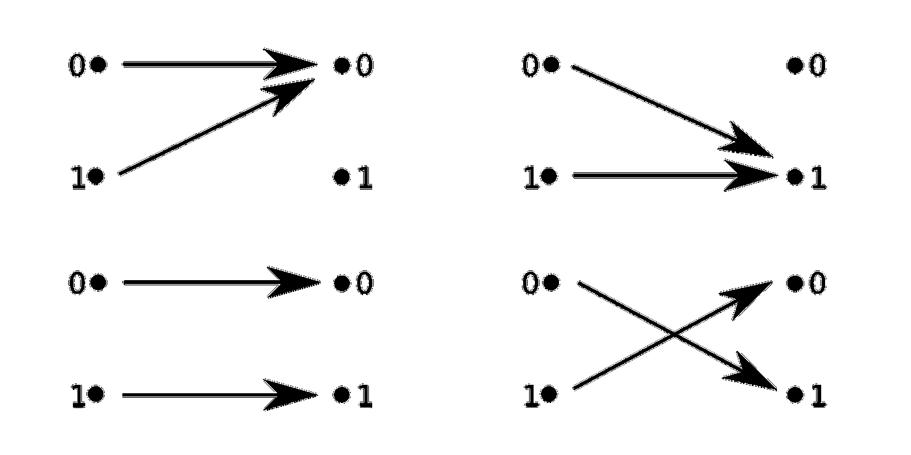*

*我们将把前两个函数称为“常数”(即我们输入什么并不重要，输出是相同的)，把后两个函数称为“平衡的”。*

> **因此问题是:如果我们把这个函数放在一个* ***黑盒*** *中，确定两个变量中的哪一个——常数或平衡，在黑盒中。**

# *用闸门再现功能*

*让我们编程吧！是的，我们现在有简单的逻辑要求，我们必须用我们学过的语言来表达。这难道不令人兴奋吗？*

*无论如何，我们有一个紧迫的问题要处理。注意，常量功能*是不可逆的*。我们无法知道输入和输出。如我所说，我无意解释这背后的推理，但是:*

> **如果我们通常需要将一个比特传递到 4 个函数中的任何一个，我们将需要 2 个量子比特来完成可逆门的同样工作。**

*也就是说，除了函数的输入之外，我们还需要传递一个空的(零)量子位来写入函数的输出。我们将这个空位称为备用位。*

*记住这一点，让我们重新创建四个功能配置。*

*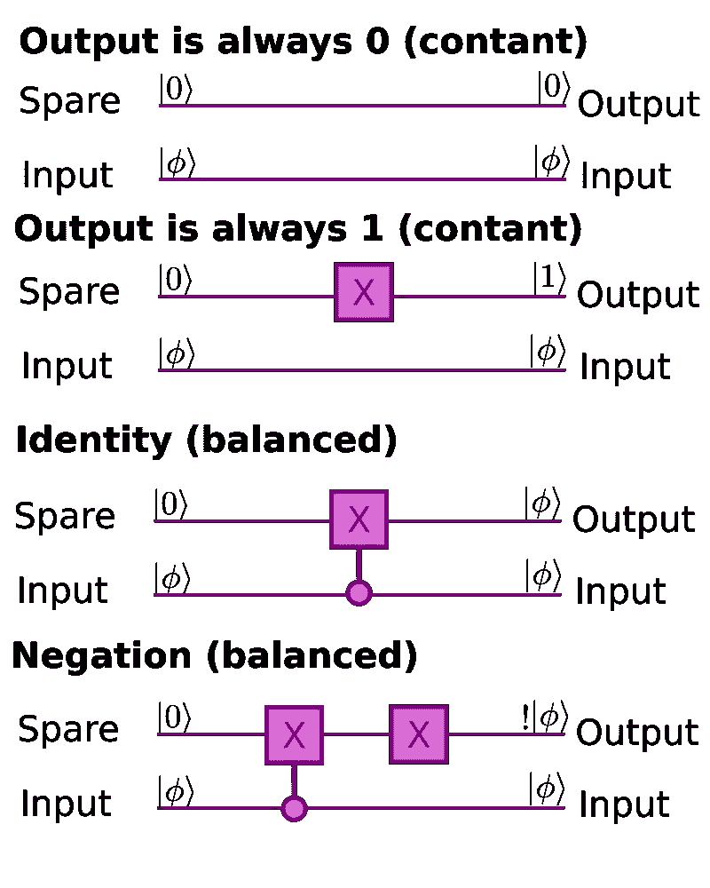*

# *该算法*

*好吧，我想让我们先定义它，就好像我们知道发生了什么，然后我们用单位圆状态机一步一步来，看看会发生什么。我声称，如果**黑盒**包含一个常量函数(来自上面的列表)，下面的算法将吐出∣11⟩，如果它是一个平衡函数，输出将是∣01⟩.*

*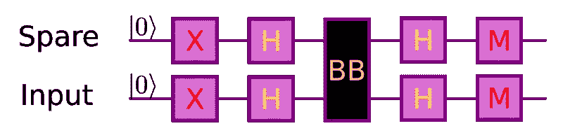*

*多伊奇算法。BB 代表“黑盒”，我们的功能在这里执行。m 代表测量——这就是我们瓦解量子位系统波函数的地方。*

## *预处理*

*首先，我们来看看量子位的初始准备，求反和哈达玛初始化。*

*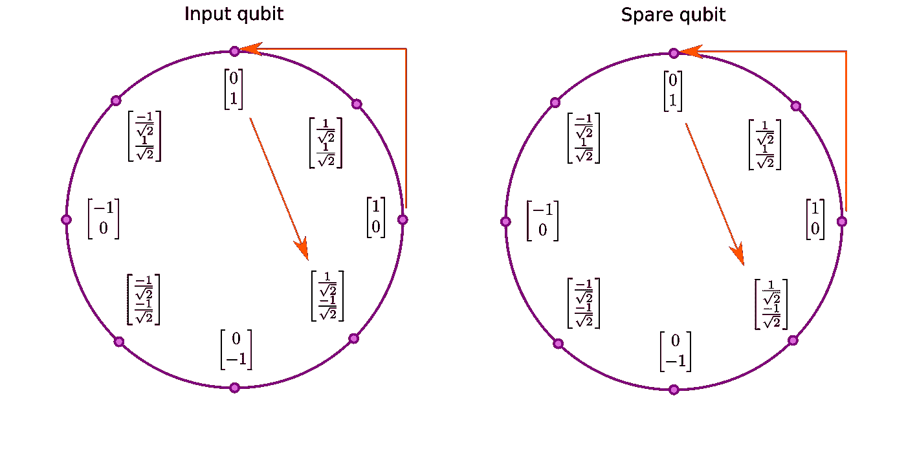*

*到目前为止没什么令人惊讶的。现在让我们看看每个黑盒函数是如何改变输出的。*

## *含量 0*

*我们将常数为 0 的函数定义为什么都不做。所以我们什么也不做，之后我们应用第二个哈达玛门，用测量门折叠波函数。*

*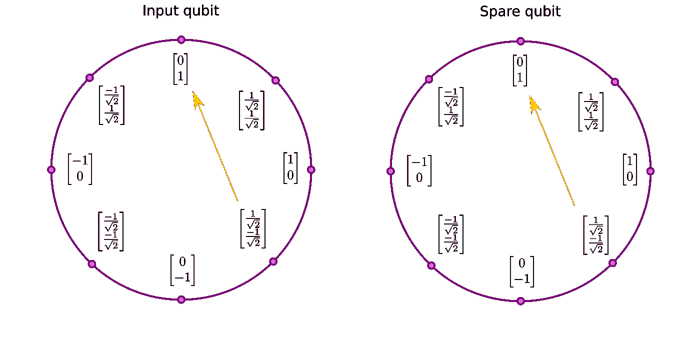*

*结果确实是∣11⟩.太好了！我们抓到一个。到下一个。*

## *常数 1*

*我们将常量-1 定义为翻转备用位。在此之后，我们再次应用哈达玛门，然后测量系统。*

*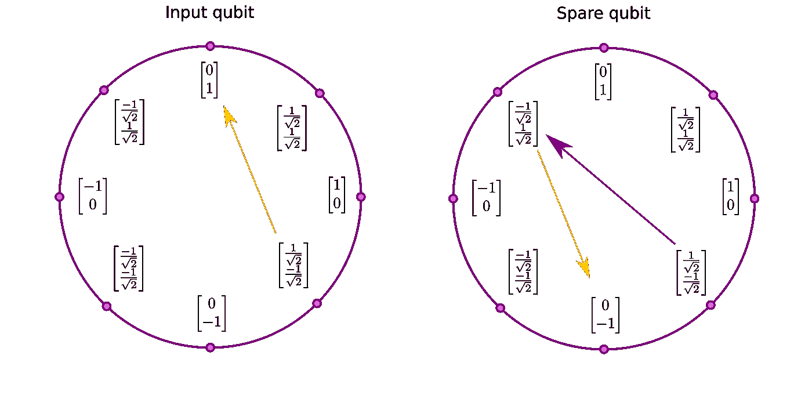*

*我们又一次得到了∣11⟩！(记住，-1 =1 的概率得到 1)棒极了，半途而废。*

## *身份*

*这就是我们应用相位反冲知识的地方。CNOT 门的行为与我们在上一节的例子中定义的完全一样。看我们的知识是怎么积累的？*

*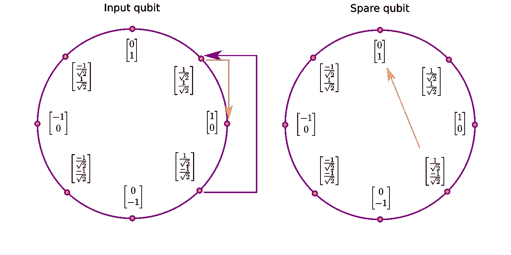*

*正如我们预测的那样，结果就是∣01⟩.*

## *否认*

*最后一个！它会成为决定性因素吗？我希望不会。请记住，与 identity 不同的是，在 CNOT 完成其相位反冲魔法后，我们有一个 X-Gate 作用于备用位。*

*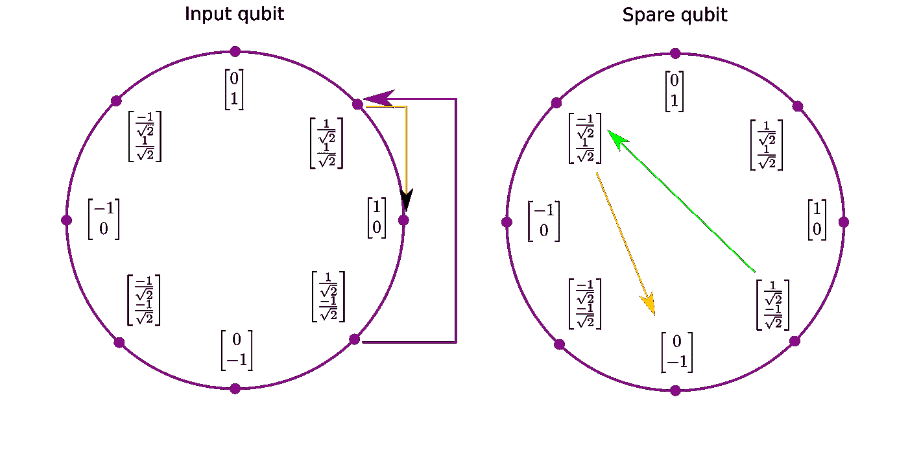*

*所以毫不奇怪，它成功了！这的确是∣01⟩，正如我们对平衡函数的期望！*

*我们能够一次就识别出 4 个函数中的任何一个和全部！*

*顺便说一句，一台经典的计算机需要对这些函数中的任何一个进行两次处理，才能确定它是常数函数还是平衡函数。试着自己证明，这需要一个 if-else 语句。*

*因此，我们已经看到了我们的第一个量子计算算法在工作！凭借我们开发的工具和知识，这仅仅是个开始！*

*算法的确是迈向更高抽象层次的第一大步。我的希望是，通过我们在这里展示的工具，你已经发展了思考现有算法的直觉水平，以及尝试它们的好奇心。*

*谁知道呢，随着时间的推移，你可能会在这个想法中变得如此根深蒂固，以至于你偶然发现了量子编程领域中一个未被探索的角落，并创造出你自己的东西。*

*与此同时，我打算继续探索量子编程的世界，并希望在前进的道路上写更多关于这个主题的东西。*

*感谢阅读！*

*1.与全局相位相反，全局相位是系统中所有量子位都具有相同相位的情况，因此可以从观测计算中排除。具有全局相位的系统在物理上是相同的，而具有相对相位的系统则不同。在大多数情况下，它们可能仍然以同样的方式被测量，但这只是因为量子计算机中的测量通常沿着同一轴进行，与相位无关。*

*2.在量子信息中，可以说这个相对相位携带了关于系统的**相干性**的信息。*

**原载于 2021 年 4 月 1 日*[*【https://kblagoev.com】*](https://kblagoev.com/blog/quantum-programming-abstraction-level-2-algorithms/)*。**