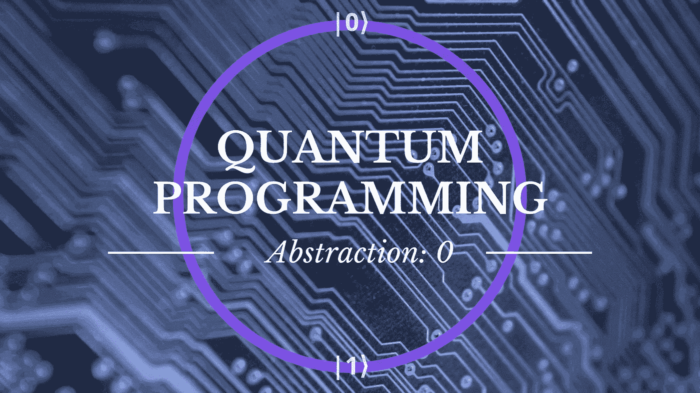
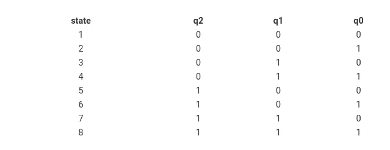
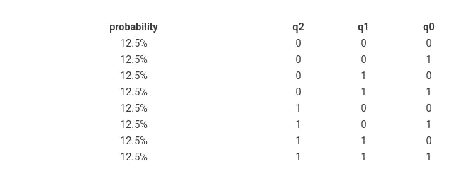
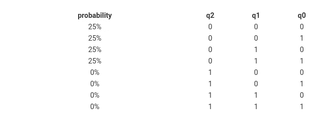

# 从量子力学中抽象出我们自己的量子编程:抽象层次 0

> 原文：<https://towardsdatascience.com/quantum-programming-by-abstracting-ourselves-from-quantum-mechanics-abstraction-level-0-62a258b4def0?source=collection_archive---------18----------------------->

正如我们知道在经典计算机中我们处理逻辑 0 和 1 一样，我们也可以知道我们在量子计算机的最低逻辑层中处理的是什么。

[作者图片](https://kblagoev.com/blog/quantum-programming-abstraction-level-0/)

1.  [从量子力学中抽象出自己的量子编程:抽象层次 0](https://kblagoev.medium.com/quantum-programming-by-abstracting-ourselves-from-quantum-mechanics-abstraction-level-0-62a258b4def0) **(this)**
2.  [量子编程——抽象层 1:逻辑门](https://kblagoev.medium.com/quantum-programming-abstraction-level-1-logic-gates-486f941e831a)

个人计算机的发明，以及利用它的数百种编程语言的进一步发展，使我们程序员能够完全从流过固体物质的电子世界中抽象出来，并进一步从通过开关门和晶体管来产生二进制数据的低级编程中抽象出来。

这似乎是我们作为一个技术社会的运作方式。我们喜欢在抽象的基础上构建抽象，直到我们能够以一种我们认为简单且实用的人类方式与我们的机器交流。

随着在量子机器上解决问题变得更加现实，我们将能够开始在相同的上下文中使用术语*应用*和*量子力学*。这将是一个我们能够从量子力学的*如何和为什么*中抽象出来，并简单地在现实世界的应用中利用它的怪异之处的时代。

但是正如我们知道在经典计算机中，最终都归结为在内存网格中翻转的 1 和 0，我们必须知道我们在量子计算机的最低逻辑层中处理的是什么。当谈到量子计算时，我们的基本逻辑结构是什么，使我们能够建立和操纵数据。

# 量子位与比特

我们必须在这里建立一个逻辑时间线。在经典计算机中，我们有特定的计算步骤。让我们特别关注两个问题。

1.  我们操纵一位的价值。我们可以将它的值从 0 翻转到 1 或从 1 翻转到 0，或者保持不变。
2.  现在我们可以测量位的价值。我们现在将观察它是 1 还是 0。

我们还可以注意到，在测量之后，比特仍然是我们观察到它的价值之前的样子，测量的行为并没有改变这一点。

显而易见，如果我们跟踪正在发生的事情，我们甚至在测量它之前就已经知道该比特是 1 还是 0。正如我们马上会看到的，

> 在大多数情况下，在测量一个量子比特之前，我们无法知道它的值。

# 量子位

量子位也可以处于 1 或 0 的状态，但是它们也可以同时处于这两种状态。当它们处于这种所谓的叠加态时，0 和 1 的状态与一种概率相关联——也就是说，如果你拿一个量子位并测量它，它将根据这种概率选择是出现 0 还是 1。

值得注意的一点是，量子位只有在不被测量时才能保持叠加态。当它的值被提取出来的时候，定义它的概率的波函数塌缩了，它根据塌缩前的概率随机选择 0 或 1。

这里要指出的另一点是，我们可以以这样的方式处理这些位，它是 1 或 0 的概率是 100%。这样，我们可以像使用经典计算机一样使用量子计算机。但是我们也会失去量子计算机的一个优势——利用叠加(以及后来的纠缠)带来的量子奇异性。

# 将量子位聚集在一起

现在让我们考虑一下，我们的记忆库中有不止一个比特。假设我们有 3 个！让我们把它们可能的值 1 和 0，放在系统所有可能状态的表中

我们现在可以观察到，在这个 3 位系统中有 8 个状态。4 位有 16 个状态，8–256 个，以此类推，呈指数增长，因此状态数等于 2 的位数幂。换句话说，每增加一位，状态的数量就会翻倍。

这与在比特网格中保存信息没有什么不同。当我们试图访问这些状态来操纵或测量它们时，差异就出现了。当计算机对一个状态进行操作时，它把它载入寄存器。在传统计算机内部的单个 CPU 中，可以将单个状态加载到寄存器中并进行操作。有趣的是，这种量子寄存器同时存储所有 2^n 可能状态，并可以通过改变单个量子位的概率分布来同时改变所有这些状态。

让我们在那上面展开一点。把量子寄存器想象成一个简单的量子位物理网格，每个量子位都包含着它坍缩为 1 或 0 的概率信息。如果我们得到所有量子位的概率，我们就可以很容易地计算出当我们折叠整个寄存器时，上面列出的每个系统状态出现的概率。例如，假设所有 3 个量子位都有 50%的几率坍缩为 1 或 0，我们将看到所有状态也有相等的概率，并且我们知道这些概率加起来应该是 1:

因此，我们可以将量子寄存器中保存的信息重新定义为我们观察系统时出现的每一个状态的概率列表。因为这个列表与所有可能状态的列表长度相同，所以量子寄存器保存的信息等于 2 的比特数的幂。当然，问题是，当我们测量系统时，它会坍缩到其中一个状态，然后我们就有了等于位数的信息。

但是在我们测量这个系统之前，

> 如果我们仅仅改变一个量子位的概率，我们就立即改变了所有状态的概率分布。

假设我们改变了 *q2* 的概率，使其有 100%的几率为 0。然后我们得到

换句话说， *q2* 为 1 的所有状态都是不可能的，其他 4 个状态概率相等。

下一个问题是，当我们崩溃系统时，我们会得到上述状态之一。我们仍然不知道概率是多少，我们只知道其中一种状态是可能的。但是，

> 如果我们多次瓦解这个系统，在每次以同样的方式设置量子位之后，我们将获得关于每个状态发生的概率的统计信息。

# 逻辑门

所以，为了改变每个状态发生的概率，我们需要操纵每个量子位的概率。在经典计算机中，为了操作一个位，我们使用[逻辑门](https://en.wikipedia.org/wiki/Logic_gate)如 NOT、SET1、SET0 和单位，以及 and、or、XOR 等。两个比特。

以类似的方式，我们在量子世界中有逻辑门。有些是对一个量子位进行操作，有些是对两个量子位进行操作，你可以让一个对三个量子位进行操作。可以为量子位定义许多逻辑门，实际上只要遵守量子力学的数学约束，可能性是无穷的。但令人欣慰的是，[已经证明](https://en.wikipedia.org/wiki/Solovay%E2%80%93Kitaev_theorem)，量子计算机上的任何操作都可以有效地减少到有限数量的门，因此我们可以定义一个足够小的**指令集**，用它我们可以将量子比特操纵成我们需要的任何概率。

我们现在已经达到了量子编程的第一个抽象层次——指令集。我们现在基本上可以定义一种类似汇编的语言来为量子计算机编写代码。在完成这篇文章之前，让我们对这个抽象概念有一个技术上的定义。我想在另一篇文章中集中讨论真正的门，否则这会变得太笨拙。

# 量子抽象机

这是通用量子计算设备(量子计算机)的抽象表示。值得注意的是，QAM 定义了经典态和量子态的操纵技术。这意味着我们将同时拥有量子位和经典位来存储观测数据。因此，QAM 由一系列元素指定:

*   量子位的数量
*   许多经典比特(例如用于存储量子比特的折叠状态)
*   用来操纵量子位的门的列表
*   指定量子指令语言的指令序列
*   整数计数器，指示要执行的下一条指令的位置

有了这个，我们现在可以自由定义门和类似汇编的指令，用它们来操纵单个或多个量子位的概率，最终改变量子位电路状态的概率分布。在下一篇文章中，我们将开始定义布洛赫球，以及在其上运行的一系列门——达到 [**抽象级别 1**](https://kblagoev.com/blog/quantum-programming-abstraction-level-1-logic-gates/) 。

1.  请注意，这种说法没有什么神奇的，这只是一个我们在宏观世界中无法体验的自然事实——任何基本粒子都将保持其所有可能状态的叠加，直到它受到作用(观察)，在这一点上，它包含所有状态概率信息的波函数崩溃，粒子随机选择这些可能状态中的一个。

2.我不想谈太多细节，只想指出一些事实:1。经典的计算机门大多是不可逆的，意思是门应用后，你无法弄清楚原来的输入是什么。由于量子力学的物理性质，量子都是可逆的。2.量子门由酉矩阵表示。极其有用。事实上，从线性代数的角度来看，我可能会写第二个版本，因为它看起来很令人满意。

*原载于 2021 年 3 月 27 日 https://kblagoev.com*<https://kblagoev.com/blog/quantum-programming-abstraction-level-0/>**。**