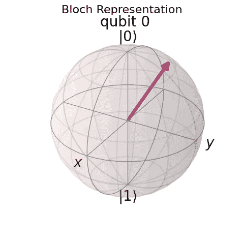
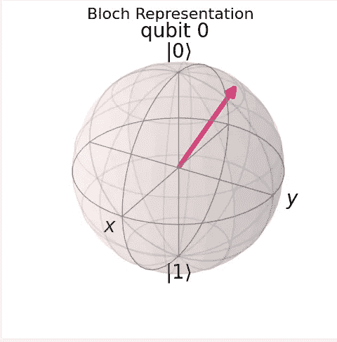
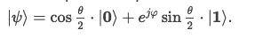
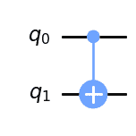
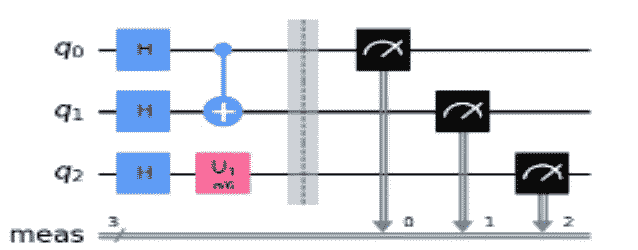
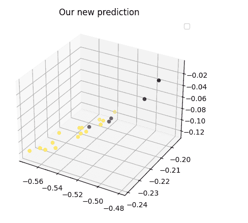
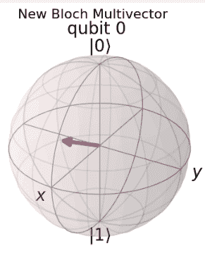
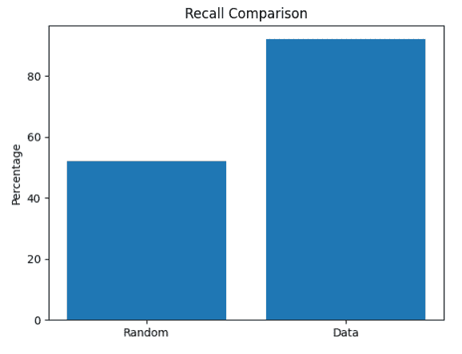

# 全图麦:历史背景和现实世界的奇巧例子

> 原文：<https://towardsdatascience.com/quantumai-historical-background-real-world-qiskit-example-99c21ae2a78a?source=collection_archive---------27----------------------->

## 对于寻求科学刺激的人来说

作者图片

量子计算已经成为一个热门话题。领先的研究机构、企业和专门的初创公司投入大量资源研究这项技术及其实际表现。对于几乎每一项创新技术，我们可能会问一些抽象的问题，比如它是什么或者为什么会流行？以及诸如“我们的组织能获得什么好处吗？”对于数据科学家来说，我们通常关心“对于这些算法，哪个 Python 包是最佳的？”。这篇文章旨在阐明这些问题。

**量子对于计算机？怎么会这样**

大约在 1850 年，德国物理学家克劳修斯发现了热力学第二定律。他发现越来越多的量与能量密切相关。起初他给这个量起了个名字***Verwandlung**inhalt***(内容转换)

后来，为了与能量的概念相一致并强调它们之间的紧密联系，他将这个概念修改为熵(“内在转化”)。从那以后，研究人员一直认为这两个量密切相关。当香农、维纳(*控制论*)、哈特利等人建立信息论时，他们使用了克劳修斯和玻尔兹曼为热力学开发的同样严谨的工具。

这些步骤之后是一些理论上的突破，如 Szilard 的[发动机](https://www.quantumcomplexity.org/tutorials/knowledge-is-power-the-energy-content-of-bits/)(阅读或请我亲自告诉你)。信息和现代物理学总是紧密相关，因此量子作为计算工具并不是一个牵强的想法

**现在的电脑怎么了？**

当观察当前一代计算机时，有两个主要障碍:

*   物理边界——最近几十年是

小型化。处理器变得越来越小，使得计算机能够大幅提高性能。然而，当我们观察当前 pn 结二极管的宽度时，我们可以注意到它大约为 5–7nm。氢原子的半径约为 0.1 *nm。*这意味着我们离边界越来越近。因此，我们需要制造出大小约为一个氢原子的“芯片”。这样的单位会受到量子效应的影响。

*   **复杂性** — CS 理论大量研究难题(你们都很熟悉这个概念 *P* & *NP* )。这些问题的最重要的代表之一是量子系统的仿真，其中复杂性呈指数增长。

1982 年，Richard Feynam [推测](https://www.eejournal.com/article/richard-feynman-and-quantum-computing/)也许量子粒子可以更好地模拟它们自己，并勾画出量子计算机的概念，要求工业界建造一台

**QC 有什么酷的？**

QC 技术允许加速计算过程，因为它可以更好地处理多种状态(更多信息)。随着理论的进步，它提供了一些突出的突破，如[肖尔的](https://en.wikipedia.org/wiki/Shor%27s_algorithm) [因式分解数的算法](/quantum-factorization-b3f44be9d738)或[格罗弗的](https://en.wikipedia.org/wiki/Grover%27s_algorithm)搜索算法。最近，一些基于量子的人工智能解决方案已经可用，用于解决我们在处理大型数据库时可能遇到的高复杂性问题

## **量子计算中的基本对象**

在这一节中，我将描述量子计算中的几个基本概念。我假设你们都熟悉**向量**和**酉矩阵**

**偈空间**

在量子力学中 *ket 空间*描述了物理状态的空间(例如速度或动量)。“Ket”这个概念是由狄拉克给出的，因为它表示⎢X 的列向量 X >。正如你所料，这里也有 *bra* 空间，我们用下面的< X⎥.来表示原始向量

**量子测量**

测量是量子力学中最基本的概念。在经典物理学中，当汽车在路上行驶时，很明显它有一个速度矢量。假设一个人想知道速度是多少，她简单地去测量它。很明显，我们不希望这个测量值改变速度。这是在我们测量之前和之后。测量只会丰富观察者的知识。

在量子力学中，事物是不同的。

一个粒子没有一定的速度，它有一个同时存在的速度集合，每个速度都是一个 ket 态(速度是一个矢量，因为它既有大小又有方向)。当我们测量粒子的速度时，它会坍缩到这些潜在状态之一:**测量(和观察者)会影响结果。**

这个概念很难理解。然而，它提出了一个想法，如果计算理论遵循量子力学，在某些情况下，计算过程可能会同时处理几个状态，从而大幅加速它们。这是我们需要从这一部分得出的主要结论

## **什么是量子比特**？

经典计算中最小的信息单位是一位。在接下来的部分中，我将描述它在量子计算中的类比>

**我们能把一点想象成一个粒子吗？**

如果 0 和 1 是一个比特的两个看似合理的值，但这两个值从来不会同时出现，那么我们可以直接把它们看作比特的电位状态。让我们来表示这些状态:

**⎪0❯** 当该位的值为 **0** 时

**当该位的值为 **1** 时，⎢1❯**

考虑一点我们不知道它的价值。由于它可能在美国的 **⎪0❯** 或 **⎢1❯** ，我们可以提供一个概率解释:

*   有一个概率 **P** 成为 **⎪0❯**
*   有一个概率 **1-P** 成为 **⎪1❯**

我们是否知道 P 这个问题现在不太重要

如果我们遵循量子力学，比特同时处于⎪0❯态和⎪1❯.态

一个“经典工程师”可能声称一个位可以是 0 或 1。我们能做的只是送他去测量。在那里量子力学和他会相遇。

整个过程遵循量子力学。我们没有创造不同的比特。我们只是改变了我们考虑和处理它们的方式。我们称这个旧比特为新方法**量子比特**。

这种新方法可能会加速大量现在难以处理的计算过程

代数上，我们可以将 **qubi** t 写成如下:

作者图片

我们有

**1=⎪α⎪ +⎪β ⎪**

(即⎪α⎪得到**⎪0❯**的概率)

## 布洛赫球

一个很好的表示量子位的方法是**布洛赫球**

作者图片

我们将偈 **⎪0❯** 标为北极，将偈 **⎪1❯** 标为南极。用代数方法，我们写出状态:

作者

其中 *𝛗* 为 XY 平面与 *𝛉.的角度关于 ZY*

**量子电路**

在经典世界中，逻辑电路是接收位并执行逻辑运算符的实体，其输出是位。这些电路由逻辑门组成，如**、**、**、**或 **NOT。**为了有一个好的计算模型，我们需要为量子计算开发一个模拟。我们需要开发用于构建量子电路的门。这些门的本质是什么？为了获得一些直觉，我们观察布洛赫球。回想一下，每一个量子位元都可以在布洛赫球上呈现为一个向量，因此量子位元有固定的数量级。幅度保持映射常用数学工具是酉矩阵。因此，我们有自然的候选人这样的大门。

事实上，我们可以将量子电路想像成一条链，它接收量子位元作为输入，并执行一系列的幺正运算和测量。在下面的章节中，我将介绍一些最常用的门。

**哈达玛门**

大概是最常用的[门](https://www.quantum-inspire.com/kbase/hadamard/)。这种转换的结果是每个状态都有相等的概率。在 [Qiskit](https://qiskit.org/) 中，我们可以如下查看此门:

作者

**CNOT**

一个两个量子位的[门](https://en.wikipedia.org/wiki/Controlled_NOT_gate)，如果第一个量子位是零，则保留第二个量子位，如果是 1，则改变第二个量子位。在 Qiskit 中，它表示如下

作者

**相移(U1)**

一个单量子位[门](https://en.wikipedia.org/wiki/Quantum_logic_gate#Phase_shift_gates)，它将 **⎪1❯** 旋转到ƛ角

作者

量子电路的一个例子如下:

它是做什么的？

*   它在每个初始量子位上执行哈达玛门
*   它不是在第一个量子位上而是在第二个量子位上执行控制
*   它旋转第三个量子位
*   它测量整个量子位

## Qiskit 真实世界示例

我们讨论了一些量子计算的想法，现在是时候在真实世界的数据上测试这些概念了。为此，我将介绍两种量子人工智能算法:

QSVM——SVM 的类似物

量子贝叶斯网络

**QVSM**

SVM 有一个量子模拟。显然，它需要在数据预处理和提取结果方面进行一些修改。需要采取几个步骤:

我们需要决定量子位的数量。根据经验，我们采用数据维度。

然后我们设置一个量子电路来执行这个算法。

最后，我们必须设置提取信息的方法。

对于 SVM，我们通常考虑在 QSVM 中作为经典函数组合的[核](/svm-and-kernel-svm-fed02bef1200)问题，并且在它们的输出上遵循酉算子。这模仿了特征提取步骤。

QSVM 的这种优势取决于这些函数的复杂性。你可以阅读更多关于这些[步骤](https://arxiv.org/pdf/1804.11326.pdf)的技术细节。

在培训阶段，我们面临两个挑战:

*   寻找量子内核——使用量子计算。
*   优化 SVM 的权重(这是使用经典方式完成的)

围绕这一训练和测试的过程是纯粹的经典训练。

在文本数据上运行它，我们得到如下结果

作者

**一种概率方法**

下一种方法依赖于经验概率方法。我们使用一组带有宁滨或特殊映射等聚合器的原始数据，作为我们引擎的特征。该引擎旨在估计给定数据项属于我们的一个聚类的概率。与 QSVM 相反，这里我们使用单个量子位，它的每个组成部分 **⎪0❯** 和 **⎪1❯** 代表一个簇。量子算法旨在优化系数，以便实现相干测量..回想一下，一个量子位是由 **⎪0❯** 和 **⎪1❯** 组成的

回想一下关于 Bloch 球面的部分，因为我们的数据是真实的，所以我们可以假设

*𝛗* 消失，系数跟随 **β** ， **α** 取决于 **θ**

我们使用数据的单变量属性来建立系数，并得到数据的[向量](/how-to-create-a-quantum-bayesian-network-5b011914b03e)

作者

将我们的数据与随机量子位进行比较的回忆图显示了这张图片

作者

有兴趣的可以在这里阅读更多关于这个技术的内容

## 我的想法

如果我们仅仅把这些结果作为人工智能实验来观察，结果是显而易见的。这些模型表现出较低的性能，无疑在商业上没有竞争力。然而，如果我们将其视为长跑运动员，这些算法相当年轻，用人工智能分类工具来衡量它们甚至更年轻。因此，采取进一步的研究步骤，在更大的数据量和不同的领域进行更多的试验是令人振奋的。从抽象的角度来看，量子计算提供了一种不同的方法，不仅可以解决棘手的问题，还可以用一种创新的方式思考那些我们可以思考的问题。我个人喜欢它不是因为 Shor，而是因为攻击概率云而不是某些状态的想法。

谢谢