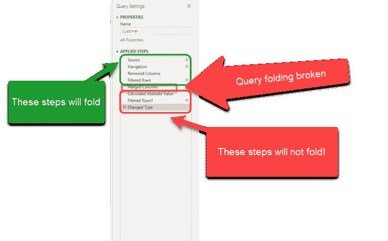
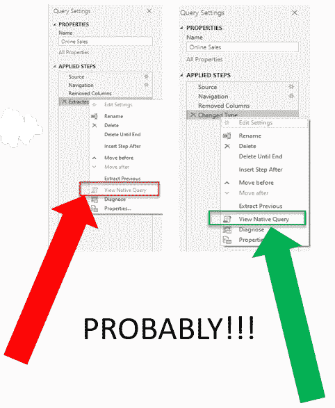
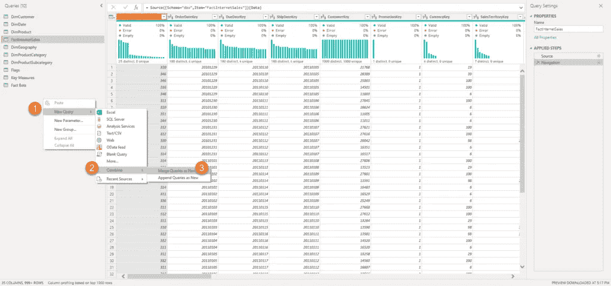
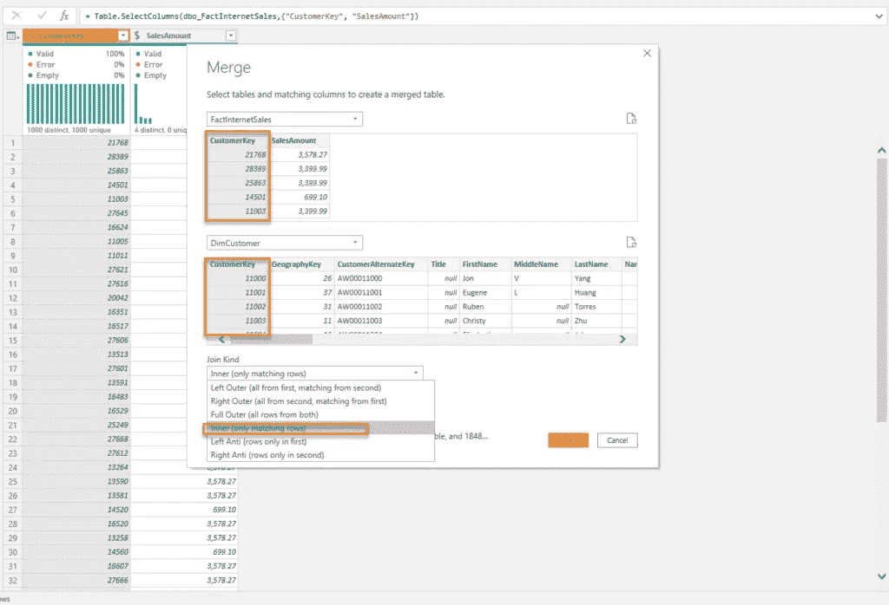
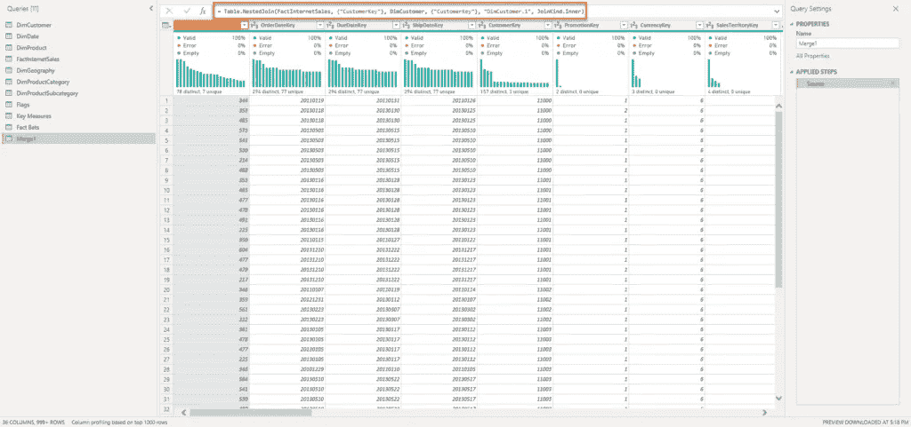
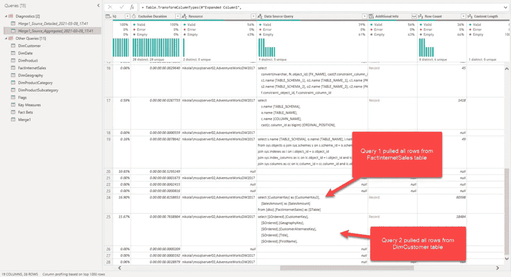
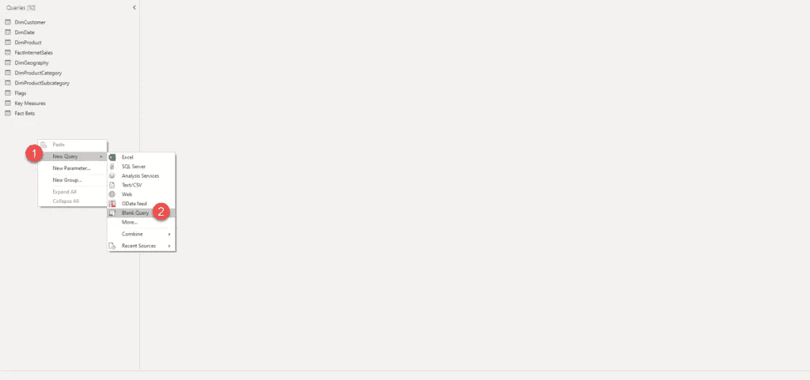
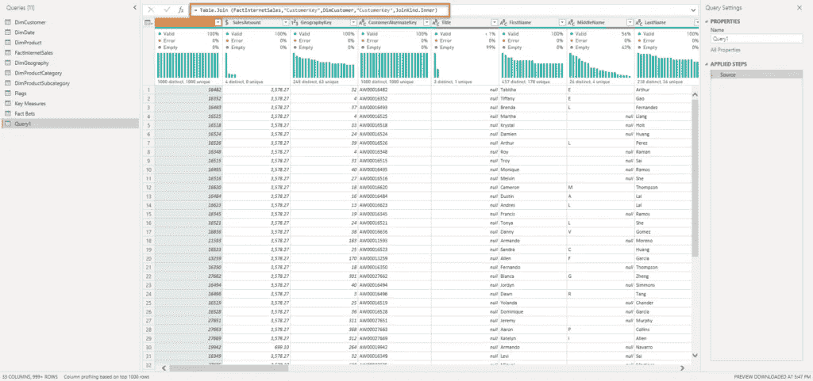
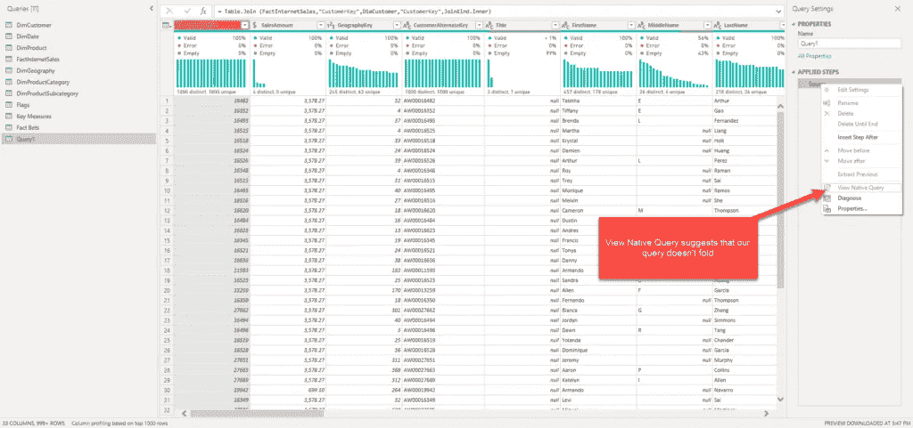
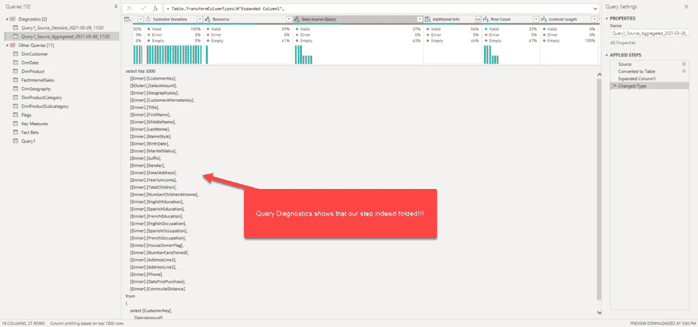

# Power BI 中的查询折叠—细节决定成败

> 原文：<https://towardsdatascience.com/query-folding-in-power-bi-devil-is-in-the-detail-d564ab0cb32?source=collection_archive---------13----------------------->

## 在 Power BI 中查询折叠系列的第 2 部分中，了解为什么人们说细节决定成败！

[https://unsplash.com/photos/fD0pgJCvypk](https://unsplash.com/photos/fD0pgJCvypk)

> "这会破坏查询折叠吗？"“您的查询会折叠吗？”…也许有人问过你这些问题，但你会说:“问…什么？!"
> 
> 或者，您可能听说过 Power BI 中的查询折叠，但不知道如何在现实生活中利用它。
> 
> 如果你认识到自己处于(至少)上述两种情况中的一种，那么请继续阅读这篇简短的系列博文！

*   [第 1 部分——什么是 Power BI 中的查询折叠，我为什么要关心？](/what-is-a-query-folding-in-power-bi-and-why-should-i-care-5b89f42f38d7)

在本系列的前一部分中，我们解释了什么是查询折叠，哪些数据源支持它，以及数据源本身中的哪些转换。现在，让我们检查一下为什么实现这种行为很重要——或者，更好的说法是——为什么您应该关心查询是否折叠？

## 为什么您应该关心查询折叠？

当您在 Power BI 中使用导入模式时，无论是在刷新速度还是资源消耗方面，当查询折叠时，数据刷新过程的工作效率都会更高。

如果您正在使用 DirectQuery 或双存储模式，因为您直接面向 SQL 数据库，所以您的所有转换**必须**折叠——否则您的解决方案将无法工作。

最后，查询折叠对于增量刷新也非常重要——它非常重要，一旦 Power BI 确定无法实现查询折叠，它就会向您发出警告。它不会破坏您的增量刷新“本身”,但是如果没有查询折叠，增量刷新就无法实现其主要目的——减少数据模型中需要刷新的数据量——因为没有查询折叠，Mashup engine 需要从源中检索所有数据，然后应用后续步骤来过滤数据。

记住所有这些，您应该尽可能地实现查询折叠。

## 慢速报告—不要责怪查询折叠！

这里有一个重要的免责声明，这是这一系列博客文章的关键要点之一:如果你的报告很慢，或者你的[视觉效果需要很多时间来渲染](/how-i-speed-up-my-power-bi-report-5x-155255415895)，或者你的[数据模型很大](/how-to-reduce-your-power-bi-model-size-by-90-76d7c4377f2d)，查询折叠与此无关！

只有当您的数据刷新或增量刷新速度慢且效率低时，您才应该更深入地研究您的超级查询步骤。

## 全有还是全无？

关于查询折叠，还有一些事情需要记住。这不是全有或全无的过程。也就是说，如果您在 Power Query 中有 10 个转换步骤，并且您的查询折叠到第 6 个步骤，您仍然可以从部分查询折叠中获得一些好处。但是，查询折叠一旦被打破，就再也无法实现了。

作者图片

简而言之，如果您有 10 个转换步骤，并且您的查询折叠在第 5 个步骤中被破坏，那么前面的所有步骤都将被折叠，但是一旦折叠被破坏，就不能再实现了，即使您在步骤 6 到 10 中有默认支持查询折叠的转换——就像在我们的示例中过滤应该是一个可折叠的步骤，这些步骤也不会被折叠。请记住这一点，并尽可能地将所有不可折叠的步骤推向流水线。

## 如何知道查询是否折叠？

好了，现在我们不再是菜鸟了。我们知道什么是查询折叠，为什么我们应该努力实现它，以及一些可以产生巨大差异的微妙技巧。

现在，是时候学习如何检查特定查询是否折叠了。第一种也是最显而易见的方法是右键单击该步骤，并检查 *View Native Query* 选项看起来如何。

如果它是灰色的，这一步(可能)不会折叠。另一方面，如果您能够点击这个选项，这意味着您的查询可能会失败。我猜你可能对“可能”这个词感到困惑。

作者图片

但是，这是一个合适的词，因为你不能 100%确定如果*视图本地查询*选项被禁用，你的查询不会折叠。稍后我将向您展示这个选项是如何欺骗我们认为查询折叠被破坏的，尽管实际上折叠确实发生了。

相反，当您想要确定您的查询是否折叠时，您可以使用 Power Query Editor 中的*查询诊断*功能，或 *SQL Server Profiler* ，就像一种古老而可靠的方法来检查 Power BI 引擎发送到数据库的查询。

此外，在 Power Query Online 中有一个很酷的新功能，其中每个步骤都标有图标，显示该步骤是否折叠、未折叠或未知。正如我所说，这个功能目前只在 Power Query Online 中可用，所以让我们希望 Power BI 团队很快在桌面版本中实现它。

作者图片

## 细节决定成败…

好吧……你可能听说过这样一句话:“细节决定成败”。现在，是时候了解微小的差异如何在我们的数据转换过程中产生巨大的影响了。

让我们从 Power 查询编辑器中最令人好奇的一个案例开始…

## 魔鬼#1 —合并联接

这一个非常有趣，因为你很难假设背景中正在发生什么。假设我想将两个查询合并成一个。我将使用 *Adventure Works* 示例数据库，并且我需要合并 FactInternet Sales 和 DimCustomer 表。

我将从事实表中删除一些列，只保留 CustomerKey 列和 Sales Amount 列，因为这是 DimCustomer 表的外键。我将按原样连接 DimCustomer 表，在合并之前不需要任何额外的步骤。

作者图片

合并表相当于 SQL 中的 JOIN 操作。本质上，我们选择要对其执行合并操作的列，以及连接的类型(left、outer 或 inner)。

作者图片

问题是，默认情况下，当您合并两个查询时，Power Query 将生成一个嵌套的 join 语句，这在 SQL 中无法正确翻译。

超级查询生成的嵌套连接操作

如果我转到 Tools 选项卡并单击 Diagnose Step，我可以看到 Mashup 引擎向我的底层 SQL Server 数据库发出了两个单独的查询——换句话说，这两个查询不能作为单个 SQL 语句执行，这意味着查询没有折叠！

作者图片

我们如何解决这个问题？让我们选择一个空的查询并手工编写我们的 M 代码，以达到完全相同的结果。

作者图片

关键的是，我们将使用一个类似的，但仍然不同的 M 函数: ***表。加入*** 。

我们现在使用的是表格。连接功能

所有的函数参数都与之前完全相同，现在让我们来检查结果。

你记得我曾经告诉过你，当*视图原生查询*变灰时，你的查询可能不会折叠，但它不是 100%正确。这是一个很好的例子。如果你看一下*视图原生查询*，它仍然显示我们的查询没有折叠…

作者图片

…但是让我们去诊断一下，看看这是不是真的。

作者图片

哦，天哪，我们上当了——这一步确实失败了！如上图所示，我们生成了一个 SQL 查询，并发送到 SQL Server 源数据库执行。

因此，我们在这个例子中发现了两个难题——第一个是连接类型，我们可以通过调整自动生成的 M 代码来解决。另一个是*视图本地查询*选项的不正确行为。在本系列的下一部分中，我将再向您展示一个当*视图本地查询*存在时的例子。

## 结论

由于我们在本系列的前一部分中打下了关于查询折叠的坚实的理论基础，我们加深了对查询折叠概念的重要性的理解。

此外，我们已经看到了一些细微的差异如何对将 M 代码转换为 SQL 的过程产生巨大的影响，并了解了如何解决查询(非)折叠时最常见的挑战之一——那就是合并操作！

在本系列的下一部分，我将向您展示一些与查询折叠相关的更方便的技巧。

如果你迫不及待地想了解更多关于查询折叠的知识，我强烈推荐查看由 **Alex Powers** 创建的[“30 天查询折叠挑战”](https://www.youtube.com/watch?v=9sV3hIn8VTY&list=PLKW7XPyNDgRCorKNS1bfZoAO3YSIAVz3N)，因为这可能是理解这个概念的最全面的资源。

[成为会员，阅读媒体上的每一个故事！](https://datamozart.medium.com/membership)

订阅[这里](http://eepurl.com/gOH8iP)获取更多有见地的数据文章！