# Power BI 中的查询折叠—技巧、谎言和最终性能测试

> 原文：<https://towardsdatascience.com/query-folding-in-power-bi-tricks-lies-ultimate-performance-test-879cafcf6cf8?source=collection_archive---------15----------------------->

## 在查询折叠系列的最后一部分，学习更多技巧，找出视图本地查询所在的时间，最后找出(不)折叠的查询之间的差异，由实数支持

[https://www . pexels . com/photo/ace-bet-black jack-business-534181/](https://www.pexels.com/photo/ace-bet-blackjack-business-534181/)

> "这会破坏查询折叠吗？"“您的查询会折叠吗？”…也许有人问过你这些问题，但你会说:“问…什么？!"
> 
> 或者，您可能听说过 Power BI 中的查询折叠，但不知道如何在现实生活中利用它。
> 
> 如果你认识到自己处于(至少)上述两种情况中的一种，那么请继续阅读这篇简短的系列博文！

*   [第 1 部分——什么是 Power BI 中的查询折叠，我为什么要关心？](/what-is-a-query-folding-in-power-bi-and-why-should-i-care-5b89f42f38d7)
*   [第 2 部分—查询折叠—细节决定成败！](/query-folding-in-power-bi-devil-is-in-the-detail-d564ab0cb32)

我假设您现在已经熟悉了 Power BI 中查询折叠的概念，尤其是它对于数据刷新和增量刷新过程的重要性。我们也已经开始研究 Power Query 转换的一些有趣的行为，在这个系列的最后一部分，我将向您展示一些更有趣的发现。

最后，我们将用最终的性能测试来结束它——我将向您展示两个相同查询背后的确切数字——一个折叠，另一个不折叠！

## 更改数据类型

Power Query 中最常见的转换之一是更改数据类型。在您的数据模型中使用适当的数据类型是一个众所周知的[最佳实践——例如，如果您的报告中不需要小时、分钟和秒级别的粒度，您应该更好地摆脱它们，并将该列的数据类型从日期/时间更改为仅日期。](/how-to-reduce-your-power-bi-model-size-by-90-76d7c4377f2d)

然而，通往地狱的道路是由良好的意图铺成的:)…因此，让我向您展示一个细微的差异，它会导致您的查询变得非常慢，即使您坚持使用正确的数据类型的建议！

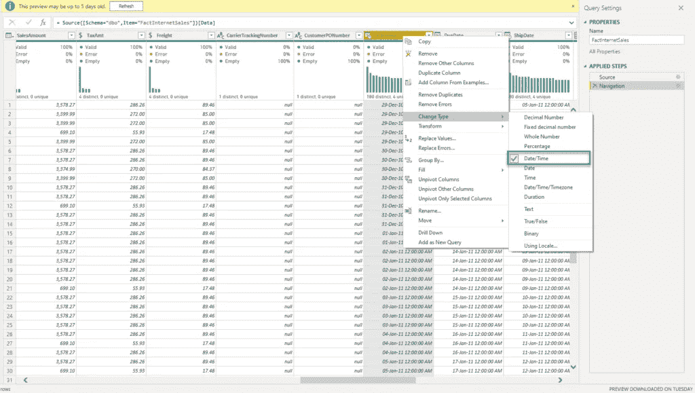

作者图片

如上图所示，我的 OrderDate 列属于日期/时间数据类型。我想把它切换到日期。有(至少)两个可能的选项可以做到这一点—第一个是右键单击该列，展开“更改类型”选项的下拉列表(就像我在插图中所做的那样)，然后选择“日期类型”(就在日期/时间下方):

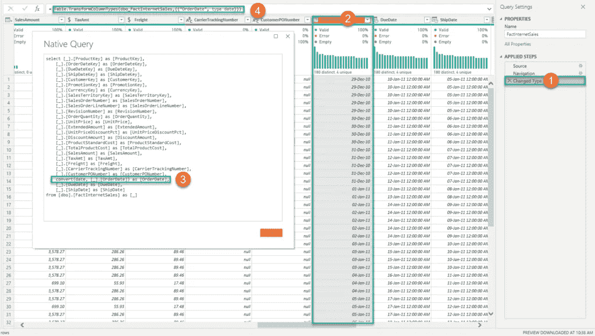

作者图片

这里发生了一些重要的事情，让我来解释一下:

1.  在 Applied Steps 窗格中，您可以注意到我们的转换步骤已经被记录下来
2.  在该列中，您可以看到时间部分消失了
3.  当我打开 View Native Query 对话框时，您可以看到 Mashup 引擎很好地将我们的转换转换成了 T-SQL *CONVERT()* 函数
4.  应用于这个转换步骤的 M 公式是:*表。TransformColumnTypes()*

现在让我们检查更改列的数据类型的另一个选项:

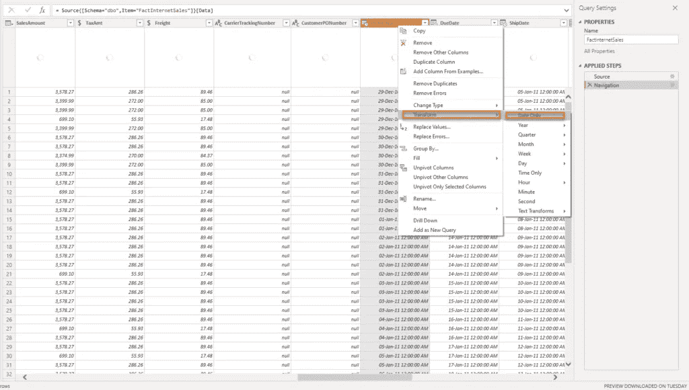

作者图片

就在我们之前的变更类型选项下面，有一个转换选项。展开下拉列表后，您可以看到“仅日期”转换。让我们点击它，看看会发生什么:

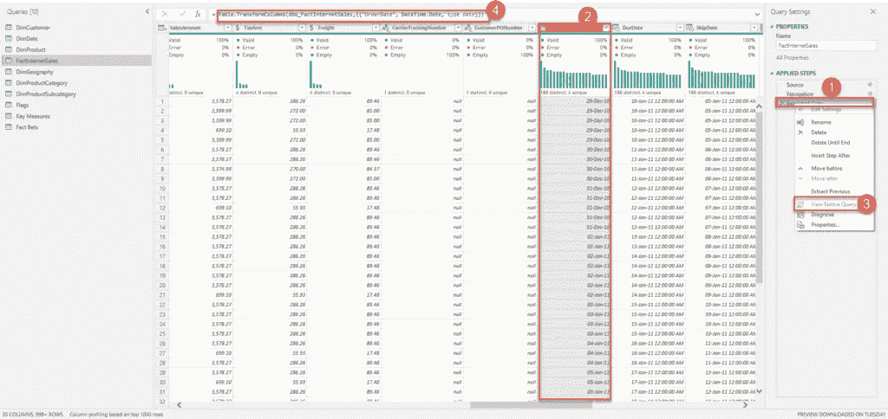

作者图片

看起来很相似，是吗？但是，让我们再次回顾一下现在发生的所有事情:

1.  我们现在有一个称为提取日期的步骤，而不是更改类型的步骤
2.  该列本身看起来与上一个示例完全相同，没有时间部分
3.  不对不对，查询不再折叠了！正如您所看到的，查看本地查询选项是灰色的！
4.  这个时候，M 公式适用的是:*表。TransformColumns()*

所以，M 公式(*表中的一个不同的单词。TransformColumnTypes* vs *表。TransformColumns* )严重影响了我们的查询，以至于无法将其转换为 SQL！

从这个故事中吸取教训:当你选择改变数据类型的选项时，要小心谨慎！

## 编写本机 SQL 查询以获取数据

将数据导入 Power BI 时，您需要做出的最早决定之一是:您是否希望从 SQL 数据库“按原样”导入数据，然后在 Power Query 编辑器中应用必要的转换…或者，您是否希望手动编写 SQL 查询来检索数据…

如果您选择后一个选项，您应该意识到手写的 SQL 查询不能再折叠了！所以，在这个场景中，是 ***全有或者全无*** ！一旦您决定使用自定义 SQL 语句导入数据，在 Power Query 编辑器中应用的所有后续转换步骤都不会折叠，即使您正在应用一些基本的转换，如过滤或重命名列，这些步骤在“正常”情况下会折叠。

让我给你看一个例子:

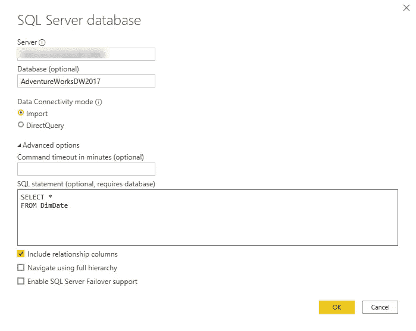

作者图片

因此，我想从 DimDate 表中导入所有行和列。现在，假设我只想保留 2007 年 1 月 1 日之后的行:

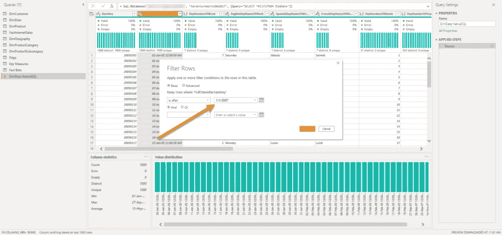

作者图片

在正常情况下，当您“按原样”导入 DimDate 表时，可以使用 SQL 中的 WHERE 子句(WHERE FullDateAlternateKey > ' 2007–01–01 ')轻松转换该转换，并将其推送到 SQL 数据库源。

现在，如果我在这一步运行查询诊断工具，我可以看到这里没有发生查询折叠！

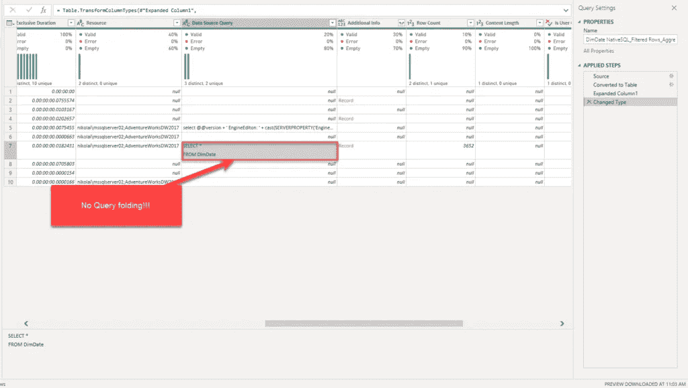

作者图片

如您所见，只有我们的初始查询是在 SQL 数据库端执行的。所以，这里发生的事情是，Mashup 引擎从 DimDate 表中提取了所有行*，然后应用了我们请求的转换步骤！无需强调这对性能的影响，无论是在 CPU 还是内存消耗方面…*

*如果您决定采用这种方式并手工编写 SQL 代码，有两种可能的解决方案:*

*   ****创建一个数据库视图***——这是最理想的场景！如果您能够在底层数据库中创建视图，那么您可以将整个转换逻辑封装在视图中，然后“按原样”导入视图，所有应用的转换都已经就绪！由于数据库视图在 Power BI 中被视为与数据库表完全相同，因此您仍然可以在视图上实现查询折叠！*
*   ****在单个 SQL 语句中应用所有必要的转换*** —如果您没有足够的权限创建数据库对象，另一个选项是在您编写的单个 SQL 语句中包含所有必要的转换步骤。大概是这样的:*

*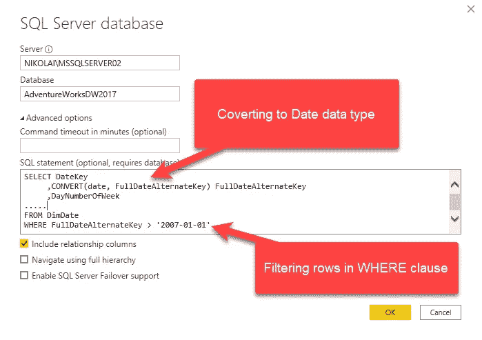*

*作者图片*

*最近，在编写原生 SQL 查询时，对查询折叠进行了一些改进。克里斯·韦伯写了一篇关于使用*价值的[优秀博文](https://blog.crossjoin.co.uk/2021/02/21/query-folding-on-sql-queries-in-power-query-using-value-nativequery-and-enablefoldingtrue/)。NativeQuery()* 函数，并为 EnableFolding 参数提供显式值 *TRUE* 。*

*然而，在撰写本文的时候，这个选项只适用于 PostgreSQL 连接器，这里的[中记录了这个连接器。它也可以在 SQL Server 中工作，但不是以最直观的方式，因为您需要在高级编辑器中手动替换 M 代码。](https://docs.microsoft.com/en-us/power-query/connectors/postgresql#native-query-folding)*

*因此，这更像是一种变通解决方案(确实很有帮助)，但是让我们希望在不久的将来，我们能够“开箱即用”地明确指示 Power BI，我们希望在编写定制 SQL 时启用查询折叠…*

## *骗子，骗子…*

*我在本系列的前一部分已经承诺，我将向您展示另一个例子，当*查看本机查询*选项可以欺骗您认为查询折叠被破坏时，即使实际上它不是真的…*

*假设我们只想保留表中的前 X 行。在我的例子中，我希望保留事实表中的前 2000 行:*

**

*作者图片*

*一旦我应用了这个步骤并检查了 View Native 查询，我就可以意识到我的查询折叠了，因为我的转换被转换成了 SQL 中的 TOP 子句:*

*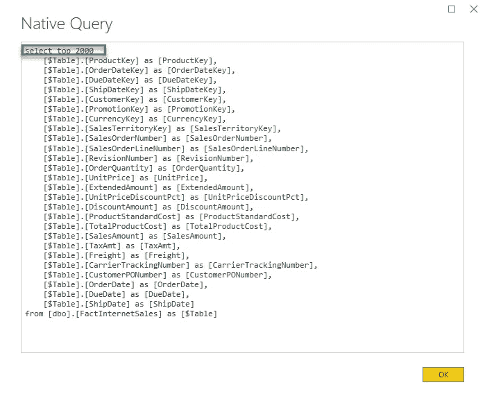*

*作者图片*

*现在，假设我想对我的销售额列应用绝对值转换。通常，这种转换很容易折叠，因为 T-SQL 中有一个 ABS 函数:*

*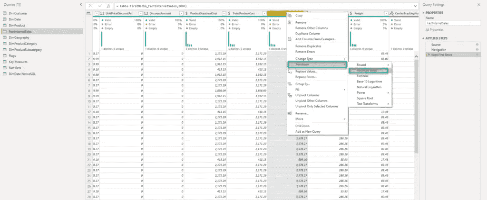*

*作者图片*

*但是，如果我右键单击这一步，我会看到查看本地查询选项是灰色的，所以我会假设这一步破坏了我的查询折叠！*

*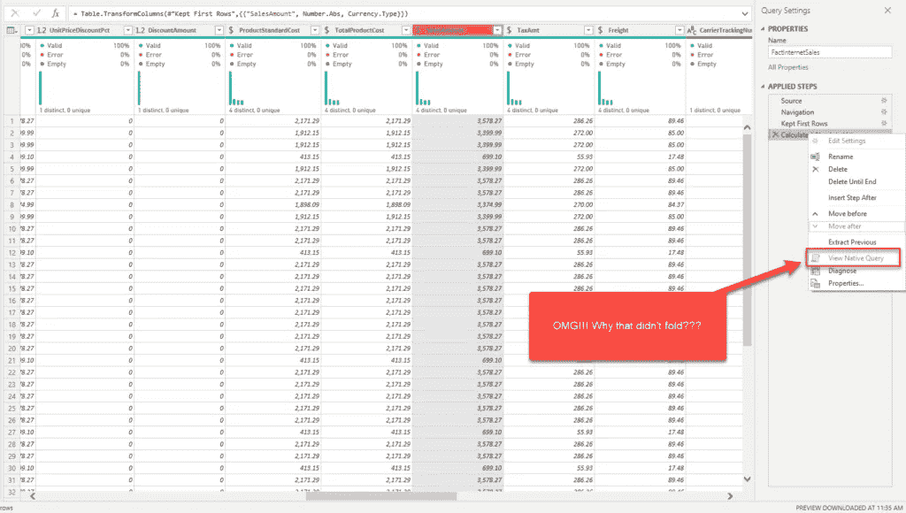*

*作者图片*

*让我们在查询诊断工具中对此进行检查:*

*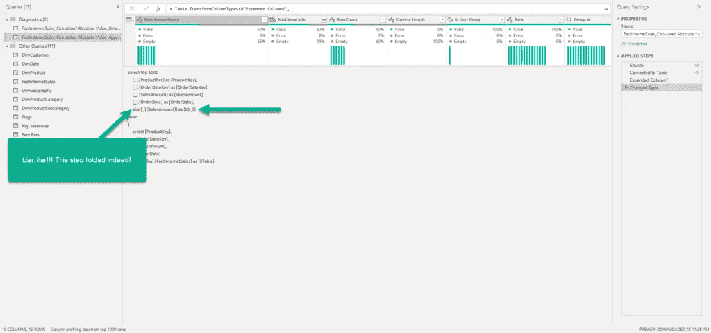*

*作者图片*

*哦，我的天啊！这一步确实折了！所以，我们又被查看原生查询选项骗了！*

*这里的关键接管是:每当您假设特定的转换步骤可以折叠时(就像在这个例子中，当我们知道 SQL 有 ABS 函数来支持我们的转换时)，请仔细检查实际发生了什么！*

## *终极性能测试*

*好吧，如果到目前为止我还没有说服您为什么应该努力实现查询折叠，现在让我拿出我最后的王牌吧！*

*我想向您展示返回完全相同结果的查询之间的数据刷新性能差异——其中一个折叠，另一个不折叠！*

****测试#1 查询折上****

*对于这个测试，我将使用 Contoso 示例数据库中的 FactOnlineSales 表。这个表大约有 1260 万行，很好地展示了查询折叠概念的重要性。*

*在第一个示例中，我应用了 9 个不同的变换步骤，它们都是可折叠的，如下图所示:*

*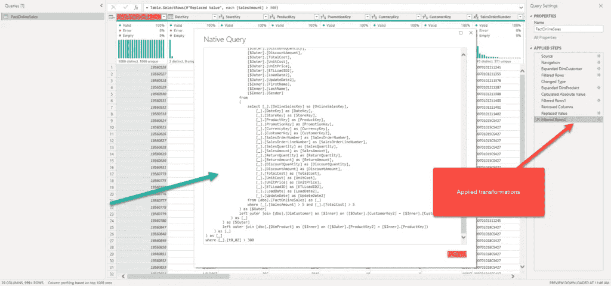*

*作者图片*

*不要关注 Mashup 引擎生成的 SQL 代码:如果你是一名 SQL 专业人员，当然，你可以编写更优化的 SQL 代码——但是，请记住，使用 Mashup 引擎自动生成的脚本， ***你不会得到最优的 SQL——你只是得到正确的 SQL*** ！*

*我将点击 Close & Apply 并打开秒表来测量我的数据刷新持续的时间。*

*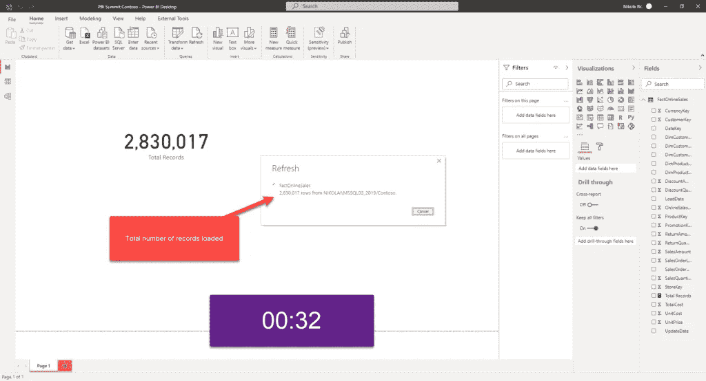*

*作者图片*

*这个查询花了 32 秒在我的 Power BI 报告中加载了 280 万条记录。数据是以 100.000–150.000 条记录为一批加载的，这很好地表明查询折叠已经就绪。*

****测试#2 查询折掉****

*现在，我将返回到 Power Query Editor，并在第三步中故意中断查询折叠(记住上面将日期/时间类型更改为 Date 的示例)，使用我知道不可折叠的转换:*

*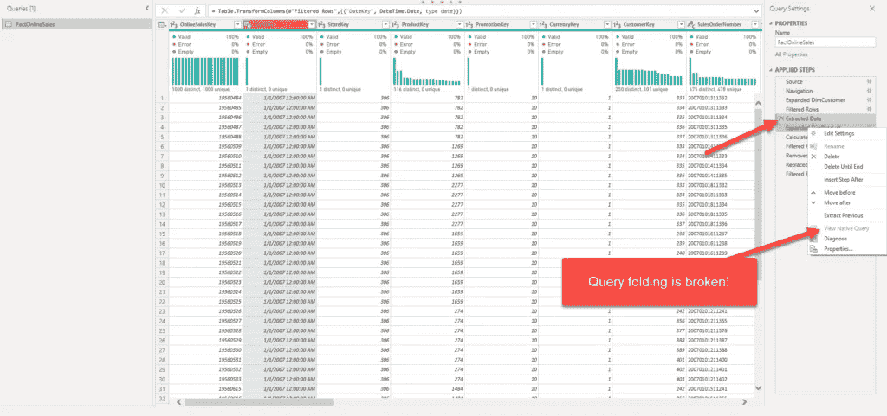*

*作者图片*

*说实话，我将在这里实现部分折叠，因为前两步将折叠，但提取日期转换后的所有后续步骤将不会折叠！*

*让我们再次打开秒表，看看会发生什么:*

**

*作者图片*

*首先要注意的是:这个查询花了 4 分 41 秒加载到我们的 Power BI 报告中，这大约比我们之前的查询折叠时的*多 10 倍。这一次，加载的数据批次在 10.000 到 20.000 条记录之间。**

**但是，更值得关注的是—您可以看到加载的记录总数几乎达到了 1100 万条！！！而不是上例中的 280 万！为什么会这样？在之前的文章中，我解释了当 Mashup 引擎不能将 M 语言翻译成 SQL 时，它需要将所有数据(从查询折叠被破坏的那一刻起)拉进**所有数据，然后**然后**对整个导入数据块应用转换！****

**最终结果是完全相同的——我们的 Power BI 报告中有 2.830.017 条记录——但是，在查询折叠就绪后，所有必要的转换都在 SQL 数据库端执行，Mashup 引擎得到了已经准备好的数据集。而在第二个场景中，在我们中断了查询折叠之后，Mashup 引擎将所有剩余的行(大约。1100 万)，只有在这之后，它才能应用其他转换步骤。**

**而且，这只是一个基本的例子，只有一个表，数据量没有那么大！想象一下包含多个表的大型数据集的影响有多大。**

## **结论**

**嗯，我们在这个博客系列中讨论了很多。我们学习了数据整形概念，我们介绍了超级查询基础知识，我们还学习了什么是查询折叠以及为什么我们应该尽最大努力来实现它。**

**我还与您分享了一些基本的例子和在一些常见用例中如何实现查询折叠的巧妙技巧。**

**最后，请注意，查询折叠是一项正在进行的工作，Power BI 团队的人员正在不断改进这一特性。因此，我在这里向您展示的一些查询折叠问题可能会同时得到解决。因此，请确保了解最新的改进。**

**感谢来自微软的 Alex Powers 收集了关于查询折叠的不同资源，以及 Christopher Majka 分享了链接，Github 上有一个 [repo，在这里您可以跟踪查询折叠功能的所有最新变化。](https://github.com/itsnotaboutthecell/powerquerym/blob/master/QueryFolding.md)**

**感谢阅读！**

**[成为会员，阅读 Medium 上的每一个故事！](https://datamozart.medium.com/membership)**

**订阅[此处](http://eepurl.com/gOH8iP)获取更多有见地的数据文章！**