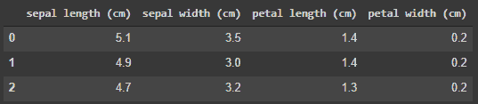

# 用 SQL 查询熊猫数据帧

> 原文：<https://towardsdatascience.com/query-pandas-dataframe-with-sql-2bb7a509793d?source=collection_archive---------1----------------------->

## 熊猫里可以用 SQL 吗？是的，这就是方法。


来自 [Pexels](https://www.pexels.com/photo/close-up-shot-of-a-panda-bear-7619816/?utm_content=attributionCopyText&utm_medium=referral&utm_source=pexels) 的 [.M.Q 黄](https://www.pexels.com/@hrvvv1994?utm_content=attributionCopyText&utm_medium=referral&utm_source=pexels)摄影

# 动机

Python 熊猫库和结构化查询语言(SQL)是数据科学家工具箱中最重要的工具之一。虽然 Pandas 是一个强大的数据操作工具，但是有许多数据科学家熟悉并喜欢使用 SQL 进行数据操作。在本文中，我们将研究如何使用带有`pandasql`库的 SQL 来执行 Pandas 数据帧的数据操作。

# Pandasql 是什么？

Pandasql 是一个 python 库，允许使用 sql 操作 Pandas 数据帧。在幕后，Pandasql 从感兴趣的 Pandas 数据帧创建一个 sqlite 表，并允许用户使用 SQL 从 SQLite 表中进行查询。

# Pandasql 是如何工作的？

安装 Pandasql 包。

```
!pip install -U pandasql
```

导入必要的包。

```
from pandasql import sqldf
import pandas as pd
from sklearn import datasets
```

我们使用 iris 数据集作为例子。`df_feature`是包含特征的数据帧，而`df_target`是包含目标的序列。Pandasql 可以在熊猫`DataFrame`和`Series`上运行。

```
df_feature = datasets.load_iris(as_frame = True)['data']
df_target = datasets.load_iris(as_frame = True)['target']print (type(df_feature))
print (type(df_target))>> <class 'pandas.core.frame.DataFrame'>
>> <class 'pandas.core.series.Series'>
```

`sqldf`方法用于查询数据帧，它需要 2 个输入:

1.  SQL 查询字符串
2.  `globals()`或`locals()`功能

典型的查询如下所示，其中`q`是 SQL 查询字符串。`sqldf`返回数据帧中的结果。

```
q = "SELECT * FROM df_target LIMIT 3"
sqldf(q, globals())
```



作者图片

`globals()`和`locals()`是 python 中内置的函数，用来存储函数和变量。让我们来看看`globals()`函数是做什么的。

```
globals()
```


作者图片

`globals()`函数返回在该会话中创建的变量字典，如`df_feature`和`df_target`。字典的关键字是变量名，字典的值包含变量的实际值。

```
print (globals().keys())>> dict_keys(['__name__', '__doc__', '__package__', '__loader__', '__spec__', '__builtin__', '__builtins__', '_ih', '_oh', '_dh', '_sh', 'In', 'Out', 'get_ipython', 'exit', 'quit', '_', '__', '___', '_i', '_ii', '_iii', '_i1', '_exit_code', '_i2', 'sqldf', 'pd', 'datasets', '_i3', 'df_feature', 'df_target', '_i4', '_4', '_i5', '_5', '_i6'])
```

由于`globals()`函数输出一个字典，我们可以通过以下方式使用`globals()`函数获取变量的访问值:

```
globals()['df_feature']
```

这将返回`df_feature`数据帧。


作者图片

# 例子

现在我们已经了解了`globals()`或`locals()`函数如何与 Pandasql 一起工作，让我们来看一些例子。我们创建了一个名为`pysqldf`的新函数，以避免每个查询都传入`globals()`或`locals()`。

```
pysqldf = lambda q: sqldf(q, globals())
```

我们可以用下面的方式简单地查询数据帧。

```
query = 'SELECT * FROM df_feature LIMIT 3'
pysqldf(query)
```


作者图片

```
query = 'SELECT * FROM df_target LIMIT 3'
pysqldf(query)
```


作者图片

让我们连接两个数据帧`df_feature`和`df_target`。如果我们使用熊猫，可以使用`pd.concat`方法。

```
pd.concat([df_feature, df_target], axis = 1).head()
```


作者图片

如果我们使用 SQL，我们将需要创建一个运行行号列，并使用行号连接两个表。由于 Pandasql 在幕后使用了 SQLite，所以 SQLite 表会默认创建`rowid`列。该列包含从 1 开始的增量整数值。

```
query = 'SELECT rowid, * FROM df_feature LIMIT 3'
pysqldf(query)
```


作者图片

我们现在可以在`rowid`列上连接两个表。输出可以赋给另一个变量，这个变量以后可以再次用 Pandasql 查询。

```
query = 'SELECT * FROM df_feature INNER JOIN df_target ON df_feature.rowid = df_target.rowid'
df = pysqldf(query)
df.head()
```


作者图片

以下是我们可以执行的其他操作的示例。

寻找不同目标类的平均萼片长度。注意`"sepal length (cm)"`被引号包围了。只有当列名中有空格时，才需要这样做。

```
query = 'SELECT target, AVG("sepal length (cm)") AS mean_sepal_length FROM df GROUP BY target'
pysqldf(query)
```


作者图片

我们还可以利用 python 中的 f 字符串来创建动态 SQL 查询字符串。

```
COL_NAME = '"sepal length (cm)"'
ALIAS = 'sepal_length'
AGG = 'MAX'query = f"SELECT {AGG}({COL_NAME}) AS {ALIAS} FROM df"
pysqldf(query)
```


作者图片

# Pandasql 的局限性

1.  由于 Pandasql 使用 SQLite，它受到 SQLite 的所有[限制。例如，SQLite 不实现右外连接或全外连接。](https://www.sqlite.org/omitted.html)
2.  Pandasql 只执行查询，它不能执行 sql 操作，如更新、插入或更改表。

# 结论

Pandasql 是对数据科学家工具箱的一个很好的补充，对于那些喜欢 sql 语法而不是 Pandas 的数据科学家来说。在本文中，我们讨论了如何使用 Pandasql 查询 Pandas Dataframe 以及它的一些局限性。

[加入 Medium](https://medium.com/@edwin.tan/membership) 阅读更多这样的故事。