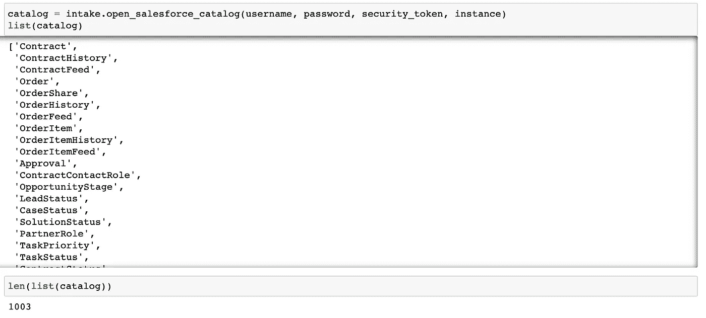
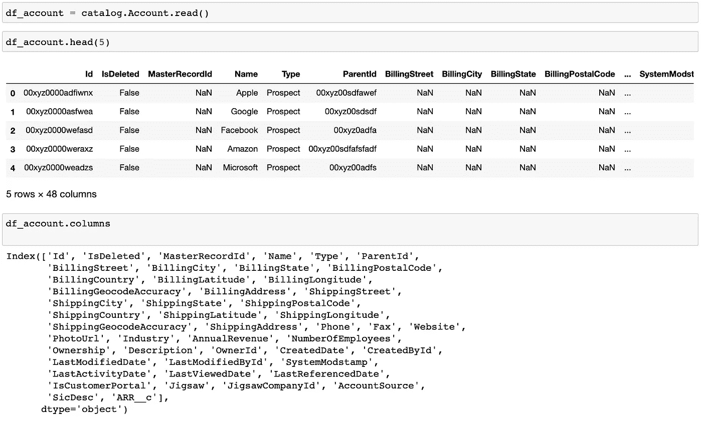
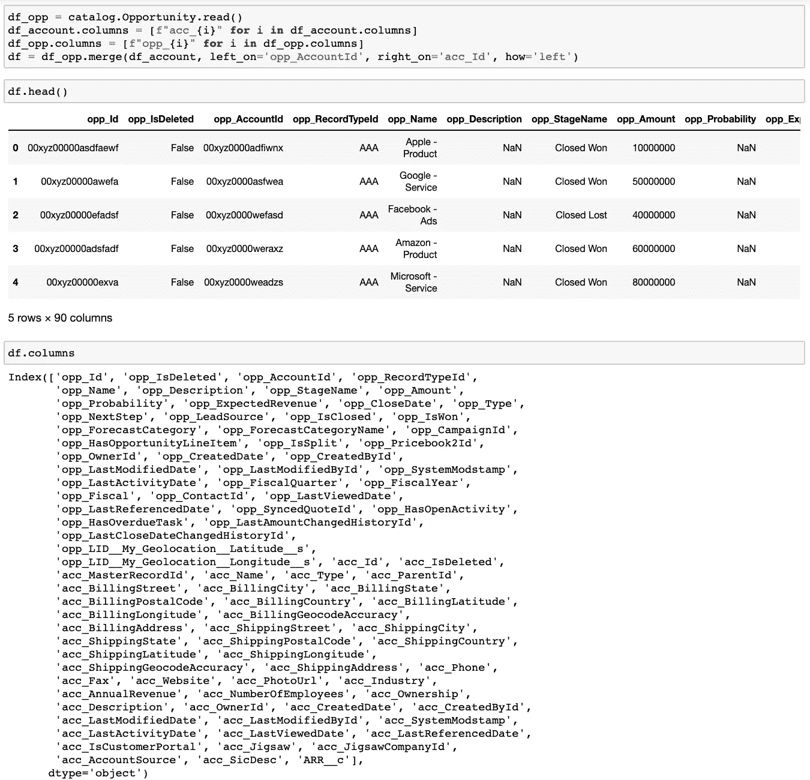
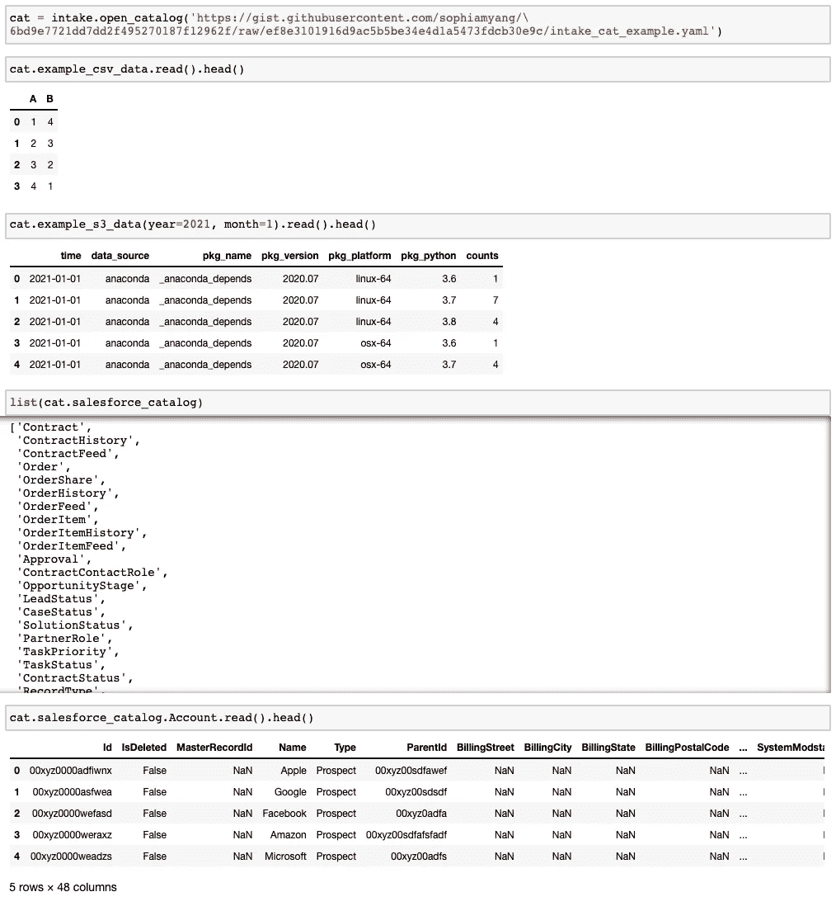

# 使用 intake-salesforce 在 Python 中查询 Salesforce 数据

> 原文：<https://towardsdatascience.com/query-salesforce-data-in-python-using-intake-salesforce-b80c7a714943?source=collection_archive---------32----------------------->

## 【salesforce 的进气驱动


[杰克·沃德](https://unsplash.com/@jackward?utm_source=unsplash&utm_medium=referral&utm_content=creditCopyText)在 [Unsplash](https://unsplash.com/@jackward?utm_source=unsplash&utm_medium=referral&utm_content=creditCopyText) 上的照片

Salesforce 数据库可能非常混乱。下图说明了 Salesforce 中一些数据表之间的关系。如您所见，数据表(即对象)之间的关系可能很复杂，很难处理。我之前写过一篇关于如何通过 Python API simple-salesforce 使用 [Salesforce 对象查询语言(SOQL)](https://developer.salesforce.com/docs/atlas.en-us.soql_sosl.meta/soql_sosl/sforce_api_calls_soql.htm) 理解和查询 Salesforce 数据的[博文。Salesforce 对象查询语言(SOQL)是一种类似 SQL 的语言，专门为 Salesforce 中的关系数据设计，对于不熟悉 Salesforce 数据库的人来说，它不是最容易理解和编写的。因此，我编写了一个导入驱动程序来加载 Salesforce 数据，以帮助人们方便地查询 Salesforce 数据。](https://medium.com/swlh/query-salesforce-data-in-python-e290a00e3cba)


作者创造的形象

# 什么是摄入？

Intake 是 Anaconda 在 2018 年开发的。这是一个轻量级的数据目录和数据访问库。它帮助用户更有效地访问数据和共享数据。具体来说，Intake 具有以下关键特征，这些特征令数据科学家们趋之若鹜:

*   摄入加载来自各种数据源的数据，并在摄入目录中提供您的数据的描述。
*   缓存有助于更快地加载数据。
*   Intake 允许用户轻松创建数据包。
*   图形界面有助于轻松浏览数据。
*   Intake 从各种数据格式加载数据，并允许用户为新的文件格式创建插件/驱动程序。
*   入口生态系统目前包括 30 多个[入口驱动](https://intake.readthedocs.io/en/latest/plugin-directory.html)，帮助用户使用统一的 API 加载来自不同来源的数据。

关于如何使用进气的更多信息可在[进气文件](https://intake.readthedocs.io/en/latest/)中找到。

# 如何使用 intake-salesforce？

在我们开始了解 intake-salesforce 之前，我们需要获得一些 salesforce 凭据信息:

*   用户名
*   密码
*   安全令牌:可在“设置—个人—重置我的安全令牌”下找到
*   实例:您的公司名称. lightning.force.com

要安装 intake-salesforce，请运行以下程序

```
conda install intake-salesforce -c conda-forge
```

或者`pip install intake-salesforce`

为了在 Salesforce 中获得表的目录，我们使用了`intake.open_salesforce_catalog`方法:



现在我们有一个包含 1003 个表的列表，我们可以使用`catalog.TABLE_NAME.read()`读取这些表，并在内存中返回 Pandas 数据帧。例如，让我们读入“账户”表(非真实数据):



帐户表中有 48 列。请注意，以 __c 结尾的列名都是 Salesforce 中的自定义对象，这意味着在这种情况下，我们的 Salesforce 管理员在帐户表对象中创建了一个名为“ARR__c”的变量对象。

类似地，我们可以读入其他表(例如 Opportunity)并将 Account 表与 Opportunity 表合并(同样，下面显示的不是真实数据)。为了明确哪些变量属于哪个表，我在帐户变量前面加了“acc_ ”,在机会变量前面加了“opp_”。这里我们看到合并后的表有 90 列。



# 把所有东西放在一起

我们如何以一致的方式从各种来源加载数据？我们将展示一个加载本地。csv 文件、存储在 AWS 上的一组拼花文件和 Salesforce 数据。

Intake 的关键特性和概念是目录文件，它是“一个 YAML 规范文件，包含一个描述如何加载数据源的命名条目列表”(https://Intake . readthedocs . io/en/latest/catalog . html)。在下面的“load_data.yaml”示例中，我们定义了三个数据源:example_csv_data、example_s3_data 和 salesforce_catalog。在每个数据源下，我们列出了它的引入驱动因素、参数和其他信息。请注意，我们将所有数据加载为 Pandas 数据帧，其他数据类型和分区/并行访问也可以使用 Intake。

要从这三个数据源加载数据，我们只需打开这个 yaml 文件作为目录`cat`，并按如下方式读入数据:

*   阅读。csv 文件:`cat.example_csv_data.read()`
*   阅读。拼花文件:`cat.example_s3_data(year=xxx, month=xxx).read()` 。注意，我们首先需要`conda install intake-parquet s3fs python-snappy`,还要注意，我们能够将参数作为参数传入。
*   读取 Salesforce 数据:`cat.salesforce_catalog`显示 Salesforce 表的列表和指定表中的`cat.salesforce_catalog.TABLE_NAME.read()`读取。



总之，intake-salesforce 为用户提供了一种在 salesforce 中查看表格目录和读取特定数据表(如 Pandas dataframes)的简单方法。摄入目录允许用户一致地从各种来源加载数据。希望你喜欢使用摄入和摄入销售力量。谢谢！

鸣谢:特别感谢 Martin Durant、Albert DeFusco 和 Stan Seibert 在开发 intake-Salesforce 和撰写本文时提供的指导和反馈。

# 参考资料:

[https://intake.readthedocs.io/](https://intake.readthedocs.io/)[https://www . anaconda . com/intake-taking-the-pain-out-of-data-access/](https://www.anaconda.com/intake-taking-the-pain-out-of-data-access/)[https://martindurant.github.io/blog/flurry-of-drivers/](https://martindurant.github.io/blog/flurry-of-drivers/)[https://medium . com/swlh/query-sales force-data-in-python-e 290 a 00 E3 CBA](https://medium.com/swlh/query-salesforce-data-in-python-e290a00e3cba)[https://developer . sales force . com/docs/atlas . en-us . soql _ sosl . meta/soql _ sosl/sforce _ API _ calls _ calls](https://developer.salesforce.com/docs/atlas.en-us.soql_sosl.meta/soql_sosl/sforce_api_calls_soql.htm)

作者索菲亚·杨 2021 年 7 月 1 日