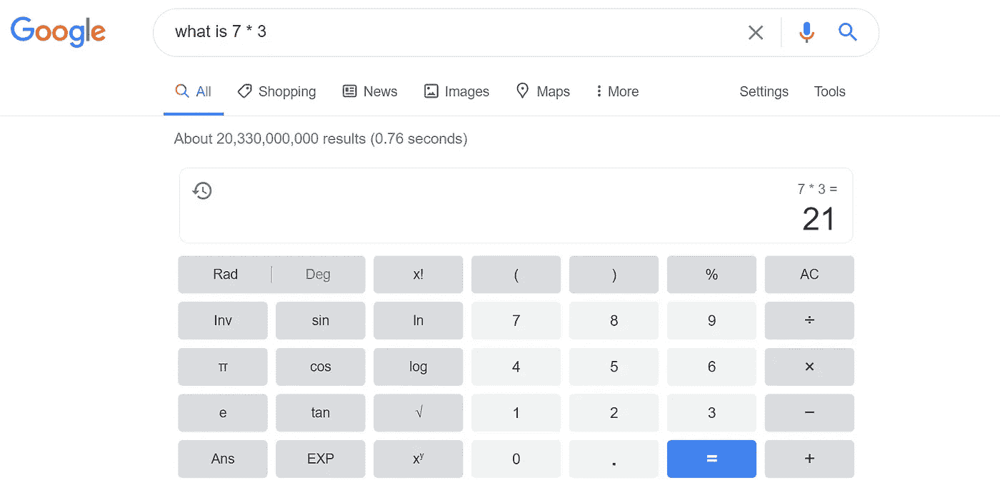
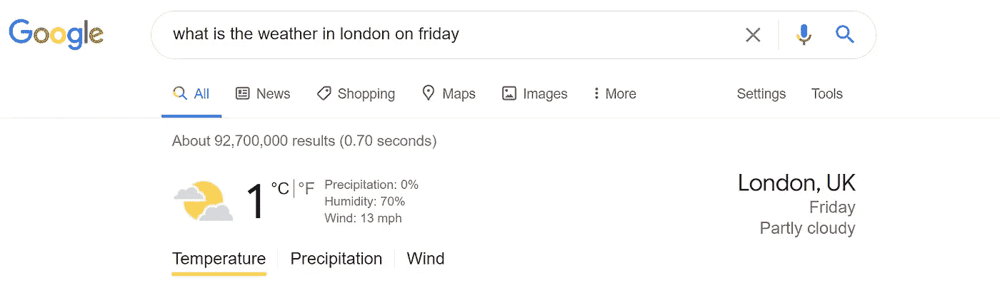
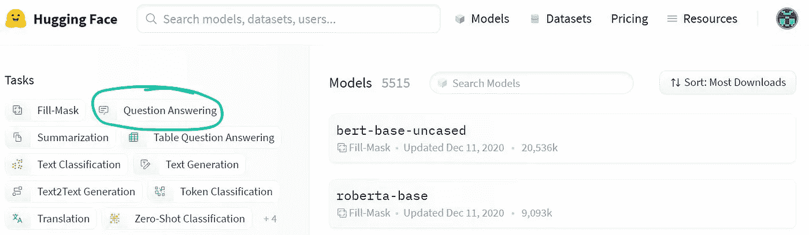
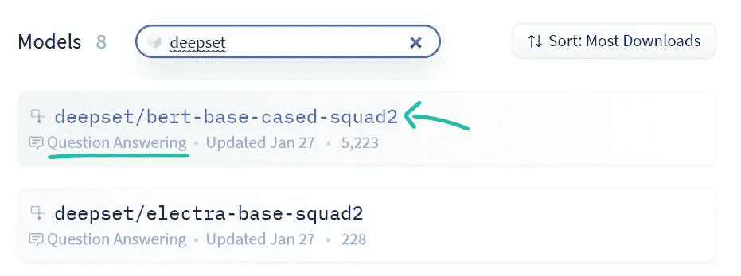
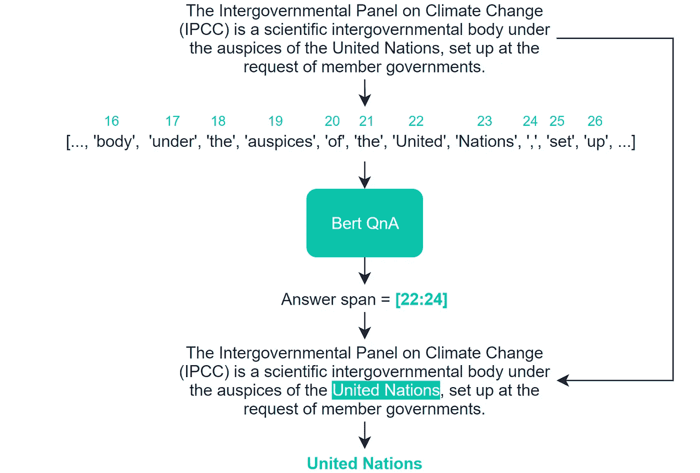

# 伯特问答

> 原文：<https://towardsdatascience.com/question-and-answering-with-bert-6ef89a78dac?source=collection_archive---------5----------------------->

## 使用预先培训的变压器进行简单、先进的问答


照片由[玛丽娜·维塔莱](https://unsplash.com/@marina_mv08?utm_source=medium&utm_medium=referral)在 [Unsplash](https://unsplash.com?utm_source=medium&utm_medium=referral) 拍摄

在不太遥远的过去，向机器提问并得到答案一直是科幻小说的内容。现在，事情发生了变化，我们发现自己在任何地方都在使用 Q & A 系统——甚至没有意识到这一点。

谷歌搜索是最好的例子——虽然在大多数情况下，谷歌被用来查找信息，并会简单地为你指出正确的方向，但许多其他查询都是直接的问题——对此谷歌通常会提供直接的答案:


这是常识吗..？



谷歌轻松识别数学问题



我们甚至可以得到更具体的信息，并根据地点和时间询问具体的信息

当然，谷歌领先了。但这并不意味着我们不能产生伟大的问答系统——我们可以——我们甚至可以使用谷歌在搜索中使用的完全相同的模型。

在本文中，我们将学习如何使用最先进的 transformer 模型进行问答。我们将了解 Google 的 Bert 以及如何使用它。

简而言之，我们将涵盖:

```
**> HuggingFace's Transformers**
  - Installation**> Setting-up a Q&A Transformer
**  - Finding a Model  - The Q&A Pipeline
    1\. Model and Tokenizer Initialization
    2\. Tokenization
    3\. Pipeline and Prediction
```

如果你更喜欢视频，我在这里也涵盖一切:

# 拥抱脸的变形金刚

首先，现代 NLP 被这些不可思议的叫做**变形金刚**的模型所主宰。这些模型非常出色，是相对较新的发展(第一篇描述变压器的论文出现在 2017 年)。

第二，变形金刚在现实世界中的实现几乎完全是通过一个名为`transformers`的库来完成的，这个库是由一群自称为 HuggingFace 的人构建的。

变形金刚图书馆如此受欢迎有很多原因。但我特别想到了三个因素:

1.  开源——这个图书馆是开源的，它有一个非常活跃的社区
2.  **易用性** —我们可以用大约五行代码开始使用来自谷歌、OpenAI 和脸书的最先进的模型
3.  **模型**——该库有难以想象的大量可用模型，我们可以简单地下载并开始工作

## 装置

我们可以使用以下工具轻松地为 Python 安装变压器:

```
pip install transformers
```

然而，这个库也依赖于 PyTorch 或 TensorFlow 的安装——因为它们在后台使用。

因此，我们安装了 TensorFlow:

```
pip install tensorflow
*OR*
conda install tensorflow
```

按照此处提供的“安装 PyTorch”下的说明安装 PyTorch。

# 设置问答转换器

现在我们已经安装了 transformer，我们可以开始构建我们的第一个问答 transformer 脚本了。

## 寻找模特



HuggingFace 模型页面的屏幕截图—我们选择**问题回答**来过滤专门为 Q & A 训练的模型

我们先找一个模型来用。我们前往[huggingface.co/models](https://huggingface.co/models)，点击左边的问答。



我们还可以搜索特定的模型——在这种情况下，我们将使用的两个模型都出现在 **deepset** 下。

之后，我们可以找到我们将在本文中测试的两个模型— `deepset/bert-base-cased-squad2`和`deepset/electra-base-squad2`。

这两个模型都是由 Deepset 构建的。艾——因此有了`deepset/`。他们都已经在 SQuAD 2.0 数据集上进行了 Q & A 的预训练，如最后的`squad2`所示。

第一个型号是`bert-base`，意思是伯特的基本(不大，也不小)版本。也就是说`cased`认为大写/小写字母是不同的。

第二个模型也是另一个叫做伊莱克特的模型的“基础”版本——我发现这是一个真正令人惊叹的问答模型

如果你对用伊莱克特替换伯特感兴趣，只需在整篇文章中用`deepset/electra-base-squad2`替换`deepset/bert-base-cased-squad2`。如果你有兴趣了解更多关于伊莱克特的工作方式，你可以看看这篇文章:

[](/electra-is-bert-supercharged-b450246c4edb) [## 伊莱克特拉是伯特——超级增压

### ELECTRA 的性能优于所有其他变压器，体积仅为其 1/4

towardsdatascience.com](/electra-is-bert-supercharged-b450246c4edb) 

很好——我们现在需要的是模型名称`deepset/bert-base-cased-squad2` —我们将很快使用它来加载我们的模型。

## 问答过程

我们的问答流程核心由三个步骤组成:

1.  模型和标记器初始化
2.  查询标记化
3.  管道和预测

这些是基本要素，实际上，可能还有其他几个步骤，比如数据预处理或上下文检索。但是，最简单的形式是，我们只需要担心这三个步骤。

因为我们想让这个介绍尽可能简单，所以我们只担心这三个步骤。

1。 **模型和记号化器初始化** —这是我们的第一步，这里我们将导入转换器并使用`deepset/bert-base-cased-squad2`初始化我们的模型和记号化器。

这是我们需要在模型和标记器中加载的唯一代码——非常简单。

2。 **输入数据标记化** —我们已经初始化了我们的标记化器，现在是时候给它输入一些文本来转换成 Bert 可读的标记 id 了。

我们的 Bert tokenizer 负责将人类可读的文本转换成 Bert 友好的数据，称为 token IDs。

首先，记号赋予器获取一个字符串并将其分割成记号。看起来像是:

其中一些记号是新的，比如`[CLS]`和`[PAD]`——这些是特殊的记号，用于向 Bert 表示不同的事物。下面是 Bert 使用的特殊令牌的完整列表。

在这个初始标记化之后，我们将这个字符串列表(标记)转换成一个整数列表(标记 id)。这是通过一个内部字典来完成的，这个字典包含了 Bert 理解的每一个令牌。

这些标记中的每一个都映射到一个唯一的整数值，上面的特殊标记表中列出了其中的一些映射。正是这些令牌 id 被输入到 Bert 中。

3。 **管道和预测** —现在我们已经初始化了我们的模型和标记器，并了解了我们的标记器是如何将我们人类可读的字符串转换成标记 id 列表的，我们可以开始集成和提问了！

```
from transformers import pipelinenlp = pipeline('question-answering', model=model, tokenizer=tokenizer)
```

我们可以这样开始提问:

现在，这看起来很简单——但这确实是我们编写问答模型和开始提问所需要的。

然而，让我们稍微分解一下这个管道函数，以便我们能够理解实际发生了什么。

首先，我们将经过`question`和`context`。当将这些输入到 Q & A 模型中时，需要一个特定的格式——如下所示:

```
[CLS] <context> [SEP] <question> [SEP] [PAD] [PAD] ... [PAD]
```

因此，在我们的示例中，合并后的输入看起来像这样:

然后将其转换为令牌 ID 格式:

这将会传递给伯特。在这一点上，Bert 做了一些语言上的魔法来识别答案在上下文中的位置。

一旦 Bert 做出决定，它将返回答案的跨度——即开始标记索引和结束标记索引。在我们的例子中，它看起来像这样*(直到“Answer span =[22:24]”*:



流水线过程

接下来，我们的管道将根据 Bert 的起始端令牌索引预测提取相关的令牌 id。然后，这些令牌 id 将被反馈到我们的令牌化器中，被解码成人类可读的文本！

这就是我们的答案！

就这样，我们建立了我们的第一个问答变压器模型！

当然，我们在这里所做的通常只是一个更大难题的一部分。最有可能的是，您还需要考虑其他一些事情，例如:

*   **上下文提取**——你总是会有一两段文字包含你的答案吗？还是更有可能是几页甚至更多？(费斯+ DPR 在这方面很棒)
*   **微调你的模型**——预先训练的模型很好，但在应用于语言/格式略有不同的 Q & A(如金融术语或推文)时可能会有困难。

这些是一些额外的步骤，在向前推进和开发真实世界的用例时可能会被证明是至关重要的，但是，它们并不总是必需的，我们在这里构建的内容代表了问答过程的核心。

如果你想了解更多关于问答变形金刚的知识——比如上下文提取和微调——我已经在 Medium 和 [YouTube](https://www.youtube.com/c/jamesbriggs) 上讨论过(并将继续讨论)。

否则，我希望你喜欢这篇文章！我很乐意听到你的反馈、问题或想法——所以欢迎在下面留下评论或通过 [Twitter](https://twitter.com/jamescalam) 联系。

感谢阅读！

[🤖带变压器的 NLP 课程](https://bit.ly/nlp-transformers)

**所有图片均由作者提供，除非另有说明*