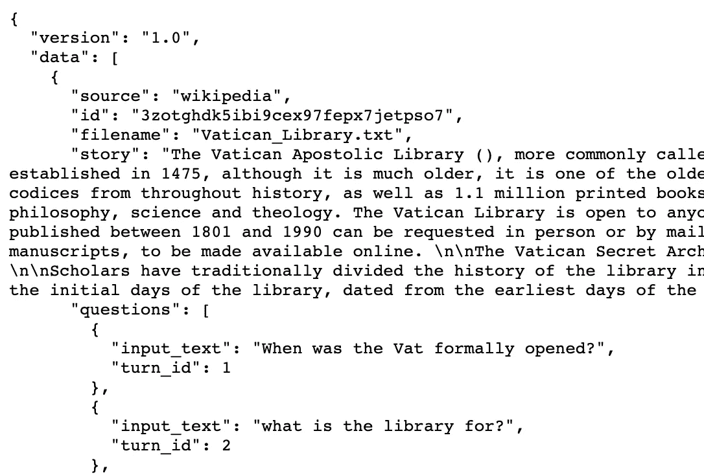
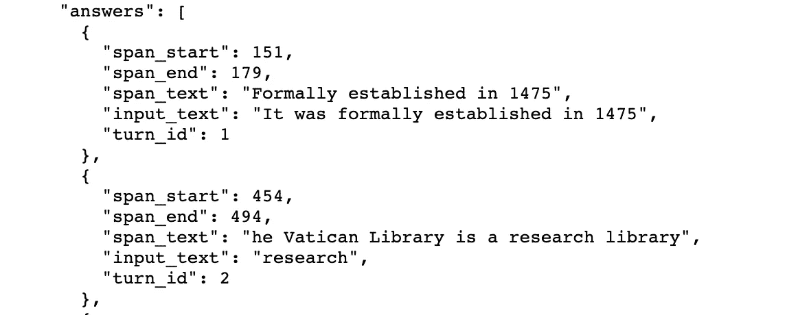
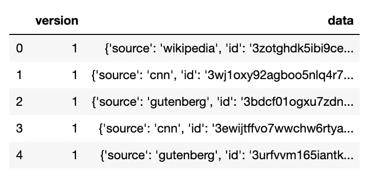
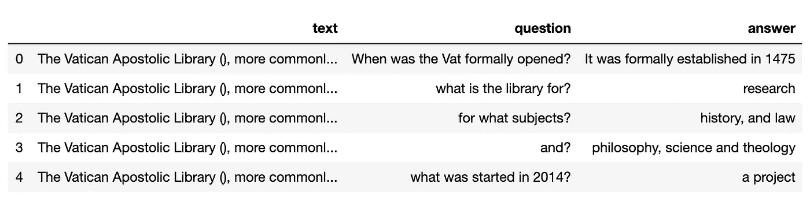
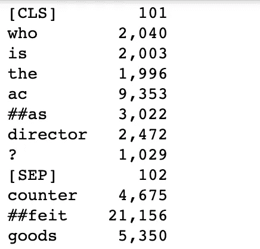
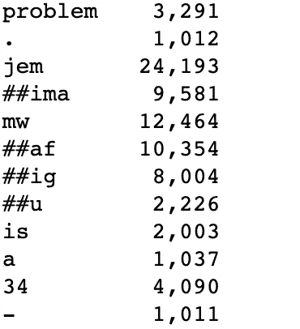
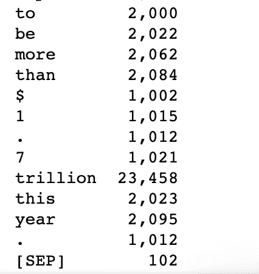

# 用微调过的 BERT 回答问题

> 原文：<https://towardsdatascience.com/question-answering-with-a-fine-tuned-bert-bc4dafd45626?source=collection_archive---------1----------------------->

## …在斯坦福大学的 CoQA 数据集上使用拥抱脸变形器和 PyTorch


[泰勒](https://unsplash.com/@taypaigey)在 [Unsplash](https://unsplash.com/photos/NTur2_QKpg0) 上的照片

每当我想到问题回答系统时，我首先想到的是教室——一个老师提出的问题，一个或几个学生举手🙋来回答这个问题。也就是说，回答问题对人类来说可能是一项微不足道的任务，但对机器来说却不是如此微不足道。要回答任何问题，机器都需要克服许多不同的挑战，如词汇空缺、共指消解、语言歧义等。😏为此，机器需要大量的训练数据和智能架构来理解和存储文本中的重要信息。NLP 的最新进展已经释放了机器理解文本和执行不同任务的能力。👌

在本文中，我们将一起完成一项常用的任务——问答。我们将使用拥抱脸变形金刚库中已经可用的微调 BERT 模型来回答基于 CoQA 数据集的故事的问题。我确信，通过查看代码，您会意识到使用一个微调的模型来达到我们的目的是多么容易。😁

***注意:*** *在本文中我们将不深入讨论 BERT 架构的细节。但是，在需要或可能的情况下，我会提供解释。*

**文中使用的版本:**火炬- 1.7.1，变形金刚- 4.4.2

让我们首先回答与本文相关的几个重要问题。

**什么是抱脸和变形金刚？**🤔

[拥抱脸](https://huggingface.co/)是自然语言处理(NLP)技术的开源提供商。您可以使用拥抱脸最先进的模型来构建、训练和部署您自己的模型。[变形金刚](https://huggingface.co/transformers/)是他们的 NLP 库。我强烈推荐你去看看拥抱脸团队所做的惊人的工作，以及他们收集的大量预先训练好的 NLP 模型。

**什么是 CoQA？**🤔

[CoQA](https://arxiv.org/pdf/1808.07042.pdf) 是斯坦福 NLP 于 2019 年发布的会话式问答数据集。这是一个用于构建对话式问答系统的大规模数据集。该数据集旨在测量机器理解文本段落并回答对话中出现的一系列相互关联的问题的能力。该数据集的独特之处在于，每个对话都是通过两个人群工作者以问答的形式就一段内容进行聊天来收集的，因此，这些问题是对话式的。要了解 JSON 数据的格式，请参考这个[链接](http://downloads.cs.stanford.edu/nlp/data/coqa/coqa-train-v1.0.json)。我们将使用来自 JSON 数据集的故事、问题和答案来构成我们的数据框架。

**伯特是什么？**🤔

[BERT](https://arxiv.org/pdf/1810.04805.pdf) 是来自变压器的双向编码器表示。它是最流行和最广泛使用的 NLP 模型之一。BERT 模型可以通过查看单词前后的单词来考虑单词的完整上下文，这对于理解查询背后的意图特别有用。由于它的双向性，它对语言的上下文和流程有更深的理解，因此，现在被用于许多 NLP 任务中。关于 BERT 的更多细节以及代码。🙃

变形金刚库有很多不同的 [BERT 模型](https://huggingface.co/transformers/model_doc/bert.html#)。很容易从这个库中找到一个特定于任务的模型并完成我们的任务。

那么，让我们开始吧，但首先让我们看看我们的数据集。😊



斯坦福的 JSON 数据

JSON 数据有很多字段。出于我们的目的，我们将使用来自“问题”和“答案”的“故事”、“输入文本”，并形成我们的数据框架。

## **安装变压器**

```
**!pip install** transformers
```

## **导入库**

```
**import** pandas **as** pd
**import** numpy **as** np
**import** torch
**from** transformers **import** BertForQuestionAnswering
**from** transformers **import** BertTokenizer
```

## 从斯坦福网站加载数据

```
coqa = **pd.read_json**('[http://downloads.cs.stanford.edu/nlp/data/coqa/coqa-train-v1.0.json'](http://downloads.cs.stanford.edu/nlp/data/coqa/coqa-train-v1.0.json'))
coqa**.head()**
```



加载的数据集

## 数据清理

我们将处理“数据”列，所以让我们删除“版本”列。

```
**del** coqa["version"]
```

对于每一个问答配对，我们将把链接的故事附加到它上面。

```
*#required columns in our dataframe*
cols = ["text","question","answer"]*#list of lists to create our dataframe*
comp_list = []
**for** index, row **in** coqa**.iterrows()**:
    **for** i **in** **range**(**len**(row["data"]["questions"])):
        temp_list = []
        temp_list**.append**(row["data"]["story"])
        temp_list**.append**(row["data"]["questions"][i]["input_text"])
        temp_list**.append**(row["data"]["answers"][i]["input_text"])
        comp_list**.append**(temp_list)new_df = **pd.DataFrame**(comp_list, columns=cols) *#saving the dataframe to csv file for further loading*
new_df**.to_csv**("CoQA_data.csv", index=**False**)
```

## 从本地 CSV 文件加载数据

```
data = **pd.read_csv**("CoQA_data.csv")
data**.head()**
```

这是我们清理后的数据。



清理的数据

```
**print**("Number of question and answers: ", **len**(data))
```

数据集有很多问题和答案，我们来数一下。

```
Number of question and answers:  108647
```

## 构建聊天机器人

使用这些预先训练好的模型的最大好处是，只需两行简单的代码就可以加载模型及其标记器。😲不就是单纯的哇吗？对于文本分类这样的任务，我们需要在数据集上微调 BERT。但对于问答任务，我们甚至可以使用已经训练好的模型，即使我们的文本来自完全不同的领域，也能获得不错的结果。为了得到更好的结果，我们使用了一个伯特模型，这个模型是根据小队基准进行微调的。

对于我们的任务，我们将使用变形金刚库中的 **BertForQuestionAnswering** 类。

```
model = **BertForQuestionAnswering.from_pretrained**('bert-large-uncased-whole-word-masking-finetuned-squad')
tokenizer = **BertTokenizer.from_pretrained**('bert-large-uncased-whole-word-masking-finetuned-squad')
```

预计下载需要几分钟，因为 BERT-large 是一个非常大的模型，有 24 层和 340M 参数，使其成为 1.34GB 的模型。

## 问问题

让我们随机选择一个问题编号。

```
random_num = **np.random.randint**(0,**len**(data))question = data["question"][random_num]
text = data["text"][random_num]
```

让我们将问题和文本标记成一对。

```
input_ids = tokenizer**.encode**(question, text)
**print**("The input has a total of {} tokens."**.format**(**len**(input_ids)))
```

我们来看看这个问题和文本对有多少个令牌。

```
The input has a total of 427 tokens.
```

为了看看我们的记号赋予器在做什么，让我们打印出记号和它们的 id。

```
tokens = tokenizer**.convert_ids_to_tokens**(input_ids)**for** token, id **in** **zip**(tokens, input_ids):
    **print**('{:8}{:8,}'**.format**(token,id))
```



带有 id 的令牌

BERT 有一种处理标记化输入的独特方法。从上面的截图中，我们可以看到两个特殊的令牌[CLS]和[SEP]。[CLS] token 代表分类，它代表句子级别的分类，在我们分类时使用。BERT 使用的另一个令牌是[SEP]。它用于分隔两段文本。你可以在上面的截图里看到两个[SEP]令牌，一个在问题后面，一个在正文后面。

除了“标记嵌入”，BERT 内部还使用了“段嵌入”和“位置嵌入”。片段嵌入有助于 BERT 区分问题和文本。在实践中，如果嵌入来自句子 1，我们使用 0 的向量，否则如果嵌入来自句子 2，我们使用 1 的向量。位置嵌入有助于确定单词在序列中的位置。所有这些嵌入都被馈送到输入层。

变形金刚库可以使用*pretrainedtokenizer . encode _ plus()*自行创建片段嵌入。但是，我们甚至可以创造我们自己的。为此，我们只需要为每个令牌指定一个 0 或 1。

```
*#first occurence of [SEP] token*
sep_idx = input_ids**.index**(tokenizer**.sep_token_id**)
**print**("SEP token index: ", sep_idx)*#number of tokens in segment A (question) - this will be one more than the sep_idx as the index in Python starts from 0* num_seg_a = sep_idx+1
**print**("Number of tokens in segment A: ", num_seg_a)*#number of tokens in segment B (text)*
num_seg_b = **len**(input_ids) - num_seg_a
**print**("Number of tokens in segment B: ", num_seg_b)*#creating the segment ids*
segment_ids = [0]*num_seg_a + [1]*num_seg_b#making sure that every input token has a segment id **assert** **len**(segment_ids) == **len**(input_ids)
```

这是输出。

```
SEP token index: 8
Number of tokens in segment A: 9
Number of tokens in segment B: 418
```

现在让我们把它输入到我们的模型中。

```
*#token input_ids to represent the input and token segment_ids to differentiate our segments - question and text*
output = **model**(**torch.tensor**([input_ids]),  token_type_ids=**torch.tensor**([segment_ids]))
```

查看最可能的开始和结束单词，并且仅当结束标记在开始标记之后时才提供答案。

```
*#tokens with highest start and end scores*
answer_start = **torch.argmax**(output.start_logits)
answer_end = **torch.argmax**(output.end_logits)**if** answer_end >= answer_start:
    answer = " "**.join**(tokens[answer_start:answer_end+1])
**else:**
    **print**("I am unable to find the answer to this question. Can you please ask another question?")

**print**("\nQuestion:\n{}"**.format**(question**.capitalize()**))
**print**("\nAnswer:\n{}."**.format**(answer**.capitalize()**))
```

这是我们的问题和答案。

```
**Question:**
Who is the acas director?
 **Answer:**
Agnes karin ##gu.
```

哇！伯特预测到了正确的答案——“艾格尼丝·卡琳古”。但是，回复里这个“##”是什么？继续读下去！📙

伯特使用**词块标记化**。在 BERT 中，生僻字被分解成子字/片段。单词块标记化使用##来分隔已拆分的标记。例如:“Karin”是一个常用词，所以 wordpiece 不会拆分它。然而，“Karingu”是一个罕见的词，所以 wordpiece 将其拆分为单词“Karin”和“##gu”。注意，它在古前面加了##，表示它是拆分后的第二个词。

使用单词块标记化背后的想法是减少词汇表的大小，从而提高训练性能。想想这些词，跑，跑，跑者。如果没有单词块标记化，模型必须独立地存储和学习所有三个单词的含义。但是，通过词块标记化，这三个单词中的每一个都将被拆分为“run”和相关的“# #后缀”(如果有后缀的话，例如，“run”，“##ning”，“##ner”)。现在，模型将学习单词“run”的上下文，其余的意思将被编码在后缀中，这将从具有类似后缀的其他单词中学习。

很有趣，对吧？我们可以使用下面的简单代码来重构这些单词。

```
answer = tokens[answer_start]**for** i **in** **range**(answer_start+1, answer_end+1):
    **if** tokens[i][0:2] == "##":
        answer += tokens[i][2:]
  **  else:**
        answer += " " + tokens[i]
```

上面的答案现在将变成: **Agnes karingu**

现在让我们把这个问答过程变成一个简单的函数。

```
**def** question_answer(question, text):

    *#tokenize question and text as a pair*
    input_ids = tokenizer**.encode**(question, text)

   * #string version of tokenized ids*
    tokens = tokenizer**.convert_ids_to_tokens**(input_ids)

  *  #segment IDs*
    #first occurence of [SEP] token
    sep_idx = input_ids**.index**(tokenizer**.sep_token_id**) *#number of tokens in segment A (question)*
    num_seg_a = sep_idx+1 *#number of tokens in segment B (text)*
    num_seg_b = **len**(input_ids) - num_seg_a

    *#list of 0s and 1s for segment embeddings*
    segment_ids = [0]*num_seg_a + [1]*num_seg_b **assert** **len**(segment_ids) == **len**(input_ids)

    *#model output using input_ids and segment_ids*
    output = **model**(**torch.tensor**([input_ids]), token_type_ids=**torch.tensor**([segment_ids]))

    *#reconstructing the answer*
    answer_start = **torch.argmax**(output.start_logits)
    answer_end = **torch.argmax**(output.end_logits) **if** answer_end >= answer_start:
        answer = tokens[answer_start]
        **for** i **in** range(answer_start+1, answer_end+1):
            **if** tokens[i][0:2] == "##":
                answer += tokens[i][2:]
            **else:**
                answer += " " + tokens[i]

    **if** answer**.startswith**("[CLS]"):
        answer = "Unable to find the answer to your question."

    **print**("\nPredicted answer:\n{}"**.format**(answer**.capitalize()**))
```

让我们使用数据集中的一个文本和问题来测试这个函数。😛

```
**text** = """New York (CNN) -- More than 80 Michael Jackson collectibles -- including the late pop star's famous rhinestone-studded glove from a 1983 performance -- were auctioned off Saturday, reaping a total $2 million. Profits from the auction at the Hard Rock Cafe in New York's Times Square crushed pre-sale expectations of only $120,000 in sales. The highly prized memorabilia, which included items spanning the many stages of Jackson's career, came from more than 30 fans, associates and family members, who contacted Julien's Auctions to sell their gifts and mementos of the singer. Jackson's flashy glove was the big-ticket item of the night, fetching $420,000 from a buyer in Hong Kong, China. Jackson wore the glove at a 1983 performance during \"Motown 25,\" an NBC special where he debuted his revolutionary moonwalk. Fellow Motown star Walter \"Clyde\" Orange of the Commodores, who also performed in the special 26 years ago, said he asked for Jackson's autograph at the time, but Jackson gave him the glove instead. "The legacy that [Jackson] left behind is bigger than life for me,\" Orange said. \"I hope that through that glove people can see what he was trying to say in his music and what he said in his music.\" Orange said he plans to give a portion of the proceeds to charity. Hoffman Ma, who bought the glove on behalf of Ponte 16 Resort in Macau, paid a 25 percent buyer's premium, which was tacked onto all final sales over $50,000\. Winners of items less than $50,000 paid a 20 percent premium."""**question** = "Where was the Auction held?"question_answer(question, text)*#original answer from the dataset* **print**("Original answer:\n", data**.loc**[data["question"] == question]["answer"].values[0]))
```

输出:

```
**Predicted answer:**
Hard rock cafe in new york ' s times square**Original answer:**
Hard Rock Cafe
```

一点也不差。事实上，我们的伯特模型给出了更详细的回答。

这是一个小函数，用来测试 BERT 对上下文的理解程度。我只是把回答问题的过程作为一个循环来玩这个模型。💃

```
**text** = **input**("Please enter your text: \n")
**question** = **input**("\nPlease enter your question: \n")**while** **True**:
    question_answer(question, text)

    flag = **True**
    flag_N = **False**

    **while** flag:
        response = **input**("\nDo you want to ask another question based on this text (Y/N)? ")
        **if** response[0] == "Y":
            question = **input**("\nPlease enter your question: \n")
            flag = False
        **elif** response[0] == "N":
            **print**("\nBye!")
            flag = False
            flag_N = True

    **if** flag_N == **True**:
        **break**
```

而且，结果！😎

```
**Please enter your text:** 
The Vatican Apostolic Library (), more commonly called the Vatican Library or simply the Vat, is the library of the Holy See, located in Vatican City. Formally established in 1475, although it is much older, it is one of the oldest libraries in the world and contains one of the most significant collections of historical texts. It has 75,000 codices from throughout history, as well as 1.1 million printed books, which include some 8,500 incunabula.   The Vatican Library is a research library for history, law, philosophy, science and theology. The Vatican Library is open to anyone who can document their qualifications and research needs. Photocopies for private study of pages from books published between 1801 and 1990 can be requested in person or by mail.   In March 2014, the Vatican Library began an initial four-year project of digitising its collection of manuscripts, to be made available online.   The Vatican Secret Archives were separated from the library at the beginning of the 17th century; they contain another 150,000 items.   Scholars have traditionally divided the history of the library into five periods, Pre-Lateran, Lateran, Avignon, Pre-Vatican and Vatican.   The Pre-Lateran period, comprising the initial days of the library, dated from the earliest days of the Church. Only a handful of volumes survive from this period, though some are very significant.

**Please enter your question:** 
When was the Vat formally opened?

**Answer:**
1475
 **Do you want to ask another question based on this text (Y/N)?** Y

**Please enter your question:** 
what is the library for?

**Answer:**
Research library for history , law , philosophy , science and theology

**Do you want to ask another question based on this text (Y/N)?** Y

**Please enter your question:** 
for what subjects?

**Answer:**
History , law , philosophy , science and theology**Do you want to ask another question based on this text (Y/N)?** N

Bye!
```

瞧啊。很好用！🤗

我希望这篇文章能让你了解我们如何轻松地使用来自拥抱面部变形库的预训练模型并执行我们的任务。如果你想把代码看做一个笔记本文件，这里有 [Github](https://github.com/chetnakhanna16/CoQA_QuesAns_BERT/blob/main/CoQA_BERT_QuestionAnswering.ipynb) 链接。

**参考文献:**

1.  [https://huggingface.co/](https://huggingface.co/)
2.  [https://arxiv.org/pdf/1810.04805.pdf](https://arxiv.org/pdf/1810.04805.pdf)
3.  [https://arxiv.org/pdf/1808.07042.pdf](https://arxiv.org/pdf/1808.07042.pdf)
4.  [https://github.com/google-research/bert/issues/44](https://github.com/google-research/bert/issues/44)

感谢大家阅读这篇文章。请分享您宝贵的反馈或建议。快乐阅读！📗 🖌