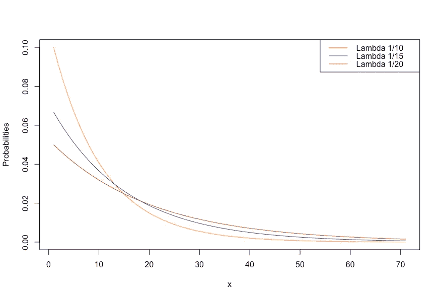
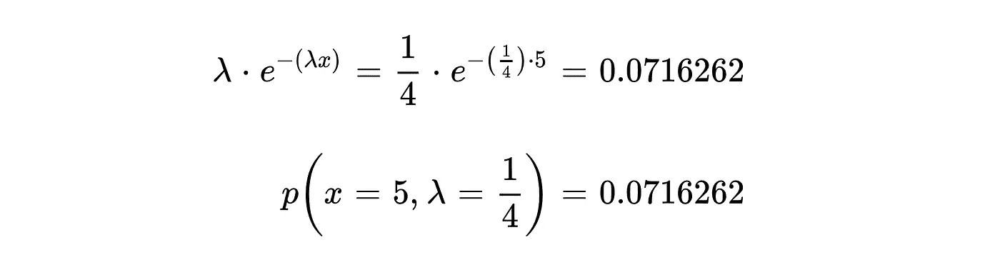
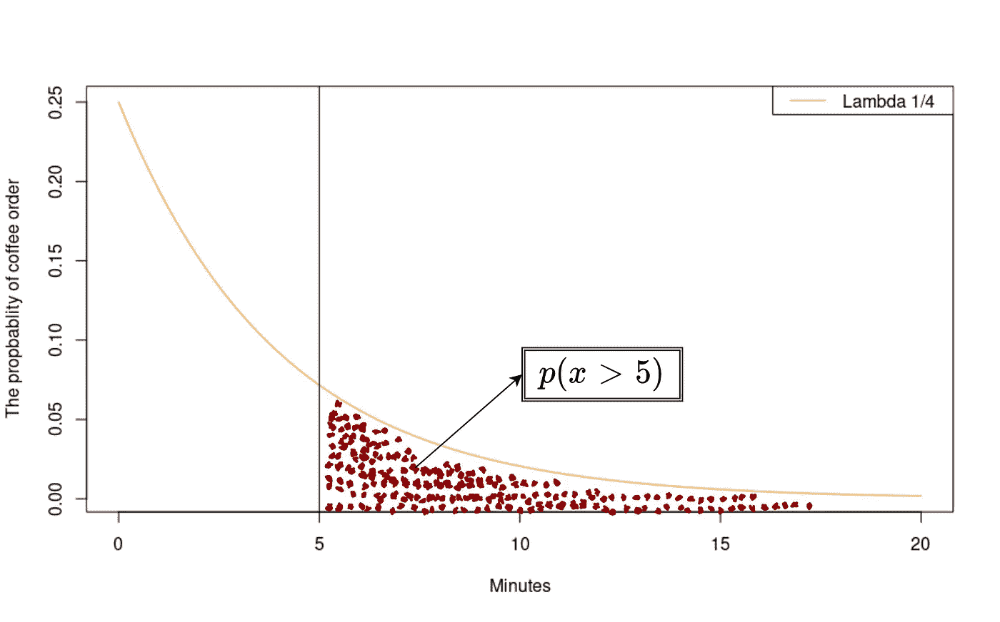
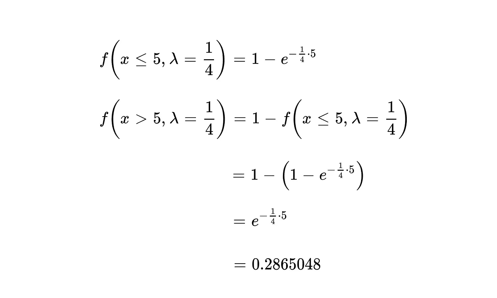

# 可以用指数分布回答的问题

> 原文：<https://towardsdatascience.com/questions-that-you-can-answer-using-exponential-distribution-2af9da54dfd8?source=collection_archive---------16----------------------->

## 概率分布

## 指数分布有什么用？


丹尼尔·诺里斯在 [Unsplash](https://unsplash.com/s/photos/coffe-shop?utm_source=unsplash&utm_medium=referral&utm_content=creditCopyText) 上拍摄的照片

每个概率问题都依赖于一个概率分布。在何种情况下将发现概率决定了应该使用概率分布。例如，在掷硬币的实验中，有两种结果，正面和反面。假设这个实验除了投掷一枚硬币之外，没有其他条件。由于只有两种结果，即尾部和头部，这就引出了伯努利分布。然而，如果问题是“抛 30 次硬币后得到 10 个头的概率是多少”，我们需要重新考虑分布情况。这是一个可以用二项分布来回答的问题，因为二项分布由 n 个独立的伯努利试验组成。

虽然有些概率问题与试验次数有关，但其他问题则取决于时间。与试验次数相关的概率分布是离散的。然而，基于时间或间隔单位的分布是连续的概率分布。一种与时间有关的连续概率分布是指数分布。在这篇文章中，我将解释指数分布以及如何解决指数分布问题？

## 指数分布

怎么知道什么时候用指数分布？指数分布与特定事件发生前的时间量有关。时间可以是分钟、小时、天或您自定义的间隔。例如，它可以是公共汽车在两分钟等待后或在精确的第二分钟到达的概率。这些是我们可以用指数分布找到的概率。它是如何找到概率的，或者什么是指数分布的概率密度函数？指数分布的概率密度函数如公式 1 所示。


公式 1——指数分布的概率密度函数(图片由作者提供)。

该公式采用两个参数作为<lambda>和<x>。值λ表示在一个时间间隔内发生的事件的平均数。x 代表事件发生的时刻。因此，当事件的平均发生率为λ时，f(x，λ)给出了事件在时刻 x 发生的概率。因为时刻不能为负，所以如果 x 小于零，则函数返回到零。概率基于图 1 中表示的λ值和 x 值而变化。</x></lambda>



图 1—λ为 1/10、1/15 和 1/20 的指数分布(图片由作者提供)

## 例子

通过例子来理解概率分布的理论总是更好的。这也是我们要对指数分布做的。假设有一家咖啡店，顾客平均每小时点 15 次咖啡。问题应该是:“下一个咖啡订单在 5 分钟后到达的概率是多少？”基于这个问题，公式 1 中的 x 将是 5。因为 x 以分钟为单位，所以我们需要以分钟为单位找到λ值。一小时有 60 分钟。从 15/60 开始，咖啡订单每四分钟来一次(1/4)。所以，λ值是 1/4。λ= 1/4 且 x=5 的概率密度函数给出了在第五分钟获得订单的概率。我们把这些值代入公式，求第 5 分钟接单的概率值。



公式 2——计算第 5 分钟接单的概率(图片由作者提供)。

发现概率值为 0.07。然而，我们需要找到在五分钟内收到订单的可能性。当 lambda 值为 1/4 时，在所有可能的分钟内收到订单的概率值如图 2 所示。要回答这个问题，我们需要计算第 5 分钟后曲线下的面积。



图-2-基于λ1/4 P(x > 5)值的概率分布(图片由作者提供)

我们应该用积分来计算这条曲线下的面积。但是，我不想深究那么多。使用积分概率密度函数可以找到另一个公式。这个公式给出了指数分布的累积概率。这正是我们所需要的。


公式 3——指数分布的累积概率(图片由作者提供)

公式 3 给出了特定事件在单元 x 之前发生的概率，根据我们的例子，这个公式给出了 5 分钟之前接单的概率。我们还可以通过从 1 中减去 5 分钟后收到订单的概率。



公式 4—5 分钟后取单的计算(图片由作者提供)。

5 分钟后收到下一个订单的概率为 0.28。表示 5 分钟前收到下一单的概率值高于 5 分钟后收到。

这些操作也可以用 Python 和 r 来应用于下面的代码。

```
R: ---------------------------------# Order exactly at 5\. minute
dexp(5 , rate=1/4)# Order after 5 minutes
pexp(5 , rate=1/4, lower.tail=FALSE)Python: --------------------------from scipy.stats import expon# Order exactly at 5\. minute
expon.pdf(5 , loc=0, scale=4)# Order after 5 minutes
1 - expon.cdf(5 , loc=0 , scale=4)
```

## 结论

本文用指数分布回答了指数分布和概率问题。指数分布是基于泊松过程的概率分布。这就是为什么我强烈建议你也去寻找泊松分布。如果您有任何问题，请随时留下您的评论。