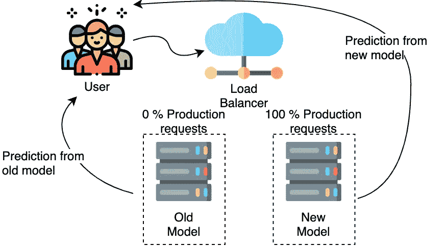

# 在部署模型之前应该问的问题

> 原文：<https://towardsdatascience.com/questions-you-should-ask-before-you-deploy-your-model-3465bca49fe5?source=collection_archive---------39----------------------->

## 机器学习部署策略介绍

泰芬·范·赞特沃特在 [Unsplash](https://unsplash.com?utm_source=medium&utm_medium=referral) 上的照片

完成一个运行良好的机器学习模型是一项巨大的努力，但这通常不是过程的终点。对于有影响的真实世界的应用程序，需要部署一个经过训练的模型并将其投入生产。

# 问题清单

> 假设你是一名有抱负的数据科学家，为一家视频流媒体网站工作。你被要求开发一个推荐系统，根据用户之前的选择向他们展示他们可能喜欢的视频。你坐下来，做你的工作，想出这个惊人的模型。你可能认为现在是时候休息一下，看看模型的工作了。但是，让我们退一步，问自己以下问题:

*   如果我的模型在生产中没有达到要求的精度，会有什么负面后果吗？
*   该模型在测试集上表现良好，但是我如何确保该模型在生产环境中工作良好，而不会在不工作的情况下失去客户呢？
*   生产中是否已经存在将被替换的现有模型？
*   停机是个问题吗？我如何保证在新模型部署期间没有/很少停机？
*   如果新模型中有一个 bug，我是否有一个策略来回滚一个旧版本？

要考虑的事情比你最初想的要多，对吗？但是有什么策略来部署模型呢？

照片由[罗布·施莱克希斯](https://unsplash.com/@robschreckhise?utm_source=medium&utm_medium=referral)在 [Unsplash](https://unsplash.com?utm_source=medium&utm_medium=referral) 上拍摄

# 部署机器学习模型的策略

## 影子部署

图片作者(图标由来自[www.flaticon.com](http://www.flaticon.com)的 [Freepik](https://www.freepik.com) 制作)

如果您不确定您的模型在生产中的表现如何，测试它的一种方法是使用影子部署。在影子部署中，您的新模型对您的用户没有任何实际影响，它只是与您的当前系统并行运行:您的模型进行预测，但不将预测交付给用户，而是交付给数据库或日志文件。影子部署的目的是收集和监控生产中模型的相关指标，而不会因新模型的错误预测而带来负面影响。

**优点:**

*   风险最小化:不会因为(意外的)低模型性能而对用户产生负面影响。
*   对生产没有影响，例如，由于请求被镜像，新模型中存在缺陷。

**缺点:**

*   因为需要并行运行和监控两个系统，所以操作开销增加了。
*   缓慢推出

## 金丝雀部署

图片作者(图标由来自 www.flaticon.com[的](http://www.flaticon.com)[自由派](https://www.freepik.com)制作)

金丝雀部署是另一种尝试降低新部署风险的策略。这也可以被视为影子部署之后的下一个逻辑步骤。不是向整个用户群推广该模型，而是只向一定比例的用户展示新模型。例如，一个典型的起始划分是 90/10，其中 90%的用户请求由旧模型处理，10%的用户请求由新模型处理。如果新模型包含一个错误或者预测不令人满意，不是所有的用户都会受到影响，而只是一小部分用户会受到影响——这将风险降到了最低。

这个想法也是为了收集新模型在一段时间内的关键性能指标。如果该模型能够稳健运行，那么新模型所服务的用户份额将会逐步增加。

**优点:**

*   降低风险:减少由于(意外的)低模型性能对用户造成的负面影响。
*   对生产的影响较小，例如，由于请求被镜像，新模型中存在缺陷。
*   快速回滚:如果新模型意外失败，您可以通过简单地重定向所有请求，快速回滚到旧模型。
*   无停机时间:两种模式并行运行

**缺点:**

*   甚至比影子部署更高的运营开销，因为两个模型在生产中有效运行。
*   缓慢推出

# 蓝色/绿色部署

图片由作者提供(图标由 [Freepik](https://www.freepik.com) 制作，来自[www.flaticon.com](http://www.flaticon.com)

蓝/绿部署的结构与 canary 部署的结构相同(两个模型并行运行)，但是，主要区别在于，新模型不仅处理一部分请求，而且一旦新服务启动并运行，所有请求都会被路由到新服务。其思想是简单地拥有两个尽可能相同的环境:如果新模型出现问题，您可以简单地将所有请求重新路由到旧模型(回滚)。如果部署应该进行得更快，这种部署方法通常是首选。这当然意味着该模型没有像其他部署策略那样经过彻底的测试。此外，较少数量的性能指标因此可用于调试和新模型的潜在重复。

**优点:**

*   降低风险:减少由于(意外的)低模型性能对用户造成的负面影响
*   快速回滚:如果新模型意外失败，您可以通过简单地重定向所有请求，快速回滚到旧模型。
*   无停机:两种模型/环境并行运行
*   快速推广

**缺点:**

*   甚至比影子部署更高的运营开销，因为两个模型在生产中有效运行。
*   较少的度量和信息可用于调试新模型。

# 更多材料:

*   1.谷歌云。，**应用部署和测试策略。**[https://cloud . Google . com/architecture/application-deployment-and-testing-strategies](https://cloud.google.com/architecture/application-deployment-and-testing-strategies)
*   2.Hergs，c .，**以影子模式部署机器学习模型。**[https://Christopher GS . com/machine % 20 learning/2019/03/30/deploying-machine-learning-applications-in-shadow-mode/](https://christophergs.com/machine%20learning/2019/03/30/deploying-machine-learning-applications-in-shadow-mode/)
*   3.部署策略介绍:蓝绿色、淡黄色等等。[https://harness . io/blog/continuous-verification/blue-green-canary-deployment-strategies/](https://harness.io/blog/continuous-verification/blue-green-canary-deployment-strategies/)