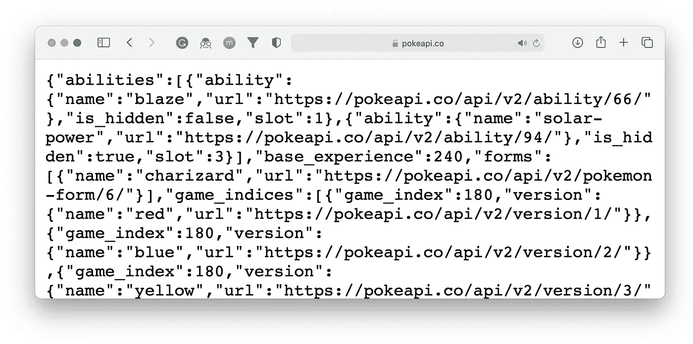

# Python 快速入门指南

> 原文：<https://towardsdatascience.com/quick-fire-guide-to-apis-in-python-891dd98c8877?source=collection_archive---------6----------------------->

## [入门](https://towardsdatascience.com/tagged/getting-started)

## 网络交流简明指南


作者图片

使用 Python 迈出与 web 交互的第一步似乎令人生畏——但事实并非如此。这是一个非常简单的过程，有着完善的规则和指导方针。

我们将涵盖入门的绝对要点，包括:

```
- Application Program Interfaces (**APIs**)
- Javascript Object Notation (**JSON**)
- **Requests** with Python
- Real world **use-cases**
```

# 应用程序接口

我们可以把 API 看作是这些小的神奇的盒子，我们在这里发送数据，然后取回数据。

这个小盒子只不过是服务器上某个地方的一个脚本。它充当了我们——T2 的客户端(T3)和他们——T4 的服务器(T5)之间的中间人。我们可以告诉我们的中间人，我们想知道一些事情，改变一些事情，或者删除一些事情——如果我们的指示被正确接收，中间人会很高兴地忘记。

在构建 API 方面有很好的指导原则，它们都遵循相同的使用模式。这些 API 中的绝大多数(在 web 上)使用了一种叫做 REST 架构的东西。

## 休息

表述性状态转移(REST) API 架构应用了六条规则:

*   所有请求必须使用一个 ***单一外向接口*** 来处理。
*   有 ***客户端-服务器独立性***——意味着客户端(美国)的变化不会影响服务器端的功能，反之亦然。
*   每一个新的请求都被独立于其他请求处理 API 不保留任何关于我们的会话的信息，因此它是 ***无状态*** 。
*   ***缓存***—API 必须指定用户是否可以缓存响应。
*   API 由 ***分层系统*** 组成，形成模块化结构。
*   如果适用于 API 使用，应根据用户要求 提供 ***可执行代码。***

所有这些产生了一个单一的网关，具有可预测的行为，可以在没有太多意外的情况下进行通信。

# 请求的类型

当我们与 API 通信时，我们会倾向于提出以下请求之一:

*   **获取** —从 API 中检索信息。
*   **POST** —创建新的资源(例如，添加新的数据记录)。
*   **PUT** —更新现有资源(例如，更改现有记录中的特定值)。
*   **删除** —删除现有资源(例如，删除数据记录)。

最常用的方法是 **GET** 协议，它允许我们下载数据。

我们可以使用谷歌地图 API 来**获取特定地址的经纬度坐标。**

发布、上传和删除是不同的，因为它们仅在修改信息时使用。使用 GitHub API，我们可以用 **POST** 创建一个 repo，用 **PUT** 更新它，用 **DELETE** 删除它。

还有**补丁** —这与 **PUT** 类似，但用于“部分更新”。我从未使用过这种方法，也没有在 API 文档中看到过这种方法——但它确实存在。

# HTTP 代码

当我们使用 **GET** 、 **POST** 、 **PUT** 或 **DELETE** 时，API 会向我们反馈信息，响应的一部分会包含一个 HTTP 代码，告诉我们请求的结果。这些通常是以下情况之一:

```
**Success Codes
200 OK** - success (common response to **GET**) **201 Created** - new resource created (**POST**/**PUT**) **204 No Content** - success but not content returned *(not an issue)****Client* Error Codes
400 Bad Request** - request not understood due to bad syntax (fix your JSON) **401 Unauthorized** - not allowed, you need authentication **403 Forbidden** - secret place, you're not allowed here **404 Not Found** - you're lost, this place doesn't exist ([or does it...](https://docs.github.com/en/rest/overview/other-authentication-methods#basic-authentication))***Server* Error Codes
500 Internal Server Error** - there's something wrong with the server**OP Codes
418 I'm a teapot** - teapot cannot brew coffee **420 Embrace Your Calm** - sending too many requests to Twitter
```

# Javascript 对象符号

当与 API 交互时，我们使用一个标准化的模板来发送和接收数据，这样客户端(我们)和 API 都可以正确地处理数据——这种格式就是 Javascript 对象符号(JSON)。

JSON 用我们在 Python 字典中看到的键值对实现了相同的层次结构。我们可以使用这种结构嵌入列表、字符串，甚至其他字典。

让我们尝试一个例子，[点击这里将使用我们的浏览器向 PokéAPI](https://pokeapi.co/api/v2/pokemon/charizard) 发送一个请求——从 API 返回 JSON 响应的明文版本:



来自 PokéAPI 的 JSON 响应，在我们的浏览器中。

我们可以看到 JSON 响应的类似字典的格式。就结构而言，Python 字典和 JSON 之间没有真正的区别——然而我们*不能*在与 API 通信时直接使用 Python 字典。

# Python 请求

我们已经探索了 API 的基础——但是我们如何开始用 Python 与它们交互呢？

我们可以使用非常受欢迎的图书馆。如果我们想发送 GET 请求，我们只需写:

```
import requestsrequests.**get**(*'https://api_address.com'*)
```

我们所需要做的就是输入我们向其发送请求的 API 的 URL 我们将收到来自 API 的 JSON 响应！

使用之前用于 PokéAPI 的相同“端点”(特定的 API 入口点)，我们可以用 Python 返回相同的信息，如下所示:

这里有三点需要注意:

*   我们的请求返回的*响应对象*显示请求成功——`<Response [**200**]>`——意思是 **200 OK** *(参考前面的代码)*。
*   我们使用 response `json()`方法访问返回的数据，这将输出 JSON 响应的 Python 字典版本。
*   字典输出与我们通过浏览器访问 API 端点时看到的完全相同。

因为我们使用`json()`方法返回了一个字典，所以我们可以使用 Python 字典中通常使用的相同方法来访问响应的特定部分。如果我们想返回 Charizard 能力的名称:

对于所有神奇宝贝迷来说，我想这是文章的结尾——对于那些对返回每个神奇宝贝及其能力的综合列表不太感兴趣的人来说，让我们转移到一些可能更有用的 API 上…

# 谷歌地图 API

谷歌(当然)提供了大量的 API——其中一个特别的是他们的地理编码 API，它允许你返回任何地址的经纬度坐标。这也是我第一次使用 Python 的职业经历的很大一部分。

从那以后，它发生了很大的变化——但当我想到“API”时，这种体验是我首先想到的事情之一。它还很好地介绍了 API 的典型用法。

1。 **授权** —大多数 API 需要我们在调用中包含一个授权密钥，如果我们错过了这一点，我们通常会返回一个 4xx 代码，告诉我们需要授权。

获取 API 密钥的步骤包含在[地理编码 API 文档](https://developers.google.com/maps/documentation/geocoding/cloud-setup)中，它非常简单，因此我不会在此重复该文档。

2。 **API 参数** —我们将尝试返回罗马斗兽场的坐标。它的地址是`Piazza del Colosseo`，我们将把它作为参数包含在请求的 URL 中。

我们也可以使用相同的方法进行身份验证。

就在那里，在我们的 JSON 响应中，我们可以看到`lat`和`lng`——我们可以访问这两个值，就像我们之前使用 PokéAPI 一样。

这是我们斗兽场的经纬度坐标——简单！

# GitHub API

我们已经看到**获得**请求，但是没有**发布** , **放置**，或者**删除**。这些请求往往略有不同，因为我们通常包含一个`payload`对象，它详细描述了我们使用 API 进行 **POST** ing、 **PUT** ting 或 **DELET** *ing* 的信息。

对于这个例子，我们将使用 GitHub API 向我们的 GitHub 帐户发布一个新的回购。同样，我们也需要一个授权密钥——你可以在这里找到一个[的分步指南](https://docs.github.com/en/github/authenticating-to-github/keeping-your-account-and-data-secure/creating-a-personal-access-token)。

不过有一点，当选择个人访问令牌的权限时——本教程需要的唯一权限是 **repo** 。我还建议远离 **delete_repo** 权限。


我们只需要**回购**权限。

一旦您有了授权密钥，我们将使用它来验证我们对 GitHub API 的所有请求，如下所示:

我们在这里所做的只是典型的 API 请求——但是使用了 API `headers`中包含的授权密钥(或令牌)。我们可以认为`headers`是我们在请求中包含的*元数据*。

最后一步是描述我们想做什么。我们将使用请求中的`data`参数来实现这一点。在这里我们包含了我们的`payload`，它是一个使用`json.dumps`转换成 JSON 格式字符串的 Python 字典:

由此我们将返回 **201 创建的**响应代码——它告诉我们请求成功了，我们已经创建了一个新资源。

为了核实，我们可以去 Github。


我们应该在我们的档案中找到一个新的 **api_test** repo。

果然，有了我们新的`api_test`回购——我们可以用 GitHub API 做很多事情，如果你对更多感兴趣，看看[文档](https://docs.github.com/en/rest)。

在这里，我们介绍了 API 的世界，以及如何在 Python 中与它们进行交互。从这里开始，还有大量的东西需要学习。

同样值得注意的是，这只是 API 生态系统的一个方面，当然还有构建和服务这些 API 的另一个方面——这是一个完全不同的游戏。

然而，掌握我们在本文中讨论的概念是继续深入到 API 交互和/或开发的其他途径的基础。

我希望你喜欢这篇文章！如果你有任何问题，请通过 [Twitter](https://twitter.com/jamescalam) 或在下面的评论中告诉我。如果你想要更多这样的内容，我也会在 YouTube 上发布。

感谢阅读！

如果您想直接进入 Python 中的 API 开发，请查看我关于使用 FastAPI 进行 API 开发的文章:

<https://python.plainenglish.io/build-better-apis-with-python-5b82fabcf8b3>  

[Jupyter 笔记本攻略](https://gist.github.com/jamescalam/20111fa38353630609d875a11445f3a5)

[🤖《变形金刚》NLP 课程 70%的折扣](https://bit.ly/nlp-transformers)