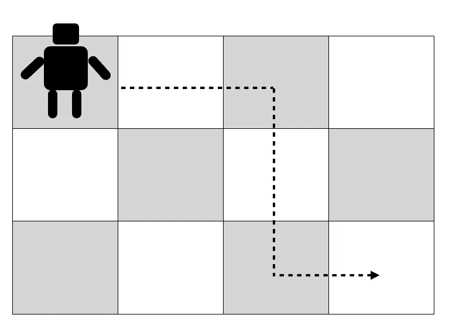
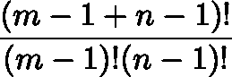

# 动态编程快速指南

> 原文：<https://towardsdatascience.com/quick-guide-to-dynamic-programming-c1618698d341?source=collection_archive---------20----------------------->

## 通过将问题分解成更小的问题来寻找最优解并不困难

[动态规划](https://en.wikipedia.org/wiki/Dynamic_programming)是一种解决优化问题的通用方法(*找到最大/最小/最短/最长…* )，通过将其分解为更小的问题(*分而治之*)，并跟踪其解决方案(*记忆化*)，以更有效地利用信息和资源。记忆化可以被看作是一种形式或递归。如果你觉得很困惑，很可能是因为你不明白为什么一开始就叫“动态”。原来名字是为了一个[历史原因](https://cstheory.stackexchange.com/questions/5635/if-you-could-rename-dynamic-programming)故意误导。

## 简单的例子

假设你要计算 6 *x 2* 。当然，你可以将乘法扩展成一系列加法，例如:

*6 x 2 = 2 + 2 + 2 + 2 + 2 + 2*

当然有许多方法来计算这个总数。例如:

*6×2 =****(2+2)****+2+2+2 =****(4+2)****+2+2 =****(6+2)****+2+2 =****【8+2】***

这个解决方案没有错，但关键是，每一个添加都是一个新的案例(用粗体突出显示)。有没有其他方法可以让我们“回收”关于*子问题*的信息？事实上，我们可以将总和改写为…

*6×2 =****(2+2)****+(2+2)+(2+2)=****(4+4)****+4 =****8+4****= 12*

正如你所看到的，在中间步骤中，技巧基本上是只计算 *(2+2)* 一次，并将结果存储到内存中。每当我们再次遇到 *(2+2)* 的时候，我们不必计算结果，只需从内存中取出即可。对于这样一个简单的例子来说，这并不重要，因为在实际情况下，获得子问题的结果可能会耗费时间或内存，因此这种方法可能比其他方法具有巨大的优势。这就是动态编程的精髓。概括来说，这些步骤通常是:

*   将问题分解成更小的子问题；
*   找出一个公式，把小问题变成大问题；
*   求最小的一个的解；
*   创建一个表来记录较小的解决方案；
*   从较小的解决方案，建立最终答案。

## {0，1}背包问题

在这个优化问题中，有一个包含 *N* 个项目的列表，这些项目具有关联的权重*W【I】*和值*v【I】*，以及一个具有最大容量 *W* 的“袋子”。目标是找到项目的子集，使得总值最大，并且权重之和小于 *W* 。在这个问题的简化版本中，项目可以被拾取或不被拾取，但不能是它们的分数或倍数，因此定义中为{0，1}。在其他地方，你可能已经看到了窃贼闯入比尔·盖茨的房子，试图偷走尽可能多的东西的例子。一个不那么戏剧性的例子可能是准备一次徒步旅行:你想带一些有用的物品，但你也不想被它们的重量压垮。

背包问题简而言之:在徒步旅行中，你会带什么东西而不会被它们的重量压垮？

如果你不知道从哪里开始，问题有几项，蛮力或“穷举搜索”的方法可能会做到这一点。也就是说，尝试所有可能的项目组合，并计算所有子集的总权重和值。选择符合要求的一个。事实证明，这种方法的时间复杂度为 *O* ( *2^N* )。然而，注意到许多较小的项目组合出现多次，这应该表明动态编程可能是解决该问题的更有效的方法。

逻辑遵循自下而上的方法。让我们拿起给定的项目 *i* 。如果它的重量*W【I】*大于背包的最大容量 *W* ，它就不能成为解的一部分。另一方面，如果*W【I】<W*那么它可能是解决方案的一部分。因此，我们需要探索两种可能性:

*   一种是我们找到没有项的最优组合*I .*
*   一个*带*项 *i，*加其他项的最优组合。在这种情况下，剩余项目的总权重必须小于 *W-w[i]* ，否则将无法满足约束(太重)。

你可以看到递归包括在背包中保留项目 *i* 的同时查看更小的组合。还有，可能没有任何可行的解决方案！为了在实践中解决这个问题，我们需要一个 2D 表，其中行表示项目，列表示最大权重(在下面的实现中，权重被“量化”为整数)。该表需要一个额外的行来处理没有条目的情况。下面是 *python3* 中的一个简单实现:

预期结果是 25。此外，您会注意到表中的许多条目都是`None`、*，即*的默认值。这是因为算法从来不会遇到权重与该列相对应的特定组合。如果你改变`weights`和`values`的初始值，你可能会看到不同的结果。

## 动态规划和强化学习

动态编程方法在一个名为[强化学习](https://en.wikipedia.org/wiki/Reinforcement_learning) (RL)的人工智能分支中扮演着一个有趣的角色，其中一个实体必须学会探索环境，以找到最大化回报的路径。你可能见过电脑玩经典视频游戏的例子。虽然我们没有深入研究 RL 的复杂性，但您可以很容易地理解它的探索方面的一部分，很可能涉及到寻找最大化或最小化某些成本函数的最短路径。

一个简单的例子是一个生活在棋盘中的机器人，它的目标是从左上角开始，到右下角，只做直线运动，只做直角转弯。在我们采取行动之前，我们可能会问有多少独特的路径。一旦我们解决了这个问题，我们可能会决定只探索其中的一部分，但这超出了本文的范围。

探索周围环境的一部分可能是计算有多少条独特的路径可以到达目标。动态编程可以帮助解决这个问题。

为了解决这个问题，我们再次创建一个 2D 表来记录一个给定的方块被访问了多少次。在这种情况下，如果棋盘有 *m* 行和 *n* 列，则表格有尺寸( *m+1* ) x ( *n+1* )来说明基本情况。其想法是，对于每一行，机器人可以上到最后一列，然后转弯并继续一路到达目标，或者停在列 *n-1* 处转弯，然后继续下一行。但是在这一点上，可用的行和列的数量已经减少，所以这对应于一个更小的子问题。最终将只剩下一个方块(目标)，这就是停止条件。

下面是一个与 *python3* 一起工作的简单实现:

一个简单的例子，展示了如何利用记忆来开发动态编程。

有了上面的输入( *m* =3， *n* =4)，结果应该是 10。公平地说，这种情况相对简单，不需要递归就可以解决。这里有一个例子:

最后，更倾向于数学的读者可能也已经注意到，问题的答案可以通过简单的推理，根据重复 *m* 行和 *n* 列的组合数量来找到。机器人必须在 *m* -1 向右和 *n* -1 向下运动中到达目标，不考虑顺序。这是一个包含[阶乘](https://en.wikipedia.org/wiki/Factorial)的单行程序:

## 结论

动态规划是一种非常强大的优化方法，应用非常广泛。我认为有趣的是，看到一种在计算资源极其有限的时代开发的方法仍然在诸如强化学习等领域找到越来越新的应用，这在当时被认为几乎是科幻的。