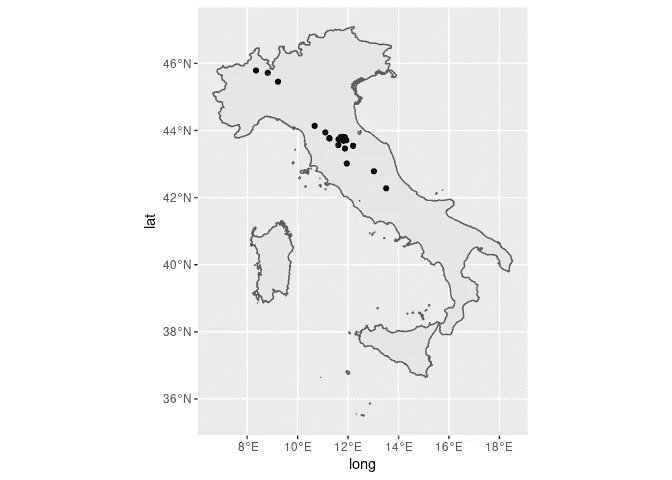

# 基于 R 的命名实体识别和地理编码

> 原文：<https://towardsdatascience.com/quick-guide-to-entity-recognition-and-geocoding-with-r-c0a915932895?source=collection_archive---------16----------------------->

照片由 [**安德鲁·尼尔**](https://www.pexels.com/@andrew?utm_content=attributionCopyText&utm_medium=referral&utm_source=pexels) 发自 [**像素**](https://www.pexels.com/photo/assorted-map-pieces-2859169/?utm_content=attributionCopyText&utm_medium=referral&utm_source=pexels)

## 在历史(或当代)文本中查找和地理定位地名的快速指南

数字人文学科在分析历史(和当代)作品的技术和 GIS 应用方面有许多用途。除了开源软件之外，开源数据为分析师提供了更大的可访问性。

在这篇文章中，我将介绍并提供一个命名实体识别(NER)和 DH 应用 Rstats 地理编码的简要指南。我将使用由优秀的 Gutenberg 项目提供的开放数据，以及使用来自优秀的 Rstats 社区的开源 Rstats 包的开放街道地图(OSM)。

本指南要求您对 R 编程有所了解。

## 什么是命名实体识别？

[NER](https://en.wikipedia.org/wiki/Named-entity_recognition) 是自然语言处理的一项任务，它识别并标记文本中的实体。这些实体可以是人、日期、公司，或者在本例中是位置。Rstats 有几个很棒的自然语言处理包，包括 [openNLP](https://CRAN.R-project.org/package=openNLP) 和 [spacyr](https://spacyr.quanteda.io/articles/using_spacyr.html) 。

## 什么是地理编码？

地理编码是查找位置的空间坐标的过程。使用 R，可以通过编程方式进行地理编码，但这是一个不完美的过程，需要特别注意结果。

## 流程是怎样的？

我将这个过程分为五个步骤:获取数据、清理数据、注释数据、地理编码和评估数据。这个过程是一个迭代的过程。因为我们正在处理文本，所以更容易遗漏细节和错误。编程提供了一个非常有用的工具，但仔细阅读和熟悉文本是必不可少的。

## 安装

在这个项目中，我将使用 Lina Eckenstein 的《卡森蒂诺:给旅行者的提示》一书，该书是使用 [gutenbergr](https://docs.ropensci.org/gutenbergr/) 包从古腾堡项目下载的。

## 步骤 0:加载包。

## 第一步:获取数据

## 下载书籍

用 gutenbergr 下载书籍相当简单。通过找到 gutenberg id 并将其传递给 gutenbergr，可以很容易地下载书籍。

(注:我过去在使用默认下载镜像时遇到过一些麻烦，可以通过选择一个[替代镜像](https://www.gutenberg.org/MIRRORS.ALL)来修复。你可以在这个[线程](https://github.com/ropensci/gutenbergr/issues/8)中看到错误的解释。).结果给出了一个整齐的数据框，每行一行。这对于分析像 [tidytext](https://juliasilge.github.io/tidytext/) 和 [quanteda](https://quanteda.io/index.html) 这样的包非常有用。

## 步骤 2:清理和准备数据

现在你有了数据，你需要做一些整理。古登堡计划提供的书籍包括封面内容，如书名和出版物信息。这对于分析来说并不真正有用，所以您可以在实际文本开始之前删除任何数据。你也可以删除某些字符，或者编辑文本中的字符串。

## 将数据符号化

语篇分析的一个重要部分是标记化。这是将文本分解成更小的部分的程序过程，通常是单词、行或句子。现在数据基本上被标记成了行，但是我想创建句子标记以供 NER 注释器使用。

有许多不同的带有内置令牌化器的包。tidytext 包中内置的单词标记化器可以很好地处理单词标记，但是用 tidytext 进行句子标记化并不总是能提供最好的结果，所以我将使用 spacyr。Spacyr 是 Python 包 spacy 的包装器。对于自然语言处理来说，它是一个强大的包，但是它要求您安装了 python，并且需要从 r。

spacyr tokenizer 需要一个文本字符串或语料库，这意味着数据帧必须折叠，这样书就是一个字符串。之后，我们可以将生成的句子重新格式化为每行一句的数据帧。

(注意:您可以保持 gutenbergr 返回的当前格式的数据。结果可能不同，但原理是一样的。)

## 检索位置

接下来，我们将从文本中检索位置。R 中有许多不同的实体标签，但是我将使用[实体](https://github.com/trinker/entity/)包，它提供了 [openNLP](https://cran.r-project.org/web/packages/openNLP/index.html) 标注器的包装器。我更喜欢这个工具，因为它不会占用太多的内存，并且是我的计算机可以处理的进程。

您可以用任何您喜欢的格式返回结果，但是我选择了在数据帧中的文本位置添加一个新的列表列。该函数返回一个列表列表，这意味着我们仍然为每个句子保留一行，以及一个在句子中出现两个位置的列表。

我还想创建一个单独的非嵌套位置的数据框架，这是一个更具可读性。这里我们选择 locations 列并取消嵌套，为文本中的每个位置实例提供一个观察值，同时从列表中删除空对象。产生的“locations”数据帧返回文本中找到的每个位置及其行号。我还将对位置进行分组和计数，给出每个位置的一行以及它在文本中出现的次数。这将有助于以后对数据进行地理编码和可视化。

此时，有必要对结果进行初步检查。实体定位器有时可能会发现不完整或错误的实体。通过在标记化的句子旁边创建一个位置行，我们可以试着指出这一半位置指的是什么。

在这种情况下，实体定位器找到了相当多的位置，但是如果您对照文本检查这些位置，我们可能会发现，除了不完整的实体之外，它还遗漏了在文本中其他地方找到的位置的一些实例。它还标记了实际上不是位置的实体。

通过保存带有行号的 location 实例，您可以很容易地检查特定的句子来推断实体所指的内容，并在上下文中查看实体。这个迭代是确保数据准确的重要部分。

## 清除位置数据

查看文本旁边的结果后，您可以删除一些不引用任何位置的实体。我还注意到文本中遗漏了一个位置——“Soci”。我将在 locations 数据帧中添加一行，然后更新 locs_dist 数据帧。

现在我有了一个在文本中至少出现一次的位置列表，我还可以检查一下是否有注释器遗漏的地方。我可以通过多种方式实现这一点，但是我包含了一个简化过程的函数，它需要一个数据帧、一个要查找的位置向量以及文本所在的列名。这个函数将在数据帧的整个文本列中搜索位置向量中的位置，并返回一个新的列表。结果列表将被附加到数据帧，并且将返回一个数据帧。

现在，我们可以看到 dataframe 中的原始 locations 列与 new_locs 列并排。如果我们打印一些示例行，我们会看到该函数已经挑选出了原始位置注释器遗漏的文本中特定位置的所有实例。此时，不再需要 text dataframe 中的 initial locations 列，因此我们可以删除该列，并取消嵌套 new_locs 列。这将为我们提供一个数据帧，每个位置观察一行，这意味着一些文本行将被复制。

## 步骤 3:注释数据

我们现在已经找到了文本中的位置，但我们不知道它们被使用的上下文。我们也不知道这是否是所有地点的完整列表。在这一点上，我们需要做更仔细的阅读。

对于这个项目，我对重现作者走过的路线感兴趣。也就是说我需要知道她到底去过哪些地方。如果我在 Excel 中打开数据，我可以扫描位置提及的上下文，并对每个观察结果进行编码。我可能会添加补充数据，如位置是否是一个城市，一个网站，地理特征等。我还可以添加一列来指示某个位置是否被访问过、浏览过，或者是否与分析无关。我还将添加访问地点的顺序。通过将位置与文本中出现的位置一起显示在单独的列中，这变得更加容易。

现在，我们可以将数据加载回 r 中。我们还可以创建单独的数据帧，这些数据帧只包含与下一步地理编码相关的位置。

# 步骤 4:地理编码

现在，我们有了一个过滤后的数据框架，其中包含了我们对此分析感兴趣的所有位置:已访问或已查看的点。我们可以使用此数据帧对使用 tidygeocoder 包的位置进行地理编码，该包使用 osm 数据对站点进行地理定位。为了提高准确性，我们可以添加一个国家列给 geocoder。

## 步骤 5:检查数据迭代

地理编码器没有返回所有点的结果，但它返回了相当多的结果。但是，我们需要检查地理编码结果的准确性。通过将它们与意大利地图一起绘制，我们看到地理编码器做得非常好，但是在意大利北部有一些点可能被错误识别。熟悉课文有助于了解你的观点应该落在哪个范围内。这也有助于将坐标数据框架与完整的句子数据框架连接起来，这样我们就可以将所有内容放在一起。

让我们把一切都标在地图上。

让我们也加入数据框架，这样我们就可以在全文旁边看到结果。

问题之一是麦当娜·德尔·萨索的位置。在上下文中，我们可以看到这是指 Corsalone 河附近的教堂。我们可以查看在线地图来核实位置并获得正确的坐标。结果是，地理编码器没有给出我们要找的位置。这里有一个由 Tyler Morgan Wall 编写的函数，它将简单地在一个数据帧中重新分配坐标，该数据帧有单独的纬度和经度列。

找到所有正确的坐标后，我们可以通过将带有坐标的数据框与其余数据连接起来来更新位置数据，并使用 lon 和 lat 列作为 X 和 Y 坐标，使用 st_as_sf 函数创建一个空间对象。

现在我们可以一起绘制我们的空间对象。

最后，我将筛选出我将用于我自己的分析的点——特别是访问过的网站。我将在 QGIS 中使用这些数据来运行最小成本路径分析，以估计作者在旅行中可能选择的路线。我计划在以后的文章中记录这些步骤。现在，我将创建过滤后的数据帧，并将其保存为 shapefile。

## 结论

r 是自然语言处理、地理信息系统和文本分析的好工具。结合 spacy python 包的 NLP 功能，R 可用于定位文本中的地理实体并对这些结果进行地理编码。这是一个有益的工具，在数字人文研究，以及 HGIS。我希望本指南有助于说明结合文本分析、NER 和 GIS 的迭代过程。如果您有任何让这个过程更顺利的想法，或者任何编写更好代码的想法，请发表评论。