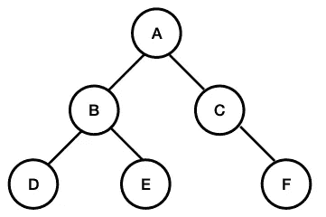

# 图形遍历分析快速指南

> 原文：<https://towardsdatascience.com/quick-guide-to-graph-traversal-analysis-1d510a5d05b5?source=collection_archive---------26----------------------->

## 分析图表来寻找最佳路径并不困难

图是由一组对象(*节点*)组成的数据结构，这些对象之间有连接(*边*)。如果连接从一个节点定向到另一个节点(例如*爱丽丝欠鲍勃的钱)，则图可以是**定向的**，或者如果定向不相关并且连接仅表示关系(例如*爱丽丝和鲍勃是朋友)，则图可以是**无向的**。如果一个图的所有节点都互相连接，那么这个图就是完整的。没有回路的有向图被称为*无回路。*树*是无向图，其中任意两个节点通过*恰好一条*边连接。树中的初始节点称为*根*，末端节点(*即没有下游连接节点的*节点)称为*叶*。***

图表的几个实际例子是[友谊网络](https://www.databentobox.com/2019/07/28/facebook-friend-graph/)(社交媒体上的*例如*)[家谱(家族)树](https://www.lucidchart.com/blog/how-to-make-a-family-tree-chart)，[分子](https://en.wikipedia.org/wiki/Molecular_graph)，[大型强子对撞机](https://en.wikipedia.org/wiki/Feynman_diagram)产生的粒子，一张[公司的组织图](https://en.wikipedia.org/wiki/Organizational_chart)。你能说出它们属于哪一类图形吗？

## 主要的图遍历算法

遍历一个图意味着通过根据一些系统规则访问节点来探索它的结构。最有效的规则取决于图表的类型和手头的问题，所以不可能做出真正通用的陈述。由于计算机科学中的许多数据结构都有一个基础图，即树，所以值得花些精力来更好地理解探索这种图的策略，以便找到满足手头问题条件的路径或节点。

在许多情况下，问题可以归结为一种陈述，例如“找到节点 *A* 和 *B* 之间的路径，使得某个量被优化”。该数量可以是例如边的数量(*即*路径的长度)，或者与每个节点相关联的某个特征(可能是二进制的)的总和。

两种主要的方法叫做**深度优先搜索** (DFS)和**广度优先搜索** (BFS)。

*   **在 BFS 方法**中，相同深度级别的节点被顺序探测，直到满足停止条件。它利用一个*队列*通过*迭代*方法找到最短路径。BFS 通常会占用大量内存，因为需要维护一个额外的数据结构，其中包含有待探索的节点，通常以“已经访问过的”布尔变量的形式存在。当树的深度不平衡或者如果搜索节点离根不太远(“浅树”)时，BFS 通常是最佳方法。一个典型的例子是*社交网络*，在这里我们想要搜索与某个特定的人有相似兴趣的人。目标节点很有可能是直接的朋友或朋友的朋友，*即*根节点可以有许多分支，但目标节点之间只有几条边。
*   **DFS 算法**通过从根到叶子来探索图形，并重复该操作，直到满足条件。它利用一个*堆栈*来寻找最短路径。如果一个给定的分支没有满足请求，算法“回溯”到更高的级别，然后沿着另一条路径前进。如果使用*递归*方法，则需要更少的内存，因为不必跟踪已经“访问”过的节点。在树代表一系列决策和/或目标叶远离根的情况下，DFS 通常是一种有效的方法。一个典型的用例例子是游戏的*模拟，比如国际象棋，在每次迭代中，可能性很少，但每个决策在下一步中都走得很远。*

## 代码示例

几行代码通常比大量文本更具说明性。在下文中，我们将探索一个由 6 个节点和 5 条边组成的简单图形。



以下示例中使用的图表结构

**深度优先搜索**

预期产出:

```
A
A -> B
B -> D
B -> E
A -> C
C -> F
```

**广度优先搜索**

预期产出:

```
A B C D E F
```

## 经验法则

1.  简单图上的最短路径-> BFS
2.  低宽度，大深度-> BFS
3.  大宽度、低深度-> DFS(递归堆栈不会溢出)
4.  扫描所有可能的结果-> DFS