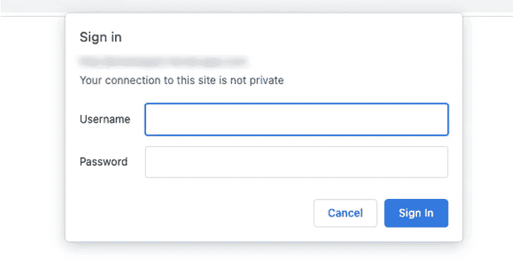
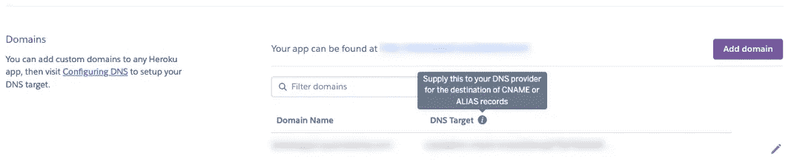
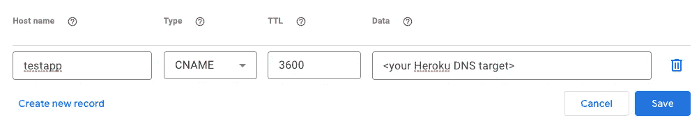

# 使用 Heroku 在自定义域上快速部署 Dash 应用程序

> 原文：<https://towardsdatascience.com/quick-start-on-deploying-your-dash-application-using-heroku-on-a-custom-domain-123f25a4bff1?source=collection_archive---------21----------------------->

## 这是一个教程，介绍了如何使用 Heroku 在自定义域上部署带有身份验证的 python Dash 应用程序。


照片由[卡洛斯·穆扎](https://unsplash.com/@kmuza?utm_source=medium&utm_medium=referral)在 [Unsplash](https://unsplash.com?utm_source=medium&utm_medium=referral) 上拍摄

平台即服务(Paas)和身份验证平台使得应用程序部署比以前更容易。我们没有将 python Dash 应用程序打包并在本地运行，而是展示了如何使用 Heroku 将 Dash 应用程序部署到自定义域的快速入门指南。

**设置 Heroku**

首先设置一个免费的 Heroku 账户，下载 CLI 工具。在本地终端中，通过以下命令登录，

```
heroku login
```

**设置本地 Dash 应用**

在本地机器上，我们可以创建一个简单的 Dash 应用程序，包含以下文件:

```
.gitignore
app.py
Procfile
requirements.txt
runtime.txt
```

这是基于关于[https://dash.plotly.com/deployment](https://dash.plotly.com/deployment)的教程，所以请参考那里的文档了解这个简单例子中的文件内容。唯一增加的是 runtime.txt，这个文件包含一行文本`python-3.7.12`。这将指示 Heroku 使用指定的 python 版本来用于应用程序-这可以是其他值，有关支持的 python 运行时，请参见[https://dev center . Heroku . com/articles/python-support # supported-runtimes](https://devcenter.heroku.com/articles/python-support#supported-runtimes)。否则，默认情况下，它将使用最新版本(在撰写本文时，python-3.9.9)。如果未指定，如果本地创建和测试的 venv 使用一个版本，而应用程序的运行时使用另一个版本，这可能会导致兼容性问题。

requirements.txt 文件是用`pip freeze`创建的。见下文，

*设置 python 虚拟环境*

```
pip install dash plotly gunicorn
virtualenv venv --python=python3.7
pip freeze > requirements.txt
```

**部署应用程序**

将应用程序部署到 Heroku 就像提交 git 并将提交推送到远程存储库一样简单(下面使用一个 Heroku 远程存储库)。

为了首次设置 Heroku 应用程序，我们将为该应用程序创建一个唯一的名称。`heroku create [name]`有效地创建了一个新的 Heroku 应用程序，并执行了一个 *git remote add* 来将 Heroku 远程存储库连接到本地 git 存储库。

```
heroku create testapp  # *testapp* is a unique name of app
git add .
git commit -m "initial commit"
git push heroku master
```

为了更新代码和重新部署，我们可以简单地提交新的更改并推送到 Heroku 远程存储库。这将自动触发全新的构建和部署。

```
git add .
git commit -m "new changes"
git push keroku master
```

如果之前已经创建了 app，可以手动将远程 Heroku 资源库与`heroku git:remote -a [name of app]`连接。

**设置认证**

我们还可以为我们的应用程序设置身份验证。最快的方法是在应用程序中实现这一点。查看 https://dash.plotly.com/authentication 的，通过基本认证找到一种方法。简而言之，这涉及到`pip install dash-auth`和在 app 中添加额外的 BasicAuth。有关完整的详细信息，请参见 dash 的认证文档。

```
auth = dash_auth.BasicAuth( 
         app,
         VALID_USERNAME_PASSWORD_PAIRS
)
```

这样，当我们访问应用程序时，我们将看到以下屏幕，要求登录。



使用基本身份验证的登录弹出窗口。作者截图

或者，您可以使用 Auth0。这可以作为附件安装。更多信息可以在[https://devcenter.heroku.com/articles/auth0](https://devcenter.heroku.com/articles/auth0)找到。

**添加自定义子域**

到目前为止，该应用程序被托管在 testapp.heroku.com。相反，我们可以很容易地将它链接到我们自己的定制域。首先，我们需要一个域名提供商(如谷歌域名)——确保你选择一个可以编辑 DNS 记录的提供商。

在 Heroku 中，转到应用程序的仪表板，在*设置下，*向下滚动到域并点击*添加域。*我们输入域名(如*customdomain.com*；或者我们也可以做子域，*testapp.customdomain.com*)。添加后，我们看到以下内容:



添加新域后的 Heroku 域视图。图片为作者截图。

记下 DNS 目标值，现在转到 DNS 提供商创建一个新的 CNAME 记录，该记录被路由到 DNS 目标。下面是创建一个 *testapp* 子域的例子。



示例 DNS 记录(使用 Google 域名)将子域路由到 Heroku。作者截图

有了这个，我们就可以在我们的客户领域快速发展了！