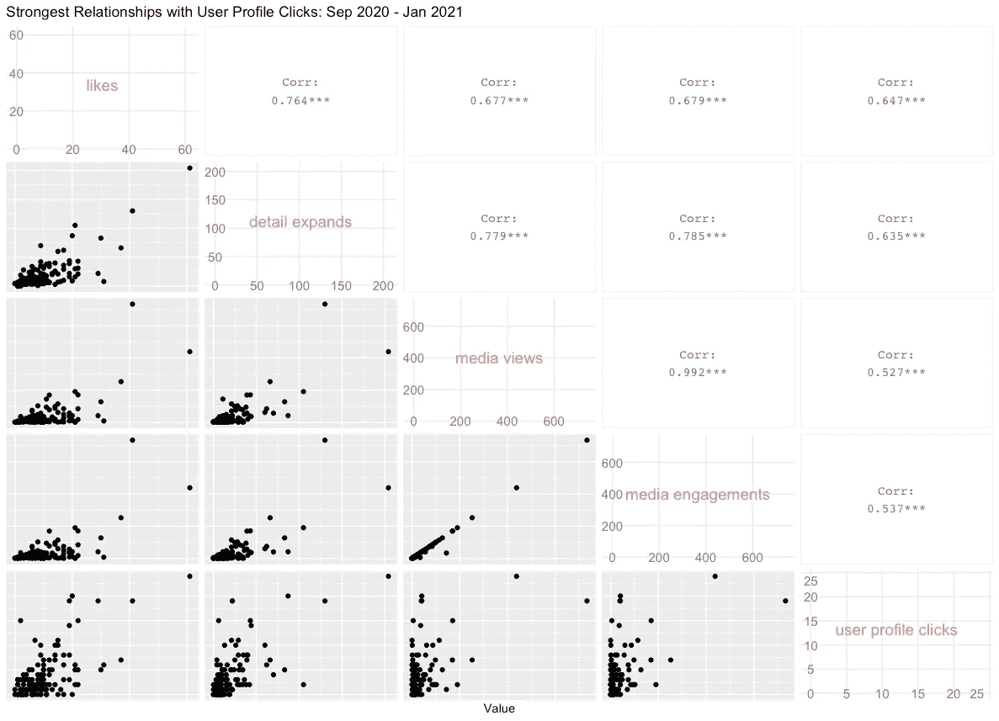
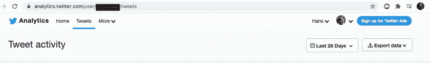
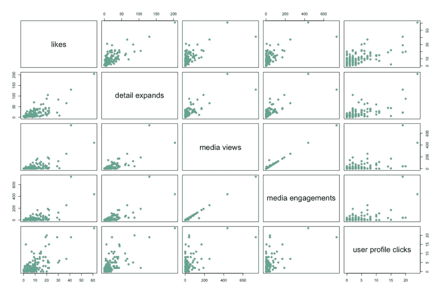
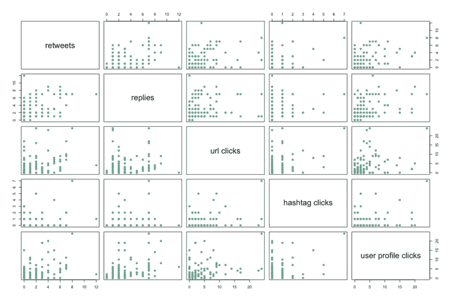
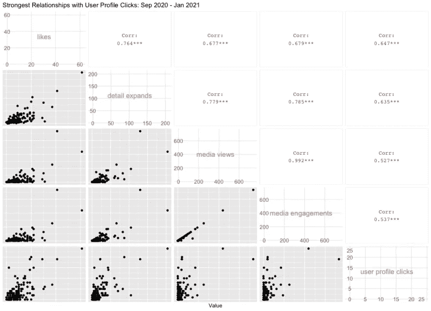
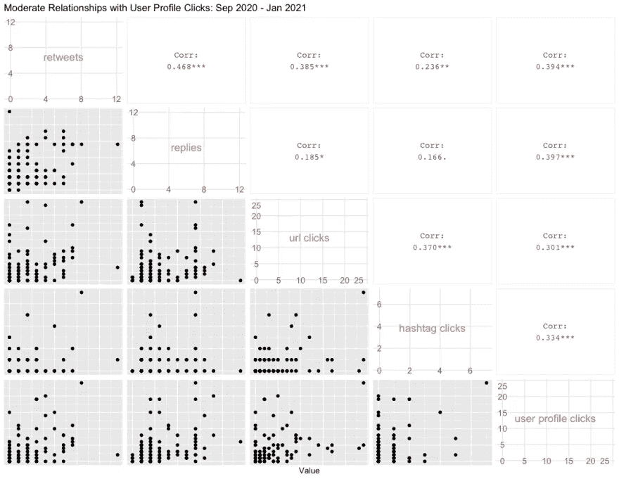

# 快速分析 Twitter 数据中的关系

> 原文：<https://towardsdatascience.com/quickly-analyze-relationships-in-your-twitter-data-20f634c5160d?source=collection_archive---------33----------------------->

## 使用 R 找出哪些指标促使人们点击你的个人资料



作者图片

# 概述和设置

这篇文章使用了各种 R 库和函数来帮助你探索你的 Twitter 分析数据。首先要做的是从[analytics.twitter.com](https://analytics.twitter.com/)下载数据。这里的假设是你已经是一个 Twitter 用户，并且已经使用了至少 6 个月。

在那里，您将点击`Tweets`选项卡，这将带您进入您的 Tweet 活动，并选择**导出数据**:



作者图片

点击**导出数据**后，您将选择“按天”，这将提供您每天的印象和参与度指标(您还可以在导出数据旁边的下拉菜单中选择时间段，默认为“过去 28 天”)。

**注意**:另一个选项是选择“通过 Tweet ”,这将下载每条 Tweet 的文本以及相关指标。我们可以用它来做有趣的文本分析，但是我们会把它留到下一篇文章。

为了这篇文章，我下载了五个月前所有可用的数据。

下载后，您将需要**读取数据中的**，在我们的例子中，**将所有五个月的**合并到一个数据帧中，我们将使用`tidyverse`中包含的`readr`包和`read_csv()`函数。然后我们将使用`rbind()`按行组合五个数据帧:

```
library(tidyverse)# load data from September to mid-January
df1 <- read_csv("./daily_tweet_activity/daily_tweet_activity_metrics_paulapivat_20200901_20201001_en.csv")
df2 <- read_csv("./daily_tweet_activity/daily_tweet_activity_metrics_paulapivat_20201001_20201101_en.csv")
df3 <- read_csv("./daily_tweet_activity/daily_tweet_activity_metrics_paulapivat_20201101_20201201_en.csv")
df4 <- read_csv("./daily_tweet_activity/daily_tweet_activity_metrics_paulapivat_20201201_20210101_en.csv")
df5 <- read_csv("./daily_tweet_activity/daily_tweet_activity_metrics_paulapivat_20210101_20210112_en.csv")# combining ALL five dataframes into ONE, by rows
df <- rbind(df1, df2, df3, df4, df5)
```

# 探索关系

Twitter analytics 跟踪几个指标，这些指标大致分为参与度，包括:转发、回复、喜欢、用户资料点击、url 点击、标签点击、详细信息扩展、媒体浏览量和媒体参与度。

还有其他指标，如“应用打开”和“推广参与”，这些是我没有使用过的服务，因此没有任何可用的数据。

## 引导性问题

有一个引导性的问题是有用的，因为它有助于集中你的探索。比方说，我感兴趣的是我的一条推文是否会促使读者点击我的个人资料。这方面的衡量标准是`user profile clicks`。

我对这篇文章最初的指导问题是:

> *哪些指标与用户档案点击最相关？*

你可以简单地使用带有基数 R 的`cor.test()`函数，在每个*度量和`User Profile Click`度量之间一个接一个地移动。例如，下面我们分别计算三对变量`User Profile Clicks`和`retweets`、`replies`和`likes`之间的相关性。一段时间后，这可能会变得乏味。*

```
cor.test(x = df$`user profile clicks`, y = df$retweets)
cor.test(x = df$`user profile clicks`, y = df$replies)
cor.test(x = df$`user profile clicks`, y = df$likes)
```

探索整个数据集中指标对之间关系的一种更快速的方法是使用**相关图**。

我们从基数 r 开始，你需要限制你可视化的变量的数量，这样相关图就不会变得太混乱。以下是与`User Profile Clicks`相关度最高的四个变量:

```
# four columns are selected along with user profile clicks to plot
df %>%
    select(8, 12, 19:20, `user profile clicks`) %>%
    plot(pch = 20, cex = 1.5, col="#69b3a2")
```

这是一张图片:



作者图片

以下是另外四个具有*中度*关系的指标:

```
df %>%
    select(6:7, 10:11, `user profile clicks`) %>%
    plot(pch = 20, cex = 1.5, col="#69b3a2")
```



作者图片

从视觉上看，您可以看到中度关系散点图更加分散，方向更难识别。

虽然基数 R 是可靠的，但我们可以用`GGally`包获得更多信息。以下是与`User Profile Clicks`高度相关的四个变量:

```
library(GGally)# GGally, Strongest Related
df %>%
    select(8, 12, 19:20, `user profile clicks`) %>%
    ggpairs(
        diag = NULL,
        title = "Strongest Relationships with User Profile Clicks: Sep 2020 - Jan 2021",
        axisLabels = c("internal"),
        xlab = "Value"
    )
```

这是与`user profile clicks`高度相关的四个变量之间的相关图:



作者图片

以下是与`User Profile Clicks`适度相关的变量:



作者图片

正如你所看到的，它们不仅提供了散点图，还显示了每对变量之间相关性的数值，这比基数 r 提供了更多的信息。

现在，您的数据中的相关模式完全有可能是不同的，因为我们在这里看到的初始模式并不意味着推广到不同的数据集。

关于数据科学、机器学习、R、Python、SQL 等更多内容，[在 Twitter 上找到我](https://twitter.com/paulapivat)。