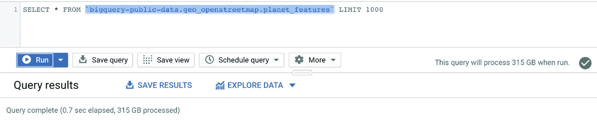

# Quo Vadis，大数据？

> 原文：<https://towardsdatascience.com/quo-vadis-big-data-36f7842b578e?source=collection_archive---------30----------------------->

## 下一步是什么，如何获取智能数据？

乔希·卡特在 [Unsplash](https://unsplash.com/s/photos/california?utm_source=unsplash&utm_medium=referral&utm_content=creditCopyText) 上的照片

大数据是指来自互联网、移动电话、金融行业、能源行业、医疗保健等领域的大量数据。以及智能代理、社交媒体、智能计量系统、车辆等来源。使用特殊解决方案对其进行存储、处理和评估[1]。术语“大数据”已经在科学和实践中出现了好几年。通常，大数据的挑战，尤其是 3v，与数据(量)的持续增长、种类和速度的增加以及数据变化的速度不断加快有关[2]。**但是如何将大数据或处理大量数据的能力转化为智能数据并赢得洞察力**？

## 能够处理大数据

我们什么时候真正谈论大数据？必须收集多少数据才能被视为大数据？正常的数据存储技术通常以兆字节或千兆字节工作。**当数据量达到 TB 或 Pb 时，我们就称之为大数据。**这一经验法则的原因是，当处理这种数据量时，传统系统不再足够强大，而且成本也明显更高。大数据(存储)技术的典型特征是:

*   分布式存储
*   数据复制
*   本地数据处理
*   高可用性
*   数据划分
*   非规范化数据
*   处理结构化和非结构化数据

用谷歌的 BigQuery 在几秒钟内查询大量数据——作者图片

## 从数据中获得洞察力(智能数据)

然而，这并不意味着已经从数据中提取了具体的知识，或者从数据中提取了相应的知识，或者在此基础上得出了相应的行动建议。为了将大数据转化为智能数据，从而为公司创造附加值，分析流程是必要的。
要做到这一点，公司通常需要三个常见领域之一的一种或多种分析能力:

*   **描述性分析—发生了什么？**
*   **预测分析—会发生什么？**
*   **规定性分析——我能做些什么来做得更好？**

为了使 BI 工具或 ML 能够快速、灵活地分析和访问数据，需要正确的数据平台。

与亚马逊、谷歌等大型云提供商合作。像数据仓库、数据库等 IT 服务是通过即插即用来实现的。提供像 BigQuery [3]或 Redshift [4]这样的数据仓库服务需要每次点击。公共云也提供了比自托管计算机中心更多的计算能力。**特别是对于小公司和初创公司来说，这是一个使用这些服务的有趣机会，因为它们具有成本效益并且易于设置**。如果您感兴趣，您可以通过大多数大型云提供商提供的免费层轻松测试解决方案。

几十年来，数据工程师、软件工程师和数据分析师一直在用 ETL 过程构建数据仓库，并一直专注于实现严格遵循 Star 或 Snowflake 等数据模型的架构。**此外，人们通常更关注技术细节，而不是业务需求**。在数据湖中，所有数据都存储在临时区域中。之后，数据将被处理到数据仓库(数据仓库是数据湖的一部分的混合模型也很常见)、数据集市或用于分析和报告。这使得数据湖比数据仓库更加灵活。此外，它还支持机器学习等新的用例，并为非结构化数据提供存储功能。

集成的数据湖和分析平台—作者图片

如果我们观察简化的架构，就会清楚地看到，如果服务已经可以在云环境中相互通信，或者集成在一个服务中，那么就不需要第三方系统的进一步接口。**这大大缩短了这些环境的设置和维护时间。**另一个重要因素是**数据科学流程可以显著简化**。每个数据科学家和工程师都知道这一过程有多耗时，因此将您需要的一切都放在云环境甚至服务中的方法大大简化了这一过程。

## 摘要

在即用型云服务的帮助下，数据湖和自助 BI 工具等新模式以及敏捷方法公司(尤其是中小型公司)可以在更短的时间内构建数据分析平台，从而更专注于业务需求。

包含大数据的自助式 BI 控制面板示例—图片由作者提供

为了从大数据中生成智能数据，第一步应该是创建技术先决条件。第二步是在集成和可扩展服务的帮助下实现分析。在这里，数据可以被进一步处理，例如，通过用于描述性任务或用于机器学习服务的自助 BI 工具。由于这种互动，可以将重点放在更多与业务相关的活动上，而不是技术的操作上。

## 来源

[1]谷歌，[https://cloud.google.com/what-is-big-data](https://cloud.google.com/what-is-big-data)(2021)

[2]麦肯锡公司，[人工智能下一个数字前沿？](https://www.mckinsey.com/~/media/mckinsey/industries/advanced%20electronics/our%20insights/how%20artificial%20intelligence%20can%20deliver%20real%20value%20to%20companies/mgi-artificial-intelligence-discussion-paper.ashx) (2017)

[3]谷歌，[，大查询](https://cloud.google.com/bigquery) (2020)

[4] AWS，[亚马逊红移](https://aws.amazon.com/de/redshift/?whats-new-cards.sort-by=item.additionalFields.postDateTime&whats-new-cards.sort-order=desc) (2020)