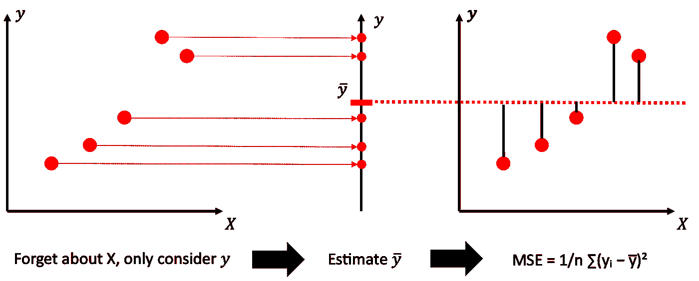
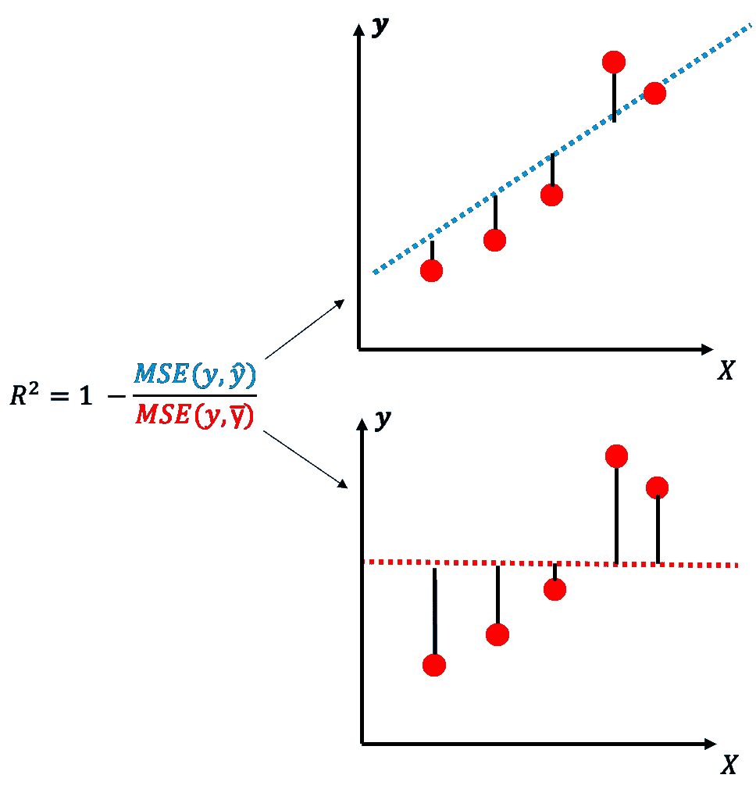

# r:衡量模型准确性的直观指标

> 原文：<https://towardsdatascience.com/r%C2%B2-an-intuitive-metric-to-measure-the-accuracy-of-a-model-7446c0d5d725?source=collection_archive---------12----------------------->

托尔加·乌尔坎在 [Unsplash](https://unsplash.com/s/photos/relative?utm_source=unsplash&utm_medium=referral&utm_content=creditCopyText) 上拍摄的照片

## 了解 R 指标背后的直觉，也称为*决定系数*。

对数据建模可能是机器学习和数据科学中最频繁的任务。随着建模而来的不可避免的问题是对看不见的数据点的预测准确性。人们已经提出了各种各样的测量精度的方法，每种方法都有其优缺点。本文解释了 R 指标背后的直觉，也称为*决定系数*。

给定具有特征 x 和目标 y 的长度为 n 的数据集。目标是拟合返回预测 P(X)=ŷ.的预测器 p 我们的预测器应该尽可能精确，从而最小化均方误差

MSE = 1/n∑(yᵢŷᵢ。

那么，你能想到的最简单的预测器是什么呢？嗯，我想忽略输入 X 是一个很好的起点。只有使用 y，才能估计目标的平均值

**y̅ = 1/n ⋅ ∑ yᵢ**

并为所有预测返回 **y̅** 。在本文的剩余部分，这个预测器被称为 Pˢ(其中 s 代表简单)。现在把 Pˢ的预测代入 MSE 方程，我们得到

**MSE(y，pˢ(x))= 1/n∑(yᵢpˢ(x)= 1/n∑(yᵢy̅)**

等一下。我以前见过这个等式。哦对了这正是*方差*的定义。因此，对于一个总是返回 y̅的常数预测器，MSE 等于 y 的方差。这是一个有趣的事实，但让我们继续。

Pˢ:是 y̅.最简单的预测者(图片由作者提供)

那么，这对于测量我的模型的性能有什么用呢？还有这个诡异的介绍和 R 有什么关系？引入“基线”预测值的原因是，将误差置于*关系*中会有所帮助。当两个或多个预测值在不同尺度的数据集之间进行比较时，这尤其有用。例如，假设一个数据集的 y 值在(-1，1)范围内，另一个数据集的 y 值在(-10000，10000)范围内。由于缩放，第二数据集的 MSE 预计会更高。因此，需要一个*统一/正常化*，否则，橙子就被比作苹果。

假设我们拟合了一个预测值 p，它提供了预测值ŷ = P(X)。那么 R 由下式定义

**r = 1 MSE(y，p(x))/mse(y,pˢ(x))= 1mse(y,ŷ)/mse(y,y̅)**

哇哦。这看起来是一个相对简单的等式。基本上，我们用预测值 p 的均方误差除以 Pˢ的均方误差，这样两个误差就有关系了。下图给出了线性预测因子 p 的示例。可以观察到 MSE(y,ŷ比 MSE(y,y̅).小因此，该分数将小于 1，导致 R 为正值。

r:将两个模型的误差设定成关系的准确性指标。(图片由作者提供)

让我们看看还会发生什么。

*   **R =1.0:** 假设我们已经找到 MSE(y,ŷ)=0.的最佳预测值那么，0 除以任何数都是零，1–0 = 1。这很酷，因为我们在这里展示的是，R 的最佳可能值实际上是 1.0
*   更有可能的是，你的预测器会有一些误差。现在正 R 告诉我们，我们的预测器比总是预测平均值好多少。
*   你可能会想，我的预测器怎么会比总是预测目标的平均值还要糟糕。嗯，你肯定听说过过度拟合？这正是可能发生的时间。

讨论了这三种情况，我们也知道 R 的值一定在区间(-∞，1.0)内。直观上，这是因为，一方面，r 没有下界，因为 MSE(y,ŷ没有上界。另一方面，MSE(y,ŷ)不能小于零，这导致上限为 1.0。

同样值得一提的是，因为分母等于**var(y)**，所以也可以将该指标解释为**解释的方差**。或者，换句话说，预测器可以捕获的方差的百分比。最后，我想提一下，模型相对性能的思想是可以借鉴的，你可以创建你自己的指标。假设您想要使用一个 K-最近邻(KNN)预测器作为您性能的基线；然后你简单的除以 MSE(y，KNN(X))而不是 MSE(y,Pˢ(X)).还有维奥拉。现在你衡量与 KNN 相关的表现。

我希望你喜欢这篇文章，并发现它是有帮助的。欢迎在下面留下一些评论。