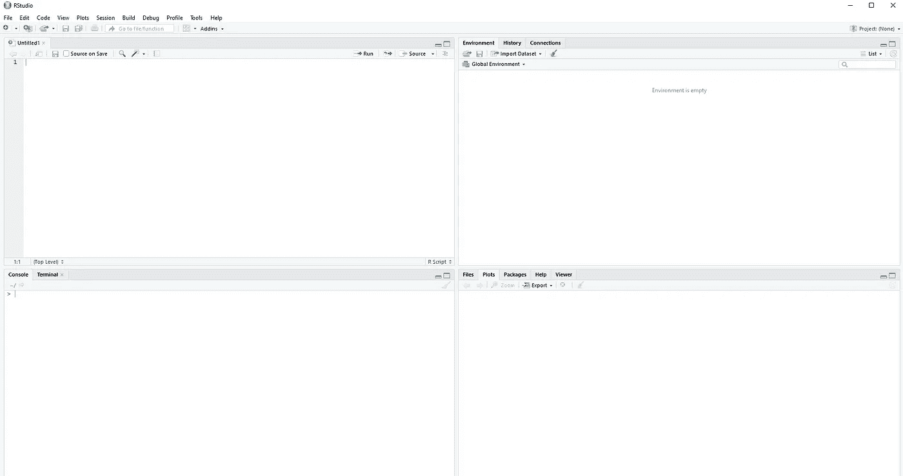

# R 基础——开始使用 R 需要知道的一切

> 原文：<https://towardsdatascience.com/r-basics-everything-you-need-to-know-to-get-started-with-r-10c8e566d7b3?source=collection_archive---------1----------------------->

## 向量、函数、循环、概率、数据可视化等等！

迭戈·PH 在 [Unsplash](https://unsplash.com?utm_source=medium&utm_medium=referral) 上的照片

作为公司大学拓展计划的一部分，我最近在新南威尔士大学(UNSW)的女性技术人员协会(WIT)做了一个关于 R 和 RStudio 基础知识的演讲。

为了将内容传播给更广泛的受众，我决定将这篇博客文章放在一起，来回顾一下那次演讲中讨论的内容。

简而言之，本次演讲的主题如下:

*   R 和 RStudio 简介
*   RStudio 接口和基础知识
*   基本算术和变量赋值
*   比较和逻辑运算符
*   数据类型
*   向量
*   功能
*   循环和条件句
*   概率与统计
*   数据帧
*   数据可视化

要观看完整的演示或获取研讨会材料，请点击这里查看 WIT 网站[。](https://unswwit.com/#/event-recaps/2021/27)

# R 和 RStudio 简介

r 是一种流行的统计计算和图形编程语言。它被统计学家和数据挖掘者广泛用于开发统计软件和数据分析。

另一方面，RStudio 是一个用于 R 的集成环境(IDE ),有两种格式:RStudio 桌面，这是一个常规的桌面应用程序；RStudio 服务器，它运行在远程服务器上，允许通过 web 浏览器访问 R studio。

在本次研讨会中，我们将使用 RStudio Deskstop，您可以在此处找到[并将其安装在您的本地计算机上。](https://www.rstudio.com/products/rstudio/download/)

那么，为什么要学 R 呢？

*   r 是开源的，这意味着它会被世界各地的其他合作开发者不断更新和改进
*   它有许多适合不同用途的外部包，例如数据操作、文本清理、数据可视化等等
*   一旦熟悉了基本语法，学习起来就相对容易和简单了
*   几乎所有和数据打交道的人都了解并知道如何使用 R，所以你也应该知道！

# RStudio 接口和基础知识

RStudio 接口

RStudio 分为 4 个象限:

*   **脚本(左上):**编写、执行和保存命令的地方
*   **环境(右上角):**列出当前工作区中的数据、变量和函数
*   **控制台(左下方):**用于快速测试代码，显示命令和输出，除了绘图
*   **绘图(右下角):**显示图形的地方

至于使用 RStudio 时需要知道的基本命令:

*   **清除控制台:** `Ctrl + L`
*   **退出 RStudio:** `Ctrl + Q`或`quit()`
*   **从脚本运行代码:**
*   **删除保存的变量:** `remove()`
*   **清除工作区中的所有内容:**
*   **访问上一条命令:** `Arrow up`
*   **R 等待下一个命令:**
*   **R 期待更多输入:** `+`
*   **注释/取消注释脚本中的代码:** `Ctrl + Shift + C`
*   **获取帮助:** `help()`或`?`

# 基本算术和变量赋值

R 最基本的用例之一是基本算术。此外，您还可以为变量赋值，以使您的计算更加灵活和稳健。

*   **添加:**
*   **减去:** `-`
*   **乘:**
*   **分:** `/`
*   **电源:** `^`或`**`
*   **整数除法:** `%/%`
*   **模(除法后的余数):** `%%`
*   **变量赋值:** `=`或`<-`

# 比较和逻辑运算符

比较运算符比较一对值，并返回 true 或 false。

*   **等于:** `==`(注意用于比较的`==`和用于赋值的`=`的区别)
*   **不等于:** `!=`
*   **大于:** `>`
*   **小于:** `<`
*   **大于等于:** `>=`
*   **小于等于:** `<=`

另一方面，逻辑运算符用于组合多个真和假语句。

*   **和** `&`
*   **或者:**

# 数据类型

R 中有 3 种主要的数据类型:

*   **数字:**数字，例如 0、3.5
*   **字符:**可包含字母、数字和特殊字符，如“你好，世界”
*   **逻辑:**布尔值，即真或假

# 向量

Vector 是用于在 r 中存储数据的最基本的数据结构。Vector 是同一数据类型的一维有序数据集合。

为了在 R 中手动创建一个向量，我们使用`c( )`。或者，R 中也有专门用于创建数字向量的内置函数，如`rep( )`和`seq( )`。

我们还可以访问、添加、删除和改变任何给定向量中的元素。

# 功能

编程就像任何解决问题的场景一样，是将一个大问题分解成更小的组成部分。这不仅有助于更好地构建和组织我们的工作，更重要的是，它允许在需要时更容易地进行代码审查和调试。

函数是执行特定任务的一段代码，可以很容易地再次重用。一个功能包括一个简单的三步过程:输入、处理和输出。

输入有时被称为参数，也就是我们传递给函数本身的东西。过程是函数将对给定的输入执行的操作，它可以是任何形式的数据转换或数值计算。最后但同样重要的是，该函数将返回期望的输出。

除了使用 R 中的内置函数，我们还可以使用`function( )`构造自己的函数。

R 中的一些内置函数包括:

*   `abs( )`
*   `sqrt( )`
*   `round( )`
*   `log( )`
*   `exp( )`
*   `sin( )`

# 循环和条件句

循环重复运行一段代码给定的次数，或者直到满足某个条件。要在循环中定义条件，我们需要 if-else 语句。

R 中有两种类型的循环，这在许多其他编程语言中是一致的:

*   **For 循环:**多次运行一段代码
*   **While 循环:**一直运行一段代码，直到某个条件失败

# 概率与统计

r 主要用于统计分析和处理大量数据。

它有几个内置功能，可以轻松进行汇总统计、概率分布以及假设检验:

*   汇总统计用于总结一组观察值，例如`summary( )`
*   概率分布将概率分配给不同的结果，例如`dbinom( )`、`pnorm( )`、`qchisq( )`和`rexp( )`
*   假设检验提供了一种检验实验结果的方法，例如`t.test( )`、`prop.test( )`和`chisq.test( )`

# 数据帧

与向量类似，数据帧是用于在 r 中存储数据的数据结构。它是长度相等但数据类型不同的向量列表。

向量以列的形式呈现，每个列都有一个名称，代表变量。行代表观察值，可以命名或不命名。

虽然可以从头开始构建数据框，但数据框通常是通过导入数据集(例如 csv 或 Excel 格式的文件)生成的。

# 数据可视化

一张图胜过千言万语。一个优秀的数据科学家能够通过有效的数据可视化来交流发现并说服利益相关者。

尽管研讨会涵盖了更高级的可视化工具，即`tidyverse`中的`ggplot`包，但 R 中仍然有各种内置的可视化功能，不需要任何外部包。

因此，我建议您在探索其他外部包之前，先尝试一下以下内置函数:

*   **散点图或线图:** `plot( )`
*   **在现有图的顶部添加图形:** `points( )`
*   **在现有地块上画直线:** `abline( )`
*   **方框图:** `boxplot( )`
*   **直方图:**
*   **柱形图:** `barplot( )`
*   **饼状图:** `pie( )`

至此，我们总结了使用 R 和 RStudio 的基本知识。

请注意，研讨会仅仅介绍了 R 的基础知识，对于 R 的实际能力还只是皮毛，尤其是与其他强大的外部包结合使用时。

尽管如此，我希望这个研讨会能够帮助你开始使用 R，但更重要的是，启发你继续发现你可以使用编程语言做什么。

感谢阅读，快乐学习！