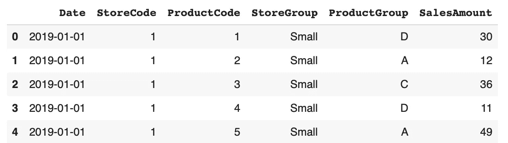
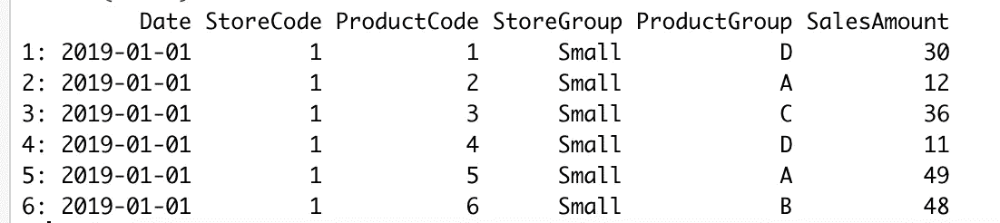
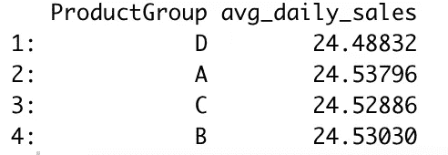
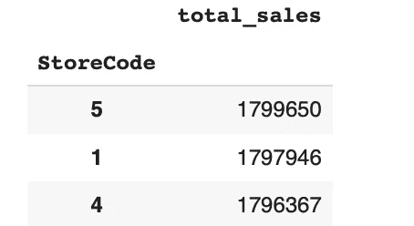
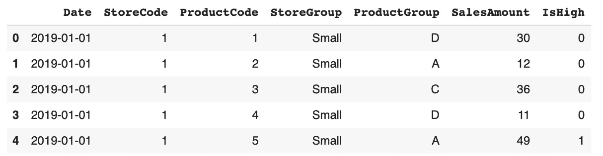
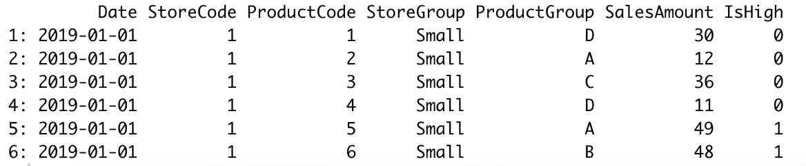

# 相当于 7 只普通熊猫的行动

> 原文：<https://towardsdatascience.com/r-equivalent-of-7-common-pandas-operations-76b632fc801b?source=collection_archive---------35----------------------->

## 熊猫和数据表库实践教程


诺德伍德主题公司在 [Unsplash](https://unsplash.com/s/photos/comparison?utm_source=unsplash&utm_medium=referral&utm_content=creditCopyText) 上拍摄的照片

Python 和 R 是数据科学生态系统中的两个关键角色。这两种编程语言都提供了大量非常有用的库。

说到数据分析和操作，有两个库非常突出:R 的“data.table”和 Python 的 Pandas。

我一直在使用两者，但我不能真正宣布一个优于另一个。尽管我个人更喜欢“data.table ”,但我还没有遇到任何任务不能用这两者来完成。

在本文中，我将使用 Pandas 和“data.table”带您完成 7 个典型的数据分析操作。因此，这对双方都是一个好的实践。

在早先的[文章](/generating-mock-sales-data-with-python-pandas-c904035782fe)中，我已经使用 NumPy 和 Pandas 生成了模拟销售数据。我将使用这些数据作为例子。让我们从导入库和读取数据集开始。

```
#Pandas
import numpy as np
import pandas as pdsales = pd.read_csv("/content/mock_sales.csv")
sales.head()
```



(图片由作者提供)

```
#data.tablelibrary(data.table)sales <- fread("~/Downloads/mock_sales.csv")
head(sales)
```



(图片由作者提供)

## 示例 1

查找列中的唯一值。

```
#Pandassales.ProductGroup.unique()
array(['D', 'A', 'C', 'B'], dtype=object)#data.tableunique(sales$ProductGroup)
[1] "D" "A" "C" "B"
```

## 示例 2

查找一列中唯一值的数量。

在我们的示例中情况并非如此，但是当列中唯一值的数量很大时，您可能会对唯一值的数量感兴趣，而不是显示所有的值。

我们可以通过添加一个字母“n”来完成这项任务。不过，对于熊猫和“data.table ”,添加的位置是不同的。

```
#Pandassales.ProductGroup.nunique()
4#data.tableuniqueN(sales$ProductGroup)
4
```

## 示例 3

计算每个产品组的平均日销售额。

对于这个任务，我们使用 Pandas 的 groupby 功能。用“data.table”稍微简单一点。

```
#Pandassales.groupby("ProductGroup").agg(
   avg_daily_sales = ("SalesAmount", "mean")
)#data.tablesales[, .(avg_daily_sales = mean(SalesAmount)), by=ProductGroup]
```



数据表输出(图片由作者提供)

## 实例 4

找出销售额最高的 3 家商店。

计算部分类似于前面的例子。我们只需更改列名和聚合函数。与上一个示例不同，我们按降序对结果进行排序，并选择前 3 名。

```
#Pandassales.groupby("StoreCode").agg(
   total_sales = ("SalesAmount", "sum")
).sort_values(
   by="total_sales", ascending=False
)[:3]#data.tablesales[, .(total_sales = sum(SalesAmount)), 
      by=StoreCode][order(-total_sales)][1:3]
```



熊猫输出(图片作者)

## 实例 5

创建一个名为“IsHigh”的新列，如果销售额大于 40，则取值 1，否则取值 0。

有几种方法可以完成这个操作。例如，我们可以如下使用 numpy 的 where 函数:

```
#Pandassales["IsHigh"] = np.where(sales["SalesAmount"] > 40, 1, 0)sales.head()
```



(图片由作者提供)

在 R 端，ifelse 函数可用于此任务。

```
#data.tablesales[, IsHigh := ifelse(SalesAmount>40,1,0)]head(sales)
```



(图片由作者提供)

## 实例 6

找出“IsHigh”列取值为 1 的不同天数。

我们已经介绍了如何使用一列中不同值的数量。该任务涉及一个额外的过滤操作。

```
#Pandassales[sales["IsHigh"]==1]["Date"].nunique()
731#data.tableuniqueN(sales[IsHigh==1]$Date)
731
```

## 例 7

查找产品组列中每个不同值的出现次数。

Pandas 的 value_counts 函数返回不同的值以及出现的次数(即行数)。

使用“data.table ”,我们可以根据产品组列对行进行分组，并使用 N 函数对行进行计数。

```
#Pandassales.ProductGroup.value_counts()
B    164475 
D    164475 
A    164475 
C    164475#data.tablesales[,.N,ProductGroup]
   ProductGroup      N
1:            D 164475
2:            A 164475
3:            C 164475
4:            B 164475
```

每组出现的次数是相同的，因为我是这样生成数据的。方法没有错😊

## 结论

R 和 Python 都有几个第三方库，对数据科学家帮助很大。在大多数情况下，一项任务可以使用两种语言的库来完成。因此，宣布一个优于另一个将是一个有争议的讨论。

在本文中，我们做了 7 个例子来演示一些任务的 R 和 Python 版本。

感谢您的阅读。如果您有任何反馈，请告诉我。