# 初学者:学习如何像专家一样可视化数据

> 原文：<https://towardsdatascience.com/r-for-beginners-learn-how-to-visualize-data-like-a-pro-840d1828c09c?source=collection_archive---------10----------------------->

## r 教程

## 基于案例研究的介绍，将引导您开始使用 ggplot2 库创建高质量的图形并了解世界

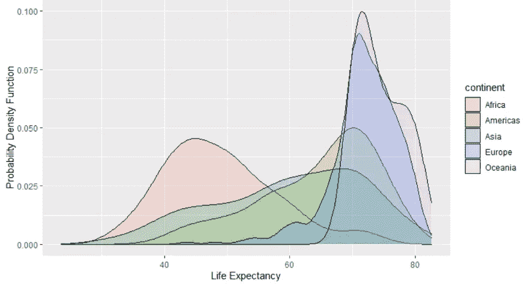

作者图片

如果你曾经想分析数据，并想在你的技能组合中添加一个新的工具包，供专业数据科学家使用，那么请继续阅读。

本教程不会给出一个枯燥的命令列表，而是使用一个具体的案例研究作为一个激励性的例子，向您介绍您需要了解的关于 ggplot2 的一切，gg plot 2 是在 r 中创建高质量图形的事实上的标准。它是一个由 [tidyverse](https://www.tidyverse.org/) 生态系统支持的第三方库。虽然您可以使用基本库在 R 中绘图，但您最有可能在任何实际项目中使用 ggplot2。因此，我强烈建议您可以直接使用这个库进行绘图。

本教程适合任何希望为他们的数据科学项目学习 R 的人。它不需要任何编程或 R 方面的背景知识。唯一的先决条件是您有一台可以上网的计算机，并且已经安装了 R 和 RStudio。然而，如果他们还没有安装，你可以查看我的简短视频教程[这里](https://www.youtube.com/watch?v=mKXkVi-UiSw)，这将帮助你设置 R，然后 RStudio 在任何时间。一旦你设置好你的电脑，回到本教程，让我们开始破解。

## 如果我是 Python 用户怎么办？

如果您习惯于 Python，您可能不太熟悉图形范式的语法，图形范式提供了一种更系统的可视化数据呈现方式。这类似于语言中的语法，我们通过结合名词、动词、冠词等来造句。使用特定的规则。因此，我仍然鼓励你通读并理解这个新的范例。你再也不会以同样的方式看待图形了。

ggplot2 是图形范例语法的一个 R 实现。它的对等物在 Python 中有一个不太出名的库， [plotnine](https://plotnine.readthedocs.io/en/stable/) 。

# 案例研究动机

我想向你们介绍已故的瑞典统计学家汉斯·罗斯林，他最著名的演讲是他试图用实际数据来辩论普遍持有的世界观。

在他的全球健康课上，他让他的学生在给定的两个国家中找出哪个国家的死亡率更高。平均而言，学生们得到了 1.8 分的正确答案(满分为 5 分)。然后，他对一组精选的教授(他们有诺贝尔奖)重复了这个测试，他们的平均分数是 2.4 分。教授们比学生们做得稍微好一点，但是这个分数仍然比那些对世界一无所知的随机回答的人(例如黑猩猩)差。

为什么一只黑猩猩会比成绩优异的学生和少数教授做得更好？

这是因为我们的世界观被关注负面事件的耸人听闻的媒体所主导，给了我们一个扭曲的世界观。汉斯·罗斯林创立的 Gapminder 基金会的使命就是用数据来纠正这种扭曲的世界观。我们有包括联合国各部门在内的各种组织收集的关于世界的大量数据。然而，到目前为止的挑战是访问隐藏在不知名的服务器的表中的数据，并适当地呈现这些数据。

在本案例研究中，我们将使用 Gapminder 基金会的数据来回答 3 个关键问题:

*1:人均寿命和人均 GDP 有关系吗？*

*2:在过去的 50 年里，全世界的预期寿命有什么变化？*

世界真的分成了两个截然不同的群体吗，西方和其他国家(发展中国家)？

使用这个案例研究，我们将创建六种图:散点图、折线图、箱线图、直方图、密度图和条形图。

# 图形语法

在我们进入情节之前，这里有一个非常简短的关于 ggplot2 实现的图形语法的迂回，这是帮助你开始的最低要求。

图形是数据的可视化表示。它帮助我们将 ***数据*** 映射到 ***审美*** 属性的 ***几何对象*** 中。前面提到的每种图形类型都是一个“几何对象”。每个“几何物体”都会有一些美学属性。例如，折线图是一个几何对象，而 x 或 y 位置以及颜色是相关联的美感。每个数据图形都需要三个基本组件:

*   数据
*   几何对象(由 *geom* 指定)
*   属性(由 *aes* 指定)

如果你有以上三个，你可以把它们结合在一起，形成一个有意义的图形对象。如果这感觉有点抽象，不要担心。一旦您看到相关的代码，并意识到通过组合这三个组件来绘制复杂的图形是多么简单，这一切都将变得有意义。

# 散点图

我们将从绘制散点图开始。散点图是帮助我们可视化两个数字量之间关系的基本绘图类型之一。我们将使用散点图来回答我们的第一个问题，人均 GDP 和预期寿命之间的关系。这两个量都是数字，因此这是一个合适的图，可以让我们了解两者之间的关系。

## 数据加载和检查

让我们从导入数据开始。我们将使用来自 Gapminder 基金会的数据。你可以直接从他们的网站上获取数据。然而，对于本教程，我们将使用一个名为 gapminder 的第三方库。(这个库是由 Jenny Bryan 开发的，她现在在 RStudio 的 tidyverse 团队工作)。

打开 R Studio，创建一个新的 R 脚本文件。让我们从安装第三方包开始。你只需要第一次这样做。

```
install.packages("gapminder")
```

安装后，加载软件包。每次打开新的 R Studio 会话时，您都需要这样做。

```
library(gapminder)
```

还要加载 tidyverse 包，它加载了几个包，作为包括 ggplot2 在内的整个生态系统的一部分(如果您愿意，也可以单独加载每个单独的包)。如果这是您的第一次，那么首先安装 tidyverse 包。

```
install.packages(tidyverse) # required only the first time
library(tidyverse)
```

gapminder 包中有几个数据集。我们将使用的是“gapminder”。继续检查数据集。有几个命令可以检查数据。您可以使用 head 和 tail 命令来提供数据集中的前几行或后几行。但是，我强烈推荐使用的命令是 summary 命令。

```
head(gapminder, n=8) # list the first 8 rows in the dataset
tail(gapminder, n=10) # list the last 10 rows in the dataset
summary(gapminder) # recommended method
```

summary 命令返回数据集中所有列的总体摘要。这为您提供了数据集的良好鸟瞰图。如下面的输出所示，我们可以看到 gapminder 数据集有 6 列，我们还可以看到分类列的每个类别的行数，以及汇总统计数据(平均值/中值/最大值/最小值等。)用于数字列

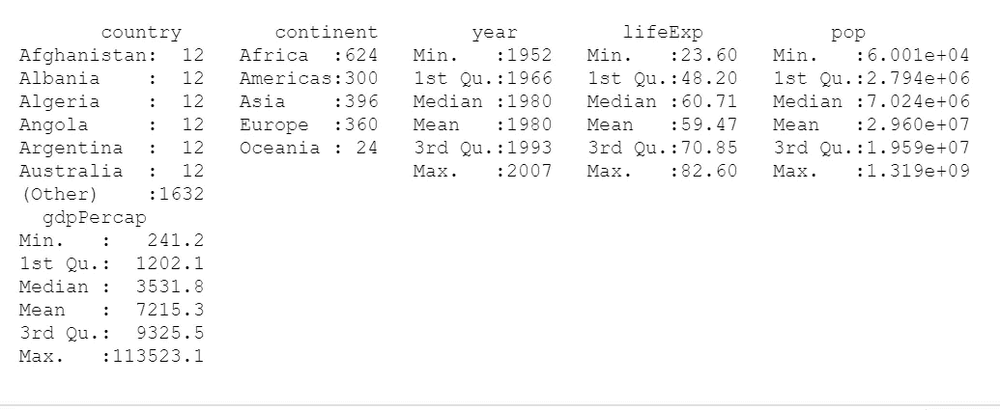

summary 命令的输出提供了数据集的鸟瞰图(图片由作者提供)

## 基本情节

现在让我们创建我们的第一个散点图。我们将使用 ggplot 函数，然后传递三个基本组件:

*   数据(我们希望绘制的数据)
*   geom(我们期望在图中看到的对象类型，如线、条、点)
*   aes(几何对象的美学属性，如位置、颜色、形状和大小)

让我们将这三个组件传递给 ggplot 函数，并将结果对象赋给一个新变量， *p* 。

```
p <- ggplot( data=gapminder, aes(x = gdpPercap, y = lifeExp)) + geom_point()
p
```

这是你的第一个情节，p 应该是这样的。

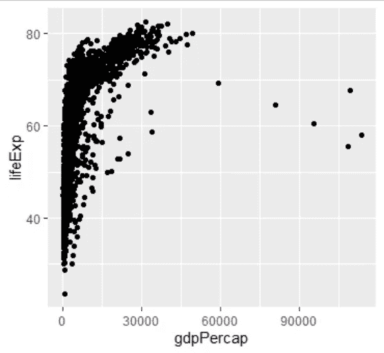

你的第一个散点图(图片由作者提供)

***我们现在将通过添加额外的层来逐步构建这个图形，很快你就会看到它用最少的代码带来了多大的变革。***

## 将 x 轴缩放到对数刻度

虽然人均国内生产总值和预期寿命之间似乎确实存在联系，但 x 轴的刻度似乎被压缩了。我们可以简单地通过向现有的 *p* 对象添加一个额外的命令，将 x 轴刻度改为对数刻度。

```
p <- p + scale_x_log10()
```

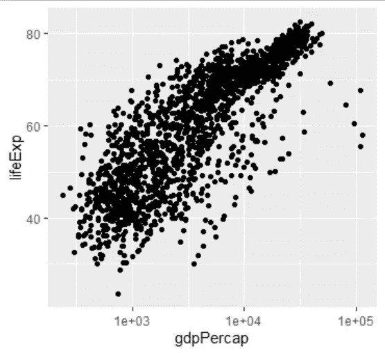

将 x 轴转换为对数标度后的散点图(图片由作者提供)

这样看起来更好，我们现在可以看到一个清晰的关系。

## 分类数据的颜色属性

虽然散点图显示了数值之间的关系，但我们仍然可以通过使用颜色属性来包含分类数据信息。让我们分别代表各大洲。

```
p <- p + aes(color=continent)
```

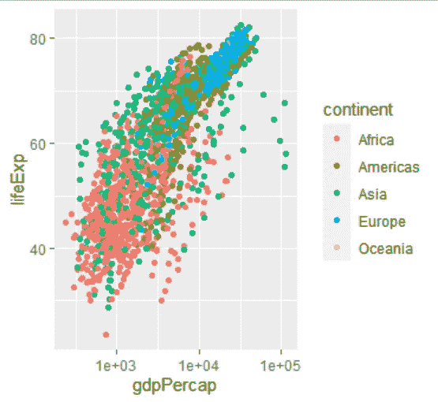

散点图现在用不同的颜色显示每个大陆(图片由作者提供)

## 其他美学

有几种额外的美学可以用来将数据映射到视觉提示中。一般来说，我不会指望有人记得他们。你可以从 RStudio 网站上获得一份官方的[备忘单](https://www.rstudio.com/resources/cheatsheets/)。一旦你习惯了这一点并加以练习，它就会成为你的第二天性。您将记住您经常使用的美学，并且您将更有能力查看官方文档或备忘单来使用适合您的应用程序的任何美学。

在我们的例子中，让我们尝试使用另一种美学，size 属性，并使用它来表示人口数量。

```
p + aes(size=pop)
```

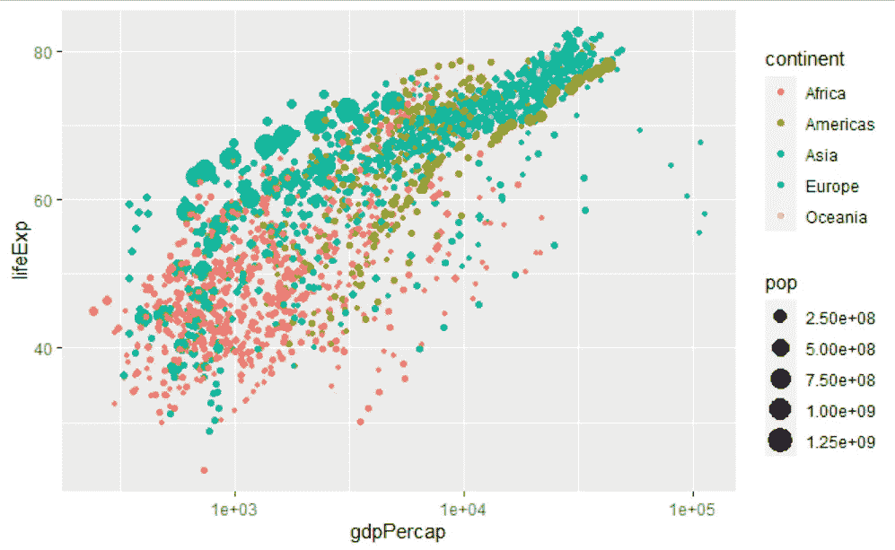

散点图现在显示大小属性(图片由作者提供)

## 添加抖动以显示重叠点

散点图的一个局限性是它不能区分一个位置的大量重叠点和具有少量点的不同位置。处理这类案件的两种方法是:

*   更改散点图中每个数据点的透明度。这由名为 alpha 的变量控制，该变量可以传递给 geom_point()命令。默认情况下，alpha 的值为 1，对应于 100%的不透明度。您现在可以尝试更改 geom_point 中的 alpha 值，看看会得到什么。

```
Hint: geom_point(alpha = 0.1)
```

*   向点添加抖动，这相当于给每个数据点一个小的推动，让它在随机方向上稍微移动。要创建抖动图，我们只需用 geom_jitter 替换命令 geom_point，并使用宽度和高度属性指定抖动量。下面是一个将抖动与指定给身高和体重的特定值结合使用的示例。继续使用这些值，看看当你在抖动中改变高度和宽度属性时会有多大的不同。请理解，添加抖动只是为了视觉外观。

```
p + geom_jitter(width=2,height=2)
```

## 添加趋势线

虽然您可以通过查看数据点来直观地了解趋势，但是您也可以绘制一条与数据点拟合的实际直线。你所需要做的就是简单地添加一个额外的层叫做 geom_smooth()。在下面的代码中，我们向“line width”参数传递了一个额外的值，这导致为每组数据点拟合一条粗线。

```
p+geom_smooth(lwd=3)
```

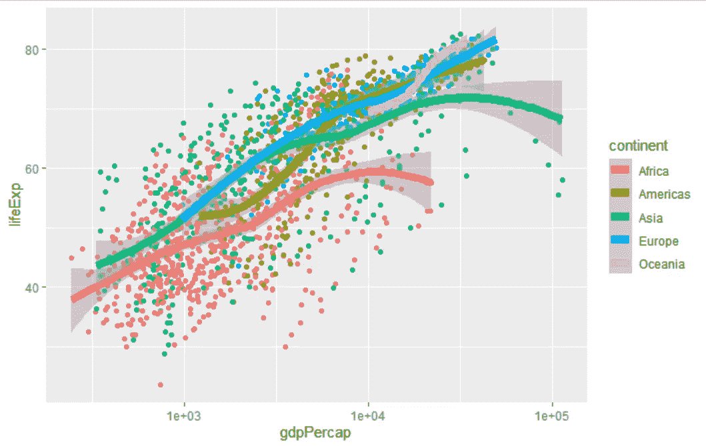

向每组数据点添加趋势线(图片由作者提供)

有了上面的散点图，我们可以清楚地回答我们的第一个问题。 ***人均寿命和人均 GDP 有很强的关系。*** ***这对于所有 5 大洲都是如此。***

# 折线图

像散点图一样，线图也显示两个数值之间的关系。当其中一个变量被排序时(例如时间线)，它们通常更有用。我们将使用折线图来调查预期寿命在过去 40 年中是如何变化的。

我们需要做的就是使用 geom_line()参数，而不是 geom_point()。

```
p <- ggplot( data=gapminder, aes(x = year, y = lifeExp)) + geom_line()
```

这就给了我们下面的剧情。

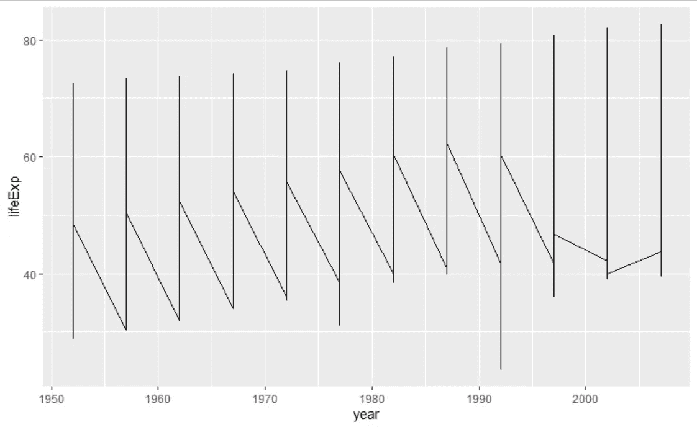

没有任何分组并使用所有数据的线图(图片由作者提供)

但是，我们希望为每个国家分别绘制数据。因此，我们可以使用“组”的美学参数按国家对数据进行“分组”。

```
p<-p+aes(group=country)
```

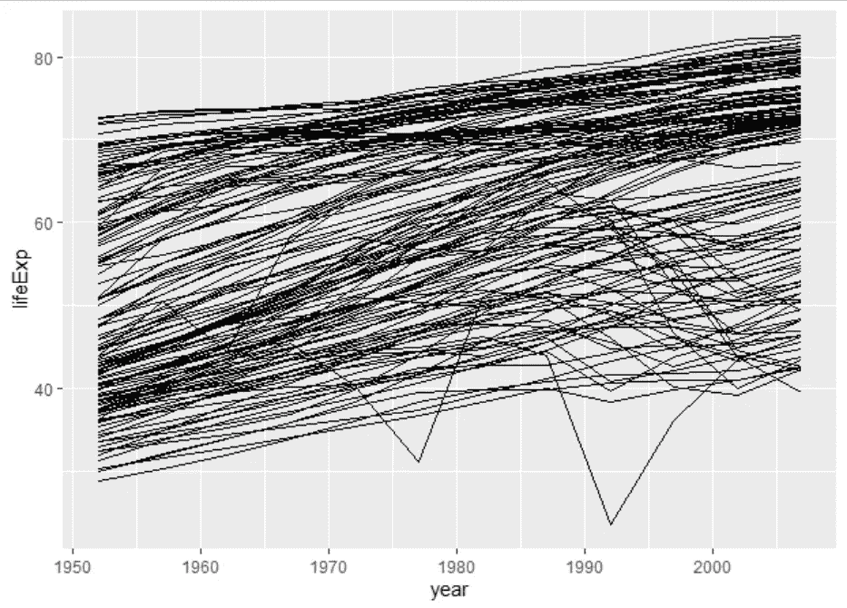

线形图，每个国家一个(图片由作者提供)

这看起来更好，我们可以看到从 1950 年到 2010 年的增长。然而，我们希望看到每个大陆的趋势，因为图表目前看起来很混乱。

```
p <- p +  aes(color=continent)
```

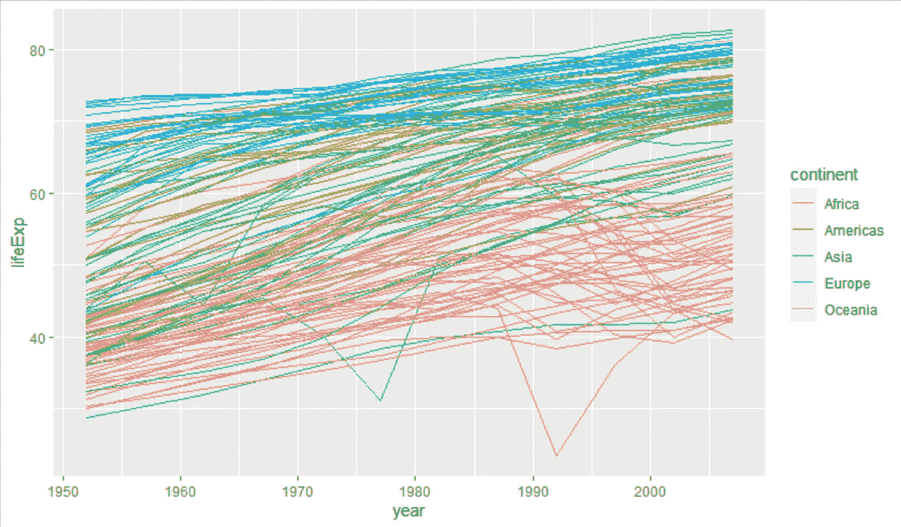

每个国家的线图，按洲分开(图片由作者提供)

## 刻面

除了用颜色来区分不同的类别，我们还可以把它们分成小的支线剧情。我们可以通过刻面层做到这一点。下图是我们在原始命令中添加了一个小平面层后生成的。然后对每个由“大陆”分隔的子情节使用相同的 x 和 y，变量传递给 faceting。

```
p <- p +  facet_wrap(~continent)
```

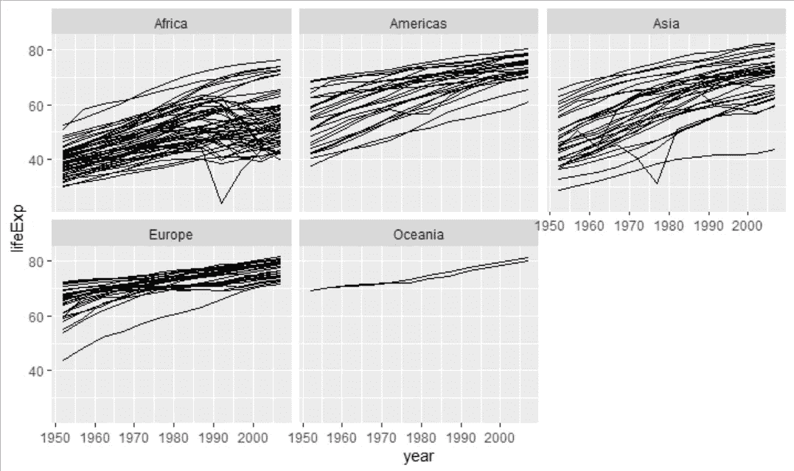

多年来的预期寿命，每个大陆一个分图使用刻面(图片由作者提供)

您还可以使用“子集”功能对数据进行子集化，并查看选定的国家列表。让我们比较一组精选的国家，画出这些年来它们的预期寿命。我任意选择了阿富汗、中国、日本、科威特、马拉维、巴基斯坦、瑞典和美国。

```
ggplot(subset(gapminder, country=='Afghanistan' | country=='China' | country=='United States' | country=='Sweden' | country=='Japan' | country=='Kuwait' | country=='Malawi' | country=='Pakistan'), aes(x=year,y=lifeExp,colour=country))+geom_line(lwd=1.5)
```

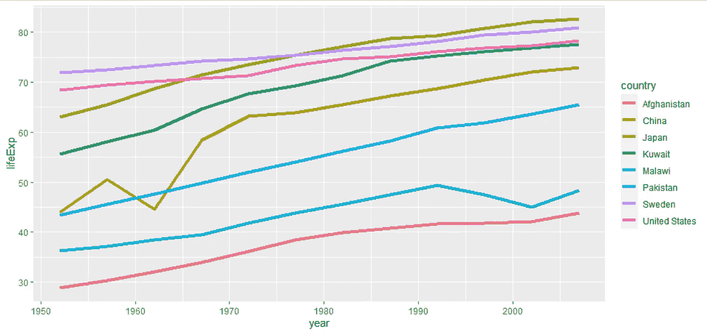

过去 40 多年来一些选定国家的预期寿命(图片由作者提供)

上面的线图清楚地向我们显示，在过去的几十年里，各大洲所有国家的预期寿命都有所增加。

# 箱线图

箱线图给我们一种数值变量分布的感觉，通过并排绘制箱线图来比较多个变量是非常有用的。让我们用箱线图来形象化各大洲的预期寿命分布。

```
ggplot(data=gapminder, aes(x=continent, y=lifeExp))+geom_boxplot()
```

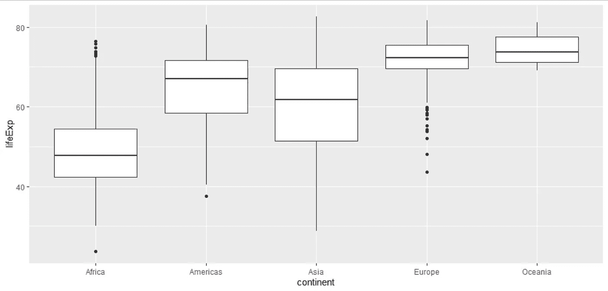

显示五大洲预期寿命分布的基本箱线图(图片由作者提供)

您可以使用 geom_point()或 geom_jitter()在箱线图顶部添加原始点。下面是一个使用 geom_jitter()函数并更改异常值颜色的示例，这样我们就可以将这些异常值与剩余的原始数据区分开来。

```
ggplot(data=gapminder, aes(x=continent, y=lifeExp))+geom_boxplot(outlier.colour = "red")+geom_jitter(width=0.2)
```

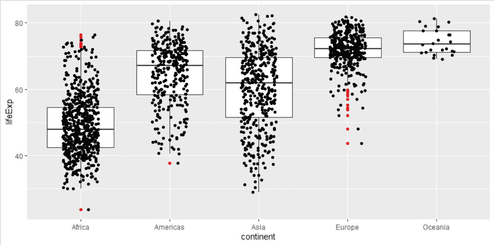

显示五大洲预期寿命分布的基本箱线图，以及带有抖动的原始点(图片由作者提供)

该图清楚地表明，虽然欧洲和大洋洲的平均预期寿命高于其他大陆，但其他大陆的一些国家的预期寿命比欧洲和大洋洲的一些国家要高得多。

# 柱状图

另一个能说明变量分布的图表是直方图。我们可以使用 geom_histogram 创建一个直方图，并为洲指定“fill”属性，这样我们就可以使用不同的颜色来比较洲。

```
ggplot(data=gapminder, aes(fill=continent, x=lifeExp))+geom_histogram()
```

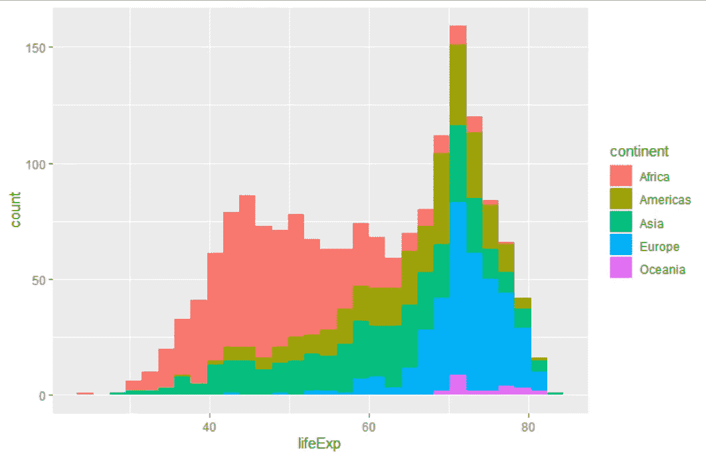

显示各大洲预期寿命分布的柱状图(图片由作者提供)

与直方图密切相关的图是使用概率密度图。这里，我们将使用 geom_density 并指定一个 alpha 值来调整透明度，以便更好地查看重叠的地块。让我们也使用 xlab 和 ylab 函数来适当地标记这两个轴。

```
ggplot(data=gapminder, aes(fill=continent, x=lifeExp))+ geom_density(alpha = 0.2)+xlab('Life Expectancy')+ylab('Probability Density Function')
```

这将给我们以下情节:

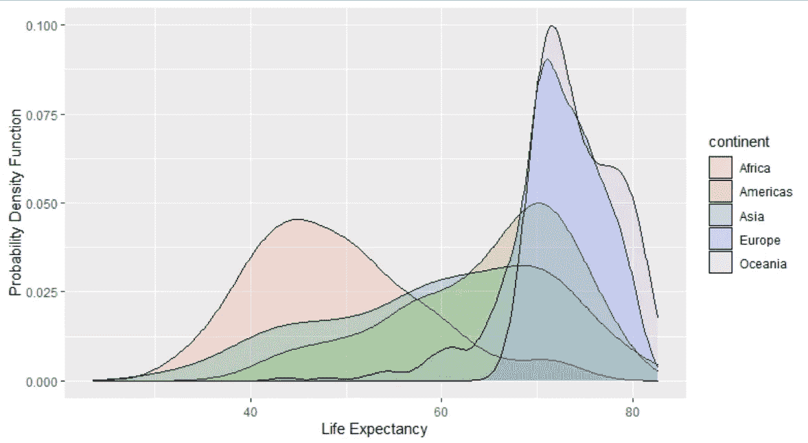

显示各大洲预期寿命分布的概率密度函数图(图片由作者提供)

箱线图、直方图和密度图越来越清楚地表明，东西方之间似乎是一个连续体，而不是二分法。

# 条形图

箱线图和直方图都有助于我们可视化数值变量的分布。然而，我们有时可能需要了解分类数据的分布。这相当于计算给定分类变量中类别的数量。geom_boxplot()允许我们绘制条形图，默认情况下，它计算给定变量中类别的数量。让我们使用 continental 变量绘制一个条形图，它将给出每个洲的记录数。

```
ggplot(data=gapminder, aes(x=continent))+ geom_bar()
```

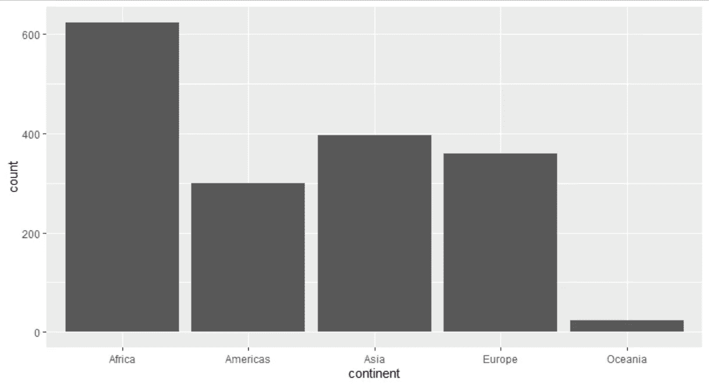

柱状图显示了我们在各大洲的记录总数(图片由作者提供)

最后，我们还可以修改上面的代码来查找给定年份(2007 年)的记录数，并翻转坐标，这样我们就可以看到水平的条形。

```
ggplot(data=subset(gapminder, year==2007), aes(x=continent))+ geom_bar() +coord_flip()
```

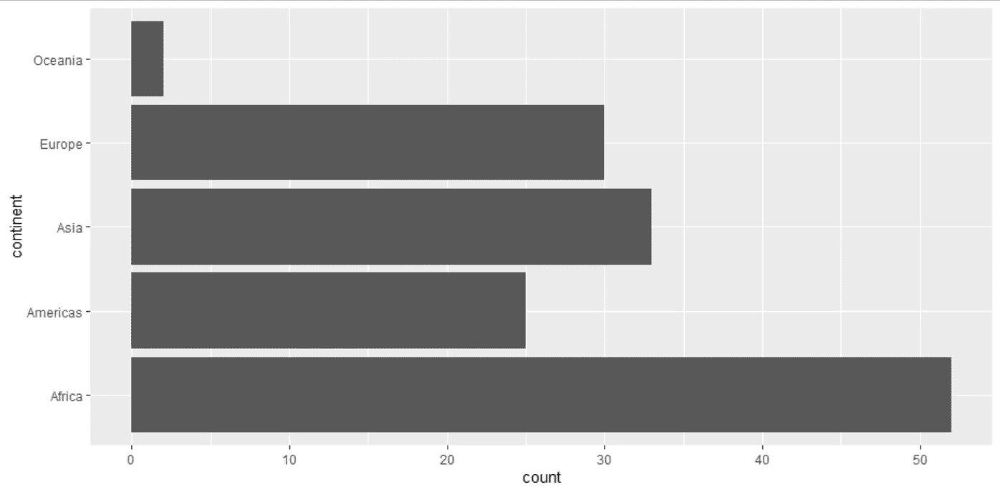

水平条形图显示了给定年份我们在各大洲的记录总数(图片由作者提供)

# 摘要

本教程向您介绍了 ggplot2 库，以帮助您用六种不同类型的图来可视化您的数据(下面提供了可视化摘要)。使用来自 Gapminder 基金会的数据向您提供了一个完整的演示。上面列出的所有代码在我的 [github](https://github.com/syedahmar/BlogTutorials/blob/main/ggplot2_introduction.R) 中也有。

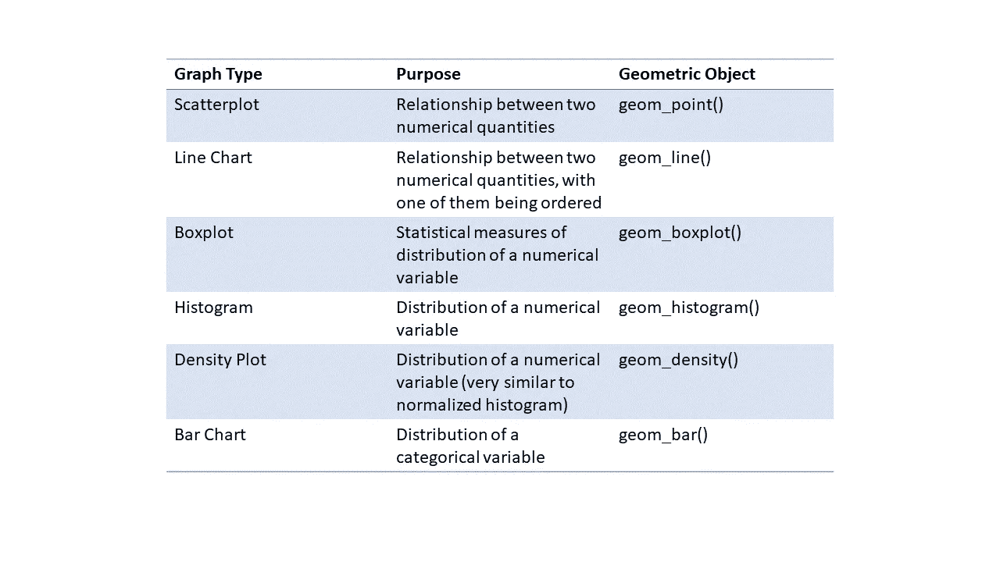

散点图、折线图、箱线图、直方图、密度图和条形图，每个的用途，以及相关的几何对象命令(图片由作者提供)

[](https://ahmarshah.medium.com/membership) [## 阅读艾哈迈尔·沙阿博士(牛津)的每一个故事(以及媒体上成千上万的其他作家)

### 作为一个媒体会员，你的会员费的一部分会给你阅读的作家，你可以完全接触到每一个故事…

ahmarshah.medium.com](https://ahmarshah.medium.com/membership)