# 初学者 r—第 2 部分:使用矩阵

> 原文：<https://towardsdatascience.com/r-for-beginners-part-2-working-with-matrices-364dcaa6e601?source=collection_archive---------35----------------------->

## 数据科学教学

## 初学者快速入门指南，帮助他们开始使用非常流行的统计和数据分析软件。

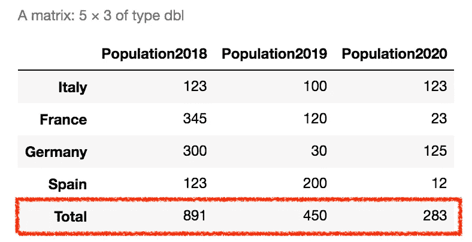

作者图片

R 软件是一款非常流行的统计计算和图形软件。它提供了许多也可以用于数据科学，尤其是数据分析的包。

本文属于初学者 R 系列，试图帮助初学者入门 R 软件。在我的[上一篇文章](/r-for-beginners-part-1-data-structures-2b49685ea2ed)中，我处理了向量。在本文中，我将讨论矩阵，并特别关注以下几个方面:

*   创建矩阵
*   为行和列指定名称
*   选择项目
*   用新的行或列扩展矩阵
*   基本统计。

# 1 创建一个矩阵

**矩阵是一个多维向量，它包含相同类型的元素**，如字符或数字。在 R 中，矩阵是通过`matrix()`函数定义的，该函数接收行数和如何对元素排序(按行还是按列)作为输入。

在下面的例子中，我们定义了一个包含 8 个元素的矩阵，并通过`nrow`参数指定将元素分布在两行中。我们也可以指定按行获取元素(`byrow=TRUE`):

```
m <- matrix(c(1,2,4,5,7,8), nrow=2, byrow=TRUE)
```

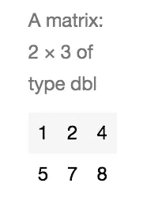

作者图片

或者按列(`byrow=FALSE`):

```
m <- matrix(c(1,2,4,5,7,8), nrow=2, byrow=FALSE)
```

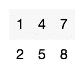

作者图片

我们也可以用先前定义的向量定义一个矩阵，简单地**连接相关的向量**:

```
population2018 <- c(123, 345, 300)
population2019 <- c(100, 120, 30)
m <- matrix(c(population2018, population2019), nrow=3, byrow = FALSE)
```

# 2 分配名称

我们可以通过`colnames()`函数给矩阵的每一列设置一个名称:

```
colnames(m) <- c("Population2018", "Population2019")
```

以及行的名称:

```
rownames(m) <- c("Italy", "France", "Germany")
```

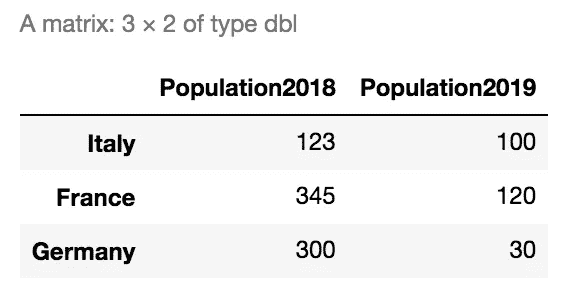

作者图片

# 3 选择项目

可以进行选择:

*   名叫
*   按索引

## 3.1 按名称选择

**选择一行/一列**

我们可以选择给定行的所有项目(注意行名后的逗号):

```
m['Italy', ]
```

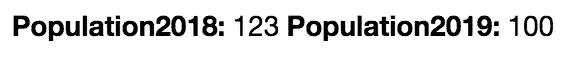

作者图片

选择一列的所有元素(注意列名前的逗号) **:**

```
m[, 'Population2018']
```

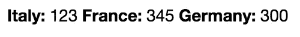

作者图片

**选择更多行/列**

该程序也可用于**从矩阵**中删除行/列。选择**部分行的所有项目**:

```
m[c('Italy', 'Germany'),]
```

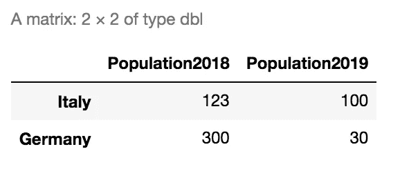

作者图片

选择**部分列的所有元素**:

```
m[,c('Population2018', 'Population2019')]
```

## 3.2 按索引选择

我们可以选择属于第一行的所有项目:

```
m[1,]
```

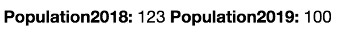

作者图片

或者，我们可以选择属于第二列的所有项目:

```
m[,2]
```

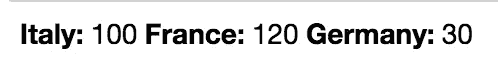

作者图片

# 4 扩展矩阵

**新的列和行可以分别通过`cbind()`和`rbind()`功能添加到矩阵**中。

## 4.1 向矩阵中添加一列

我们可以添加**一个新的列**，以`column_name=vector`的形式将它传递给`cbind()`函数，如下所示:

```
m <- cbind(m, Population2021=c(123,23,125))
```

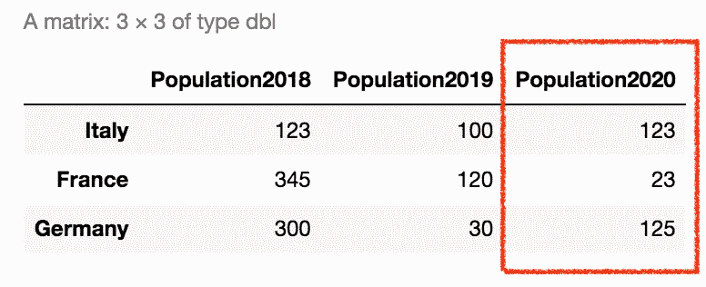

作者图片

注意到

*   `cbind()`接收要扩展的矩阵作为第一个参数
*   **新向量的长度必须与矩阵的行数相同**。

## 4.2 向矩阵中添加一列

`rbind()`函数与`cbind()`函数的语法相同。因此，可以添加一个新行，如下所示:

```
m <- rbind(m, Spain=c(123, 200, 12))
```

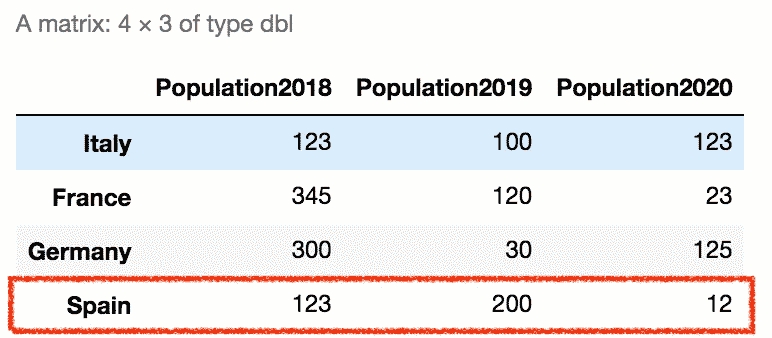

作者图片

# 5 基本统计

**如果一个矩阵的所有行/列都是数字类型**，可以计算一些基本的统计数据。要检查一个矩阵的类型，我们可以执行下面的函数:

```
str(m)
```

它给出了以下输出:

```
num [1:4, 1:3] 123 345 300 123 100 120 30 200 123 23 ...
 - attr(*, "dimnames")=List of 2
  ..$ : chr [1:4] "Italy" "France" "Germany" "Spain"
  ..$ : chr [1:3] "Population2018" "Population2019" "Population2020"
```

请注意，类型是数字(num)，因此我们可以继续。我们可以按行或按列对元素求和。

## 5.1 按行求和

在这个具体的例子中，我们可以按国家计算总人口:

```
rowSums(m)
```

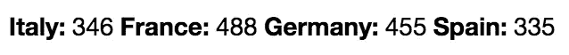

作者图片

我们可以将结果添加为新列:

```
enriched_m <- cbind(m, Total=rowSums(m))
```

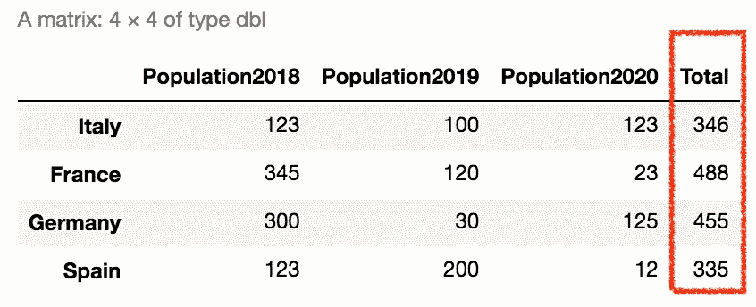

作者图片

## 5.2 按列求和

与按行求和类似，按列求和可以通过以下函数实现:

```
colSums(m)
```

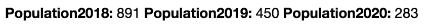

作者图片

在前面的示例中，我们已经按年份计算了总和，因此我们可以将其添加为新行:

```
enriched_m <- rbind(m, Total=colSums(m))
```


作者图片

# 摘要

在本教程中，我已经介绍了 r 中的矩阵。需要提醒的是**矩阵的所有元素必须是同一类型**。如果您想要管理不同的类型，您应该构建一个数据框架或列表。因此，请继续关注下一篇文章。

现在 Medium 提供了一个新特性，即它允许**构建列表**。**如果您喜欢这篇文章，您可以将其添加到您的收藏夹列表**，只需点击按钮，放在文章右上角的按钮:

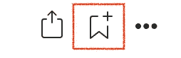

作者图片

如果你想了解我的研究和其他活动的最新情况，你可以在 [Twitter](https://twitter.com/alod83) 、 [Youtube](https://www.youtube.com/channel/UC4O8-FtQqGIsgDW_ytXIWOg?view_as=subscriber) 和 [Github](https://github.com/alod83) 上关注我。

# 相关文章

</r-for-beginners-part-1-data-structures-2b49685ea2ed>  <https://medium.com/analytics-vidhya/a-gentle-introduction-to-descriptive-analytics-8b4e8e1ad238>  <https://medium.com/geekculture/the-top-25-python-libraries-for-data-science-71c0eb58723d> 