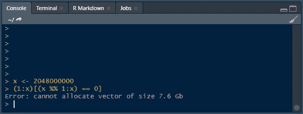

# r 慢——都是你的错！

> 原文：<https://towardsdatascience.com/r-is-slow-and-its-your-fault-2fcedacc7abb?source=collection_archive---------13----------------------->

## 教程| R |优化代码

## 了解您的工具对您的成功至关重要


由[卢卡·安布罗西](https://unsplash.com/@lucambro?utm_source=medium&utm_medium=referral)在 [Unsplash](https://unsplash.com?utm_source=medium&utm_medium=referral) 上拍照

任何在数据科学领域工作的人都熟悉 R。您肯定遇到过有人认为 R 是一种缓慢的语言，无法处理更大的数据。事实并非总是如此。我在野外看到的许多 R 代码表明，对这种语言的工作原理缺乏基本的理解。让我们看一个例子，如何优化你的代码来与你合作，而不是与你作对。

<https://realdrewdata.medium.com/membership>  

# 为什么循环很慢？

让我们从 R 编程语言是如何工作的开始。这就是所谓的[解释语言](https://www.geeksforgeeks.org/difference-between-compiled-and-interpreted-language/)。这意味着在运行代码之前你不需要编译任何东西，计算机只是解释并运行它，给你结果。这有助于加快您编写和测试代码的速度，但缺点是通常执行起来较慢。在处理过程中有很多开销，因为 R 几乎每次查看变量时都需要检查变量的类型。这使得改变类型和重用变量名变得容易，但是对于非常重复的任务，例如在循环中执行一个动作，会降低计算速度。

让我们以一个简单的编程问题为例:找出给定数字的所有[因子](https://www.cuemath.com/numbers/factors/)。为此，我们可以查看从 1 开始一直到给定数字的每个数字，包括给定数字。如果我们的数字是 2048，这将是从 1 到 2048 的所有数字。我们将 2048 年除以这些可能的因素。如果余数是 0，则该数是一个因子。

对于初学编程的人来说，用 For 循环可以很容易地解决这个问题。我们将 2048 赋给一个变量`x`。然后我们可以创建一个空白向量来存储找到的因子。

```
x <- 2048factors <- c()
```

现在是 for 循环。我们从 1 到`x`。在 for 循环中，我们将创建一个 if 语句。if 语句的条件将是`x`模(`%%` ) `i`等于 0。模运算将给出每个数除以`x`的余数。当这个值为 0 时，我们将执行下一行，将`i`的值添加到我们的因子向量中。

```
for (i in 1:x) {
    if (x %% i == 0) {
        factors <- c(factors, i)
    }
}
```

这种方法没有任何问题。在一台相当标准的计算机上运行它根本不需要任何时间。您也将在因子向量中获得正确的值。那么这种方法有什么问题呢？

当 R 使用循环时，它必须在每次循环运行时检查`x`和`i`的值。在我们看来，很明显这些总是数字，但是 R 仍然需要每次都检查。当你想找出一个更大的数字的因数时，比如 2，048，000，这就成了一个问题。在我的电脑上，同样的循环用了大约 26(！)秒求 2，048，000 的所有因子。

如果你想在你的机器上运行它，使用`rbenchmark`包。使用`benchmark`函数，给你的代码起一个名字，比如 Loop。将该名称设置为我们的循环，您将在输出的 elapsed 部分获得您的执行时间。请注意，代码运行了多次，运行时间是所有运行的累计时间。

```
library(rbenchmark)benchmark(
    "Loop" = {
        loop_factors <- c(1)
        for (i in 2:x) {
            if (x %% i == 0) {
                loop_factors <- c(loop_factors, i)
            }
        }
    }
)# Output
# test replications elapsed relative user.self sys.self user.child
# Loop          100    27.5        1     27.44        0         NA
# Sys.child
#        NA
```

# 还有另一种方法

现在我知道你在说什么了，用 python(或者另一种更快的语言)！但是如果你知道它是如何工作的，没有理由 R 不能更快地处理这个任务。我们需要做的就是消除每次循环时检查每个变量类型的开销。大概是这样的:

```
factors <- (1:x)[(x %% 1:x) == 0]
```

好了，问题解决了！运行速度快了 7 到 8 倍，并且给出了相同的正确答案。但这都是为了理解为什么我喜欢代码是可读的，所以当我们重写这个优化的语句时，让我们更深入一点。

首先，我们已经确定了 R 花很长时间运行循环的部分原因是因为它在每次循环时都要检查变量的类型。幸运的是，R 被设计成利用向量来避免这种情况。要求向量的每个元素都具有相同的类型，所以 R 在计算时不需要检查每个元素。因此，为了优化，我们将使用矢量化运算。

</storing-data-r-data-structures-717245c6bab8>  

首先，我们将得到我们的数`x`，并使用模运算符(`%%`)来得到除以从 1 到`x`的每个数时的每个余数。我们可以使用`1:x`来创建从 1 到`x`的所有数字的向量。当我们用一个数字向量对单个元素`x`取模时，R 用向量的每个元素除`x`，返回余数的向量。

```
remainders <- x %% 1:x
```

接下来，我们要测试哪些余数是 0。类似于余数运算的工作方式，我们可以将整个`remainders`向量与 0 进行比较。这将返回一个向量`TRUE` / `FALSE`，其中`TRUE`表示余数为 0。

```
true_false <- remainders == 0
```

现在，我们可以使用`true_false`向量来过滤我们可能的数字，1 到`x`，给出我们最终的答案。

```
(1:x)[true_false]
```

# 让我们飙车吧

让我们再次检查我们的计算速度，比较所有三个版本:for 循环版本、单行向量优化版本和可读向量优化版本。我将再次使用`benchmark`函数，这次添加一个向量和向量可读。`x`再次设置为 2，048，000。

```
benchmark(
    "Loop" = {
        loop_factors <- c(1)
        for (i in 2:x) {
            if (x %% i == 0) {
                loop_factors <- c(loop_factors, i)
            }
        }
    },
    "Vector" = {
        loop_factors <- (1:x)[(x %% 1:x) == 0]
    },
    "Vector Readable" = {
        remainders <- x %% 1:x
        true_false <- remainders == 0
        loop_factors <- (1:x)[true_false]
    }
)# Output
#              test replications elapsed relative user.self sys.self
# 1            Loop          100   27.52    7.519     27.38     0.00
# 2          Vector          100    3.66    1.000      2.99    0.66
# 3 Vector Readable          100    3.77    1.030      3.24    0.50
#
#   user.child sys.child
# 1         NA        NA
# 2         NA        NA
# 3         NA        NA
```

在输出中，运行最快的代码的相对值为 1。每隔一个片段将显示相对于最快的片段所用的时间的多少倍。在我的例子中，单行版本比可读版本稍快。这很可能是因为我们存储了步骤之间的输出，使其更具可读性。您还可以看到，for 循环比 vector 版本慢 7.5 倍。向量确实有助于优化你的代码！

太棒了。r 用向量做任何事都快得多，对吗？嗯，R 还是有一些限制的。虽然使用向量可以大大加快计算速度，但 R 仍然在内存中完成大部分计算。所以一旦我们达到足够大的数字，R 将无法分配计算所需大小的向量，比如 2，048，000，000。事情是这样的:



# 结论

所以最后，了解你的工具是很重要的。r 是一种非常容易掌握的语言。学习一些技巧，比如利用向量，可以加快计算速度，并有助于保持 R 在工具箱中的相关性。你还需要知道你的工具的局限性。学习用向量优化你的代码是有用的，但是一旦你遇到一定规模的数据和计算，你可能要开始寻找一种新的语言。