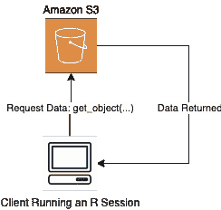
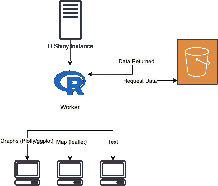
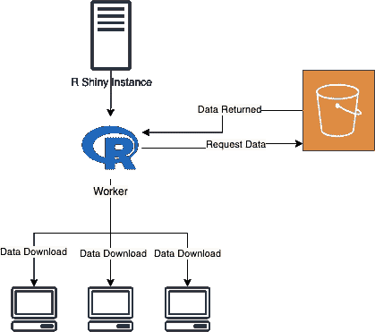
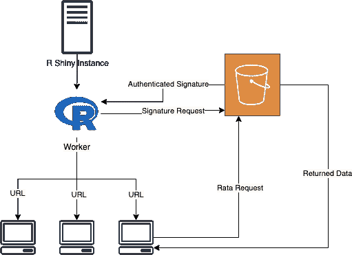

# R Shiny —支持从亚马逊 S3 高效下载文件

> 原文：<https://towardsdatascience.com/r-shiny-enable-efficient-file-downloads-from-amazon-s3-f575bfb21244?source=collection_archive---------43----------------------->

## [理解大数据](https://towardsdatascience.com/tagged/making-sense-of-big-data)

## *了解如何使用亚马逊 S3 签名网址在 R Shiny 上高效下载文件。*

保罗·花冈在 [Unsplash](https://unsplash.com?utm_source=medium&utm_medium=referral) 上的照片

尽管 R universe 中有一些优秀的软件包可以与 R 中的 S3 一起工作，尽管所有这些软件包都可以很容易地与 R shiny 无缝集成，但当我通过 R Shiny 处理大文件时，仍然会面临一些有趣的挑战。让我们先问自己一个简单的问题。

> 我们如何从 S3 存储桶中访问文件来执行数据分析？

# 从 R 访问 S3 数据

感谢我们提供的软件包，从 R 访问 S3 数据从来没有这么简单过。

aws.s3 包包含与 s3 REST API 集成的强大功能，允许用户以编程方式管理他们的 S3 桶。从个人经验来看，代码库的文档、可用性和可读性都非常好。

我不打算深入研究如何使用这个包，但是让我们来探索当我们试图从 S3 桶中获取数据时会发生什么。

作者图片，使用 [draw.io](http://draw.io) 生成

函数调用向 S3 发出请求。该函数在幕后处理身份验证，最后将请求的数据返回给客户端。

上面描述的工作流最适合在本地执行探索性工作，因为正如您所料，数据是通过网络从 S3 传输到您的本地机器上的。

然而，在 R Shiny 中使用这种方法不再是最有效的方法，因为我们的代码不再是“客户端”

# 从 R Shiny 获取 S3 数据

当使用 R Shiny 时，重要的是要记住我们编写的代码要么在实例上执行，要么在由 shiny-server 启动的 worker 上执行。客户端现在是实际连接并使用我们的应用程序的最终用户。

上面描述的工作流在一个闪亮的应用程序中工作；然而，我们现在面临两个潜在的用例。

1.  从 S3 获取数据，在闪亮的应用程序中使用这些数据或执行一些分析，并以可视化方式呈现这些数据。
2.  以数据下载的形式将数据直接交付给用户。

## 用例#1 —查询、消费和呈现 S3 数据

作者图片，使用 [draw.io](http://draw.io) 生成

在上图中描述的工作流中，目标是

1.  从 S3 获取数据。
2.  消费来自`server(...)`内部的数据来做一些有用的工作。
3.  以可视化的形式呈现数据。(可选)

为了实现这一点，我们可以重用上面给出的代码。下面的代码摘录中提供了一个例子，sans 数据可视化代码。

## 用例 2 —提供直接数据下载

## 天真的方法

如果我们使用以前的方法作为直接数据下载来交付数据，这将给我们带来一个新的问题。下面是代码和工作流的样子。

作者图片，使用 [draw.io](http://draw.io) 生成

查看上面的图表和代码，我们可以开始发现流程中的低效之处。工作进程首先请求数据。然后，一旦数据通过网络返回，它就被写入客户机的文件系统。数据在网络上有两次传输。如果我们能减少一半，那将大大提高我们系统的效率。

## 授权签名

授权签名允许 R Shiny 生成一个临时 URL，客户机可以用它来访问数据。这个 URL 使客户端能够直接从 S3 存储桶下载数据，基本上绕过了所有中间步骤。这将网络数据传输减少了一半，并大大缩短了下载时间。

作者图片，使用 [draw.io](http://draw.io) 生成

## 如何生成经过身份验证的 URL

虽然使用签名来生成经过认证的 URL 并不是一种新颖的方法，但据我所知，R 中目前可用的包肯定没有提供一种简单的方法来实现这一点。我在亚马逊 AWS 官方文档的帮助下开发了一个助手函数来生成认证的 URL。

使用这个助手函数，从 S3 下载文件的闪亮代码将如下所示。

# 摘要

在上面给出的例子中，当向客户端提供数据下载时，使用`aws.s3`从 Shiny 中查询数据的简单方法是一种次优的方法。更有效的方法是使用`aws.signature`生成一个签名，然后用它生成一个签名的 URL。然后，客户端可以使用签名的 URL 直接下载数据。

对于未来的工作，将这一功能整合到`aws.s3`中会很有用。这样，该软件包将更接近于成为 R and R 闪亮 S3 所有相关事务的一站式商店。

一如既往，任何建设性的反馈，错误，或更有效的方法总是受欢迎的。你可以通过[推特](https://twitter.com/sada6191)或者下面的评论联系我。