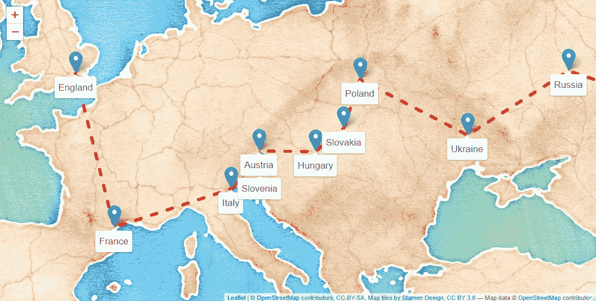
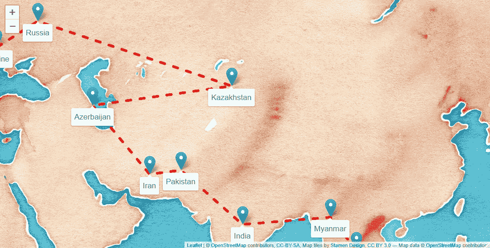
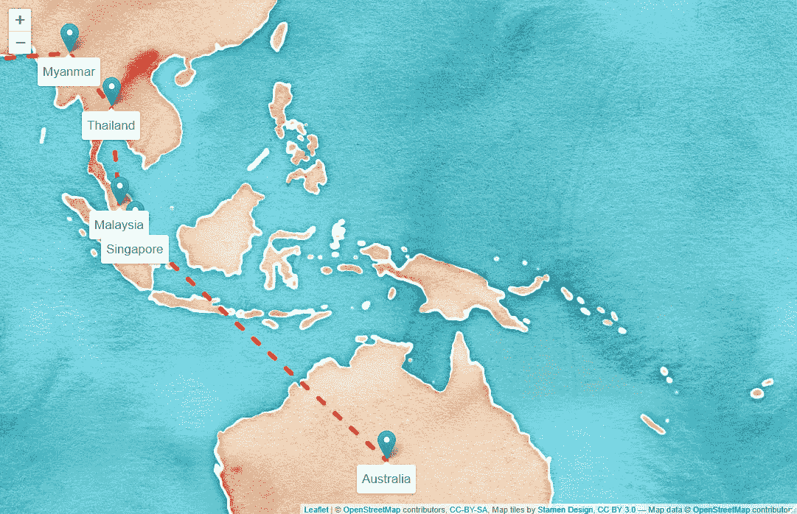
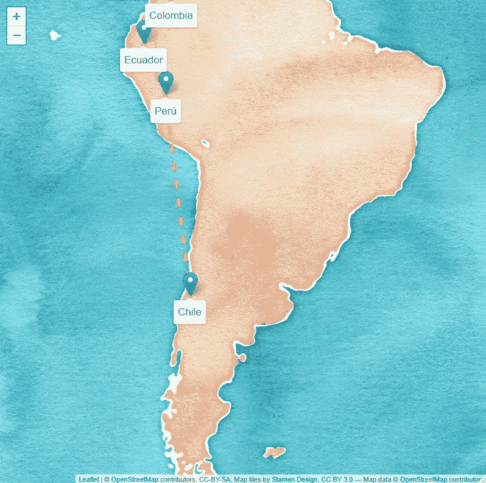
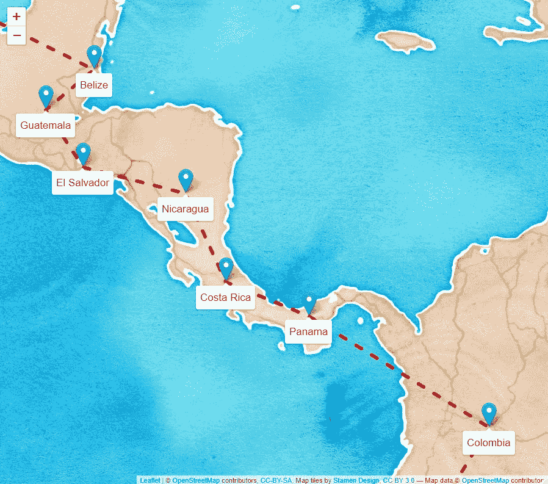
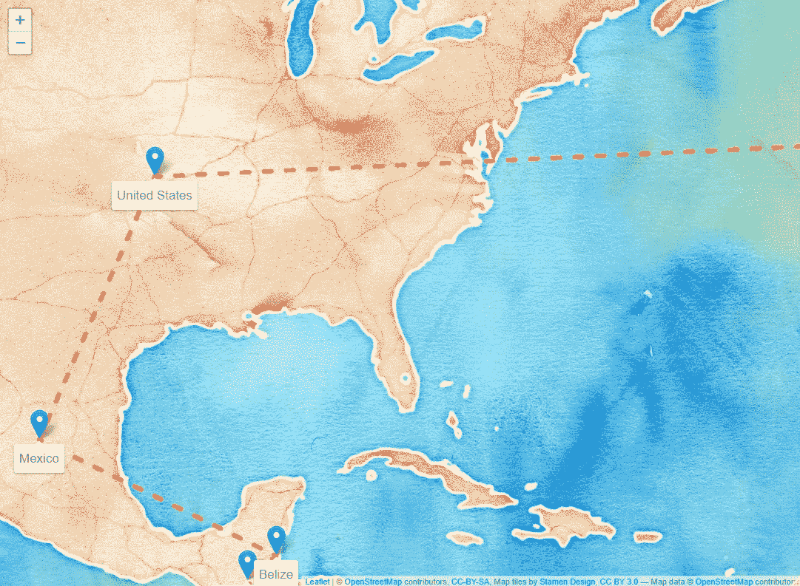
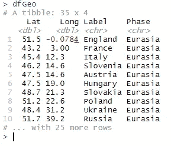

# r 对一辆杜卡迪。哪个更快？

> 原文：<https://towardsdatascience.com/r-vs-a-ducati-which-is-faster-3797c9a306c6?source=collection_archive---------46----------------------->

## 用 R 和传单绘制亨利·克鲁斯打破世界纪录的环球航行的美丽地图，只用了 8 行代码！


图片作者。我对杜卡迪扰频器的解读。

# 准备好来一次狂野之旅吧

2019 年，亨利·克鲁成为骑摩托车环游世界的最年轻的人。在一年的漫长旅程中，他骑着杜卡迪沙漠雪橇行走了 55，000 英里。

亨利的旅程始于英国伦敦的自行车棚俱乐部。从这里，他骑行穿过欧洲、俄罗斯、中东和东南亚。然后一架飞机向下(并穿过)澳大利亚。最后他飞到了南美洲，一路骑到了美国的东海岸。最终他回到了伦敦！

我知道你很想跳上你的摩托车，把所有的烦恼抛到九霄云外，跟随着亨利的脚步。但是…

1.  生活似乎成了阻碍
2.  所有这些数据都不会流向科学本身

为什么我们不试着通过 R 的视角来体验亨利的冒险呢？所以，拉起离合器，换到第一档，踩下油门，抓紧，因为我们出发了！

# 获取数据

要在地图上绘制点，您需要点。我知道，神魂颠倒。

这些分数没有我想象的那么容易获得。据我所知，没有一个地方简明地展示了亨利的环球旅行。那么当数据不存在的时候我们该怎么办呢？我们要不要继续做其他项目，让果实挂在藤蔓上更低的地方，触手可及？或者也许我们应该撇撇嘴，把拳头举到空中，诅咒这一天已经明确抛弃我们的数据之神？

那鸿我们只是制作自己的数据。

根据亨利的博客，我能够非常准确地把英国和印度联系起来。然而，他的博客在他的旅程进行到一半时就结束了，所以在旅行的剩余时间里，我从他的一些采访中收集了一些关于哪些国家先于其他国家的逻辑。下载我生成的数据[这里](https://github.com/KendonDarlington/WorldCircumnavigation/blob/main/WorldCircumnavigation/Henry%20Crews%20Journey%20-%20Geo.csv)！

也就是说，我们离英国越远，我就越有可能错过一两步。但是我们并没有在火星上发射火箭，所以让我们顺其自然吧！

首先，我将展示我用 R 绘制的地图，然后我将展示产生这些地图的 8 行代码。

# 欧亚大陆

欧洲到俄罗斯



图片作者。

俄罗斯到缅甸



图片作者。

缅甸到澳大利亚



图片作者。

# 美洲

智利到哥伦比亚



图片作者。

哥伦比亚到伯利兹



图片作者。

伯利兹到美国，然后回到英国



图片作者。

# r 和传单

传单是一个用 r 语言创建地图的极好的库。只需几行代码，你就可以创建漂亮的地图。首先，你将需要[从这里](https://github.com/KendonDarlington/WorldCircumnavigation/blob/main/WorldCircumnavigation/Henry%20Crews%20Journey%20-%20Geo.csv)抓取数据。

当在 R 中工作时，我更喜欢创建一个 R 项目，这样我就可以对我所有的代码使用相对路径。或者，您可以从上面的链接下载 csv 文件，并将“dfGeo”的路径更改为您保存文件的位置。代码如下:

我们从使用传单和 tidyverse 包装开始。如果您还没有这些软件，请安装它们:

```
install.packages("leaflet")
install.packages("tidyverse")
```

然后，我们将 csv 导入 tibble(数据帧的 tidyverses 版本)

```
dfGeo <- read_csv('Henry Crews Journey - Geo.csv')
```

如果您想查看我们的数据，请在控制台中键入“dfGeo ”:



作者图片

```
leaflet(data = dfGeo) %>%
  addTiles() %>%
```

这将调用传单库并传递 dfGeo 作为数据源。添加图块只会生成一张空白地图。

```
addMarkers(lng=~Long, lat=~Lat, label=~Label, labelOptions = labelOptions(noHide = T,  direction = "bottom",textsize = "17px")) %>%
```

添加标记在地图上标出我们的点。查看上面的数据(dfGeo)，您可以使用波形符调用小叶参数内的列(aka ~Long 是“Long”列)。Label 是我们数据集中的国家名称。

LabelOptions 只是让文本稍微大一点，默认显示标签。否则，您必须单击标记来显示标签。方向只是说把标签放在标记的底部，而不是顶部或左侧等。

```
addProviderTiles(providers$Stamen.Watercolor) %>%
```

这将贴图设置为雄蕊。水彩地图，如果你问我，它看起来很酷。如果你不喜欢老式的水彩画，你可以在这里使用更多的地图模板。

```
addPolylines(data = dfGeo, lng = ~Long, lat = ~Lat, group = ~Label, color = 'red', dashArray = '10,20')
```

最后，我们添加连接每个标记的线条。它们也是基于纬度和经度的，因为我是按顺序将数据放入 csv 的，所以一切正常。dasharrray 只是把线设置成虚线，而且相当大。

仅此而已。您可以从 github 下载完整的 R 项目，其中包括代码和 csv 文件。你只需运行项目，它将全部工作！

[在 GitHub 上下载完整的项目！](https://github.com/KendonDarlington/WorldCircumnavigation)