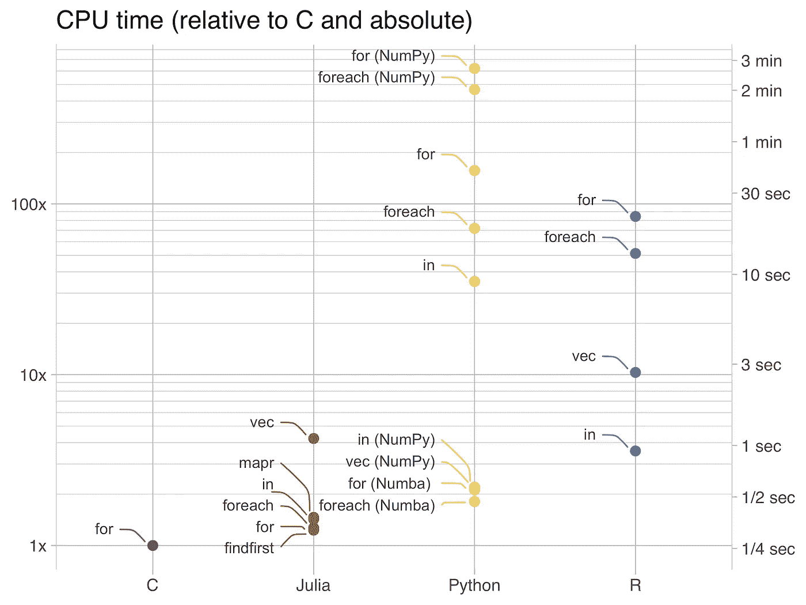

# r 对 Python 对 Julia

> 原文：<https://towardsdatascience.com/r-vs-python-vs-julia-90456a2bcbab?source=collection_archive---------0----------------------->

## 编写高效的代码有多容易？


澳大利亚八月在 [Unsplash](https://unsplash.com/?utm_source=unsplash&utm_medium=referral&utm_content=creditCopyText) 拍摄的照片

*TL；DR:直接跳到整体对比部分*

如果你是一名数据科学家，你很有可能用 Python 或 r 编程。但是现在有一个叫 Julia 的新人，他承诺了类似 C 语言的性能，而不损害数据科学家编写代码和与数据交互的方式。

在我的上一篇文章 中，我将 R 与 Julia 进行了比较，展示了 Julia 如何为数据科学社区带来了令人耳目一新的编程思维。主要的收获是，有了 Julia，您不再需要向量化来提高性能。事实上，循环的良好使用可能会带来最佳的性能。

在这篇文章中，我将 Python 加入其中。数据科学家选择的语言有一句话要说。我们将解决一个非常简单的问题，其中内置实现可用，从头开始编写算法非常简单。目标是当我们需要编写高效的代码时，理解我们的选择。

# 通过线性搜索的成员测试

让我们考虑在一个未排序的整数向量上的成员测试问题。

```
**julia**> 10 ∈ [71,38,10,65,38]
true**julia**> 20 ∈ [71,38,10,65,38]
false
```

原则上，这个问题是通过线性搜索解决的。该算法遍历输入向量的元素，直到找到被搜索的值(成功搜索)或到达向量的末尾(不成功搜索)。目标是告诉一个给定的整数是否在向量中。

为了评估 R、Python 和 Julia 中的不同实现，我用 1 到 2.000.000 的 1.000.000 个唯一整数生成了一个[数据集](https://github.com/dcmoura/blogposts/raw/master/r_python_julia/vec.txt)，并对 1 到 1.000 的所有整数执行了 1.000 次搜索。搜索成功的概率约为 50%,因此该算法有一半的时间会扫描整个向量以得出搜索不成功的结论。在剩余的情况下，算法应该需要( *n+1)/2* 次评估(平均)来找到元素，其中 *n* 是向量的长度。

我通过取 3 次运行的 CPU 时间中位数来衡量每个实现的性能。关于运行实验的硬件和软件的更多信息可以在[这里](https://github.com/dcmoura/blogposts/blob/master/r_python_julia/README)找到。

*请注意，这些实验的目标不是对不同的语言和实现进行精确的基准测试。目标是强调当性能很重要时，语言给数据科学家带来的障碍。*

# 实施情况

我在 C 语言中实现了线性搜索，以掌握静态类型编译语言的性能，并设置基线。这个二进制可执行文件花费了 0.26 秒的 CPU 时间来执行 1000 次搜索。

# r 实施

我在 R 中尝试了不同风格的成员测试，从专门的操作符(`in`)到使用循环的类 C 实现，绕过了矢量化方法。

当我们从`in_search`转移到`for_search`时，我们对算法有了更好的控制。然而，随着控制的增加，r 中的性能会下降。使用矢量化运算比遍历元素直到找到匹配项要快一个数量级，如在`vec_search`中，矢量化运算执行全数组扫描。就像我之前的文章一样，尽管需要更多的内存和(多余的)操作，矢量化还是取得了成功。不出所料，专门的操作符`in`具有最高的性能和更干净的代码。

我也尝试了 Map-Reduce 操作，但没有耐心等到它们完成…如果你追求性能，这不是一个选项。

# Python 实现

老实说，最初的目标是只使用原生函数和原生数据结构，但是在使用 Python 的原生列表时，`in`操作符比 R 慢了大约 10 倍。因此，我还包括了 NumPy 数组的结果(它为 Python 带来了矢量化的操作)。CPU 时间从 9.13 秒到 0.57 秒，大约是基线的 2 倍。然而，当转向循环方法时，原生列表领先了一个数量级…我给了 NumPy 第二次机会，在 Numba 包中添加了 JIT 编译。Numba 有一些限制，但使用起来很简单:你只需要包含 Numba 包，并标记你想看到编译后 JIT 的函数(并仔细阅读手册)。带有 NumPy 加 Numba 的循环提供了与矢量化/专门化操作相当(或更好)的性能，但是实现这一点并不容易，因为其中有几个陷阱。说到陷阱，用 Numba 在原生列表上执行循环是令人失望的…再次，我停止了执行，因为它花了超过 5 分钟才完成。

# Julia 实现

在 Julia 中，我加入了更多的风格来展示本地可用功能的多样性和性能。

除了向量化操作之外，性能非常接近 C 中的实现，性能下降了 20%-50%。矢量化的性能相当不错，大约是 4 倍 C 的 CPU 时间，但在矢量化操作上也是 2 倍 NumPy 的 CPU 时间。你得到的自由是难以置信的，因为你可以在 Julia 中编写几乎任何算法！为了在 For 循环上获得最佳性能，我使用提示告诉编译器不要检查索引是否在数组的范围内(`inbounds`宏)，并告诉编译器它在执行迭代的顺序上有额外的自由(`simd`宏)。如果您想知道，不提供这些提示会使循环的性能接近于`in_search`。

# 总体比较



(使用 ggplot2 和 ggrepel 在 R 中绘制的图)

看看这个简单问题的并列结果，我们发现:

*   Julia 的性能在实现上几乎独立地接近 C；
*   Julia 中的例外是在编写类似 R 的矢量化代码时，性能下降了大约 3 倍；
*   当将 JIT 编译(Numba)添加到 Python 时，基于循环的实现接近了 Julia 的性能；尽管如此，Numba 对您的 Python 代码施加了约束，使得这个选项成为一种折衷；
*   在 Python 中，在原生列表和 NumPy 数组之间做出选择，以及何时使用 Numba:对于经验较少的人来说，哪一个是最好的数据结构(性能方面)并不明显，也没有明确的赢家(特别是如果您包括动态添加元素的用例，这里不涉及)；
*   R 不是最快的，但是你得到了与 Python 相比一致的行为:R 中最慢的实现比最快的慢了~ 24 倍，而 Python 中是~343 倍(Julia 中是~ 3 倍)；
*   原生 R 总是比原生 Python 表现更好；
*   每当在 Python 或 R 中无法避免循环时，基于元素的循环比基于索引的循环更有效。

# 细节很重要…

我可以在这里停止这篇文章，写用 Julia 写高效的代码是多么的无缝。尽管如此，细节很重要，程序员需要注意 Julia 的内部结构。你能猜出最影响性能的[代码](https://github.com/dcmoura/blogposts/blob/master/r_python_julia/linear_search.jl)是哪一行吗？这里有一个提示:你将不会在之前展示的任何片段中找到它…

这是:

```
map(line -> parse(Int, line), eachline(f))
```

这行代码解析输入文本文件 *f* ，每行包含一个数字(注意，读取文件不是基准的一部分)。那么，这一行代码有什么特别之处呢？简而言之，朱莉娅推断:

*   匿名函数(`map`的第一个参数)返回的元素类型(始终)是整数；
*   因此，映射的输出是一个整数数组。

因为 Julia 知道存储的是一个整数数组，所以它分配了一个连续的内存块，其中每一项都包含一个整数。这允许高效的读取操作。

怎么才能搞砸呢？这里有一种方法:

```
a = []
for line in eachline(f)
    push!(a, parse(Int, line))
end
```

好像差不多吧？然而:

```
> typeof(a)
Array{Any,1}
```

语句`a = []` *，*虽然看起来很方便，但它创建了一个`Any`数组，这意味着您可以在数组的每个元素上存储任何类型的数据。在内部，Julia 在内存中存储了一个指针数组，以配合`Any`提供的灵活性。因此，在处理数组时，Julia 无法再处理连续的内存块。对性能有什么影响？大约慢 50 到 100 倍！

修复这段代码相当简单:`a = Int[]`(而不是`a = []`)会完成这项工作，因为它指定了元素的类型。

# 结果

在本文涉及的所有语言中，Julia 显然是最容易编写高效代码的。尽管如此，你需要知道你在做什么。幸运的是，[性能提示](https://docs.julialang.org/en/v1/manual/performance-tips/)可以让你走上正轨。

编码快乐！

我经常使用这三种语言，而且我都很喜欢。每个人都有自己的位置。

**代码可在**[github.com/dcmoura/blogposts](https://github.com/dcmoura/blogposts)获得

你可以在 [Tweeter](https://twitter.com/daniel_c_moura) 、 [LinkedIn](https://www.linkedin.com/in/dmoura/) 和 [Vimeo](https://vimeo.com/danielcmoura) ( **查看我的数据 vizs！**)

如果你喜欢这篇文章，你可能也会喜欢 [**把数据科学家从矢量化的魔咒中解放出来**](/freeing-the-data-scientist-mind-from-the-curse-of-vectorization-11634c370107)