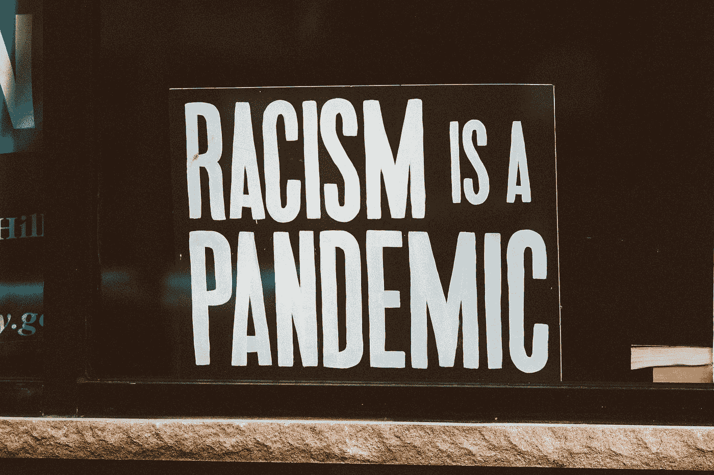
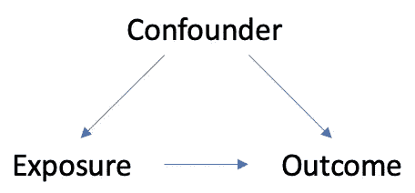

# 健康数据科学中的种族和民族

> 原文：<https://towardsdatascience.com/race-and-ethnicity-in-data-science-138acf1c23b4?source=collection_archive---------34----------------------->

## [公平与偏见](https://towardsdatascience.com/tagged/fairness-and-bias)、[业内笔记](https://towardsdatascience.com/tagged/notes-from-industry)

## 为什么它很重要，以及我们应该如何对待它



照片由[乔恩·泰森](https://unsplash.com/@jontyson?utm_source=medium&utm_medium=referral)在 [Unsplash](https://unsplash.com?utm_source=medium&utm_medium=referral) 拍摄

不可否认，考虑种族或民族(缩写为 R/E；在本文中用作单数名词，尽管本文中的陈述将统称为种族和民族)在定量研究医疗保健结果中是重要的。去问任何一位受人尊敬的统计学家/流行病学家/数据科学家，他们至少会告诉你这么多！我认为，虽然对 R/E 重要性的理解无处不在，但我们总是可以努力建立一个更强大的基础词汇，来解释为什么重要。我想写一篇文章，旨在从(相当成熟的)关于建模中的 R/E 的文献中总结结论。具体来说，我想在解释性和预测性的上下文中简要介绍一下 R/E(要了解更多关于这种差异的信息，请查看我以前的文章[中关于这个主题的内容！).](/i-built-a-predictive-model-is-b-s-a905077fe4)

下面是这篇文章的大纲。虽然我是根据我个人对 R/E (1)的理解程度来排列主题的。这个变量**代表什么** 2。我们如何**记录**这个变量的**测量值** 3。为什么这个变量**重要** 4。我们如何对这个变量做出**统计结论**)，请随意跳到你最感兴趣的话题！

*   关于种族和民族差异的几点说明
*   在模型中编码 R/E
*   关于预测模型中的 R/E 要知道的事情
*   在解释(因果)模型中解释 R/E
*   摘要

# 种族和民族之间的差异

一个被广泛接受的关于种族和民族的区别是，种族指的是身体特征的集合(被认为是),而民族包含了一个人身份的社会文化成分。这里有一个简单的例子来描述这两者:

> 一个女孩出生在中国，父母是中国人，但在婴儿时期，她被意大利的一个意大利家庭收养。在种族上，她从小就感觉自己是意大利人:她吃意大利菜，她说意大利语，她了解意大利的历史和文化。她对中国的历史和文化一无所知。但是当她来到美国，她被当作亚洲人来对待。

ThoughtCo 的一篇文章更详细地描述了这种差异，但我想让你注意的一点是，当我们考虑 R/E 时，无论是在我们的样本人群、目标人群中，还是在我们建立的任何模型中的协变量中，我们都必须确切地知道我们在处理什么。否则，例如，在一个模型中包括种族，然后在未考虑种族时解释或应用该模型可能会导致有偏见、不准确或不完整的结论。种族和族裔作为单独的数据变量被收集是很常见的，因此理解这种差异是每个人为了更好地理解他们的数据而可以采取的一个基本步骤。关于模型中 R/E 的*含义*的更详细讨论将在下面的“解释性模型中的 R/E”中讨论。

# 编码 R/E

种族和民族是所谓的*名义分类*变量。这意味着类别没有固有的顺序，不像*冷、暖、热*那样有基于温度的固有顺序。有许多不同的方法来编码分类变量(加州大学洛杉矶分校 IDRE 分校有一个[不错的列表](https://stats.idre.ucla.edu/spss/faq/coding-systems-for-categorical-variables-in-regression-analysis-2/)，但是两种常见的方法是**简单**和**虚拟**编码。

在 R 中，可以用下面的方式对这个变量进行简单编码:

```
# simple encoding
# A tibble: 4 x 3
  personid desired_encoding race    
     <dbl>            <dbl> <chr>   
1        1                1 white   
2        2                2 black   
3        3                3 asian   
4        4                4 hispanicdf$race <- factor(df$race, levels = c("white", "black", "asian", "hispanic")
```

您可以在其中明确指定比赛的级别。在这种编码中，您从回归模型中获得的任何估计值都将反映某个种族的因变量(如血压)的平均值与白人的平均值的比较，因为白人被指定为参考水平。

或者，您可以像这样对此变量进行伪编码:

```
# A tibble: 4 x 5
  personid is_white is_black is_asian is_hispanic
     <dbl>    <dbl>    <dbl>    <dbl>       <dbl>
1        1        1        0        0           0
2        2        0        1        0           0
3        3        0        0        1           0
4        4        0        0        0           1
```

这些估计值将有所不同，因为它们现在反映了不同的比较(即，`is_black`比较黑人与非黑人的预期因变量)。你应该选择一个能为你的目标带来最有意义的比较的编码系统。

要避免的一个陷阱是:不要使用 R/E 作为连续变量！换句话说，在简单编码系统中，**确保它被模型**理解为一个因子变量。否则，它将生成 R/E 的估计值，假设 race 中的*线性*关系，这是无意义的。

此外，了解数据中的 R/E 是复杂的也是有用的，因此本文不会深入讨论如何处理交叉的或更具体的 R/E 标识。

# 预测模型中的 R/E

在预测建模中考虑 R/E 可能有许多微妙的方式，但在这一节中，我将重点关注“非 R/E 代表”数据集中潜在偏差的类型以及围绕 R/E 作为预测变量的争议。

## 偏差的类型

多年来，预测算法中的种族偏见在新闻([谷歌“大猩猩”种族貌相事件](https://www.forbes.com/sites/mzhang/2015/07/01/google-photos-tags-two-african-americans-as-gorillas-through-facial-recognition-software/?sh=66abdf13713d))、书籍(例如[数学毁灭武器](https://www.amazon.com/Weapons-Math-Destruction-Increases-Inequality/dp/0553418815))和大量期刊文章中受到了大量关注。在医疗保健中，通常，算法的目标是产生告知健康需求的预测或测量(例如，预测疾病风险)。这一目标的关键是阐明该算法是针对谁的——预测 40-65 岁之间的美国男性的疾病风险？英国 18 岁以下儿童？如果我们不考虑世卫组织，我们就有产生偏见的风险。加州大学伯克利分校的医生研究员 Ziad Obermeyer 写了几篇文章和最近的[算法偏差剧本](https://www.chicagobooth.edu/research/center-for-applied-artificial-intelligence/research/algorithmic-bias/playbook)，描述了两种主要类型的偏差:**表示偏差**和**测量偏差。**

对于第一种类型， [Sjoding et。艾尔。](https://www.nejm.org/doi/full/10.1056/NEJMc2029240)提供了一个突出的例子，说明使用脉搏血氧饱和度测量来预测患者血氧水平的算法在黑人患者身上表现不佳，因为该算法主要是针对白人患者进行训练的。在这个例子中，R/E 是重要的，因为在理想的情况下，你将在一个有代表性的数据集上进行训练，以便做出公共卫生决策(关于为什么在其他情况下，一个没有代表性的研究不应该总是被立即丢弃的[切线](https://www.ncbi.nlm.nih.gov/pmc/articles/PMC3888189/))。如果数据不可用，那么至少，除了预测模型之外，还应该提出强烈而明确的警告。

对于第二种类型， [Obermeyer](https://science.sciencemag.org/content/366/6464/447) 描述了一个场景，从开始，模型中预测的变量可能*有偏差。例如，将医疗保健成本视为未来健康需求的代理变量(代理反映了我们在衡量某些方面的最佳尝试)。一个模型发现，黑人的医疗成本预计比白人低，因此一个天真的后续措施是将有针对性的政策努力集中在改善白人的健康结果上。然而，这一结果实际上来自于这样一个事实，即由于歧视和难以获得医疗保健，美国黑人的数据记录成本较低。*

## R/E 作为预测变量？

作为一个独立于反映与 R/E 相关的结构性不平等的数据的主题，我想提供一个 R/E 如何建模(或不建模)的简要概述。种族和族裔包括在一些流行的预后临床预测模型中，如心血管疾病的[合并队列方程](https://clincalc.com/Cardiology/ASCVD/PooledCohort.aspx)和 [NIH 乳腺癌风险评估工具](https://bcrisktool.cancer.gov/)。然而，您可能会惊讶地听到，包含 R/E 并不完全常见，事实上，只有 [3% (23/854)](https://www.ncbi.nlm.nih.gov/pmc/articles/PMC5558842/) 的心血管预测模型包含 R/E。在预测模型中包含 R/E 在文献中存在很大争议，我将尝试提供一个简短的论点总结。

反对将它包括在内的主要原因是，一些人声称它唤起了种族敏感决策中种族定性的主要因素。主要的观点是，医疗领域的种族貌相与执法或保险领域的种族貌相有着根本的不同。塔夫茨大学的研究员杰西卡·保卢斯认为，尽管在执法等领域，模型中的种族偏见会导致明确的惩罚和奖励，但在医疗保健领域的影响却不太清楚。低估和高估风险各有利弊，因此将 R/E 作为一个变量可以**提高预测的准确性**，从而(平均而言)改善临床决策。相比之下，预测模型没有考虑种族因素(所谓的“种族盲”)，这可能会降低所有 R/E 组(以及基于预测结果的决策)的准确性，尤其是那些在数据中代表性不足的组。

公平地说，R/E 是一个复杂的变量，虽然一些模型已经发现 R/E 的一些表现是一个*统计上显著的*预测器，但它的预测能力如何实际有效还有待观察，因为 R/E 是多么微妙和不稳定(在[这篇文章](https://www.ncbi.nlm.nih.gov/pmc/articles/PMC5558842/)中了解更多)。

# 解释性模型中的 R/E

在这一节中，我将简要介绍在因果语境中解释 R/E 的挑战。记住解释性模型的目标通常是建立因果机制。了解健康结果中的种族差异以改进有针对性的公共卫生政策和干预措施的目标由来已久。解释性模型通常用于理解与某些健康结果相关的种族差异的程度。[围绕这一主题的一篇开创性文章](https://www.ncbi.nlm.nih.gov/pmc/articles/PMC4125322/)讨论了如何深思熟虑地解释并将 R/E 作为一个变量包含在解释模型中，这篇文章来自哈佛大学教授 Tyler VanderWeele。

这是一个复杂的话题，就我个人而言，我建议在阅读本文之前，先了解一些因果推理的基础知识。

问题以下列常见方式出现:

> 你有一个结果要解释，并且你对 R/E 感兴趣作为你的主要曝光。你还记得从你的统计类调整混杂因素，所以你选择一些你觉得相关的变量。你建立模型，得出 R/E 的回归估计。

正是在这一点上，VanderWeele 建议你应该停下来，重新评估你迄今为止所做的事情。你如何解释回归估计？挑战在于，当你在模型中加入其他变量时，对 R/E 的解释将会改变(如果你真的想进入兔子洞，[这里有](https://www.ncbi.nlm.nih.gov/pmc/articles/PMC4276366/)一个全面但相对抽象的关于混杂因素含义的回顾)。基本上，下图说明了混杂因素的一些特征，因为它会影响暴露(如 R/E)和结果(如心血管风险)。



作者自己的形象

然而，如果目标是理解暴露如何导致结果背后的潜在因果机制，我们不得不质疑 R/E 真正包含了什么？是肤色的生物效应吗(比如深色皮肤可以抵御紫外线)？是因为对肤色的感知而产生的健康行为(比如医院里的歧视)？遗传背景？家庭社会经济地位？当我们想要对结果进行因果陈述时，我们想要控制尽可能多的变量(想想随机对照试验或科学实验)。然而，如果我们甚至不知道 R/E 效应的真正含义，将很难决定控制哪些变量以及如何解释 R/E。例如，VanderWeele 得出结论，对模型中 R/E 系数的一种可能解释是(在此转述):

> 如果您设置了 R/E 捕获的所有可想象方面的分布(即，身体表型、遗传学、SES 等),观察到的健康差异会发生什么？)表示一个 R/E 组等于另一个 R/E 组。

底线是在解释性模型中包含 R/E 不是一项简单的任务，您应该公开质疑您看到这种情况发生的地方。

# 总结和结论

建模中的 R/E 是一个复杂的话题，有很多讨论。许多杰出的专家都发表了自己的观点，至少，倾听这场对话让我个人成为了一名更有思想、更有知识的数据科学家和流行病学家。我将用一系列问题来结束本文，当您发现自己在自己的数据中处理 R/E 时，可以随时问自己一个问题。

*   我可以向某人解释种族和民族的区别吗？
*   我的数据中的 R/E 是如何编码的？编码符合我的研究问题吗？
*   这个预测模型对谁有效？
*   这个模型中是否有任何变量可能会受到历史或系统的种族偏见的影响？
*   在这个解释模型中，R/E 是如何解释的？有意义吗？