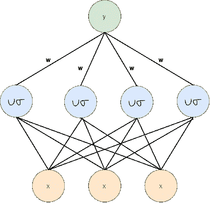
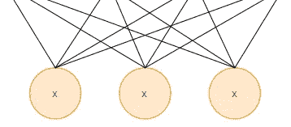
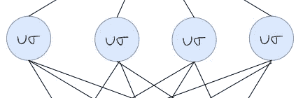
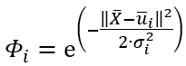
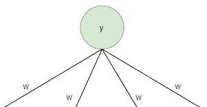
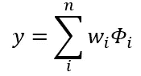

# 简化的径向基函数神经网络

> 原文：<https://towardsdatascience.com/radial-basis-function-neural-network-simplified-6f26e3d5e04d?source=collection_archive---------1----------------------->

## 深度学习

## 径向基函数神经网络简介

[Zoltan·塔斯](https://unsplash.com/@zoltantasi?utm_source=medium&utm_medium=referral)在 [Unsplash](https://unsplash.com?utm_source=medium&utm_medium=referral) 上的照片

R **径向基函数(RBF)网络**的架构与大多数神经网络架构完全不同。大多数神经网络结构由许多层组成，并通过重复应用非线性激活函数来引入非线性。另一方面，RBF 网络仅由一个输入层、一个隐藏层和一个输出层组成。

作者图片

输入层不是计算层，它只是接收输入数据并将其输入到 RBF 网络的特殊隐藏层。隐藏层内部发生的计算与大多数神经网络非常不同，这就是 RBF 网络的强大之处。输出层执行预测任务，如分类或回归。

## 输入层

输入层只是将数据提供给隐藏层。

作者图片

因此，输入层中神经元的数量应该等于数据的维数。在输入层中，不执行任何计算，这与标准人工神经网络的情况不同。输入神经元完全连接到隐藏神经元，并向前馈送它们的输入。

## 隐蔽层

隐藏层接受模式可能不可线性分离的输入，并将其转换到更可线性分离的新空间。隐藏层比输入层具有更高的维数，因为不可线性分离的模式通常需要被变换到更高维的空间中，以便更可线性分离。这是基于 **Cover 关于模式可分性的定理**，该定理指出，通过非线性变换转换到更高维空间的模式更可能是线性可分的，因此隐藏层中的神经元数量应该大于输入神经元的数量。也就是说，隐藏层中神经元的数量应该小于或等于训练集中样本的数量。当隐层神经元的数量等于训练集中样本的数量时，可以认为模型大致等价于核回归、核支持向量机等**核学习器**。

隐藏层中的计算基于与原型向量的比较，原型向量是来自训练集的向量。

作者图片

隐藏层中的每个神经元都有一个原型向量和一个带宽，分别用μ和σ表示。每个神经元计算输入向量与其原型向量之间的相似性。隐藏层中的计算可以数学地写成如下:

作者图片

使用:

*   x 条作为输入向量
*   μ bar 作为 iᵗʰ神经元的原型向量
*   σ为 iᵗʰ神经元的带宽
*   φ为 iᵗʰ神经元的输出

参数μ bar 和σ以无监督的方式学习，例如使用某种聚类算法。

## 输出层

输出层对分类或回归任务使用线性激活函数。

作者图片

输出层中的计算就像标准的人工神经网络一样执行，它是输入向量和权重向量之间的线性组合。输出层中的计算可以数学地写成如下:

作者图片

使用:

*   wᵢ作为重量连接
*   φ作为 iᵗʰ神经元从隐藏层的输出
*   y 作为预测结果

得到的预测可用于分类或回归任务，这取决于目标和损失函数。参数 w 以监督的方式学习，例如梯度下降。

虽然 RBF 的输出层可以作为最终输出，但是也可以将 RBF 网络与其他网络进行堆叠，比如我们可以用多层感知代替 RBF 网络的输出层，对网络进行端到端的训练。

## 结论

RBF 网络只包含一个单独的隐藏层，它有自己计算输出的方法。RBF 网络是基于覆盖定理，它利用其隐含层将数据投射到一个更高维的空间，因此隐含层的神经元数目应该大于输入层的神经元数目。输出层使用线性激活函数，或者可以认为没有任何激活函数。

## 参考

<https://www.amazon.com/Neural-Networks-Deep-Learning-Textbook/dp/3319944622>  <http://vlabs.iitb.ac.in/vlabs-dev/labs_local/machine_learning/labs/exp3/theory.php>  <https://www.sciencedirect.com/topics/engineering/radial-basis-function-network>  <https://en.wikipedia.org/wiki/Radial_basis_function_network> 