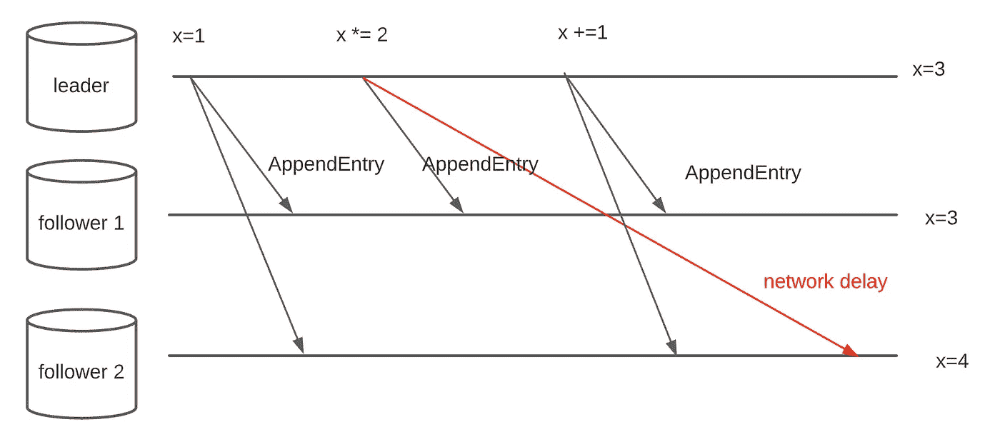
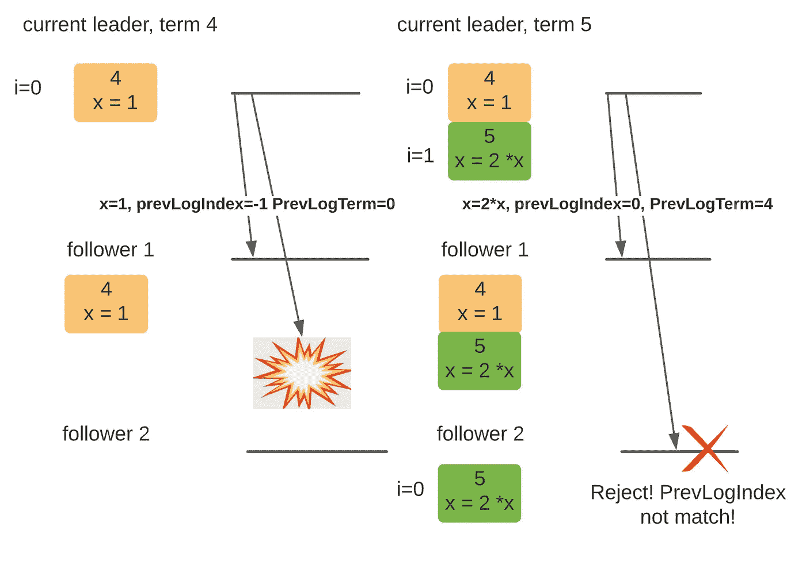
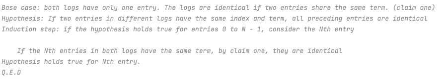
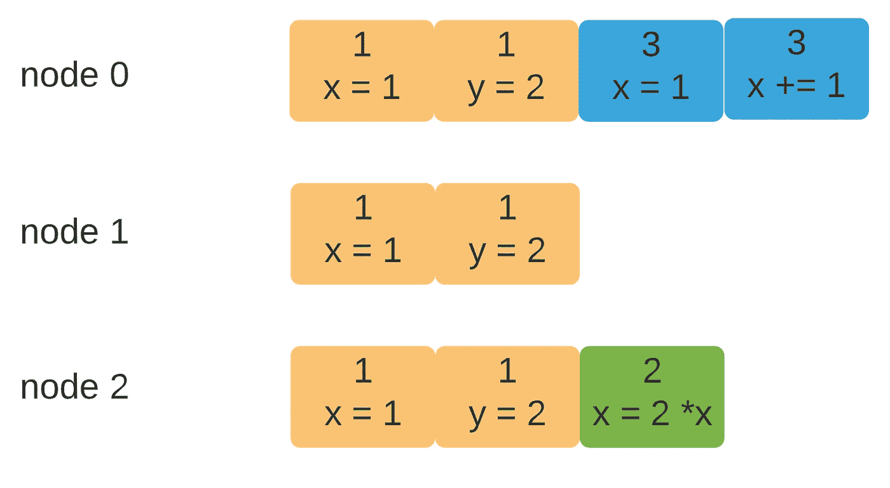
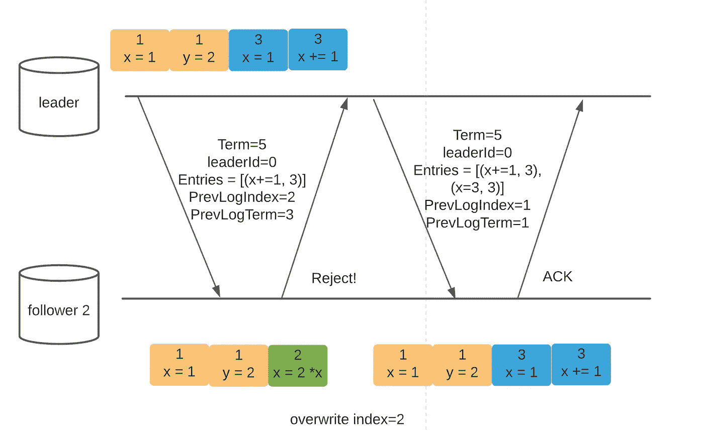
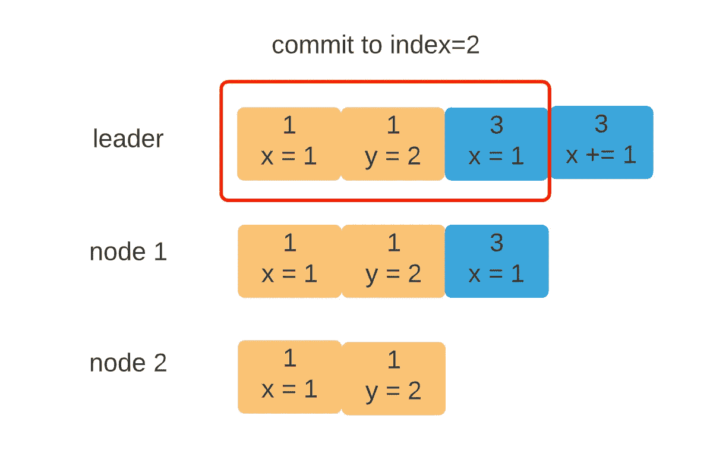

# Raft 算法讲解 2

> 原文：<https://towardsdatascience.com/raft-algorithm-explained-2-30db4790cdef?source=collection_archive---------14----------------------->

## 第 2 部分—日志复制

## 介绍

Raft 是一种共识算法，用于以分布式方式编排副本。Raft 的设计考虑到了可理解性，它只有几个可移动的部分，很容易实现。在[上一篇文章](/raft-algorithm-explained-a7c856529f40)中，我讲了 Raft 的基础知识，解释了 leader-election 机制。在这篇文章中，我们将关注另一个重要的问题——日志复制。

## 基本原则

Raft 本质上是一堆复制的状态机。每当领导者节点接收到请求时，该请求都会被附加到日志中以获得持久性。相同的日志被复制到多台机器上以实现冗余。


图 0。木筏日志，作者图

例如，在图 1 中，当前领导者的日志中有四个条目。跟随者 1 完全同步，但跟随者 2 缺少最新条目。如果你不明白图 0 中的**术语**是什么，可以看看我之前的文章。

**用于日志复制的 RPC**

为了便于理解，Raft 只对所有通信使用两个 RPC 调用:

这个 RPC 由领导者发起，并携带最新接收到的命令。它也用作心跳消息。当一个追随者收到这个消息，选举计时器被重置。 **AppendEntry** 消息是这样的结构(我在这里使用 Golang)

如果你不明白每个字段的意思也没关系。我们将逐一检查它们。

**RequestVote** :此 RPC 用于领袖选举，由最后一个帖子覆盖。我将跳过它，因为我们只关心日志复制。

## 日志复制详细信息

让我们从一个普通的日志复制算法开始。每当领导者收到请求时，它会将日志条目转发给所有追随者，并等待大多数人的确认。

**问题 1:日志排序**

普通算法在跟随者一到达就向他们发送消息。为此，它只需要消息中的两个字段— **leaderID** 和 **Entry** 。一个主要问题是，由于潜在的消息延迟，日志顺序无法保留。考虑图 1 中的场景。



图一。日志排序问题，按作者分类

Raft 使用两个附加字段来确保日志的完整性— **PrevLogIndex** 和 **PrevLogTerm** 。当发出一个新条目时，领导也发出之前条目的索引和术语号。在将新请求附加到其本地日志之前，接收方确保其最新条目具有相同的索引和术语。



图二。**附录条目**附加簿记，作者提供的数字

有了这两个额外的参数，我们可以实现一些了不起的东西:

1.  给定日志的索引，如果来自两个日志(在两个不同的机器上)的条目共享同一个术语，则它们是**相同的**
2.  如果不同日志中的两个条目具有相同的索引和术语，**前面的所有**条目都是相同的

第一个性质很容易证明。假设索赔是错误的。如果存在两个具有相同术语的不同条目，其中一个条目必须比另一个条目更晚被领导收到。由于日志是只追加的，其中一个条目将有一个更大的 **PrevLogIndex** 。但是，如果它们出现在两个不同日志的同一个索引中，它们必须有相同的 **PrevLogIndex。**(否则接收方拒收)矛盾！！

第二个主张可以用归纳法来证明:



图 3。权利要求 2 的归纳证明，图由作者提供

这两个保证一起构成了 Raft 的**日志匹配属性**。

**问题 2:条目冲突的关注者**

如果领导者日志是群集中唯一的权威，它将覆盖追随者的任何冲突。有可能丢失一些日志条目吗？考虑以下情况:



图 4。日志冲突，按作者分类

在深入研究这个问题之前，我想让你相信上述场景确实会发生。索引 2 之前的日志是同步的。从那以后，可能会发生以下情况来创建这些日志:

```
1) node 2 becomes the leader (votes from itself, 1 and 0) with term 22) node 2 receives a request from the client but failed to sync with other nodes
3) node 0 becomes the leader (vote from 1 and itself) with term 3
4) node 0 receives requests from the client. but failed to sync
```

现在，如果节点 0 恢复与节点 2 的联系，它将尝试复制其日志，如图 5 所示



图五。覆盖冲突，按作者分类

如您所见，绿色条目确实被删除了。就目前的设计而言，这个问题是不可避免的。然而，这里的一个关键观察是绿色条目没有在大多数节点(至少两个节点)上复制。如果是，它将永远不会被删除，原因如下:

1.  如果一个条目在多数节点上被复制，那么至少有 N/2 + 1 个节点拥有它
2.  对于没有赢得选举的条目的节点，它需要来自其他节点的 N/2 张选票(候选人总是为自己投票)
3.  由于候选人没有条目，有条目的 N/2 + 1 节点不会投票给它(第 1 部分解释了选举限制)
4.  它不会获得足够的选票来赢得选举

这是 Raft 的第二个关键特性— **日志完整性属性**。如果一个条目在多数节点上**被复制，它将总是出现在未来的 leader 日志中，不管它可能是哪个节点。如果没有在大多数人身上复制，那么如果领导层发生变化，一个条目可能会被删除。**

有了日志完整性属性，在大多数人拥有它之前不要确认客户机请求是很重要的。

**问题 3:何时提交？**

最后，我们到达最后一个问题——何时提交条目？首先，什么是提交，为什么提交？Raft 是一种低级的一致性算法，由键值存储等高级应用程序使用(例如 ZooKeeper)。当 Raft 安全地复制一个条目时，我们希望确保客户机可以通过应用程序看到它。因此，Raft 需要决定何时告诉上层应用程序一个条目已经准备好可以使用了(一个部分复制的条目，因为 leader 日志中的最后一个条目应该是不可见的！).



图六。提交，按作者列出的数字

到目前为止，我们的普通算法没有携带任何关于提交索引的信息。因为数据流是单行道，从领导者流向追随者，节点不知道一个条目是否在大多数节点上复制。

为了解决这个问题，我们可以向 **AppendEntry** 消息添加另一个字段，称为 **LeaderCommit。**如果多数人收到一个条目，则领导者增加提交指数。下面是跟踪 leader 节点使用的提交索引的实际代码。

领导者如何跟踪提交索引

## 摘要

在本文中，我们从一个普通的日志复制算法(广播条目，无需任何额外的簿记)开始，并通过考虑各种极端情况，将其发展为成熟的版本。日志复制中最重要的 RPC 是 **AppendEntry** RPC，它使用一个具有四个字段的结构:

*   **Term** :对于日志复制和领袖选举非常重要
*   **LeaderId** :显示候选人的身份。
*   **条目**:领导者希望复制的条目列表。
*   **PrevLogIndex** :正好在**条目[0]** 之前的日志条目的索引。用于确保**日志完整性和日志匹配属性**
*   **PrevLogTerm** :紧接在**条目【0】**之前的日志条目的期限。用于确保**日志完整性和日志匹配属性**
*   **LeaderCommit** :对上层应用很重要。只有提交的条目才能应用于应用程序，并且对客户端可见。