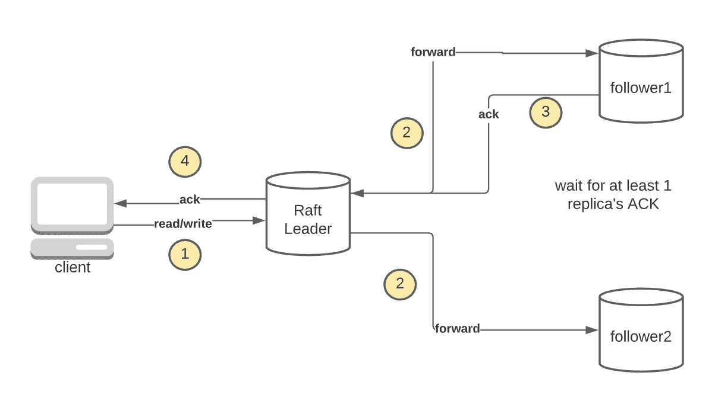
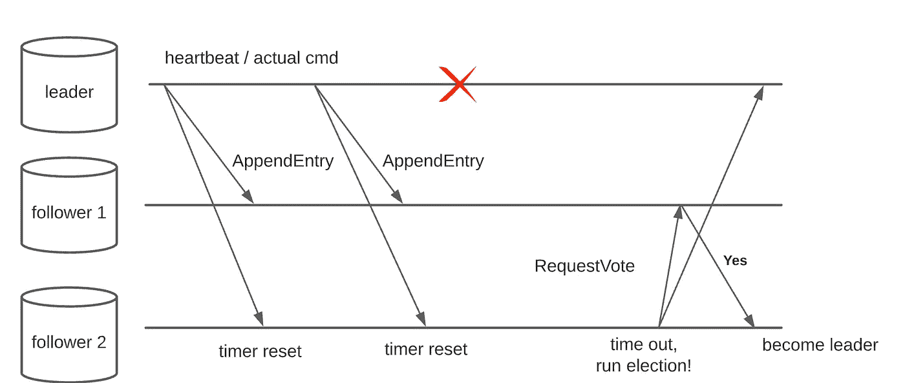
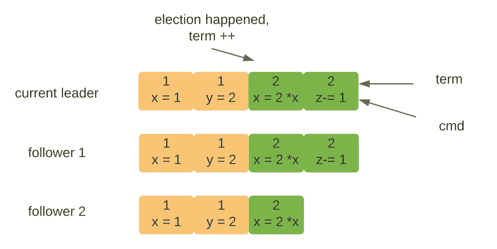
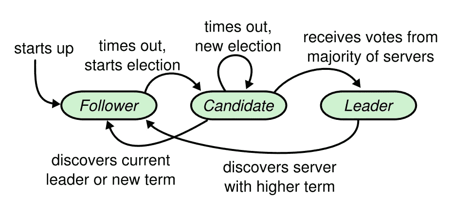
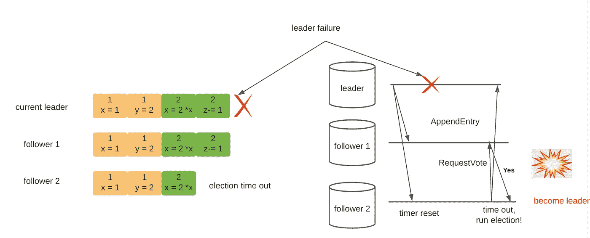

# Raft 算法，已解释

> 原文：<https://towardsdatascience.com/raft-algorithm-explained-a7c856529f40?source=collection_archive---------6----------------------->

## 第 1 部分—领导人选举

## 介绍

Raft 是一种共识算法，用于以分布式方式编排副本。Raft 的设计考虑到了可理解性，它只有几个可移动的部分，很容易实现。在本文中，我们将探讨 Raft 的基本组件以及它的领导者选举机制。

## 基本原则

**数据流**

在最高级别上，Raft 基于具有半异步复制策略的单领导架构。要了解更多关于单领导复制的信息，您可以查看[这篇文章](/database-replication-explained-5c76a200d8f3)。顾名思义，所有的写/读请求都要经过一个领导者，这个领导者再将请求传播给追随者。它等待多数并向客户机返回 ACK(图 1)

图一。木筏数据流，作者图

附带说明一下，Raft 是可线性化的(强一致性),因为它由同一个 leader 处理所有读/写操作。

**故障转移**

领导者显然是系统中的单点故障，必须实施节点故障转移以确保可用性。在 Raft 中，这种故障转移被称为领导者选举，我们将在后面详细讨论。总的想法是，当领导者活着且可联系时，它每隔 100 毫秒(可配置)向所有追随者发送心跳消息。当领导者不可达时(死亡或网络中断)，一些追随者将向同伴发出消息并呼吁选举。

图二。领导人选举，按作者分列

**RPC 定义**

根据上面的描述，Raft 服务器之间似乎有许多类型的消息——广播命令、心跳、运行选举、提交日志等。然而，Raft 被精心设计，它只使用了**两个**RPC:

**AppendEntry** :这个 RPC 由领导者发起，携带最新接收到的命令。它也用作心跳消息。当一个追随者收到这个消息，选举计时器被重置。 **AppendEntry** 消息是这样的结构(我在这里使用 Golang)

**RequestVote** :当一个跟随者的选举定时器到时(长时间没有收到 AppendEntry，~300ms)，它成为候选人，并调用其他所有节点为自己投票。其他人可以同意或拒绝投票。一旦大多数人同意，候选人就成为领导者。其他候选人回归追随者。

如果你现在看不到每个字段的用途，那也没关系，但是请记住，对于一个正在工作的 Raft 服务器来说，这是你所需要的。这篇文章聚焦于领导人选举，这意味着我们将更详细地研究的请求。

**日志**

Raft 将来自客户端的命令存储在一个只附加的日志中(保存在磁盘上)。每当接收到一个新命令时(例如，set key = val)，就会将它和当前的术语编号一起添加到日志中(稍后解释)。

图五。木筏日志，作者图

领导者日志是集群中的唯一权威。如果一个跟随者的日志和领导者的日志有冲突，矛盾会被领导者覆盖。

## 选举详情

在分布式环境中，有许多可能的场景，其中领导者与其他节点失去联系。可能服务器死了；也许它的信息丢失了。与其分析 Raft 在每种情况下是如何工作的，不如让我们把自己放到一个追随者节点的角度。

**选举伪代码**

作为跟随者，节点保持一个选举计时器。如果在给定的时间内 rf.hearbeatEvent 通道中没有可用的消息，节点转换为候选节点并广播 **RequestVote。**[select case](https://gobyexample.com/select)文法是一个 Golang 特性，它阻塞线程，直到通道中有新消息可用。

**问题 1 —多重选举**

在没有任何选举协调的情况下，没有什么可以阻止 Raft 节点运行多个选举。由于每个节点都为自己投票(通过设计)，因此可能没有一个选举能够获得多数票。在没有任何共识的情况下，节点陷入了一次又一次没有领袖的选举循环中。

为了避免并发选举，Raft 尝试了一个简单的解决方案——随机化超时，如图 6 所示。有人可能会说随机化不能解决问题，我同意。这里的关键思想是随机化降低了选举冲突的概率。如果发生分裂投票，我们可以简单地重试，很有可能在下一轮完成。

**问题 2 —多个领导**

多个领导者甚至可以存在于一个严格多数票的 Raft 集群中吗？答案既是肯定的，也是否定的。如果一个领导者(L1)与所有其他节点断开，追随者将进行新的选举，最终选出一个新的领导者(L2)。对 L1 来说，由于它没有办法探测到 L2 的存在，它仍然充当着领导者的角色。所以，是的，Raft 中可以有多个领导者。

但是，如果您还记得复制策略—当大多数副本回复 **AppendEntry** 调用时的半异步和 ACK。如果 L1 无法达到多数，它将无法处理任何写请求。所以，从当事人的角度来看，L1 就像死了一样。所以不，只有一个领导人(L2)可以在服务。

**问题 3 —老领导重新加入集群**

现在，如果网络是固定的，而 L1 突然可以到达所有节点，那会怎么样呢？它对 L2 政府会有什么反应？这就是 **AppendEntry** 和 **RequestVote** 中的 **Term** 字段发挥作用的地方。

每个节点都有一个**术语**号，并用它标记所有发出的消息。每当接收到消息时，节点将发送方的**术语**号与其自身的进行比较。如果滞后，接收方自动更新其**术语**。

当进行新的选举时，候选人将**任期**数增加 1。更新的术语将被传播到投票给 L2 的所有节点，这些节点保证是大多数。现在，如果 L1 重新加入这个组织，它会发现自己的任期更短了——是时候下台了。

图 8。状态转换，从原来的[筏纸](https://raft.github.io/)、

**问题 4 —落后的候选人**

到目前为止，我已经忽略了选举的一个关键部分——日志健全性检查。在 Raft 中，投票是以先到先得的方式进行的。但是，这个简单的逻辑并不能阻止日志过期的节点成为领导者。考虑图 9 中的场景，其中过时的追随者 2 成为第一个要求选举的人。

图九。当前投票逻辑的问题，按作者分类

如果投票是先到先得，那么跟随者 1 将投票给跟随者 2。记得领队日志是 Raft 的唯一权威吗？如果跟随者 2 成为领导者，最后一个条目(z-=1)将被丢弃！

为了解决这个问题，Raft 实施了额外的选举限制，以确保只有更新日志的候选人才能参加选举。

1.  如果候选人的任期数较低，则拒绝投票(它肯定错过了一些选举)
2.  如果候选人的日志没有更新，拒绝投票，如下所示。

由于选举限制，图 9 中的跟随者 2 将不会获得跟随者 1 的投票，因为其日志虽然具有相同的 LastTerm，但比跟随者 1 的日志短。第一次选举后发生的情况是没有领导者被选举，跟随者 1 将最终超时并赢得选举(跟随者 1 将投票给它，因为所有标准都满足)。

## 摘要

在本文中，我们从一个普通的选举逻辑(先来先服务)开始，并通过考虑各种极端情况，将其发展为成熟的版本。领导者选举中最重要的 RPC 是 **RequestVote** RPC，它使用一个具有四个字段的结构:

*   **Term** :对陈旧领导检测非常重要。没有它，老领导就无法优雅地下台。
*   **CandidateId** :显示候选人的身份。
*   **LastLogIndex** :候选人日志的长度，用于实施选举限制。如果候选人的日志很短，就不会赢得选举。
*   **LastLogTerm** :最后一个日志条目的期限，用于选举限制。如果任期低，就不会赢得选举。

在[的下一篇文章](/raft-algorithm-explained-2-30db4790cdef)中，我们将探讨 Raft 如何在领导层变动时保持复制日志的完整和同步。