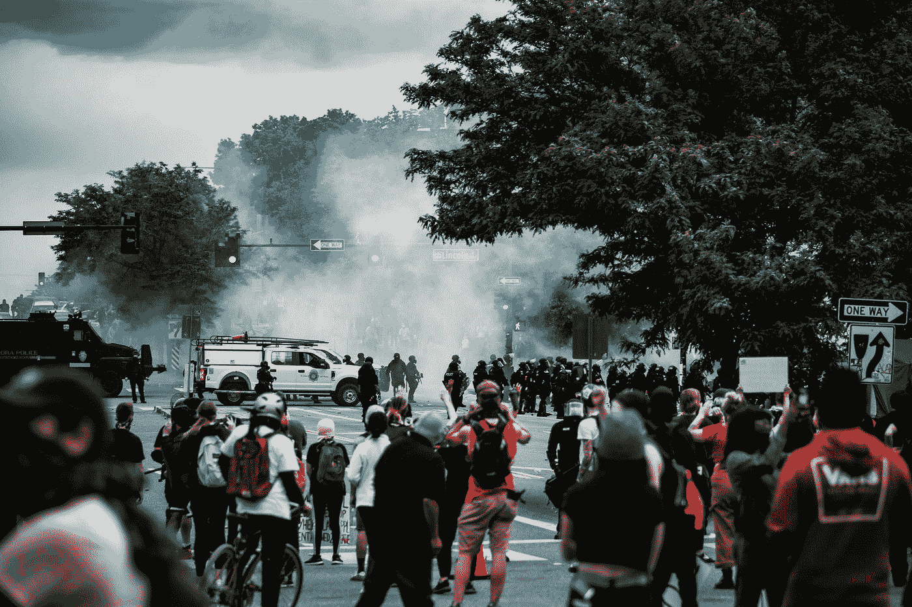
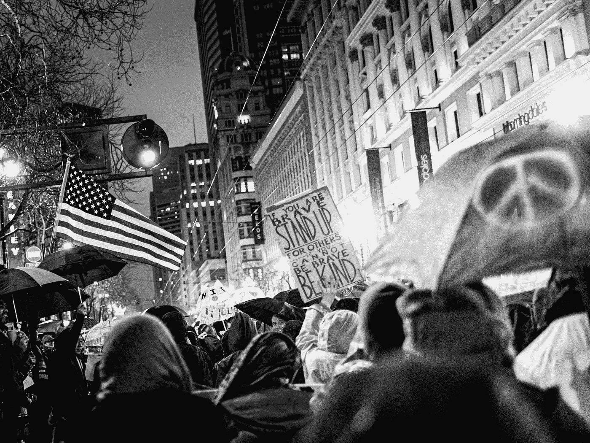

# 暴力反抗机器:贝叶斯定理和抗议的本质

> 原文：<https://towardsdatascience.com/rage-against-the-machine-bayes-theorem-and-the-nature-of-protest-4d7e12e297ee?source=collection_archive---------36----------------------->



科林·劳埃德在 [Unsplash](https://unsplash.com?utm_source=medium&utm_medium=referral) 上的照片

剥夺和平抗议权利的法律正在席卷美国各地的立法机构。传统上，宪法学者将这类政策视为言论自由和公共安全之间的平衡测试。认为前者在此时此刻威胁着后者，是否有实证依据？这就是这篇文章的内容。

今年春天，在通过了全国最严格的法案之一后，佛罗里达州州长自豪地庆祝了“全国最强的反暴乱、支持执法的措施”。

> “如果你闹事，如果你抢劫，如果你伤害他人，特别是如果你在这些暴力集会中伤害了执法人员，你就会进监狱。”州长罗恩·德桑蒂斯

我不认为这有争议。然而，隐含的前提——暴力抗议如此普遍，以至于有必要进行有力的谴责——似乎并没有在数据中得到反映。

艾丽卡·切诺维特博士是美国非暴力抗议运动的主要学者之一。她的研究团队维护着一个关于美国抗议活动的[公开数据集](https://github.com/nonviolent-action-lab/crowd-counting-consortium)，我将在这里使用它。他们承认数据是不完美和不完整的——但我认为它对我们的分析很有用。我们将使用贝叶斯定理来形成我们自己的比例感。

但是，为什么是贝叶斯定理呢？我相信贝叶斯为这个问题提供了一个很好的工具，因为它以一种频率主义模型所不具备的方式保留了不确定性。与只能产生狭窄范围的输出的机械过程不同，贝叶斯提供了灵活性，以适应与我们自然处理问题的方式不相似的“完整画面”。

如果我明天去抗议，我不知道会发生什么。我接受这种不确定性——但这并不能阻止我下意识地思考可能会出什么问题。脾气可能会爆发。我旁边的人可以揍警察。我身后的那个可以砸碎办公楼的窗户。我们可能会遭到枪击——或者我们都可以和平地、平静地为我们关心的事业发声。都是似是而非的。

对于那些参加过大型示威游行的人来说，我们直觉地认为，虽然有些人可能会失控，但大多数人会坚持社会认可的行为，并有一定程度的克制。贝叶斯的有用之处在于，它被设计成将假设整合到分析中；从一开始的直觉，我们收集新的信息，将它与我们所知道的相结合，并集中在一个更接近现实的概率值上。我们可能会从完全不同的假设开始，但最终会非常接近。

这就是直觉。现在让我们用 Python 实现来更精确地定义它。

```
import pandas as pddf = pd.read_csv(
    '[https://raw.githubusercontent.com/nonviolent-action-lab/crowd-counting-consortium/master/ccc_compiled.csv'](https://raw.githubusercontent.com/nonviolent-action-lab/crowd-counting-consortium/master/ccc_compiled.csv'), 
    encoding='latin'
)df.columns
df.head()
```

columns 属性和 head 方法让我们感受到了什么是可用的。使用 shape 方法，我们还可以看到有近 72，000 个观察值(如本文所述)。在检查这些列时，请注意我们可以计算各种不同场景的概率。为了简单起见，我选一个。

我的猜测是，在典型的抗议活动中，最有可能发生的是财产损失。这是“表演”的最低成本形式。另一方面，考虑到后果的严重性，警察成为暴力目标的示威可能相当罕见。因此，我将计算我所猜测的介于这两个极端之间的概率:抗议者暴力伤害其他抗议者。以符号形式:

> P(伤害|抗议)= P(抗议|伤害)* P(伤害)/ P(抗议)

在我的 import 语句之后，我声明了贝叶斯定理构建块的概率值。

```
# Unconditional probability of someone being injured in the crowd
injury = df.injuries_crowd_any.mean()# Unconditional probability of protest (as opposed to march, walkout, boycott, etc.)
protest = df.type.value_counts(normalize=True)[0]# Probability of protest given that there are injuries
injured = df[df.injuries_crowd_any == 1]
protest_given_injury = injured.type.value_counts(normalize=True)[0]
protest_given_injury# Calculate posterior probability
injury_at_protest = (protest_given_injury * injury) / protest
```

我的结果是 0.00975。这个值有一个非常具体的含义:在所有不同的公共表达方法的范围内——以及相关的结果——导致受伤人员出席的抗议形式的可能性略低于百分之一。就比例而言，将这一问题与其他政策问题进行比较会很有趣——比如家庭暴力或枪支暴力。

我将让读者来判断这种可能性是否证明我们所看到的政策反应是正确的。然而，将辩论建立在经验主义的基础上有望帮助人们形成有数据支持的自己的观点。

感谢阅读！



威尔·雷耶斯在 [Unsplash](https://unsplash.com?utm_source=medium&utm_medium=referral) 拍摄的照片