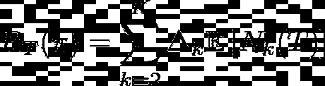
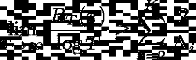
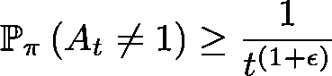
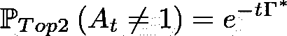
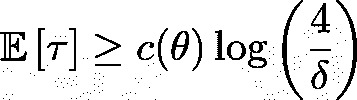
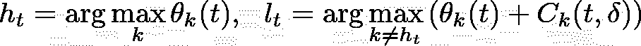

# 给你泼冷水:汤普森取样对 A/B 测试不好

> 原文：<https://towardsdatascience.com/raining-on-your-parade-thompson-sampling-is-not-good-for-a-b-testing-e5a7cbed80fb?source=collection_archive---------38----------------------->

## 我的揭开纯粹探索系列的第 0 部分(a)

[国家癌症研究所](https://unsplash.com/@nci?utm_source=medium&utm_medium=referral)在 [Unsplash](https://unsplash.com?utm_source=medium&utm_medium=referral) 上拍摄的照片

# 如果批量统计不起作用，就让汤普森来解决你的问题🤡

大多数文章讨论在介质上进行 A/B 测试

*   以批量统计开始和结束，或
*   用一个停止规则来补充批量统计，一些软件使用一个完全不透明的过程神奇地产生这个规则，这个过程很容易被忽略，或者
*   至少从经验上认识到顺序统计的优越性，但是简单地从上面的步骤 2 中剥离出“批处理”，坚持香草的“汤普森抽样”,并雄辩地讲述这将如何解决你所有的产品测试困境，并使你一夜之间成为亿万富翁。

虽然我[已经解释了](/why-most-a-b-tests-are-not-efficient-11b289414191)如何将**顺序**测试、*与*一个合理的、*可证明的* **停止规则**结合起来，比批量测试表现得好得多，但是最近第三类文章的大量涌现表明了对我打算在本文中消除的一个神话越来越多的信任。

> **误区:**后悔和样本量效率本质上是同一个度量。

# 💡快速回顾定义

在我的[上一篇文章](/how-to-tame-your-bandit-4c6b2723d0db)中，我描述了**样本量效率**的含义，因此，为了保持文章简洁，我将只更详细地讨论遗憾(继续使用与我上一篇文章相同的基本符号)。**遗憾**在我们的多臂 Bandit (MAB)框架中的一个采样算法，本质上是测量奖励的损失，因为它一直没有拉最好的臂。

如前所述，我假设θ₁>θₖ，∀ k ∈ {2，3，…，K}，并将δₖ=θ₁-θₖ定义为臂 k 的奖励缺口。在时间 s ∈ {1，2，…，T}，MAB 算法π对臂 Iₛ进行采样，并接收奖励 X(s,Iₛ).它的遗憾被定义为

T 轮π算法的后悔定义(图片由作者提供)

# **⚡神话从何而来？(有点夸张)**

我上面提到的许多困惑，在我看来，都可以归因于后悔的一个等价定义。让随机变量 Nₖ(T)表示在 t 轮中算法π采样臂 k 的次数。然后，

回报差距方面的遗憾(图片由作者提供)

上述等式表明，良好的后悔性能自动意味着采样次优 arm 的频率较低。作者(在我看来)看到上面的等式，并假设任何最小化遗憾的算法必然也能快速找到最佳臂。**这不是完整的画面！**

你看，这样的作者往往忘记了与𝔼Nₖ(T 有关的另一个术语，即δₖ.的差距因为在后悔最小化的过程中，失去奖励的代价是如此之高，所以为这种环境设计的算法往往会非常小心，在探索和利用之间徘徊。另一方面，快速找到最佳手臂需要算法非常积极的行为。由于回报不再是一个因素，困扰后悔最小化的探索-开发困境在后一种情况下就不那么突出了。

[Vanilla Thompson Sampling(vTS)](https://web.stanford.edu/~bvr/pubs/TS_Tutorial.pdf)已经被开发用于最小化遗憾的明确目的，并且展示了当涉及到手臂选择时其同类的所有恐惧。这就是为什么上述第二类和第三类文章的说法非常具有误导性。

# 小遗憾糟糕的最佳行动识别🤯

再读一遍。注意我没说“小遗憾≠好的最佳动作鉴定！”我在这里提出的主张是*更强*，也就是说，任何在后悔最小化问题上表现良好的算法，*必然会在最佳手臂识别上表现不佳。让我们更正式一点。*

众所周知，最好的后悔最小化算法在后悔中显示出[对数增加](https://www.amazon.com/Bandit-Algorithms-Tor-Lattimore/dp/1108486827)，即 O(log(T))。给定来自一些θ类实例的 bandit 实例θ = [θ₁,…,θₖ],后悔性能的下限是

后悔表现的下限(图片由作者提供)

这仅仅意味着对于任何 bandit 实例θ∈θ，对于类θ的遗憾最优算法将显示 O(log(T))的渐近性能。现在的问题是，对于任何这样的算法，*总是*在同一个类θ中存在至少一个*【困难】*实例，使得选择**错误臂**的概率随时间至多以**多项式**衰减！从形式上讲，对于任何ϵ > 0、

选择错误手臂的概率(图片由作者提供)

这使得π对于这项任务来说相当不可靠。这自然使我们得出结论

(免责声明:这个定理确实有一些限定条件，为了清楚起见，我省略了这些条件。更多详情请参考 [Tor 的第 33 章和 Csaba 的代表作](https://www.amazon.com/Bandit-Algorithms-Tor-Lattimore/dp/1108486827)。)

这种下降率在应用中是完全不可接受的，因为(a)它导致巨大的样本量和(b)存在几种更好的替代方案！后一种说法是正确的，即使人们不希望求助于设计复杂的停止时间来决定实验何时收集了足够的数据来宣布一个行动是“最好的”

既然我已经(希望)让你相信了行星队长的“*减少、再利用、回收*”咒语不适用于 A/B 测试，我们可以继续讨论更有效的替代方案。

回收塑料不是算法(来源:维基共享)

# 前两个汤普森抽样

这是为了让汤普森取样探索更积极。简而言之，这种算法像普通 TS 一样进行，但在每一轮中，随机选择两个顶级动作(或手臂)中的一个，并对其进行采样。非常仔细地选择随机化的概率，并且通过所述选择，

Top-2 TS 迅速停止选择错误的手臂(图片由作者提供)

这里有几点值得注意。

*   由于可以在一轮中选择两个顶端的武器中的任何一个，探索显然是被鼓励的。
*   与我们早先关于选择错误臂的概率的界限相比，Top-2 TS 好几个数量级(从多项式减少到**指数**减少)！
*   这个常数γ*决定了指数下降的速率，也是可以达到的最佳值。

然而，这个算法没有使用停止时间(在文献中，它属于*固定预算*类别)。许多其他人也自动提供一个**停止时间**，在此时间他们停止并宣布一个手臂是最好的。

# 输入舞台左侧的停止时间

纯粹的探索算法属于“固定置信度”算法的范畴，这些算法在看到足够多的证据后，还会决定什么时候采取“最佳”行动。它们旨在解决以下问题:

> 给定置信参数δ ∈ (0，1)，使用尽可能少的臂拉动，找出概率至少为 1-δ的最佳臂。

因此，在我们的设置中，这些算法需要使用尽可能少的样本来找到 Arm 1。我现在将讨论这一类别中几个突出的例子。

# 跟踪并停止

加里维耶和考夫曼在他们的[里程碑 2016 论文](http://proceedings.mlr.press/v49/garivier16a.pdf)中表明，对于给定的 bandit 实例，任何固定置信度算法的停止时间τ满足来自某个类θ的θ = [θ₁,…,θₖ]

样本量的下限(图片由作者提供)

上述实例相关常数 c(θ)取决于对 K 个臂中的每一个进行采样的频率。假设 w(θ)=[w₁(θ),…,wₖ(θ]是频率。显然，这个量显然只有在θ已知时才能计算出来，这意味着实际上没有算法事先知道它。但是，可以*估计*随着时间的推移！

这就是“跟踪-停止”策略的作用。他们根据可获得的回报估计θ，在时间 t，他们得到 w(θ)的估计 wᵗ(θ。然后，他们对采样频率与 wᵗ(θ规定的频率相差最远的臂进行采样，并重新估计θ，然后重复该过程。这种情况会持续下去，直到收集到足够多的有利于 arm 的证据，算法停止并宣布该 arm 为最佳。

在高置信度状态下，即当δ接近 0 时，跟踪和停止策略在样本量上是可证明的最优的。再次注意，焦点是*完全*在探索上，最小化遗憾是*而不是*的目标！

(我将在本系列的后续文章中更详细地讨论这种方法背后的直觉。)

# 上下置信限算法

基于置信度的算法维护一个集合，称为“置信度集合”，该集合包含具有高概率的真实 bandit 实例θ。这个集合，对于每个臂 k ∈ {1，…，K}，仅仅是当前奖励均值θₖ(t)加上探索奖金 Cₖ(t,δ).换句话说，概率至少为 1-δ，θₖ ≤ θₖ(t)+Cₖ(t,δ).

较低-较高置信度(LUCB)算法，如 Top-2 TS，保持两个臂(1)具有最大估计均值的臂和(2)具有最大估计较高置信度的臂，即，

LUCB 在每一轮中都保持两只手臂(图片由作者提供)

LUCB 算法在*对回合*中进行，在连续回合中采样*这两个臂*并更新它们的估计。当 hₜ的置信下限大于 lₜ的置信上限时，它们就停止了(并且很自然地宣布 hₜ是最好的)。

为了正确选择探索奖金 Cₖ(t,δ)，这些算法可以被证明是在最佳值的对数因子内。设计这样一个奖金需要了解有限时间版本的[LIL(T11)定律，这超出了本文的范围。需要注意的是，与普通 UCB 不同，LUCB 算法并不是简单地在每一轮都采样 lₜ！再一次，一个流行的后悔最小化算法的纯探索版本显示了强有力的修改**以支持积极的探索**。](https://en.wikipedia.org/wiki/Law_of_the_iterated_logarithm)

存在一些其他的设计纯探索算法的方法，但是我相信对于本文的目的来说，这三个说明性的例子已经足够了。在我的“揭开纯粹探索的神秘面纱”系列的未来部分，我们将遇到其他更奇特的生物，并分析它们的样本大小表现。

# 结束语

在不了解设计算法的基本原理的情况下回收算法通常是一个坏主意，尽管汤普森采样有很多优点，但也不例外。

一般来说，A/B 测试和纯探索形成了一类比后悔最小化更复杂和要求更高的问题(就数学成熟度而言),因为与后者不同，它们涉及可测量的设计(a)抽样规则(B)停止时间和(c)获胜者选择标准。通过这篇文章，我希望我已经说服了读者，这些问题必须作为它们自己的一类来对待。

这篇文章是我的“揭开纯粹探索的神秘面纱”系列中的一个快速弯路，其中的第 0 部分和第 1 部分[已经可以在 TDS 上找到。本系列将继续分析如何提高**动作消除**的样本量性能。](/how-to-tame-your-bandit-4c6b2723d0db)

所以下次之前，记住孩子们

> 后悔最小化算法在最好的 Arm 识别中**被证明是坏的**。