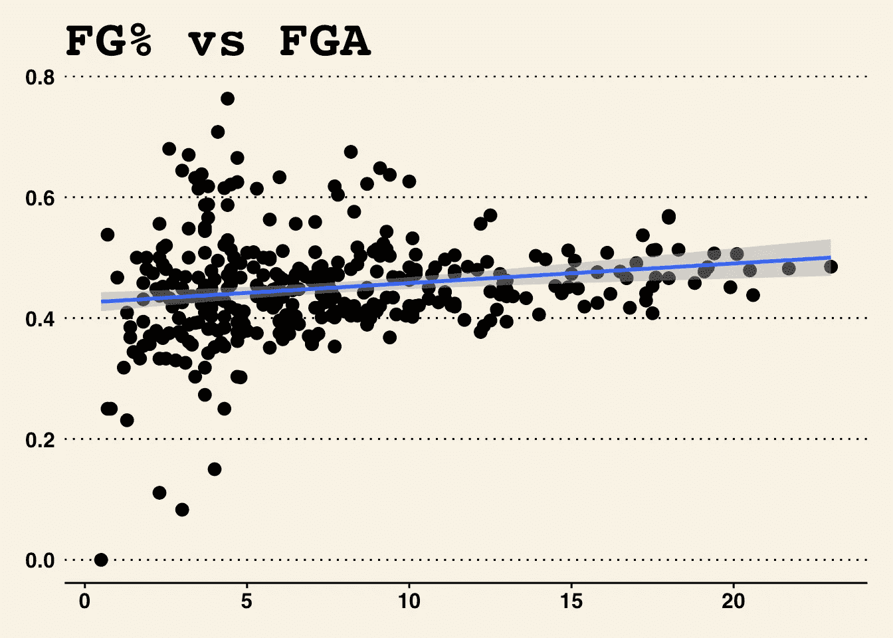
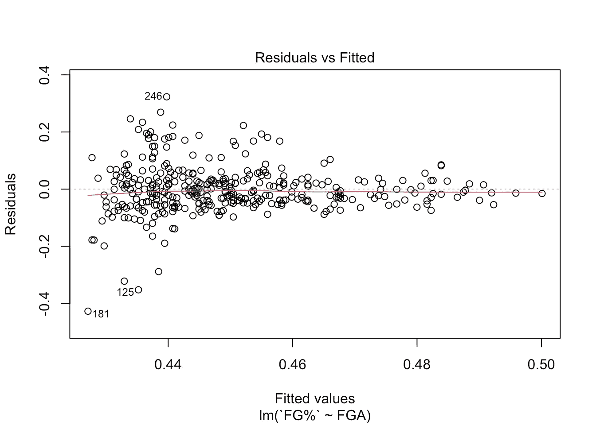
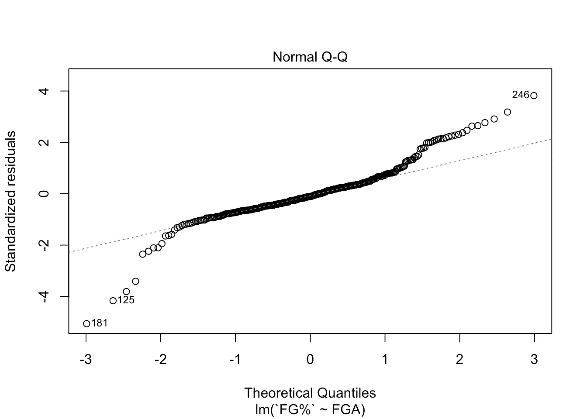
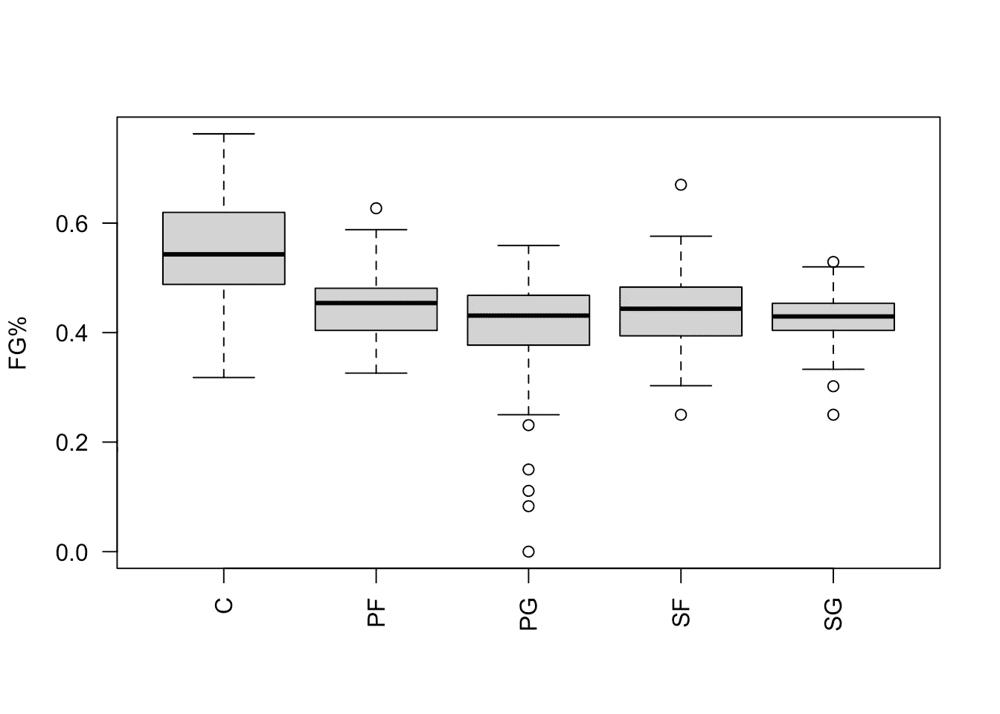
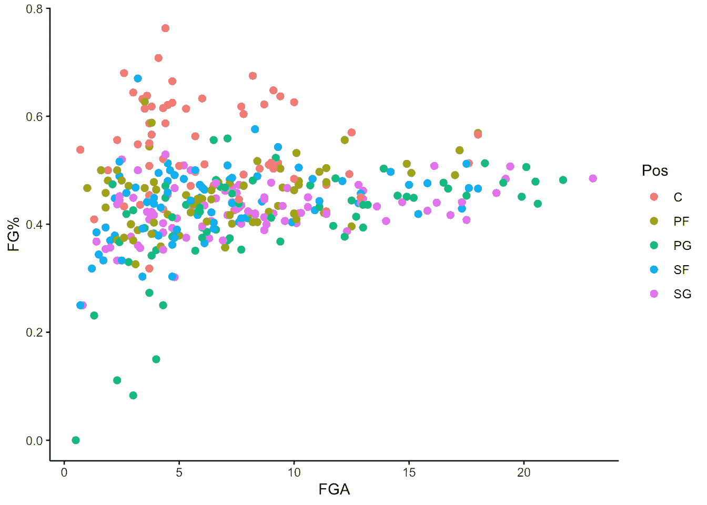

# 线性模型中的随机效应

> 原文：<https://towardsdatascience.com/random-effects-in-linear-models-15845b2540ac?source=collection_archive---------8----------------------->

## 线性模型的扩展

## R 中关于在线性模型中使用随机效应的端到端分析示例。


蒂姆·莫斯霍尔德在 [Unsplash](https://unsplash.com?utm_source=medium&utm_medium=referral) 上的照片

T 简单的线性模型有一个重要的假设，即观测值的独立性。这一假设在大多数精心设计的实验中都成立，但在现实生活的数据集中却很少成立。

将相关数据假设为独立数据的最大风险之一是，由于大量的“独立”观察值，您的线性模型将始终为您提供漂亮的 p 值。

观察值的“相关性”通常来自同一组内数据点的一些共享特征。例如，如果你对家庭收入如何影响孩子的考试成绩感兴趣，你需要考虑来自同一所学校或班级的学生的成绩比来自不同学校或班级的学生的成绩更相似。

在这种情况下，使用随机效应是提高线性模型估计值的有效方法。一般来说，如果您在调查数据集中有一些与您要回答的问题不直接相关的分组结构，最好将它们作为随机效应包含在您的线性模型中。(注意，随机效果不能用于连续变量，最好超过 5 个级别。)

在本文中，我将通过一个小项目来展示如何在 r 的线性建模中使用随机效果。我将避免复杂的数学方程，并使想法和实现代码尽可能简单。希望你能从中学到一些东西！

## 这个问题

我的项目问题是" ***投篮尝试次数如何影响投篮命中率？*** ”

NBA 比赛暂停期间，我们总能听到教练对着球员大喊，“*继续投篮！*

大多数 NBA 职业球员都相信，即使现在很冷，如果一个人坚持投篮，他最终会找到自己的节奏。实际上，潜在的假设是，投篮尝试次数的增加可以积极地影响投篮命中率(并最终增加投篮命中率)。

一些球员甚至抱怨说，他们在投篮命中率方面表现不佳，只是因为他们不允许像超级明星在球场上那样投篮。

这个小型项目的问题是用统计建模来解决上述现象。

## 数据集

数据集是 2020–2021 NBA 赛季 NBA 球员的场均数据，从网站 [basketball reference](https://www.basketball-reference.com/leagues/NBA_2021_per_game.html) 下载。

以下是 R 中用于数据清理的代码。

```
my_tab = read_excel("sportsref_download.xlsx")
dup_players = my_tab[with(my_tab, Tm == "TOT"),]$Player
my_tab_filtered = my_tab[with(my_tab,((Player %**in**% dup_players) & Tm == "TOT")| !(Player %**in**% dup_players)),] %>%
  mutate(Pos = replace(Pos, Pos == "SG-PG", "SG"))%>%
  mutate(Pos = replace(Pos, Pos == "SF-SG", "SF"))%>%
  mutate(Pos = replace(Pos, Pos == "PF-SF", "PF"))%>%
  mutate(Pos = replace(Pos, Pos == "C-PF", "C"))%>%
  mutate(Pos = replace(Pos, Pos == "PG-SG", "PG"))%>%
  mutate(Pos = replace(Pos, Pos == "SG-SF", "SG"))%>%
  mutate(Pos = replace(Pos, Pos == "SF-PF", "SF"))%>%
  mutate(Pos = replace(Pos, Pos == "PF-C", "PF"))
my_tab_filtered = my_tab_filtered[complete.cases(my_tab_filtered),]
```

首先，我从数据中删除了赛季内球队之间交易的重复球员。然后，我修改了玩家的位置到他们的主要位置，如果他们可以打多个位置的话。最后，我从数据中删除了 *NA* 值。

为了检查球员名字在数据中是否唯一，我使用了下面的代码。

```
length(unique(my_tab_filtered$Player)) == nrow(my_tab_filtered)
```

它给了我“真”，这意味着球员是独一无二的。

因为我试图评论投篮命中率对投篮命中率的影响，我在下面的散点图中绘制了它们之间的关系。



散点图 FG%与 FGA(图片由作者提供)

从图上看，投篮次数和投篮命中率之间似乎存在某种线性关系。接下来，我将使用统计方法来检查观察结果。

## 建模

如果不考虑数据内部任何可能的分组结构，可以简单的对其应用线性回归模型，就是把所有东西都装进一个线性模型。

```
null.lm = lm(`FG%` ~ FGA, data = my_tab_filtered)
summary(null.lm)
```

它给了我们，

```
## 
## Call:
## lm(formula = `FG%` ~ FGA, data = my_tab_filtered)
## 
## Residuals:
##      Min       1Q   Median       3Q      Max 
## -0.42711 -0.04531 -0.00926  0.03243  0.32324 
## 
## Coefficients:
##              Estimate Std. Error t value Pr(>|t|)    
## (Intercept) 0.4254855  0.0084259  50.497  < 2e-16 ***
## FGA         0.0032440  0.0009531   3.404 0.000741 ***
## ---
## Signif. codes:  0 '***' 0.001 '**' 0.01 '*' 0.05 '.' 0.1 ' ' 1
## 
## Residual standard error: 0.08477 on 358 degrees of freedom
## Multiple R-squared:  0.03134,    Adjusted R-squared:  0.02864 
## F-statistic: 11.58 on 1 and 358 DF,  p-value: 0.0007406
```

FGA 的 p 值(投篮次数)看起来不错，不是吗？

我也检查了残差，

```
plot(null.lm, which = 1)
```



零线性模型中的残差与拟合值(图片由作者提供)

```
plot(null.lm, which = 2)
```



零线性模型的 Q-Q 图(图片由作者提供)

这些诊断图确实显示了一些异常模式，但是大部分数据看起来是正常的。关于诊断线性模型的更多信息，请参见[这篇文章](/diagnose-the-generalized-linear-models-66ad01128261)。

如果我停在这里，我可以得出结论，投篮尝试确实对投篮命中率有显著的积极影响。但是，我在线性模型中假设了观测值之间的独立性，这是完全错误的。

我们来看看球员在不同位置的 FG%吧，

```
boxplot(`FG%` ~ Pos, data = my_tab_filtered, las=2,xlab = "")
```



五个位置的投篮命中率(图片由作者提供)

我们可以从箱线图中看到，不同的位置确实有不同水平的投篮命中率。例如，中锋比其他位置有更高的投篮命中率，这是有意义的，因为他们离篮筐更近。

如果我们再次用玩家的位置作为颜色绘制散点图，我们也可以看到分组(聚集)的模式，



FG%对 FGA 进行颜色编码(图片由作者提供)

因此，我不能忽略“位置”变量，尽管这不是我对建模的兴趣。

在这种情况下，有必要在线性模型中引入固定效应和随机效应的概念。简单来说，固定效应是我们试图从数据中估计的未知常数，而随机效应是我们试图估计(*farage，Julian J .，2016* )分布参数的随机变量。

对于固定效应，我们的目标是在线性模型中估计它们的系数，以便评论与因变量的关系。但是，我们对随机效应变量中每个具体水平的效应不感兴趣，我们只想检验随机效应的变异是否大于零。

因为我感兴趣的是 FGA 对 FG%的总体影响，而不是它在每个单独位置的表现，所以我在线性模型中使用位置作为随机影响，而不是固定影响。固定效果和随机效果之间更多的概念差异可以在[这里](https://stats.stackexchange.com/questions/4700/what-is-the-difference-between-fixed-effect-random-effect-and-mixed-effect-mode)找到。

要在 R 中执行混合(固定效果+随机效果)线性模型，需要 lme4 包。

然后，我扩展了前面的线性模型，把位置作为随机效应。

```
**library**(lme4)
mixed.lm = lmer(`FG%` ~ FGA + (1|Pos), data = my_tab_filtered)
summary(mixed.lm)
```

这给了我，

```
## Linear mixed model fit by REML ['lmerMod']
## Formula: `FG%` ~ FGA + (1 | Pos)
##    Data: my_tab_filtered
## 
## REML criterion at convergence: -859.3
## 
## Scaled residuals: 
##     Min      1Q  Median      3Q     Max 
## -5.2524 -0.5565  0.0096  0.5838  3.5555 
## 
## Random effects:
##  Groups   Name        Variance Std.Dev.
##  Pos      (Intercept) 0.003318 0.05760 
##  Residual             0.004878 0.06984 
## Number of obs: 360, groups:  Pos, 5
## 
## Fixed effects:
##              Estimate Std. Error t value
## (Intercept) 0.4178439  0.0266955   15.65
## FGA         0.0048149  0.0007998    6.02
## 
## Correlation of Fixed Effects:
##     (Intr)
## FGA -0.223
```

在上面的报告中，随机效应部分告诉我们在分组因素(这里是玩家的位置)和剩余方差中发现了多少方差。

固定效应部分与简单线性模型报告非常相似，它显示了系数的估计值以及系数的标准误差。

如果我们首先看上面报告的随机效应部分，我们可以看到来自“Pos”的方差与来自“Residual”的方差非常相似。计算完比例后，

```
0.003318/(0.003318 + 0.004878)
```

我得到 40.4%的方差不能用固定效应来解释。这些结果再次证实了将“位置”作为随机效应包括在内的必要性。

如果我们看看固定效应部分的 FGA 系数的估计值和标准差，我们可以看到标准差比估计值小得多，这表明 FGA 系数不为零。

您可能已经注意到，lme4 包的混合线性模型的报告中没有“p 值”。

“没有提供 p 值”是在线性模型中使用随机效应的一个主要缺点。实际上有很多方法来计算近似的 p 值，但是理论上没有一种方法是那么精确的，因为自由度的计算很复杂。这个特定主题的讨论可能会非常复杂和冗长，因此我们在这里不讨论细节。

计算随机效应的 p 值的一个实用方法是在 bootstrap 中使用似然比检验统计。似然比检验的基本思想是通过包含不同数量的变量来比较两个模型对观察数据的似然性。如果可能性比率明显不同于 1，那么包含额外变量是有用的。

检验似然比是否显著不同于 1 与检验对数似然比之间的差是否不为零是一样的。

测试统计量可以计算如下:

```
my_stat = 2*(logLik(mixed.lm) - logLik(null.lm,REML = TRUE))
```

然后，我们创建一个 bootstrap 方法来模拟零假设(简单线性模型)下的数据，然后生成大量的似然比检验统计量。

```
LRT_stat = numeric(1000)
**for**(i **in** 1:1000){
  y = simulate(null.lm)$sim_1
  null_md = lm(y ~ FGA, data = my_tab_filtered)
  mixed_md = lmer(y ~ FGA + (1|Pos), data = my_tab_filtered)
  LRT_stat[i] = as.numeric(2*(logLik(mixed_md) - logLik(null_md,REML = TRUE)))
}
```

然后，我们测试有多少模拟案例超出了我们数据中观察到的统计数据，

```
sum(LRT_stat > my_stat)
```

在我们的例子中，这个数字接近于零，这表明了随机效应的重要性。

同样的似然比检验可以用来检验线性模型中的固定效应。我不会在本文中重复这个过程，因为它与随机效应的测试非常相似。唯一的区别是，在计算固定效应不同的两个模型之间的似然比统计时，将 REML 设置为 FALSE。代码如下:

```
my_stat = 2*(logLik(mixed.lm) - logLik(null.lm,REML = FALSE))
LRT_stat = numeric(1000)
**for**(i **in** 1:1000){
  y = simulate(null.lm)$sim_1
  null_md = lmer(y ~ 1 + (1|Pos), data = my_tab_filtered, method = "ML")
  mixed_md = lmer(y ~ FGA + (1|Pos), data = my_tab_filtered, method = "ML")
  LRT_stat[i] = as.numeric(2*(logLik(mixed_md) - logLik(null_md,REML = FALSE)))
}
sum(LRT_stat > my_stat)
```

总之，我们发现，在考虑了球员位置的随机效应后，投篮尝试显著影响了球员的投篮命中率。

## 讨论

现实生活中的问题可能比我上面提到的更复杂。例如，如果你的随机效果中有不止一个分组因子，你需要考虑随机效果的类型。随机效应主要有两种类型，交叉效应和嵌套效应。如果受试者在随机效应的一个水平上没有出现在任何其他水平上，那么它就是嵌套效应，否则，它就是交叉效应。

例如，在前面提到的关于家庭收入和学生成绩之间关系的问题中，你把学校和班级都作为随机效应。学校和班级变量是嵌套效果，因为一个班级只能属于一个特定的学校。这种情况下的 sudo 代码可以是:

```
nested_mod = lmer(grades ~ income + (1|school) + (1|school:class), data = school_grades)
```

或者，

```
nested_mod = lmer(grades ~ income + (1|school/class), data = school_grades)
```

再举一个例子，如果你试图在大范围的山区测量鸟类的体型和体重之间的关系，你可能需要考虑两个随机影响，季节和山区位置。

捕捉鸟类的季节和地点都会影响鸟类的体型和体重之间的关系。因为每座山都有四个季节，这两个随机效应是交叉效应。sudo 代码就像是，

```
crossed_mod = lmer(grades ~ income + (1|season) + (1|mountain_id), data = birds_data)
```

线性模型中随机效应的上述用法已经涵盖了大多数可能的情况。希望这些对你有帮助。

如果你对什么时候使用随机效果感到困惑，关于这一点有很多争论和标准。有兴趣可以在这里 阅读更多 [*。然而，我的建议是，只要你注意到数据集中任何分组因素的影响，就继续随机影响，这也是 *Gelman，Andrew (2005)所推荐的。**](https://dynamicecology.wordpress.com/2015/11/04/is-it-a-fixed-or-random-effect/)

**干杯！**


照片由 [kazuend](https://unsplash.com/@kazuend?utm_source=medium&utm_medium=referral) 在 [Unsplash](https://unsplash.com?utm_source=medium&utm_medium=referral) 上拍摄

## 参考

 [## 是固定效应还是随机效应？

### 在教一个研究生统计学课程的时候，我最终成为了一名统计顾问。我最常被问到的一个问题是…

dynamicecology.wordpress.com](https://dynamicecology.wordpress.com/2015/11/04/is-it-a-fixed-or-random-effect/) [](https://stats.stackexchange.com/questions/4700/what-is-the-difference-between-fixed-effect-random-effect-and-mixed-effect-mode) [## 固定效果、随机效果、混合效果模型有什么区别？

### 有一些关于这方面的好书，如盖尔曼和希尔。接下来的内容基本上是他们的总结…

stats.stackexchange.com](https://stats.stackexchange.com/questions/4700/what-is-the-difference-between-fixed-effect-random-effect-and-mixed-effect-mode) 

*farage，Julian J .用 R 扩展线性模型:广义线性、混合效应和非参数回归模型。CRC 出版社，2016*

安德鲁·盖尔曼。"方差分析——为什么它比以往任何时候都重要."统计年鉴 33.1(2005):1–53。