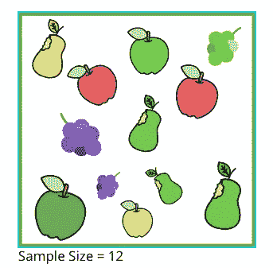
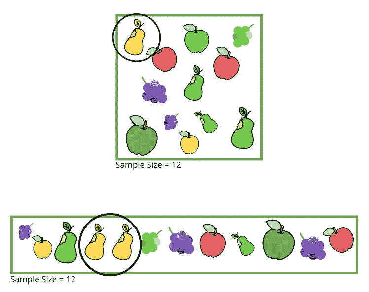
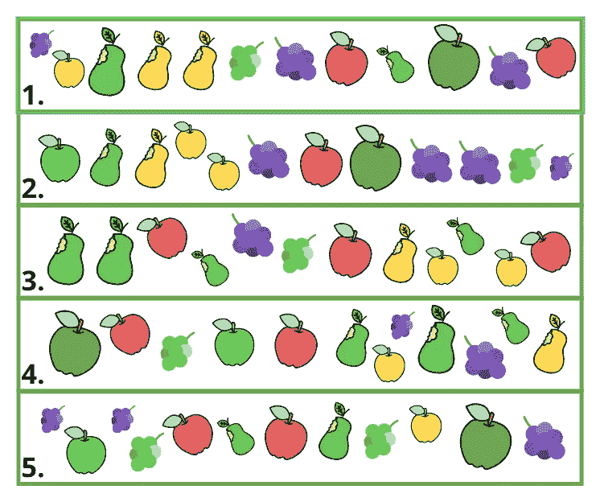
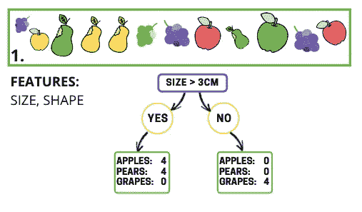
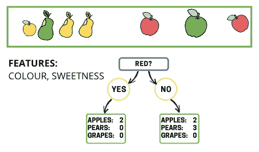
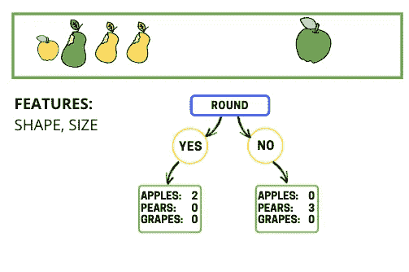
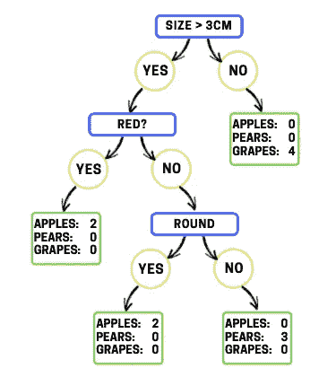
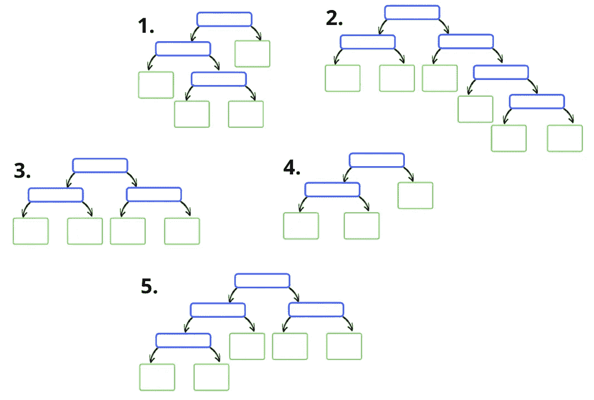
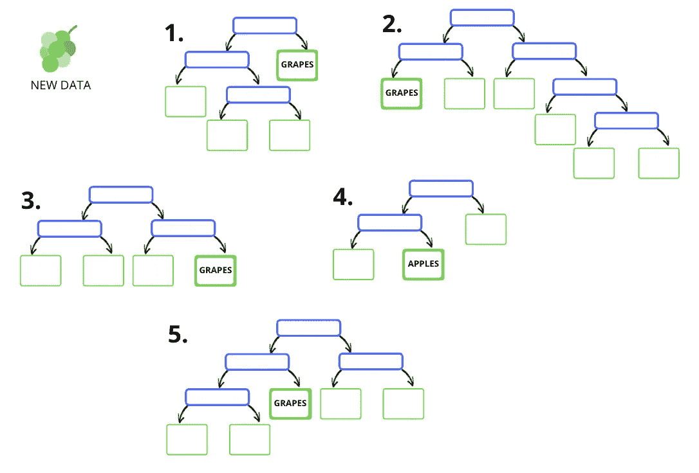
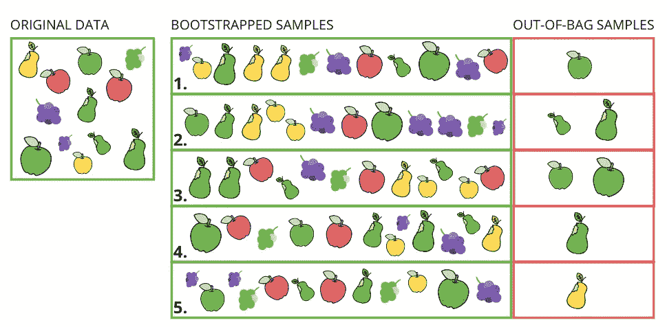

# 随机森林的非技术性指南

> 原文：<https://towardsdatascience.com/random-forest-29cf337c68d4?source=collection_archive---------33----------------------->

## 今天最广泛使用的算法之一实际上很难解释

Geran de Klerk 在 [Unsplash](https://unsplash.com?utm_source=medium&utm_medium=referral) 上拍摄的照片

如果你还没有，你应该读一读我写的关于决策树的文章。

 [## 决策树的非技术性指南

### 现代的、基于树的模型的构建模块…

towardsdatascience.com](/decision-trees-ac091793070) 

理解决策树及其缺陷对于理解随机森林为什么存在以及它为什么强大至关重要。

# 目录

*   [简介](#1226)
*   [决策树缺陷](#0924)
*   [随机森林](#c94e)
    - [总结](#3605)
    - [自举](#47d1)
    - [随机化特征](#65f4)
    - [拟合决策树](#2bbb)
    - [重复 100 次](#254d)
    - [做预测](#566b)
    - [评分](#69dc)
    - [超参数](#5718)
*   [结论](#7756)

# 介绍

[根据 KDNuggets](https://www.kdnuggets.com/2020/12/kaggle-survey-2020-data-science-machine-learning.html) 数据科学家最常用的三种算法是线性/逻辑回归、决策树或随机森林以及梯度推进模型。78%的应答者使用决策树或随机森林，很明显这个模型是我们应该理解的。

如果你不能向商业受众解释一个模型，它不太可能得到利益相关者的认可或认同。本文旨在用大家都能理解的方式来解释随机森林。

随机森林既可以用于分类，也可以用于回归，但我在这里将重点讨论分类。

这个模型是一个*集合*方法，意味着我们一起使用许多模型。主要*组合*技术为*装袋*和*助推*。随机森林属于*装袋*类别。这个后面会解释。

# 决策树缺陷

决策树的快速回顾。如果你不熟悉这些概念，你可以在这里阅读我的文章。

*   我们希望通过我们的一个特征来分割我们的数据，这个特征是**节点**，结果数据是**叶子**。
*   我们希望最小化每个**叶**中的*杂质* 。
*   *杂质*通过使用叶子中各等级的比例来计算。我们可以使用基尼系数或熵值。
*   在每个节点选择的特征是基尼系数最小的特征

这种方法有一些缺陷

*   该算法是*贪婪的*,这意味着我们基于该节点处的分裂而不是未来节点中的结果分裂来选择最佳特征
*   当树木长得很深时，它们很容易过度生长。我们可以通过*修剪*该树来限制这一点，但这会降低预测能力。

答案是引入随机性，使用更多的树，因此得名；**随机森林**。

# 随机森林

## 摘要

该算法可以分解为以下步骤，我将逐一解释:

1.  从现有数据集创建新数据集(引导)。
2.  在此数据集上拟合决策树。
    2a。在树的每个节点随机采样 X 个特征。
3.  重复数百次。
4.  合并每棵树的预测(聚合)。

## 拔靴带

Bootstrapping 是 20 世纪 80 年代流行的一种统计重采样方法。它用于计算置信区间和标准误差，在随机森林模型中起关键作用。它是这样工作的…

首先，我们取数据集，在这个例子中是 12 种水果。希望这些图片是不言自明的，但是在决策树的例子中，我们有不同大小和颜色的苹果、梨和葡萄。

我们的样本数据集。图片作者。

让我们创建第一个引导示例。这是通过取样**和替换**来完成的，这意味着每个样本可以被多次提取。我在下面突出了一个例子，黄梨被取样两次。

创建单个引导示例。图片作者。

值得注意的是，尽管我们可以通过这样做来创建一些极端的样本，但是**中心极限定理**表明我们的样本的平均值将围绕我们的原始数据集的平均值呈正态分布。

让我们为这个例子创建 5 个引导样本(scikit-learn 缺省值是 100)。

图片作者。

希望你能看到这样做会给我们的数据带来更多的随机性。考虑决策树在这些自举样本中的每一个上进行训练时的样子，以及哪些特征会产生最佳的基尼系数，从而导致不同的根节点。

## 随机化特征

我们还有另一个步骤来引入随机性。这是每次我们在决策树中创建一个节点时，从我们的数据集中随机选择固定数量的特征。

在我们之前的例子中，我们只有 3 个特性；颜色、形状和大小。为了更好地说明这个例子，让我们假设我们也有一个甜度分数，从 1 到 5。

默认情况下，scikit-learn 将最大特征设置为总数的平方根。在这个例子中，我们有 4 个特征，所以我们在每个节点使用的最大值是 2。

在创建决策树的每个节点时，**我们随机选择 2 个特征**。这在我们的引导样本中创建了非常不同的树。

特征可以在每个阶段重复使用，但是算法不会重新选择二进制特征，除非它在单独的分支中，因为分割已经完成。

## 拟合决策树

我们现在可以在每个引导数据集上安装一个决策树。

让我们看一个**引导数据集 1 的例子。**我在这里只是估算了基尼系数的近似值，所以如果你自己计算，你可能会发现一些差异。

我们在样本上拟合一个常规的决策树，但是有一个小的不同。在每个节点，我们只能从 2 个随机选择的特征中挑选。

对于根节点，两个随机选择的特征是*大小*和*形状*。以标准方式选择根节点。我们计算基尼系数并选择最佳特征。在这种情况下，它的*大小。*

决策树的根节点。图片作者。

我们实现了左边叶子的纯度，但是右边的叶子仍然需要进一步分类。

从右边的叶子开始，在这个节点随机选择的特征是*颜色*和*甜度*。像往常一样，我们使用基尼系数来选择最佳特征。*颜色* =红色在这里给出了最好的分数，所以这里被用作下一个节点。

决策树的第二个节点。图片作者。

右边的节点还不是纯的，所以我们从另外两个随机选择的特征中创建另一个节点。在这里，我们得到*形状*和*尺寸*。请注意*尺寸*可以再次使用，但我们不会选择 3 厘米，因为这个分支中的所有东西都已经超过 3 厘米了。

形状给了我们纯洁，所以这棵树是完整的

达到纯洁的最后一个节点。图片作者。

这是最后一棵树。

> 请记住，在每个节点，我们只能从 2 个功能中选择。这些是随机选择的，我们无法控制它们是什么。

自举样本 1 上的决策树。图片作者。

## 重复 100 次

我们在这里只使用了 5 个样本，scikit-learn 的缺省值是 100，但通常我们在建模时会使用几百个样本。增加树的数量将有利于模型，但会受到收益递减的影响-最终更多的树不会产生明显更好的结果，但会增加计算量。

我们现在有数百个不同的样本，每个样本都有不同的特征组合，每个样本都有一个决策树。

这是我们 5 个样本的一些示例树。

每个引导示例的示例树。图片作者。

> 我们如何用这些树做预测？

## 做预测

这可以简单地通过**聚合**投票来完成。每棵树都有同等的投票权。这样，不良预测和过度拟合的树可能会被其他树补偿。

我们简单地将每个类别的投票相加，计算出一个概率分数，该分数可用于分类。

在本例中，树 1、2、3 和 5 正确地将我们的新数据预测为葡萄。树 4 预测苹果。这给出了一个概率为 80%的葡萄结果。

图片作者。

## 得分

在分类中，我们可以用典型的度量来评估随机森林模型；准确度、精密度、召回率等等。然而，自举的使用也提供了一个独特的指标，称为**外袋**评分。

当创建**自举**样本时，通常 1/3 的原始样本将不被包括在内。这些可以被认为是每棵树的看不见的数据。

在下图中，我们可以看到每个自举样本的开箱样本。你可以看到这并不接近每棵树的 1/3，因为我创建样本的方法并不是随机的。

图片作者。

为了创建一个 out-of-bag 分数，我们获取每个样本，并从没有在该样本上训练的每个树中为该样本生成一个预测。

在上面的例子中，树 2 和树 4 没有看到大绿梨，所以我们可以根据这个样本从这些树生成一个预测，因为它们没有被训练过。

我们可以对每个样本都这样做，并计算正确预测的百分比；**场外评分。**

## 超参数

在这里，我不打算详细介绍所有参数，我只解释主要概念。如果您不熟悉超参数，可以跳过这一节。

大多数随机森林参数与单个决策树的深度有关。记住，如果树木的深度不受控制，它们会过度生长。然而，装袋应该防止这产生太大的影响。我们仍然可以通过修剪树来提高性能。有许多不同的方法来使用超参数修剪树，要记住的主要事情是一些超参数重叠，所以要确保你没有用一个参数限制你的树，而试图测试另一个。

考虑我们使用的独立决策树的数量总是很重要的。在强大的模型和你正在使用的计算机能力之间找到平衡是很重要的，记住在某个点之后，更多的树不会增加显著的模型改进。

超参数可以使用交叉验证的准确性甚至是开箱得分进行优化。

# 结束语

玛丽塔·卡维拉什维利在 [Unsplash](https://unsplash.com?utm_source=medium&utm_medium=referral) 上拍摄的照片

在本文的开始，我指出了标准决策树模型中的两个关键缺陷:

*   该算法是*贪婪*的，这意味着我们基于该节点的分割而不是未来节点的分割来选择最佳特征
*   当树木长得很深时，它们很容易过度生长。我们可以通过*修剪*树来限制这一点，但是这会降低预测能力。

Random Forest 通过以下方式解决这些问题:

*   这些树仍然是贪婪的，但是我们现在正在测试数百种具有不同特征组合的树的排列。我们不需要找到最优的树，因为我们正在使用许多树的力量。
*   通过聚集来自许多树的结果来限制过度拟合，并且在每个决策边界仅允许随机特征。引导样本也有助于过度拟合。如果需要，我们仍然可以修剪个别的树。

希望你能看到随机森林是如何通过引入 **B** ootstrapping 和 **Agg** regation 来改进决策树的。这些的组合被称为**装袋**。

该算法仍然是高度可解释的，**我们可以提取特征重要性。**然而，我们不能深入算法并查看每一棵单独的树，所以我们不能像使用常规决策树那样绘制树形图和决策边界。

随机森林是当今最广泛使用的基于树的算法之一，但也是许多集成方法之一。

像往常一样，如果有任何问题，请随时直接联系我。

## 更多数据科学文章:

 [## 面向数据科学家的高级 SQL

### 掌握 SQL 以节省时间和炫耀

medium.com](https://medium.com/analytics-vidhya/advanced-sql-for-data-scientists-8e99a3c7f24c)  [## 决策树的非技术性指南

### 现代的、基于树的模型的构建模块…

towardsdatascience.com](/decision-trees-ac091793070) 

## 联系我:

 [## Adam Shafi -数据科学沉浸式大会| LinkedIn

### 拥有 4 年以上分析经验的数据科学家，包括管理团队、交付项目和转变…

www.linkedin.com](https://www.linkedin.com/in/adamshafi/)