# Python 中的随机森林算法

> 原文：<https://towardsdatascience.com/random-forest-algorithm-in-python-from-scratch-487b314048a8?source=collection_archive---------22----------------------->

## 使用(主要)数组和循环在 python 中编写强大的算法

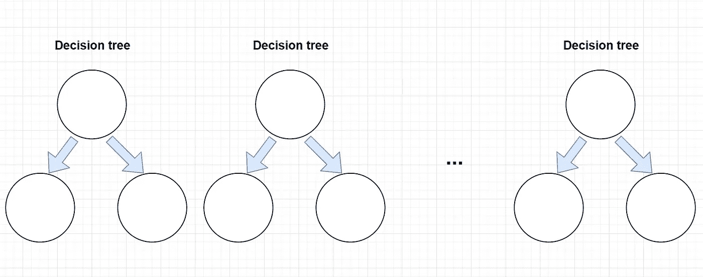

随机森林简化。按作者分类的图表

本文旨在揭开流行的随机森林(random forest)算法的神秘面纱，并通过使用图形、代码片段和代码输出来展示其原理。

我用 python 写的 **RF** 算法的完整实现可以通过:【https://github.com/Eligijus112/decision-tree-python】T4 访问

我强烈鼓励偶然看到这篇文章的人深入研究代码，因为对代码的理解将使将来阅读关于 **RF** 的任何文档更加简单明了，压力也更小。

任何关于优化的建议都受到高度鼓励，并欢迎通过 GitHub 上的 pull 请求。

RF 的构建模块是简单的决策树。如果读者熟悉分类决策树的概念，这篇文章会更容易阅读。强烈建议在进一步阅读之前通读以下文章:

[](/decision-tree-algorithm-in-python-from-scratch-8c43f0e40173) [## Python 中的决策树算法从零开始

### 用 Python 编写只使用 NumPy 和 Pandas 的流行算法，并解释其中的内容

towardsdatascience.com](/decision-tree-algorithm-in-python-from-scratch-8c43f0e40173) 

***sci kit-learn***python 中有一个 RF 算法的实现，速度很快，已经审核了几百次:

[](https://scikit-learn.org/stable/modules/generated/sklearn.ensemble.RandomForestClassifier.html) [## sk learn . ensemble . randomforestclassifier-sci kit-learn 0 . 24 . 2 文档

### 随机森林分类器。随机森林是一个元估计器，它适合于许多决策树分类器…

scikit-learn.org](https://scikit-learn.org/stable/modules/generated/sklearn.ensemble.RandomForestClassifier.html) 

在文档中，需要定义的第一个超参数是 ***n_estimators*** 参数，默认值为 100。这个参数的解释非常优雅:

> 森林中树木的数量。

这个解释非常浪漫，但是一个顽固的数学家第一次阅读时可能会觉得有点困惑:我们在谈论什么样的森林和什么样的树？

随机森林算法背后的直觉可以分成两大部分: ***随机*** 部分和 ***森林*** 部分。让我们从后者开始。

现实生活中的森林是由一堆树组成的。一个随机森林分类器是由一堆决策树分类器组成的(这里和整个文本— **DT** )。组成整个森林的 **DT** s 的确切数量由前面提到的 ***n_estimators*** 变量定义。

一个 **RF** 算法中的每个 **DT** 完全相互独立。如果 n_estimators 变量设置为 50，则森林由 50 棵决策树组成，这些决策树彼此完全独立生长，不共享任何信息。

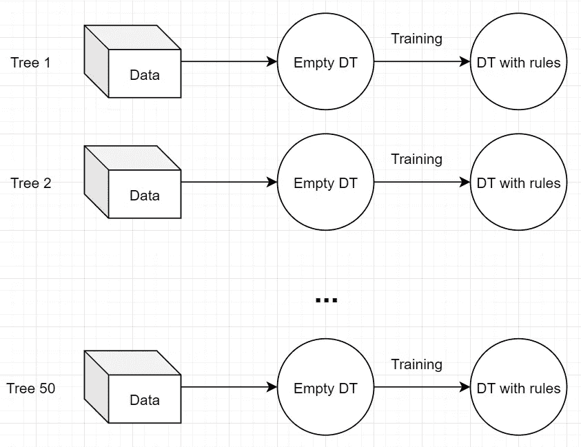

50 分钟。按作者分类的图表

二进制分类决策树可以被视为一个函数，它接受输入 **X** 并输出 1 或 0:

**DT: X → {0，1}**

RF**的最终预测**是从每个单独 DT 做出的预测的多数投票。

如果在 50 棵树中，有 30 棵树将新的观察标记为 ***1*** ，20 棵树将相同的观察标记为 ***0*** 随机森林的最终预测将是 ***1*** 。

在关于简单分类决策树的文章中，很明显，对于相同的输入和相同的超参数，决策树将学习相同的输出和相同的规则。那么，为什么要种 50(或 100，或 1000，或 **k** 呢？这就是第二部分 **RF** 直觉的用武之地:随机**部分。**

RF 中的随机部分可以分为两部分。

**第一部分**是数据的自举。数据自举是其行的替换子样本。python 实现中创建引导示例的部分:

用于引导的代码。按作者

例如，如果整个数据集 **d** 有 10 行:

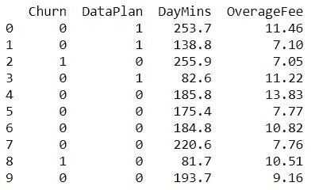

数据集示例。作者图片

响应变量是客户流失列，其他三列是特性。

**d** 的三个独立引导数据集可能看起来像:

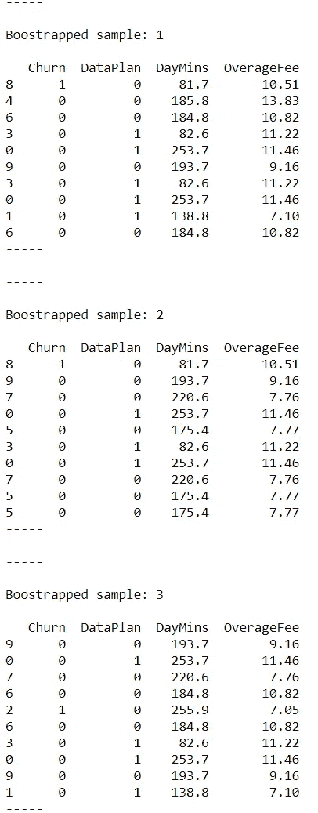

3 个数据引导。作者图片

从上图可以看出，第一个样本中，第 5 排和第 8 排是一样的。此外，并不是所有的原始观察都存在。

如果我们定义 **RF** 具有 k 个决策树( *n_estimators = k* )，那么将会创建 k 个不同的引导数据集，并且每个树将会随着不同的数据集而增长。每个数据集的行数可以与原始数据集相同，也可以比原始数据集少。

因此，如果 **RF** 由 50 个决策树组成，那么 **RF** 的高层图将如下所示:

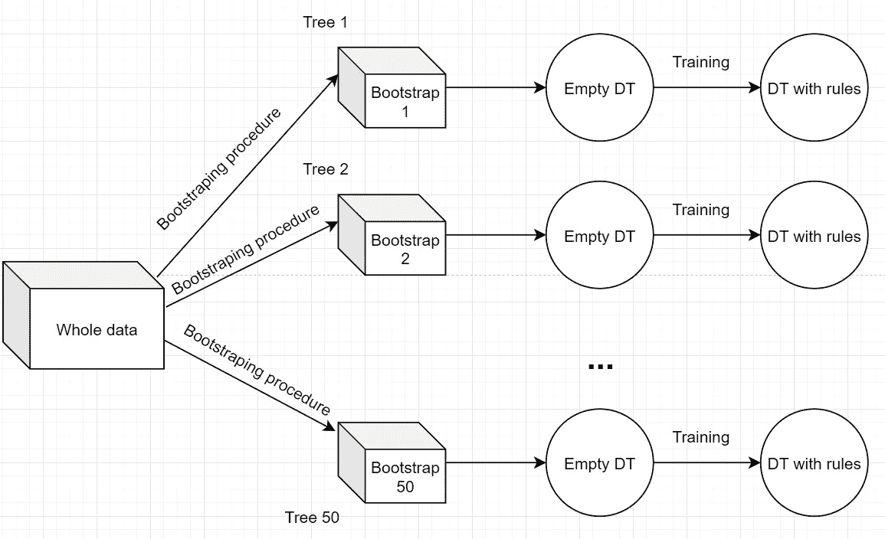

引导程序。按作者分类的图表

五十棵决策树中的每一棵都将随着唯一的数据集而增长。

**随机森林中的随机第二部**正在训练阶段。当在数据上拟合分类决策树时，在每个分割选择期间，特征保持不变。

在随机森林分类器创建过程中，每个决策树的增长与这里实现的算法略有不同

[https://sci kit-learn . org/stable/modules/generated/sk learn . tree . decision tree classifier . html # sk learn . tree . decision tree classifier](https://scikit-learn.org/stable/modules/generated/sklearn.tree.DecisionTreeClassifier.html#sklearn.tree.DecisionTreeClassifier)

唯一的区别是，在每个分割创建时刻，抽取一个具有**特征的随机子样本，并利用这些特征计算最大基尼系数。**

[https://gist . github . com/eligijus 112/4c 47 be 2 f 7566299 bb 8 C4 f 97 c 107d 82 c6f](https://gist.github.com/Eligijus112/4c47be2f7566299bb8c4f97c107d82c6)

例如，假设我们有一个具有 100 个初始特征的自举数据样本 **d** 和 **X** 矩阵。我们可以用参数**X _ features _ fraction**(sci kit-learn 实现中的 **max_features** )定义在每个分割阶段要留下多少个特征。让我们将其设置为 0.05，这意味着在每次分割时，将选择 5 个随机特征(或 5%)进行分割。

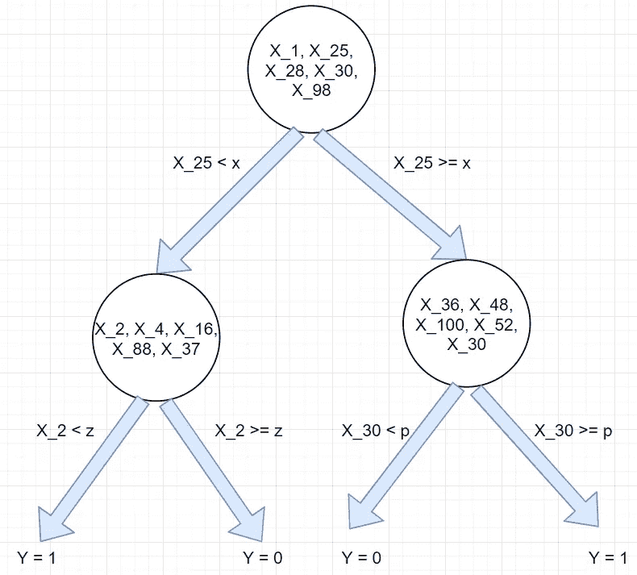

射频树示例。按作者分类的图表

在第一个节点中，有五个 X 特征:1、25、28、30 和 98。当用值 x 分割第 25 个特征时，找到最佳分割。下面两个节点具有另外 5 个随机特征，其中搜索最佳分割。

因此， **RF** 算法如下:

选择一组超参数。

对于 **1 到**k**树做:**

*   生成一个随机引导数据样本 **d** 。
*   对数据 **d** 拟合决策树。在生长阶段的每次分割过程中，选择要分割的要素的随机子样本。

预测时，获得每一个 **k** 树的预测，然后使用多数投票选择标签。

让我们在一些真实数据上安装一个 **RF** 分类器。完整的笔记本和数据可以通过以下方式访问:

[https://github . com/eligijus 112/decision-tree-python/blob/main/randomforestshowcase . ipynb](https://github.com/Eligijus112/decision-tree-python/blob/main/RandomForestShowcase.ipynb)

我的 GitHub 存储库中的数据集有 3333 行，我们将使用以下各列:

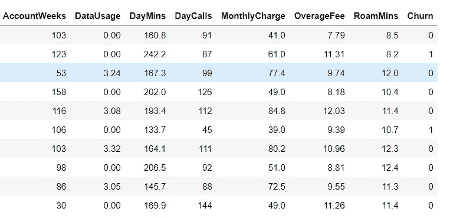

数据样本。作者图片

目标是创建一个分类器，预测电信客户是否会流失。 ***流失*** 是客户不再使用公司产品的事件。如果 churn = 1，则意味着用户已经切换到不同的服务提供商，或者由于任何其他原因，没有显示任何活动。

让我们将数据拆分为训练和测试拆分。训练数据将有 75%的行(2500)，测试集将有 25%的行(833)。

如何使用自定义 RF 类的示例代码。作者代码

生长 5 个决策树，每个分裂中具有 25%的特征，并且每个树的深度为 2，我们得到以下森林:

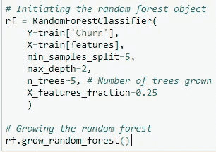

森林的生长。作者图片

```
------ 

Tree number: 1 

Root
   | GINI impurity of the node: 0.27
   | Class distribution in the node: {0: 2099, 1: 401}
   | Predicted class: 0
|-------- Split rule: DayCalls <= 113.5
           | GINI impurity of the node: 0.24
           | Class distribution in the node: {0: 1598, 1: 257}
           | Predicted class: 0
|---------------- Split rule: DayMins <= 287.7
                   | GINI impurity of the node: 0.21
                   | Class distribution in the node: {0: 1591, 1: 218}
                   | Predicted class: 0
|---------------- Split rule: DayMins > 287.7
                   | GINI impurity of the node: 0.26
                   | Class distribution in the node: {1: 39, 0: 7}
                   | Predicted class: 1
|-------- Split rule: DayCalls > 113.5
           | GINI impurity of the node: 0.35
           | Class distribution in the node: {0: 501, 1: 144}
           | Predicted class: 0
|---------------- Split rule: DayMins <= 225.0
                   | GINI impurity of the node: 0.25
                   | Class distribution in the node: {0: 431, 1: 76}
                   | Predicted class: 0
|---------------- Split rule: DayMins > 225.0
                   | GINI impurity of the node: 0.5
                   | Class distribution in the node: {1: 68, 0: 70}
                   | Predicted class: 0
------ 

------ 

Tree number: 2 

Root
   | GINI impurity of the node: 0.26
   | Class distribution in the node: {0: 2124, 1: 376}
   | Predicted class: 0
|-------- Split rule: OverageFee <= 13.235
           | GINI impurity of the node: 0.24
           | Class distribution in the node: {0: 1921, 1: 307}
           | Predicted class: 0
|---------------- Split rule: DayMins <= 261.45
                   | GINI impurity of the node: 0.18
                   | Class distribution in the node: {0: 1853, 1: 210}
                   | Predicted class: 0
|---------------- Split rule: DayMins > 261.45
                   | GINI impurity of the node: 0.48
                   | Class distribution in the node: {0: 68, 1: 97}
                   | Predicted class: 1
|-------- Split rule: OverageFee > 13.235
           | GINI impurity of the node: 0.38
           | Class distribution in the node: {1: 69, 0: 203}
           | Predicted class: 0
|---------------- Split rule: DayMins <= 220.35
                   | GINI impurity of the node: 0.13
                   | Class distribution in the node: {0: 186, 1: 14}
                   | Predicted class: 0
|---------------- Split rule: DayMins > 220.35
                   | GINI impurity of the node: 0.36
                   | Class distribution in the node: {1: 55, 0: 17}
                   | Predicted class: 1
------ 

------ 

Tree number: 3 

Root
   | GINI impurity of the node: 0.25
   | Class distribution in the node: {1: 366, 0: 2134}
   | Predicted class: 0
|-------- Split rule: DataUsage <= 0.315
           | GINI impurity of the node: 0.29
           | Class distribution in the node: {1: 286, 0: 1364}
           | Predicted class: 0
|---------------- Split rule: MonthlyCharge <= 62.05
                   | GINI impurity of the node: 0.18
                   | Class distribution in the node: {1: 144, 0: 1340}
                   | Predicted class: 0
|---------------- Split rule: MonthlyCharge > 62.05
                   | GINI impurity of the node: 0.25
                   | Class distribution in the node: {1: 142, 0: 24}
                   | Predicted class: 1
|-------- Split rule: DataUsage > 0.315
           | GINI impurity of the node: 0.17
           | Class distribution in the node: {0: 770, 1: 80}
           | Predicted class: 0
|---------------- Split rule: RoamMins <= 13.45
                   | GINI impurity of the node: 0.12
                   | Class distribution in the node: {0: 701, 1: 49}
                   | Predicted class: 0
|---------------- Split rule: RoamMins > 13.45
                   | GINI impurity of the node: 0.43
                   | Class distribution in the node: {0: 69, 1: 31}
                   | Predicted class: 0
------ 

------ 

Tree number: 4 

Root
   | GINI impurity of the node: 0.26
   | Class distribution in the node: {0: 2119, 1: 381}
   | Predicted class: 0
|-------- Split rule: DayCalls <= 49.5
           | GINI impurity of the node: 0.49
           | Class distribution in the node: {1: 8, 0: 6}
           | Predicted class: 1
|---------------- Split rule: MonthlyCharge <= 31.5
                   | GINI impurity of the node: 0.0
                   | Class distribution in the node: {0: 4}
                   | Predicted class: 0
|---------------- Split rule: MonthlyCharge > 31.5
                   | GINI impurity of the node: 0.32
                   | Class distribution in the node: {1: 8, 0: 2}
                   | Predicted class: 1
|-------- Split rule: DayCalls > 49.5
           | GINI impurity of the node: 0.26
           | Class distribution in the node: {0: 2113, 1: 373}
           | Predicted class: 0
|---------------- Split rule: DayMins <= 264.6
                   | GINI impurity of the node: 0.21
                   | Class distribution in the node: {0: 2053, 1: 279}
                   | Predicted class: 0
|---------------- Split rule: DayMins > 264.6
                   | GINI impurity of the node: 0.48
                   | Class distribution in the node: {1: 94, 0: 60}
                   | Predicted class: 1
------ 

------ 

Tree number: 5 

Root
   | GINI impurity of the node: 0.24
   | Class distribution in the node: {0: 2155, 1: 345}
   | Predicted class: 0
|-------- Split rule: OverageFee <= 7.945
           | GINI impurity of the node: 0.15
           | Class distribution in the node: {0: 475, 1: 43}
           | Predicted class: 0
|---------------- Split rule: AccountWeeks <= 7.0
                   | GINI impurity of the node: 0.28
                   | Class distribution in the node: {1: 5, 0: 1}
                   | Predicted class: 1
|---------------- Split rule: AccountWeeks > 7.0
                   | GINI impurity of the node: 0.14
                   | Class distribution in the node: {0: 474, 1: 38}
                   | Predicted class: 0
|-------- Split rule: OverageFee > 7.945
           | GINI impurity of the node: 0.26
           | Class distribution in the node: {0: 1680, 1: 302}
           | Predicted class: 0
|---------------- Split rule: DayMins <= 259.9
                   | GINI impurity of the node: 0.2
                   | Class distribution in the node: {0: 1614, 1: 203}
                   | Predicted class: 0
|---------------- Split rule: DayMins > 259.9
                   | GINI impurity of the node: 0.48
                   | Class distribution in the node: {0: 66, 1: 99}
                   | Predicted class: 1
------
```

每棵树都有点不同。具有所选超参数的测试集上的精度和召回分数是:

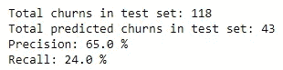

准确性结果。作者图片

让我们尝试通过种植更复杂的随机森林来提高准确性指标。

当生长一个有 30 棵树的随机森林，每个分割点有 50%的特征，max_depth 为 4 时，测试集中的精度为:


更复杂 RF 下的精度。作者图片

如果我们种植 100 棵树，具有 75%的特征，并且树的最大深度是 5，则结果是:

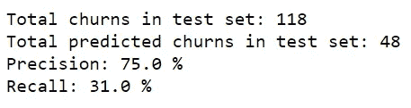

更复杂的射频结果。作者图片

scikit learn 实现给出了非常相似的结果:

```
# Skicit learn implementation
from sklearn.ensemble import RandomForestClassifier# Initiating
rf_scikit = RandomForestClassifier(n_estimators=100, max_features=0.75, max_depth=5, min_samples_split=5)# Fitting 
start = time.time()
rf_scikit.fit(X=train[features], y=train[‘Churn’])
print(f”Time took for scikit learn: {round(time.time() — start, 2)} seconds”)# Forecasting 
yhatsc = rf_scikit.predict(test[features])
test[‘yhatsc’] = yhatscprint(f”Total churns in test set: {test[‘Churn’].sum()}”)
print(f”Total predicted churns in test set: {test[‘yhat’].sum()}”)print(f”Precision: {round(precision_score(test[‘Churn’], test[‘yhatsc’]), 2) * 100} %”)
print(f”Recall: {round(recall_score(test[‘Churn’], test[‘yhatsc’]), 2) * 100} %”)
```

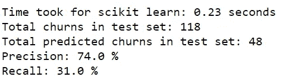

Scikit 学习结果。作者照片

*请注意，sklearn 和定制代码结果之间的差异可能会有所不同，因为每棵树的自举数据的随机性质以及用于找到最佳分割的随机特征。即使使用相同的超参数运行相同的实现，我们每次都会得到稍微不同的结果。*

总之，随机森林算法是由独立的简单决策树组成的。

每个决策树都是使用自定义引导数据集创建的。在每次分裂和每个决策树中，当搜索增加 GINI 增益的最佳特征和特征值时，考虑特征的随机子样本。

一个 **RF** 分类器的最终预测是所有独立决策树的多数投票。