# 随机森林分类器项目——预测在线新闻流行度

> 原文：<https://towardsdatascience.com/random-forest-classifier-project-predicting-online-news-popularity-e99c79daa33?source=collection_archive---------22----------------------->

## 使用 scikit-learn 构建一个随机森林分类器并预测在线新闻文章的份额数量

假想场景:我是一名数据科学家，在一家网络新闻公司工作。营销经理想花一笔预算来推广具有高潜力的商品。因此，她要求我建立一个预测模型来预测一篇文章是否会获得大量的份额。

谢尔盖·阿库利奇在 [Unsplash](https://unsplash.com?utm_source=medium&utm_medium=referral) 上的照片

## 数据集概述:

该数据集中的文章由 Mashable(【www.mashable.com】)发布，其内容的版权归其所有。因此，该数据集不共享原始内容，而是共享一些与之相关的统计数据。使用数据集中提供的 URL 公开访问和检索原始内容。([随意从 Kaggle](https://www.kaggle.com/srikaranelakurthy/online-news-popularity) 下载数据集)

它包含**大约 40k 行**和 **61 列(58 个预测属性，2 个非预测属性，1 个目标字段)。**

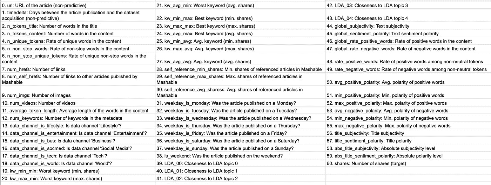

属性信息。作者照片

我们开始吧！([参见此处的代码](https://github.com/YuehHanChen/Random_Forest_Project_Predicting_Popularity_of_Online_News_Articles/blob/main/Predicting_Popularity_of_Online_News_Articles.ipynb))

## *第一步:数据评估*

在评估数据之后，我发现这个数据集非常干净、整洁，并且没有缺失值。然而，它唯一的问题是，除了“url”之外，每个列的名称开头都有空格。(请参见下面的列名。)

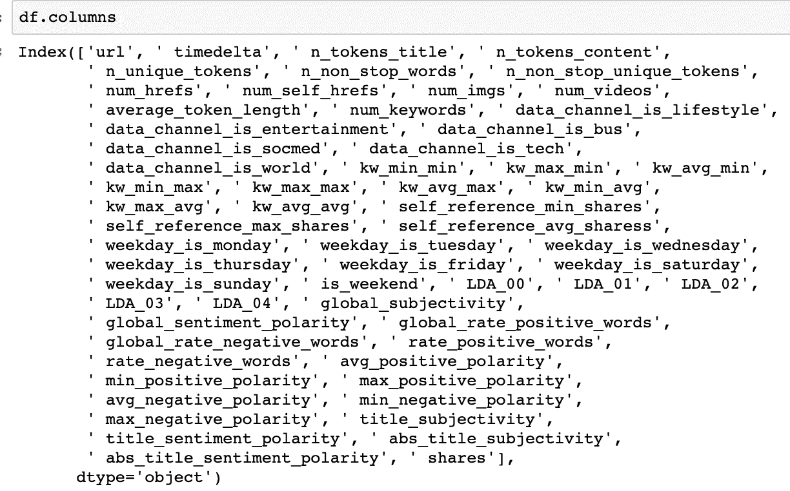

作者照片

## ***第二步:数据清理***

因此，我使用下面的代码来解决上述问题。

lambda 函数用于遍历每一列的名称，如果其中有一个""，则使用" "替换它。

## ***第三步:探索性数据分析***

在 EDA 阶段，我发现大部分份额都在 15000 以下，所以我把 15000 以上的文章筛选出来看大部分。我计划绘制经验累积分布函数(ECDF)和股票数量的分布，以了解如何将股票数量分为不同的组，以便我可以建立一个分类模型来预测它属于哪个组。

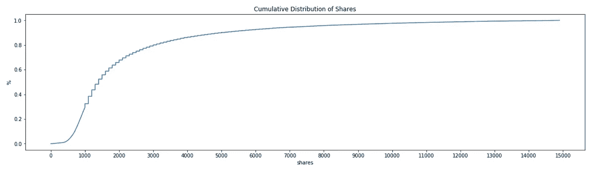

作者照片

作者照片

在看了 ECDF 和分布之后，似乎大多数文章都在 500 到 3000 股之间。所以，我决定把股数分成 3 个等级。([见此处代码](https://github.com/YuehHanChen/Random_Forest_Project_Predicting_Popularity_of_Online_News_Articles/blob/main/Predicting_Popularity_of_Online_News_Articles.ipynb))

1.  **极差**:股数低于 500 股。
2.  **多数**:股数在 500-3000 股之间。
3.  **极好**:股数高于 3000。

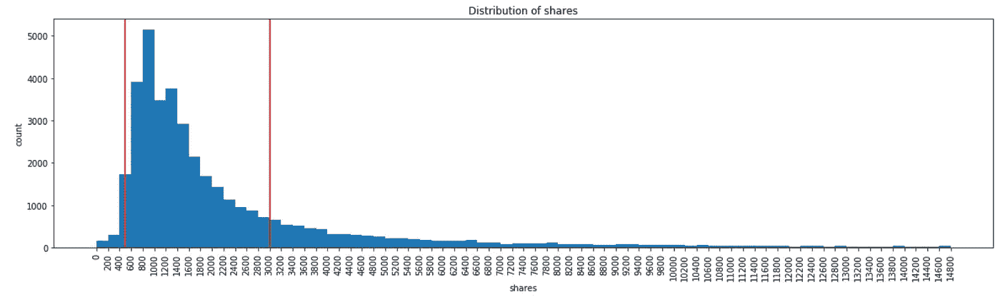

作者照片

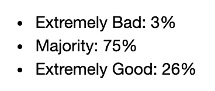

这显示了数据集中每个级别的百分比。作者照片

其次，我发现原始数据集包含两个特性，weekday 和 data_channel，这两个特性已经被一次性编码。

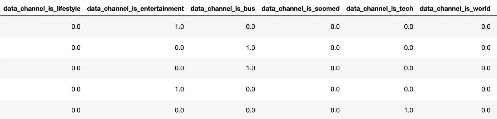

data_channel 已经是一键编码。作者照片。

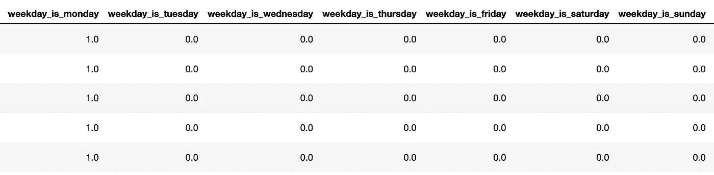

工作日已被一次性编码。作者照片。

因为具有高基数的独热编码分类变量会导致基于树的集成的低效率。算法将给予连续变量比虚拟变量更大的重要性，这将模糊特征重要性的顺序，导致较差的性能(Ravi。"[一键编码使基于树的集成变得更糟，这是为什么？](/one-hot-encoding-is-making-your-tree-based-ensembles-worse-heres-why-d64b282b5769)》。

然而，在这个项目的最后一步，优化精度，我将测试是否不使用一热编码真的执行得更好。因此，在这里，为了准备测试，我将所有一次性编码的变量、与工作日相关的变量和与 data_channel 相关的变量恢复为单列。

weekday 和 data_channel 变量的转换版本如下所示:

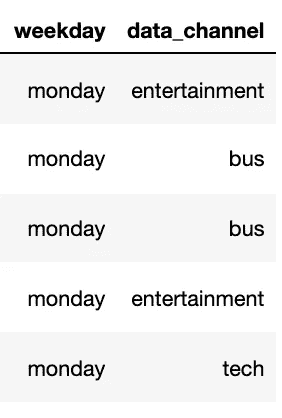

作者照片

## ***第四步:*随机森林模型构建**

我们到了最重要的部分，建立模型。在模型构建过程中，我们需要遵循一些小步骤来正确地执行它。

> 1.将分类列转换为数字列。

> 2.将数据集分为训练集(70%)和测试集(30%)

> 3.构建并测试模型

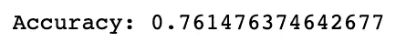

漂亮！其实比我预想的要高！

> 4.尝试不同数量的 n 估计量，看看我们应该使用多少棵树

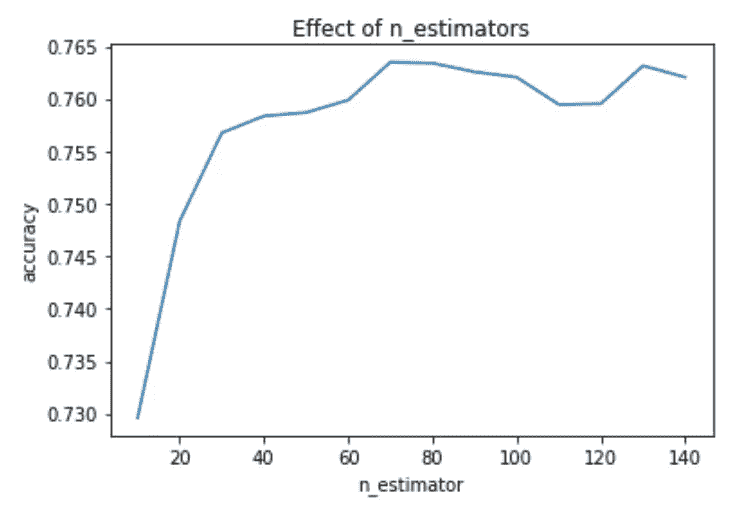

作者照片

该图显示，在使用超过 60 棵树(n_estimatpr = 60)后，我们将获得大约 76%的准确率。

## ***第五步:*优化准确率**

为了优化准确率，我有三个方向可以探索:

1.  搞清楚用一键编码和不用哪个准确率更高？
2.  找出哪个变量对因变量不太重要？放下它们，看看准确率有没有提高。
3.  随机森林分类器、线性支持向量分类器和 RBF 支持向量分类器哪个模型效果更好？

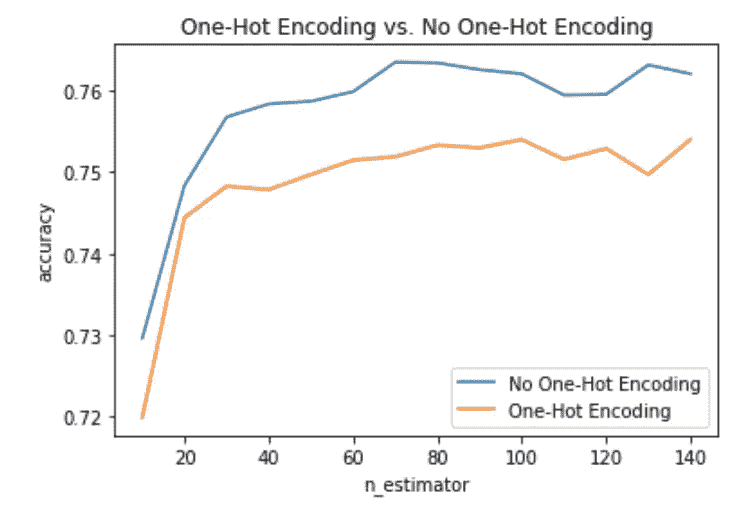

作者照片

对于第一种情况，在计算了每种情况下不同 n _ estimaters 的精确度后，我们可以看到，没有使用独热编码的情况比另一种情况高出近 1%。因此，我决定继续不使用一键编码。

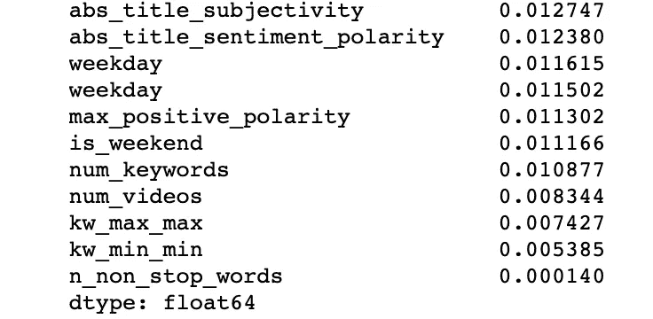

该图显示了 10 个最不重要的变量，并且“n_non_stop_words”具有最低的特征重要性分数。作者照片

对于方向 2，在得到特征重要性得分后，只有一个变量得分明显偏低，“n_non_stop_words”。而下图是去掉“n_non_stop_words”之后和去掉之前的对比。

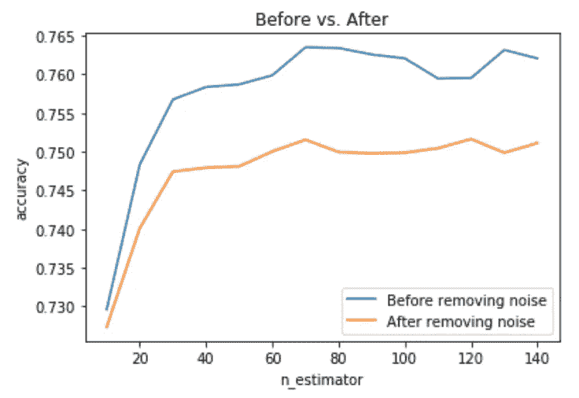

作者照片

奇怪的是，去掉“n_non_stop_words”后，并没有增加准确率。反而下降了近 1.5%。因此，我决定不移除它。

对于最后一个，随机森林分类器，线性支持向量分类器，还是 RBF 支持向量分类器，哪个模型更好？

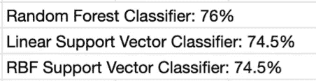

作者照片

> 经过 5 分钟计算其中三个的准确率，随机森林分类器以 76%的准确率胜出！

谢谢你看完！如果你对这个项目的完整代码感兴趣，请查看 [my Github](https://github.com/YuehHanChen/Random_Forest_Project_Predicting_Popularity_of_Online_News_Articles/blob/main/Predicting_Popularity_of_Online_News_Articles.ipynb) 。此外，我喜欢反馈，如果有任何不清楚或应该做得更好的地方，请联系我。这是我的 [LinkedIn](https://www.linkedin.com/in/yueh-han-chen/) 或者通过我的电子邮件联系我(【johneeeeeeeeee3@gmail.com】T4

引用作品:

拉维拉克什。"[一键编码让你的基于树的整体变得更糟，这是为什么？](/one-hot-encoding-is-making-your-tree-based-ensembles-worse-heres-why-d64b282b5769)*走向数据科学。*2019 年 1 月 11 日。[https://towards data science . com/one-hot-encoding-is-making-your-tree-based-ensembles-worse-heres-why-d64b 282 b 5769](/one-hot-encoding-is-making-your-tree-based-ensembles-worse-heres-why-d64b282b5769)