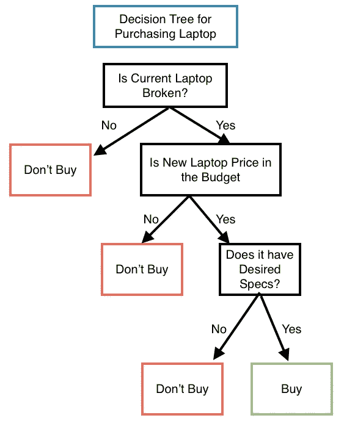
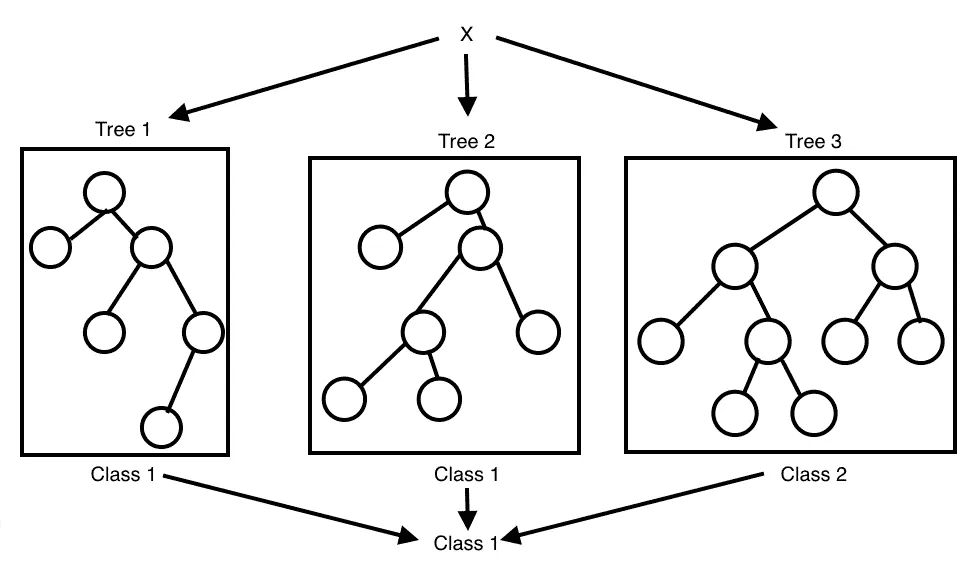

# 兰登森林解释道

> 原文：<https://towardsdatascience.com/random-forest-explained-6b4849d56a2f?source=collection_archive---------20----------------------->

## 决策树和随机森林的理解与实现

图片来自[水花](https://unsplash.com/photos/sMQiL_2v4vs)

决策树和随机森林是业界常用的健壮算法，因为它们易于解释和执行。该算法最强的属性之一是，它允许用户根据树的深度来查看哪些特征对预测贡献最大及其重要性。

本文将提供对决策树和随机森林算法的概念性理解。尽管这种算法对于基于分类和回归的问题都足够健壮，但本文将集中讨论基于分类的例子。对于基于回归的问题，您可以应用下面描述的类似的思维过程，但是这些算法将被其他算法(如逻辑回归)执行，这些算法专门关注那些任务。我还将向读者展示如何使用 iris 数据集上的`sklearn`库在 Python 中实现随机森林和决策树算法来进行花卉分类。下面我概述了本文将遵循的结构。

**目录**

*   决策树
    -实现
    -优点
    -缺点
*   随机森林
    -实现
    -优点
    -缺点
*   摘要
*   资源

# 决策图表

如果决策树的重点是结果的可解释性，那么它对企业来说是很有吸引力的模型。顾名思义，决策树是一种模型，它通过基于提出一系列问题的决策来分解给定的输入数据。想象一个有向无环图，其中每个节点表示一个决策，边连接一对决策。

## 例子

我们可以在下图中概括这一点，在下面的例子中，我们给定的问题是确定一个人是否应该购买一台新的笔记本电脑。这是一个分类示例，其中`buy`和`don't buy`是我们给定的标签。

判定用户是否应该购买新笔记本电脑的决策树分类器示例(图片由作者提供)

基于我们训练树的特征，模型将学习一系列问题来推断给定数据的类别标签。同样的概念也可以用于非分类数据，如整数。该算法将从根节点(最顶端的节点——在我们的例子中为`Is the Current Laptop Broken`)开始，并在导致最大*信息增益*的特征上分割数据。有各种不同的方法来分割这棵树，另一种常见的方法是通过最小化*基尼系数*。我们可以在每个子节点上重复这个分裂过程，直到不能再分裂为止。正如你所想象的，这个过程容易过度拟合，因为它可能导致一个非常深的树有许多节点。解决这个问题的典型方法是修剪树以防止过度拟合。在大多数情况下，修剪过程非常简单，最简单的方法是限制树的最大深度。

## 履行

有关此决策树和 sklearn 库中正在使用的函数的更多详细信息，请参考 [this](https://scikit-learn.org/stable/modules/generated/sklearn.tree.DecisionTreeClassifier.html) [3]。

这个脚本将产生两个输出。第一个将是为分类虹膜数据集而形成的决策树的视觉表示，第二个将是混淆矩阵，其将概述分类器的准确性。下面的[文章](https://blog.exsilio.com/all/accuracy-precision-recall-f1-score-interpretation-of-performance-measures/)提供了关于如何使用准确度、精确度、召回率和 f1 分数的深入理解[4]。

## **优点**

*   容易理解
*   易于实施
*   针对基于分类的问题的强大性能
*   非参数

## 不足之处

*   数据的高方差、小变化会导致树结构和决策的大变化
*   倾向于过度拟合
*   尽管它在分类方面表现很好，但对于基于回归的问题，性能会急剧下降
*   根据类的数量和数据集的大小，计算时间会急剧增加

# 随机森林

在过去的十年中，随机森林在机器学习领域获得了广泛的关注。这是因为它在分类、易用性和可扩展性方面的强大性能。随机森林是决策树的集合。集成学习是一种使用多种学习算法来提高预测性能的方法[1]。这种方法可以更好地概括模型，并且不容易过度拟合。

## **算法**

1.  随机抽取大小为 *n* 的 **bootstrap** 样本(从有替换的训练集中随机选择 *n* 个样本)。
2.  从引导示例中生成决策树。在每个节点:
3.  随机选择 *d* 特性，无需更换。
4.  根据目标函数，使用提供最佳分割的特征来分割节点，例如，通过最大化信息增益。
5.  重复步骤 1 至 2 *k* 次。

这将聚集每个树的预测，以通过多数投票来分配类别标签。

随机森林分类可视化-许多决策树的集合，使用多数投票生成预测(图片由作者提供)

## 履行

有关随机森林分类器和 sklearn 库中正在使用的函数的更多详细信息，请参考[this](https://scikit-learn.org/stable/modules/generated/sklearn.ensemble.RandomForestClassifier.html)【2】。

这个脚本将输出一个与模型相关的混淆矩阵。该矩阵将通过与每个类别相关联的 f1 分数、精确度和召回率等指标来概述模型的准确性。

## 优势

*   分类任务的强大性能
*   不太可能过度适应数据(不需要修剪或大量超参数调整)

## 不足之处

*   训练速度慢-处理大型数据集时，训练模型的计算复杂度非常高
*   更难解释

# 摘要

总之，本文概述了决策树算法可以被视为一种模型，它通过基于提出一系列问题的决策来分解给定的输入数据。然而，随机森林算法使用集成学习来生成模型，该模型使用一组决策树一起通过多数投票来生成预测。一个重要的收获是，这两个模型在处理分类问题时都有很高的性能。

# 资源

[1][https://en.wikipedia.org/wiki/Ensemble_learning](https://en.wikipedia.org/wiki/Ensemble_learning)

[2][https://sci kit-learn . org/stable/modules/generated/sk learn . ensemble . randomforestclassifier . html](https://scikit-learn.org/stable/modules/generated/sklearn.ensemble.RandomForestClassifier.html)

[3][https://sci kit-learn . org/stable/modules/generated/sk learn . tree . decision tree classifier . html](https://scikit-learn.org/stable/modules/generated/sklearn.tree.DecisionTreeClassifier.html)

[4][https://blog . ex silio . com/all/accuracy-precision-recall-f1-score-interpretation-of-performance-measures/](https://blog.exsilio.com/all/accuracy-precision-recall-f1-score-interpretation-of-performance-measures/)

您可能会对我写的其他文章感兴趣:

</recommendation-systems-explained-a42fc60591ed>  </link-prediction-recommendation-engines-with-node2vec-c97c429351a8>  </text-summarization-in-python-with-jaro-winkler-and-pagerank-72d693da94e8>  </monte-carlo-method-explained-8635edf2cf58>  </markov-chain-explained-210581d7a4a9>  </random-walks-with-restart-explained-77c3fe216bca>  </k-nearest-neighbours-explained-7c49853633b6> 