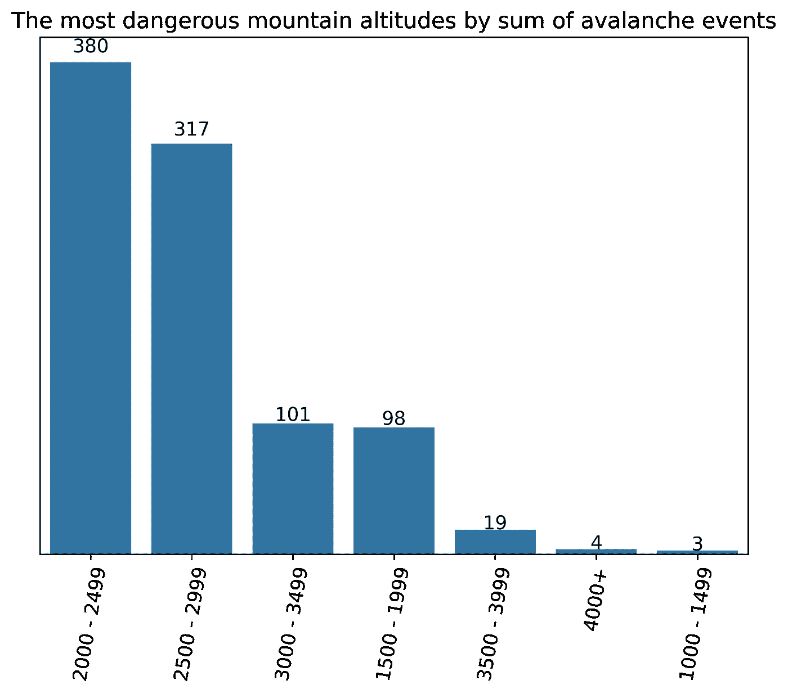
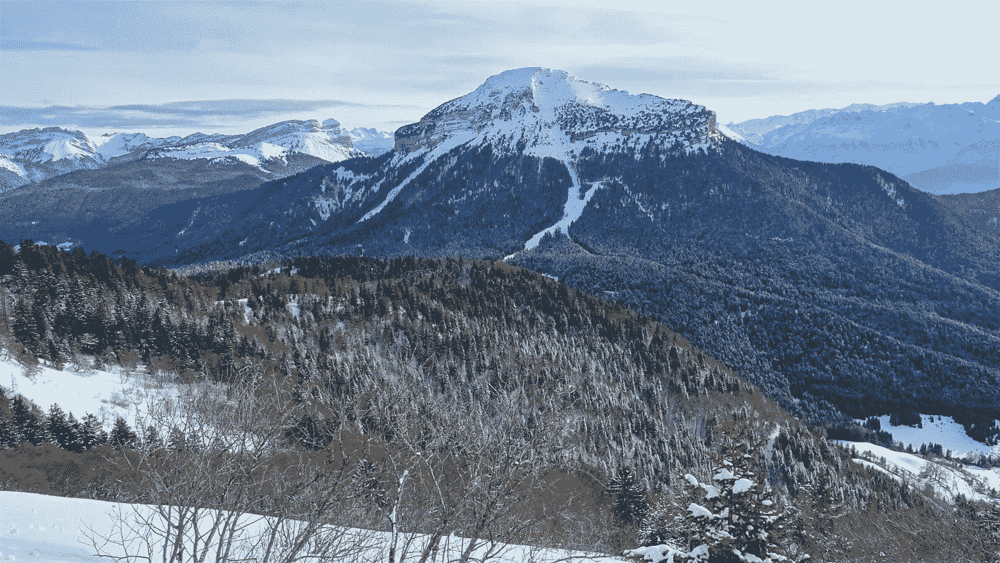

# 不平衡数据集的随机森林:法国阿尔卑斯山雪崩的例子

> 原文：<https://towardsdatascience.com/random-forest-for-imbalanced-dataset-example-with-avalanches-in-french-alps-77ffa582f68b?source=collection_archive---------9----------------------->

如何评估和提高高度不平衡数据的随机森林的性能？让我们看看法国阿尔卑斯山雪崩的使用案例。

徒步旅行者眺望法国阿尔卑斯山勃朗峰，图片来源:卡米拉·哈马尔契科娃

***目录***

*   *1)不平衡数据集的性能指标简介*
*   法国阿尔卑斯山雪崩的随机森林(RF ):为什么回忆胜于精确？
*   *2.1)欠采样以提高 RF 模型的性能*
*   *2.2)提高射频模型性能的特性选择*
*   *2.3)平衡射频以提高射频型号的性能*
*   *3)结果汇总*

在大多数数据科学课程中，他们让你在“太完美”的数据集上工作，其中每个类别或类或多或少地被平等地表示。但是，当你穿过矩阵的另一边时(不是你在数学课上讨厌的那一边，是有 Neo 和很酷的慢速移动子弹的那一边)，现实是混乱的，你会发现更多的例子，其中一个类比另一个类出现得更频繁。

> **多数类:**具有太多观察值的类
> 
> **少数类:**仅代表整个数据集的一小部分的类

# **1.1 牛逼的准确度是误导**

经典的例子是大多数疾病的临床研究。你会发现只有极少数人患有某种疾病(除非你关注发达国家的 Covid 或肥胖症)。因此，**您正在处理不平衡的数据集，默认情况下，您将获得令人印象深刻的准确性**。

当只有 [4.7 %的人口被诊断为白血病](https://www.wcrj.net/wp-content/uploads/sites/5/2018/06/e1080-A-study-on-the-incidence-and-mortality-of-Leukemia-and-their-association-with-the-Human-Development-Index-HDI-worldwide-in-2012.pdf)时，你对某人没有白血病的预测会有很高的准确率，你甚至不需要用机器学习算法弄脏你的手或键盘。你可以简单地运用常识。

# **1.2 F1 的分数统治了他们所有人**

因此，当数据集不平衡时，您应该更多地关注其他指标，例如 [**F1 得分**](https://scikit-learn.org/stable/modules/generated/sklearn.metrics.f1_score.html) 。F1 的分数与刘易斯·汉密尔顿或迈克尔·舒马赫无关，它是**精确度和召回率的加权平均值**。

> **雪崩预测**经典**二元分类问题** **有很多 0 =否定** =多数类“无雪崩”的例子****少数 1 =肯定** =少数类“雪崩”的例子。**

**回忆告诉您模型在一组真 1 和假 0(假阴性)中预测 1 的准确程度。精度告诉我们模型在真 1 和假 1(假阳性)组中预测 1 的准确程度。所有指标(F1 分数、精确度和召回率)从 0 到 1。当 0 表示完全错误的结果时，1 表示完美的预测。**

> **通常，我们不得不满足于在精确度和召回率之间进行权衡。这取决于我们的用例，**我们更关心最小化假阴性(优先考虑召回)还是假阳性(优先考虑精确度)？****

**根据提到的指标，我将主要关注加权 F1 分数和雪崩日的回忆。**

# ****2 法国阿尔卑斯山雪崩的随机森林****

**我将使用超过 540，000 个条目的数据集，经过数据争论后，这些数据汇集了法国阿尔卑斯山 22 个不同地块从 2010 年 10 月到 2019 年 9 月每天不同的降雪和气象变量。这些数据是我的自变量(机器学习中的特征)。某一天某一地块是否发生雪崩是因变量(标签)。这是一个非常不平衡的数据集，因为雪崩只出现在 0.4%的案例中。**

> **特征来源:[法国山区 S2M 气象和积雪再分析(1958 年至今)](https://en.aeris-data.fr/metadata/?865730e8-edeb-4c6b-ae58-80f95166509b)选定年份法国阿尔卑斯山数据**
> 
> **标签来源:Data-Avalanche.org 发生雪崩**

****

**法国阿尔卑斯山白湖的日出，图片来源:Kamila Hamalcikova**

## **回忆和精确:哪个更重要？**

**在 54 万个条目的不变样本上运行 Random Forest (RF)时，加权 F1 得分为 0.99793，确实不错。但是，仍然有精度和召回来更详细地研究。对我来说，我更看重回忆而不是精确。此外，我更看重少数类(有雪崩的日子)的回忆，而不是多数类(没有雪崩的日子)的回忆。为什么？**

****误报**是我预测雪崩的日子，但实际上并没有真正的危险。这一糟糕预测的代价可能是无聊的徒步旅行者或被困在家中观看 Youtube 上的猫视频的滑雪者，因为他们没有更好的事情可做。**

**假阴性是我预测没有雪崩的日子，但是对那些相信我的假预测的可怜的徒步旅行者和滑雪者来说，真的有雪团落下的危险。因此，这个糟糕预测的**代价甚至可能是人命**。这就是为什么回忆战胜了精确，我确实更关心雪崩时的回忆，而不是没有雪崩时的回忆。**

> **用随机森林模型预测法国阿尔卑斯山雪崩的所有代码可以在我的 GitHub repo [这里](https://github.com/Kamila-Hamalcikova/Avalanche_prediction_for_massifs_in_French_Alps)找到。**

**在我的第一个 F1 得分为 0.99793 的 RF 模型中，我在没有雪崩的日子里得到的回忆值为 1，而在雪崩的日子里只有 0.546。这意味着我能准确预测没有雪崩的日子，但我只能准确预测每隔一天有雪崩的日子。山区救援人员可能不太喜欢这种模式。**

# ****2。1 欠采样技术获得更好的结果****

**在处理不平衡数据集时，可以尝试对数据进行重采样。数据科学家最喜欢的技巧是尝试过采样或欠采样方法。**

> ****过采样**:少数阶级的过度代表**
> 
> ****欠采样**:欠多数类表示**

**幸运的是，我有相当大的数据集，所以我可以很容易地从样本中删除一些没有雪崩的日子。这是欠采样。但是如果你有一个小数据集，欠采样不是你的解决方案，因为很多重要的信息会在这个过程中丢失。传统上，过采样使用得更多。这发生在大数据时代之前，当时获得包含数千或数百万次观察的庞大数据集的成本非常高。**

**因此，我使用了**欠采样来创建 50 %有雪崩情况和 50 %没有雪崩情况的样本**。这导致数据集只有 4078 个观察值，而不是之前正常样本的 540 000 个观察值。加权 F1 分数下降到 0.9019，对没有雪崩的日子的回忆下降到 0.87，但对有雪崩的日子的回忆上升到 0.94。即使最后一个数字是我们最关心的数字，但我的模型离现实世界很远。**

****我使用了魔法或者更准确地说是数学技巧，将召回率从不令人满意的 0.548 提高到惊人的 0.940** 。就数学而言，这完全没问题，但如果考虑到统计学或数据科学，就没那么好了。在法国阿尔卑斯山的真实山脉上，雪崩并不是每两天出现一次，即使我们认为其中一些没有被注意到，并从任何数据库中消失。**

****

**很难说，有多少次雪崩没有记录。冬季格勒诺布尔附近的森林，图片来源:卡米拉·哈马尔奇科娃**

**但是要注意，称欠采样方法完全是浪费时间，因为这不是终点。下一步是现在在正常样本上使用这个机器学习模型(在欠样本上训练)并比较结果。**

**第一个在正常样本上训练的模型在雪崩的日子里给了我们 0.546 的回忆。该模型(在欠样本下训练，但用于正常样本)略有改进；回忆 0.548 有雪崩的日子。是的，更好，但不是很好。我们还可以尝试什么来提高召回率？**

# ****2.2 特性选择和工程****

**另一种提高随机森林性能的方法是对独立变量做一些小的改动，从已经存在的变量中创建新的变量(特征工程)或者去掉不重要的变量(特征选择)。**

**基于探索性数据分析，我注意到**雪崩在某些月份和某些高度比在其他月份和高度更频繁地出现**。甚至在应用任何机器学习模型之前，小于 1500 米的海拔就已经从数据集中移除了。**

****

**2010 年至 2019 年法国阿尔卑斯山最常发生雪崩的高度，数据来源:Data-Avalanche.org，图表:Kamila Hamalcikova**

**现在，我还决定**删除“较高的异常值”，海拔超过 3600 米(有限海拔)的条目**，**删除夏季月份(无夏季)的条目**，而不是将法国阿尔卑斯山的特征分成 22 个不同的山体，我试图**忽略山体，只使用整个法国阿尔卑斯山的数据(无山体)**。**

**我分别运行了所有三个选项(有限海拔、无夏季、无山丘)的 RF 模型，后来还结合了这三个选项中的最佳选项。**我在有雪崩的日子里获得的最好回忆是没有夏天的变体**的 0.575，而没有山丘的变体实际上将回忆降低到 0.528。有限的海拔和没有夏天的结合导致了比单独选择更少的回忆。没有地块和没有夏天的组合以 0.559 的召回率结束。因此**最受欢迎的模型是没有夏季月份的随机森林模型**。**

**山区救援人员可能也不会批准这个模型(我可以预测 10 次雪崩中的 6 次)，但这是我在有限的时间内从我的数据集得到的最好的结果。特征的数据源(上面的链接)实际上更大，提供了更多的变量用于机器学习模型，但由于我的计算机的计算能力有限，我只使用了其中的一部分。**

**我没有谈论加权 F1 分数，因为所有具有功能选择的模型都设法获得了从 0.997 到 0.998 的相对较高的指标，因此仅仅基于 F1 分数而偏爱一个模型是没有意义的。**

# **2.3 随机森林模型的修改**

**当然，你总是可以走出随机森林，尝试不同的机器学习模型。但是 RF 还有一招对付不平衡数据的锦囊妙计， [**【平衡随机森林(BFR)**](https://imbalanced-learn.org/stable/generated/imblearn.ensemble.BalancedRandomForestClassifier.html) 。文档上说这个模型**随机地对每个助推器样本进行欠采样以平衡它**。如果这个解释仍然有点模糊，我们可以说:**

> **平衡随机森林是 RF 的修改，其中为每棵树构造两个大小相同的自举集，大小等于少数类的大小:一个用于少数类，另一个用于多数类。这两个集合共同构成了训练集。**

**对于这个模型，你需要先安装**不平衡学习库**，然后你就可以开始了。运行之后，我**将雪崩日的召回率提高到了 0.91，但是精确度却急剧下降到了 0.03** 。此外，在没有特征选择的样本上，BFR 的加权 F1 分数下降到 0.939。大多数山地救援队可能会批准这种模式，因为它最大限度地减少了假阴性。**

**另一方面，这个模型给了我们非常高的误报率。超过 19，000 个错误预测的完全没有威胁的雪崩日。所有其他模型的假阳性数量明显较低，只有 0 到 3 个假阳性。因此，我有一种感觉，当滑雪运动的所有者可以加入到与山地救援队的讨论中时，他们会强烈地推动没有夏天的 RF 模型，雪崩日的召回率为 0.58，F1 得分较高。**

****

**法国阿尔卑斯山中部格勒诺布尔和 Chamechaude 山附近的“随机”森林，来源:Kamila Hamalcikova**

# **3 雪崩预测结果总结**

**回忆有雪崩的日子(为了减少假阴性的数量)是我评估雪崩预测性能的主要指标，加权 F1 分数紧随其后。我使用了 3 种不同的技术来解决高度不平衡的数据问题:**

*   **1) **根据欠采样训练的 RF 模型，用于正常样本**:结果是雪崩日召回率从 0.546(根据正常样本训练的模型)略微提高到 0.548。两种 RF 模型加权 F1 值均为 0.998。**
*   **2) **特征选择**:我对特征使用了 3 种不同的变化:A)没有夏季月份的样本 B)海拔有限(不超过 3600 米)的样本 C)没有地块划分的样本。我还检查了 A+B 和 A+C 的组合。所有五个模型都产生了类似的 F1 分数 0.997-0.998，但召回率最高的是选项 A。没有夏季月份的样本在雪崩日的召回率为 0.58，因此是最受欢迎的选项。**
*   **3) **平衡 RF 模型**:这个机器学习模型确实为雪崩日提供了 0.91 的召回率，但它的 F1 分数下降到了 0.939，雪崩日的精度是悲惨的 0.03(之前提到的所有模型的精度都是 1 或至少接近 1)。此外，该模型在某种意义上使用与欠采样类似的方法，仅在每个引导上使用，因此其在真实世界中的性能值得怀疑。这意味着我们对简单欠采样 50 %的反对意见:50 %也适用于平衡 RF 模型。**

****结论**:在没有夏季月份的样本上，我会选择 RF 模型，因为它对雪崩日有第二好的回忆 0.58 和可接受的 F1 分数。最佳召回率为 0.91 的平衡 RF 模型没有被选中，因为它的 F1 分数较低，精度很差，在现实世界中应用时可能会出现问题。**

***该项目是在*[*Jedha*](https://en.jedha.co/)*公司组织的**full stack 数据科学训练营期间完成的。***

## **参考文献和引文:**

*   **[1]: Ł.德戈尔斯基和日。Kobylinski 和 A. Przepiórkowski。(2008).*定义提取:改善平衡随机森林【https://annals-csis.org/proceedings/2008/pliks/154.pdf*T22**
*   **J.布朗利。(2020 年 2 月)。B *用于不平衡分类的聚集和随机森林*[https://machine learning mastery . com/bagging-and-Random-Forest-for-balanced-class ification/](https://machinelearningmastery.com/bagging-and-random-forest-for-imbalanced-classification/)**
*   **J.布朗利。(2020 年 1 月)。*如何计算不均衡分类的精度、召回率和 F-Measure*[https://machinelingmastery . com/Precision-Recall-and-F-Measure-for-unbalanced-class ification/](https://machinelearningmastery.com/precision-recall-and-f-measure-for-imbalanced-classification/)**
*   **J.哈尼卡特。(2018 年 5 月)。*用 Python 实现随机森林分类模型*[https://medium . com/@ hjhuney/Implementing-a-Random-Forest-class ification-Model-in-Python-583891 c 99652](https://medium.com/@hjhuney/implementing-a-random-forest-classification-model-in-python-583891c99652)**
*   **栗色你好。(2017). *Growing RForest — 97%的召回率和 100%的准确率***[https://www . ka ggle . com/palm book/Growing-r forest-97-Recall-and-100-Precision](https://www.kaggle.com/palmbook/growing-rforest-97-recall-and-100-precision)****
*   ****米（meter 的缩写））弗奈、m .拉斐塞、p .哈根穆勒、R. Nheili、D. Verfaillie 和 S. Morin。(2019).*法国山区 S2M 气象和积雪再分析(1958 年至今)*[https://en.aeris-data.fr/metadata/?865730 E8-edeb-4c6b-ae58-80f 95166509 b](https://en.aeris-data.fr/metadata/?865730e8-edeb-4c6b-ae58-80f95166509b)****
*   ****数据来自 Data-Avalanche.org[http://www.data-avalanche.org/](http://www.data-avalanche.org/)(2020 年通过电子邮件发送)****