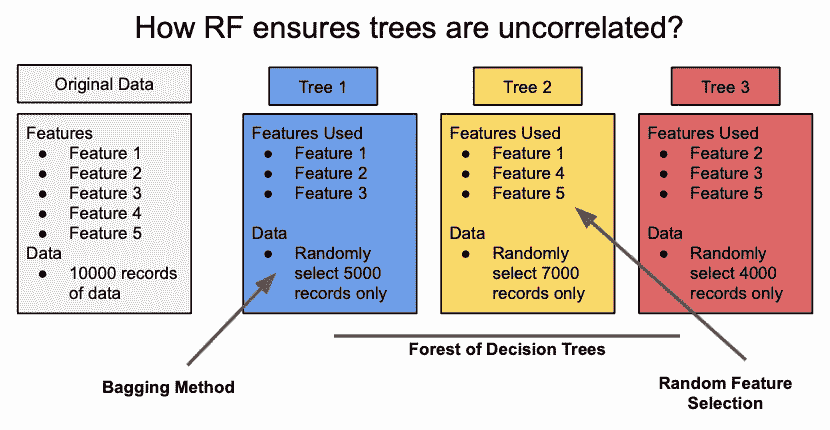
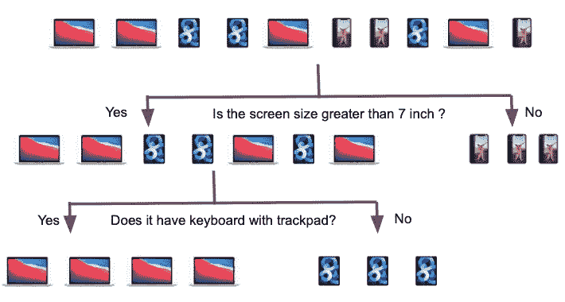
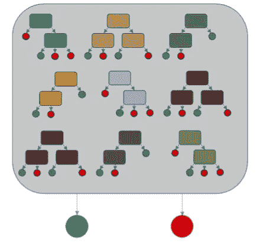

# 简单英语随机森林:为什么这么受欢迎？

> 原文：<https://towardsdatascience.com/random-forest-in-simple-english-why-is-it-so-popular-3ba04d0374d?source=collection_archive---------17----------------------->

## 你想知道的关于常用算法的一切

法比奥·康帕雷利在 [Unsplash](https://unsplash.com/s/photos/forest-from-drone?utm_source=unsplash&utm_medium=referral&utm_content=creditCopyText) 上拍摄的照片

随机森林是现实生活中数据科学项目以及数据科学竞赛中最流行和最常用的算法之一。这个故事背后的想法是用简单的术语来解释这个流行的算法。随机森林算法是一个集成模型，这意味着在进行预测的过程中建立了多个模型。具体来说，在随机森林的情况下，建立许多决策树模型，并基于这些独立决策树预测的平均值进行最终预测。

好的，但是这些决策树是如何构建的呢？他们使用相同的数据集吗？为了提高模型输出的性能，随机森林算法将为每个决策树使用不同的数据子集以及不同的特征子集。这确保了模型中没有偏差，因为没有特定的数据段或一组特征支配预测结果。它还确保了每个模型都是不同的，否则拥有这么多模型就没有什么好处了。如果单个模型是使用相同的数据集和相同的特征构建的，那么无论我们构建多少个不同的模型，预测结果都不会有太大的不同。随机森林算法避免了过度拟合，因为它使用来自数据和特征的不同子集，这有助于产生不同的不相关模型。

作者图片

现在说到它的名字，为什么叫随机森林？它被称为随机森林，因为我们使用**随机**数据和特征子集，最终我们构建了一个**决策树(许多树)森林**。随机森林也是 bagging 方法的一个经典例子，因为我们在每个模型中使用不同的数据子集来进行预测。

# 什么是决策树？

下面是一个决策树算法的简单例子。让我们在 iPhones、iPads 和 MacBooks 的分类中使用决策树算法。决策树是一种简单的基于规则的算法。它通过一系列问题对数据集进行分类，这些问题被称为决策节点。

在下面的例子中，屏幕大小首先用于将 iPhones 与 iPads 和 MacBooks 区分开来。然后，我们可以通过检查键盘和触控板的存在来区分 iPads 和 MacBooks。

作者图片

在现实生活中，如果出现分类问题，我们也会使用一系列问题将数据集分类到不同的类别中。在一个随机森林中，我们将构建许多这样的决策树来做出更好的预测。数据子集和特征的随机选择确保了随机森林中的各个决策树彼此不同。下面是不同的树在随机森林算法中的典型图像，

图片来自[维基百科](https://commons.wikimedia.org/wiki/File:Decision_Tree_vs._Random_Forest.png#filelinks)

# 为什么是随机森林？

一些特征使得随机森林算法在各种数据集以及不同类型的问题上表现得更好。是的，它既可以用于分类问题，也可以用于回归问题。以下是使它胜过许多其他型号的一些特征，

*   随机森林中的最终模型预测基于来自所有个体决策树模型的聚集预测，因此避免了过度拟合。然而，这里重要的一点是，各个模型(决策树)不应该高度相关
*   随机森林算法由许多决策树组成，决策树背后的机制也有助于识别在进行预测时很重要的特征，因此随机森林天生擅长变量选择
*   与许多其他算法(如线性回归、SVM 等)不同。)random forest 对数据或其分布不做任何假设。因此，它通常需要最少的数据转换
*   随机森林算法利用特征的随机子集，因此它可以很好地处理高维数据集(具有大量特征的数据集)

# 何时使用随机森林？

与其他算法相比，有些情况下随机森林是更好的选择。其中一些场景是，

*   当数据集有离群值时，因为随机森林算法不受它们的影响
*   当数据集中存在噪声时，许多算法会将噪声视为模式，但随机森林中使用的 bagging 方法可确保数据集中的噪声不会被错误地视为信号或模式
*   当数据集中有缺失值时，随机森林具有有效的选项来估计缺失值并保持准确性，即使大部分数据缺失

因此，随机森林可能是处理含有异常值、噪声和/或缺失值的数据集的更好选择。

此外，随机森林算法可以有效地处理大型数据集，并且可以处理具有大量要素的数据集，而不会丢弃任何要素，也不需要降维

除了预测问题，随机森林可能是识别重要特征的一个好选择。

# 什么时候不用？

现在，我们来看随机森林并不是一个合适的选择。

*   当预计测试数据集将不同于训练数据集时，随机森林不是一个好的选择。随机森林算法需要训练数据集包括所有或大多数可能的场景，因为它不能很好地处理测试数据集中出现的新模式
*   如果需要建立特征和目标属性之间的关系，那么随机森林是不合适的。随机森林有助于识别重要要素，但无法解释它们与目标属性的关系
*   当数据集使其成为线性回归或 SVM 等算法的明显候选对象时。例如，当要素和目标属性之间存在线性关系时，这对于任何线性模型都很有意义

# 使用 Python 的简单实现

作者编写的脚本

# 最后的想法

随机森林是数据科学家中最流行的算法之一。它可以灵活地用于不同种类的数据集，只需进行最少的数据转换。它适用于大型数据集和高维数据集。它适用于分类和回归问题。最后，因为它是基于规则的，所以很容易向业务涉众解释结果。这里有一个关于随机森林算法的简单教程——[https://www.youtube.com/watch?v=_Wq_ZgEunqQ](https://www.youtube.com/watch?v=_Wq_ZgEunqQ)

# 保持联系

*   如果你喜欢这篇文章，并对类似的文章感兴趣，[在 Medium 上关注我](https://medium.com/@rsharankumar)
*   我在我的 YouTube 频道上教授和谈论各种数据科学主题。[在这里订阅我的频道](https://www.youtube.com/c/DataSciencewithSharan)。
*   在这里注册[我的电子邮件列表](https://chipper-leader-6081.ck.page/50934fd077)获取更多数据科学技巧，并与我的工作保持联系