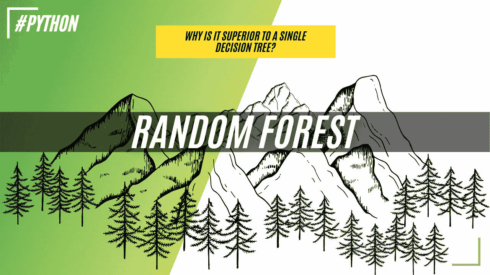
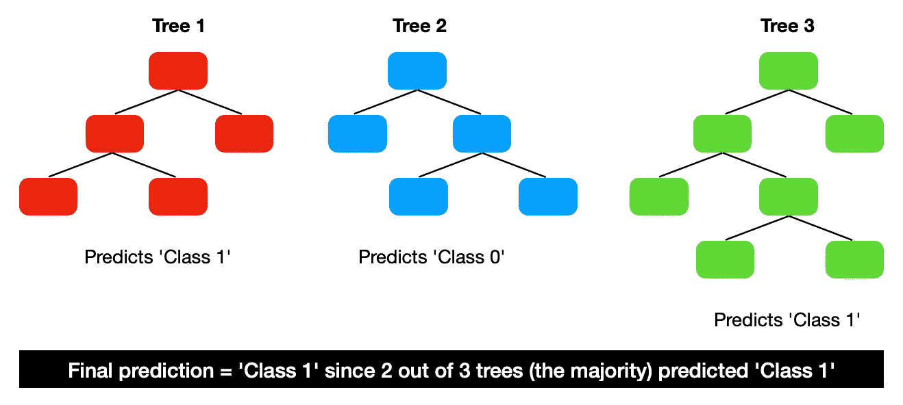
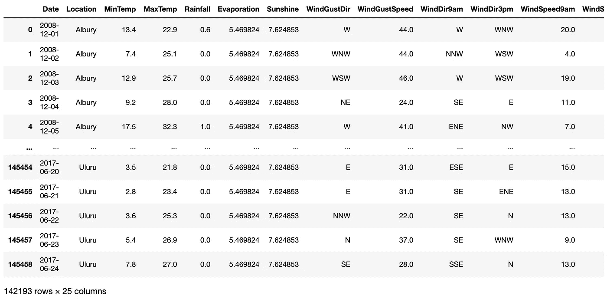
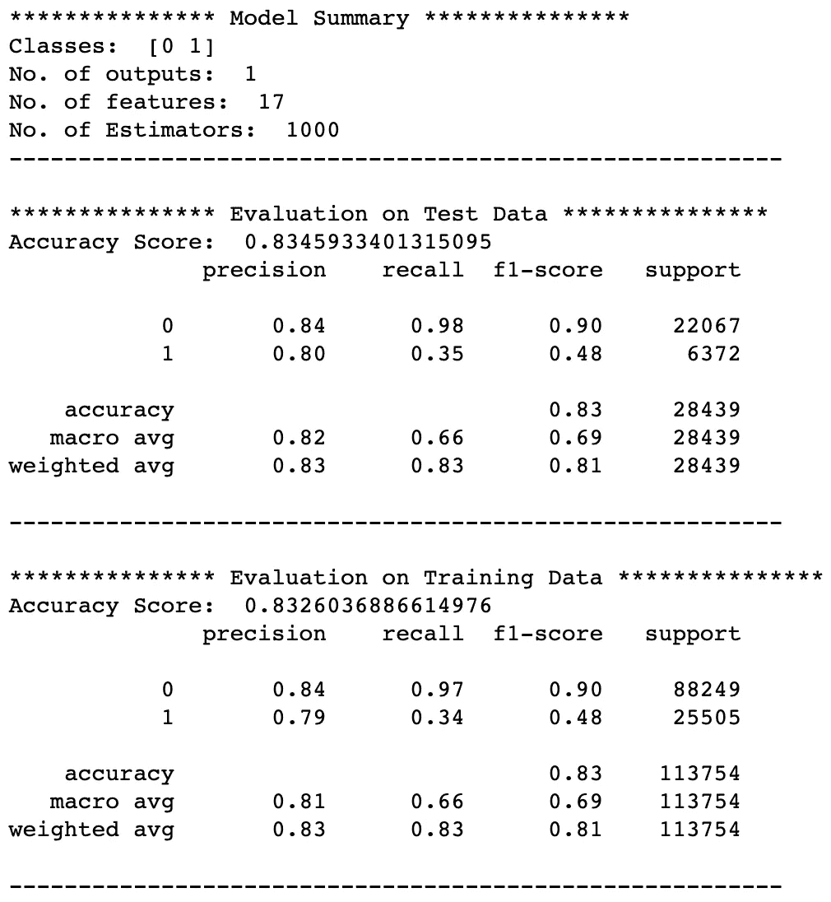
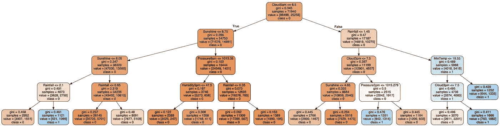
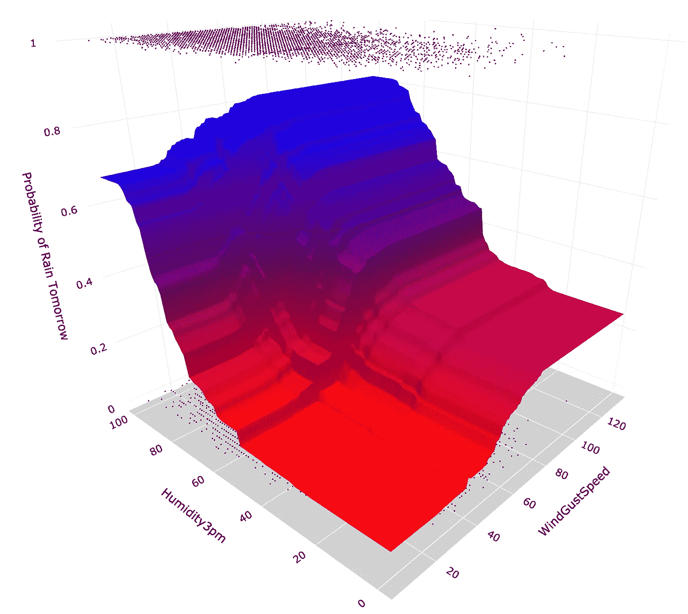
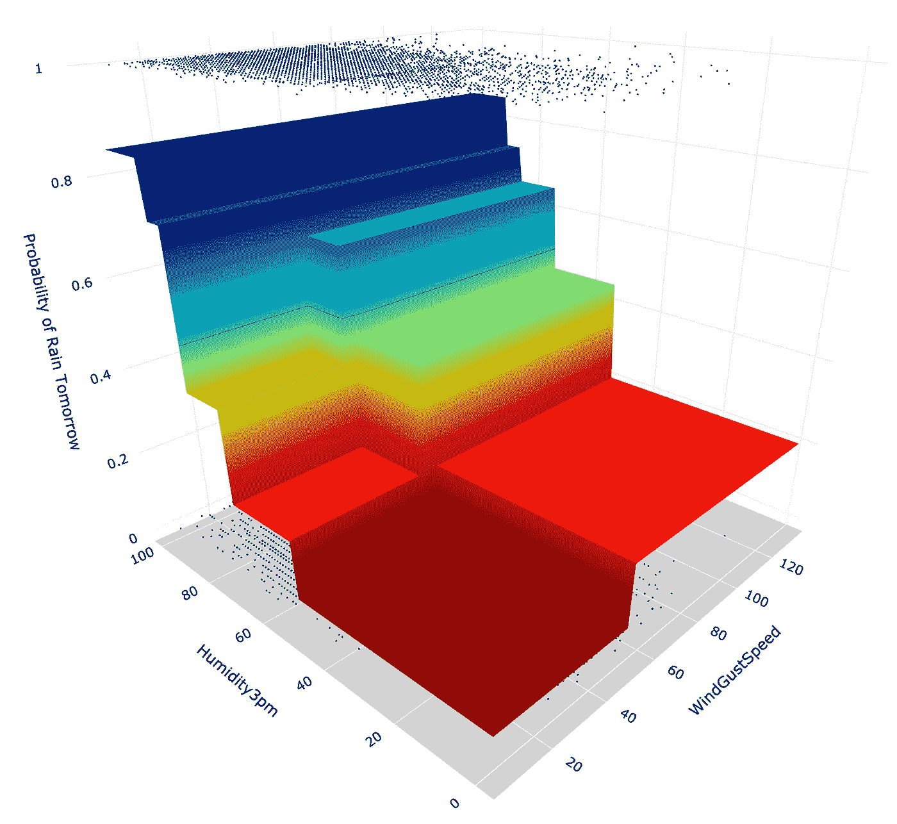

# 随机森林模型:为什么它们比单一决策树更好？

> 原文：<https://towardsdatascience.com/random-forest-models-why-are-they-better-than-single-decision-trees-70494c29ccd1?source=collection_archive---------12----------------------->

## 机器学习

## 详细解释了随机森林机器学习算法的工作原理，它优于决策树的原因，以及如何用 Python 来构建它们



随机森林。图片由[作者](https://solclover.medium.com/)提供。

# 介绍

如果你想成为一名成功的数据科学家，你需要了解不同机器学习算法的细微差别。

这个故事是我深入研究这种算法如何工作的系列文章的一部分。这包括简单的示例、3D 可视化和完整的 Python 代码，供您在数据科学项目中使用。

# 故事涵盖以下主题:

*   随机森林分类属于算法范畴
*   解释随机森林分类如何工作，以及为什么它比单一决策树更好
*   Python 代码示例和可视化

# 它属于哪一类算法？

类似于其他一些算法，随机森林可以处理分类和回归。虽然在这个故事中，我关注的是分类，但同样的逻辑在很大程度上也适用于回归。

快速回顾一下分类和回归之间的区别:

*   利用**分类**，我们试图预测一个类别标签。换句话说，它用于输出(目标变量)取一组有限值的问题，例如，明天是否会下雨。对应算法:`[*sklearn.ensemble.RandomForestClassifier*](https://scikit-learn.org/stable/modules/generated/sklearn.tree.DecisionTreeClassifier.html#sklearn-tree-decisiontreeclassifier)`
*   同时，**回归**用于预测数字标签。这意味着您的输出可以采用无限多的值，例如，房价。对应算法:`[*sklearn.ensemble.RandomForestRegressor*](https://scikit-learn.org/stable/modules/generated/sklearn.ensemble.RandomForestRegressor.html)`

这两种情况都属于机器学习算法的监督分支。下图是**交互式的，**所以一定要点击不同的类别来**放大并展示更多的**👇。

机器学习算法分类。由[作者](https://solclover.com/)创建的互动图表。

***如果你喜欢数据科学和机器学习*** *，请* [*订阅*](https://solclover.com/subscribe) *每当我发布一个新故事时，你都会收到一封电子邮件。*

# 随机森林分类算法是如何工作的？

在引擎盖下，随机森林本质上是一个 CART 算法(分类和回归树)，除了它创建了许多树的**集合**而不是一个。这提供了几个优点，例如:

*   改进的性能(群体的智慧)
*   改进的鲁棒性(不太可能过度拟合，因为它依赖于许多随机树)

*如果你不熟悉 CART，你可以在我之前的故事里找到关于它的一切:*

[](/cart-classification-and-regression-trees-for-clean-but-powerful-models-cc89e60b7a85) [## CART:清晰而强大的模型的分类和回归树

### CART 算法是如何工作的，如何在 Python 中成功使用？

towardsdatascience.com](/cart-classification-and-regression-trees-for-clean-but-powerful-models-cc89e60b7a85) 

## 群体的智慧——它是什么，为什么好？

随机森林算法对类别标签使用多数一致预测，这意味着每棵树预测观察值是属于“类别 0”还是“类别 1”。如果 100 棵树中有 55 棵树预测为“1 类”, 45 棵树预测为“0 类”,那么最终的模型预测将是“1 类”。



多重决策树。图片由[作者](https://solclover.medium.com/)提供。

来自多个树的多数预测比单个树的预测更好，因为这些树相互保护免受它们各自错误的影响。然而，这取决于树之间相对不相关。

## 构建多棵树的过程

问题是，我们如何从同一个数据池中构建许多树，同时保持它们相对不相关？它有两个部分:

1.  Bootstrap 聚合(带替换的随机抽样)
2.  特征随机性

## 自举聚合

决策树是所谓的 ***高方差估计器*** ，这意味着样本数据的微小变化都会极大地影响树结构及其预测。

理想情况下，您希望通过创建许多树并在聚合中使用它们来进行预测，从而将它变成一个 ***低方差估计器*** 。

Bootstrapping 是一种技术，它不是采用整个训练数据来构建一棵树，而是使用替换采样来创建许多相同大小的样本。然后，您可以使用这些样本来构建单独的树。例如:

```
Whole data (10 observations): [1,2,2,2,3,3,4,5,6,7]Bootstrap sample 1 (10 obs): [1,1,2,2,3,4,5,6,7,7]
Bootstrap sample 2 (10 obs): [1,2,2,2,2,3,3,3,3,6]
...
Bootstrap sample n (10 obs): [2,2,2,3,4,5,6,6,7,7]*Note, how each of your samples consist of 10 observations.*
```

在这种情况下，您从整个样本中随机选取一个数字，并记录您选取的数字。然后重复这个动作，直到你记录了 10 次观察结果。

相当于从一桶红色和蓝色的球中随机选择一个球，记录它的颜色，然后在重复相同的动作之前将它放回桶中。

这种方法产生许多具有相同观察值但不同分布的样本。最后，这些树的聚集导致模型预测的方差减少，将其变成一个低方差估计器。

## 特征随机性

降低树之间相关性的第二部分来自于在为每个节点寻找最佳分割时使用随机选择的特征。

例如:

```
Full list of features: [feat1, feat2, ..., feat10]Random selection of features (1): [feat3, feat5, feat8]
Random selection of features (2): [feat1, feat5, feat10]
...The split in the first node would use the most predcitive feature from a set of [feat3, feat5, feat8]
The splint in the second node would use the most predictive feature from a set of [feat1, feat5, feat10]
...*Note, when building a Random Forest model, you can control the number/proportion of features that are used to find the best split for each node.*
```

此过程允许创建相关性较低的树，并与引导聚合相结合，生成一个随机森林。

[](https://solclover.com/membership)[](https://www.linkedin.com/in/saulius-dobilas/)

# 随机森林分类模型的 Python 示例

抛开理论，让我们用 Python 构建一个随机森林模型。

## 设置

我们将使用以下数据和库:

*   来自 Kaggle 的澳大利亚天气数据
*   [Scikit-learn 库](https://scikit-learn.org/stable/index.html)，用于将数据拆分为[训练测试](https://scikit-learn.org/stable/modules/generated/sklearn.model_selection.train_test_split.html?highlight=train_test_split#sklearn.model_selection.train_test_split)样本，构建[随机森林模型](https://scikit-learn.org/stable/modules/generated/sklearn.ensemble.RandomForestClassifier.html)，以及[模型评估](https://scikit-learn.org/stable/modules/generated/sklearn.metrics.classification_report.html?highlight=classification_report#sklearn.metrics.classification_report)
*   [Plotly](https://plotly.com/python/) 用于数据可视化
*   用于数据操作的[熊猫](https://pandas.pydata.org/docs/)和 [Numpy](https://numpy.org/)
*   [Graphviz 库](https://graphviz.readthedocs.io/en/stable/manual.html)绘制决策树图

让我们导入所有的库:

然后我们从 Kaggle 获取澳大利亚的天气数据，你可以按照这个链接下载:[https://www . ka ggle . com/jsphyg/weather-dataset-rattle-package](https://www.kaggle.com/jsphyg/weather-dataset-rattle-package)。

我们接收数据并推导出一些新的变量用于模型中。



Kaggle 的澳大利亚天气数据的一个片段，做了一些修改。图片由[作者](https://solclover.medium.com/)提供。

接下来，让我们按照以下步骤构建一个模型:

*   步骤 1-选择模型特征(自变量)和模型目标(因变量)
*   步骤 2 —将数据分为训练样本和测试样本
*   步骤 3-设置模型参数并训练(拟合)模型
*   步骤 4-使用我们的模型预测训练和测试数据上的类别标签
*   步骤 5-生成模型摘要统计数据

上述代码生成以下总结模型性能的输出。



随机森林模型性能。图片由[作者](https://solclover.medium.com/)提供。

正如我们所看到的，当与训练数据相比时，该模型在测试数据上具有相似的性能。估计值的数量是 1000，这意味着我们的随机森林由 1000 棵个体树组成。这是一棵树 552 的样子。如果您愿意，您可以通过更改索引来为它们中的每一个生成树形图。



决策树图。图片由[作者](https://solclover.medium.com/)提供。

## 奖金代码

虽然我们无法使用 17 个特征轻松地可视化所有模型预测，但当我们仅使用 2 个特征构建随机森林时，我们可以做到这一点。为此，我们首先需要使用上面的代码构建另一个模型，记住只选择 2 个特性:

```
X=df[['WindGustSpeed', 'Humidity3pm']]
```

建立模型后，我们使用以下代码用 Plotly 创建 3D 可视化:

上面生成了下图。



随机森林模型预测面。图片由[作者](https://solclover.medium.com/)提供。

从上面的图像中，我们可以清楚地看到，随着下午 3 点的湿度和阵风速度的增加，明天下雨的机会增加。此外，虽然不完全平滑，但与仅使用一个决策树相比，决策面的大步骤变化较少(见下图)。



单一决策树模型预测曲面。图片由[作者](https://solclover.medium.com/)提供。

# 结论

随机森林是性能最好的机器学习算法之一，已经被广泛采用。虽然它比单一的决策树模型更难解释，但它带来了许多优势，例如改进的性能和更好的泛化能力。

感谢您的阅读，您可以在自己的数据科学项目中随意使用上述代码和材料。

干杯！👏
**索尔·多比拉斯**

***如果你已经花光了这个月的学习预算，下次请记得我。*** *我的个性化链接加入媒介是:*

[](https://solclover.com/membership) [## 通过我的推荐链接加入 Medium 索尔·多比拉斯

### 作为一个媒体会员，你的会员费的一部分会给你阅读的作家，你可以完全接触到每一个故事…

solclover.com](https://solclover.com/membership) 

此外，您可能有兴趣了解随机森林与 AdaBoost 的对比:

[](/adaboost-algorithm-remarkably-capable-but-with-one-interesting-limitation-cf95905bf8a0) [## AdaBoost 机器学习算法:如何提高难以预测案例的性能

### 对自适应 Boosting 算法及其与其他基于决策树的机器的区别的直观解释…

towardsdatascience.com](/adaboost-algorithm-remarkably-capable-but-with-one-interesting-limitation-cf95905bf8a0) 

其他升压算法:

[](/gradient-boosted-trees-for-classification-one-of-the-best-machine-learning-algorithms-35245dab03f2) [## 用于分类的梯度增强树——最好的机器学习算法之一

### 梯度增强在分类树中如何工作的分步指南

towardsdatascience.com](/gradient-boosted-trees-for-classification-one-of-the-best-machine-learning-algorithms-35245dab03f2) [](/xgboost-extreme-gradient-boosting-how-to-improve-on-regular-gradient-boosting-5c6acf66c70a) [## XGBoost:极端梯度增强—如何改进常规梯度增强？

### 详细了解这两种算法之间的差异，以及何时应该选择其中一种算法

towardsdatascience.com](/xgboost-extreme-gradient-boosting-how-to-improve-on-regular-gradient-boosting-5c6acf66c70a)