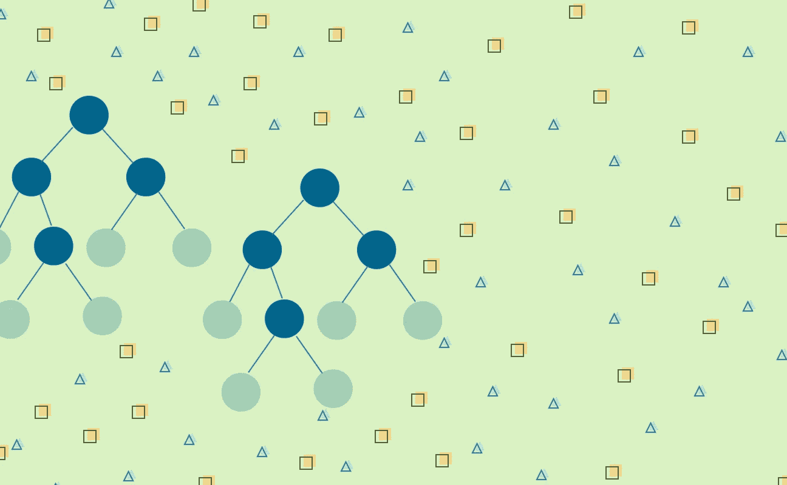
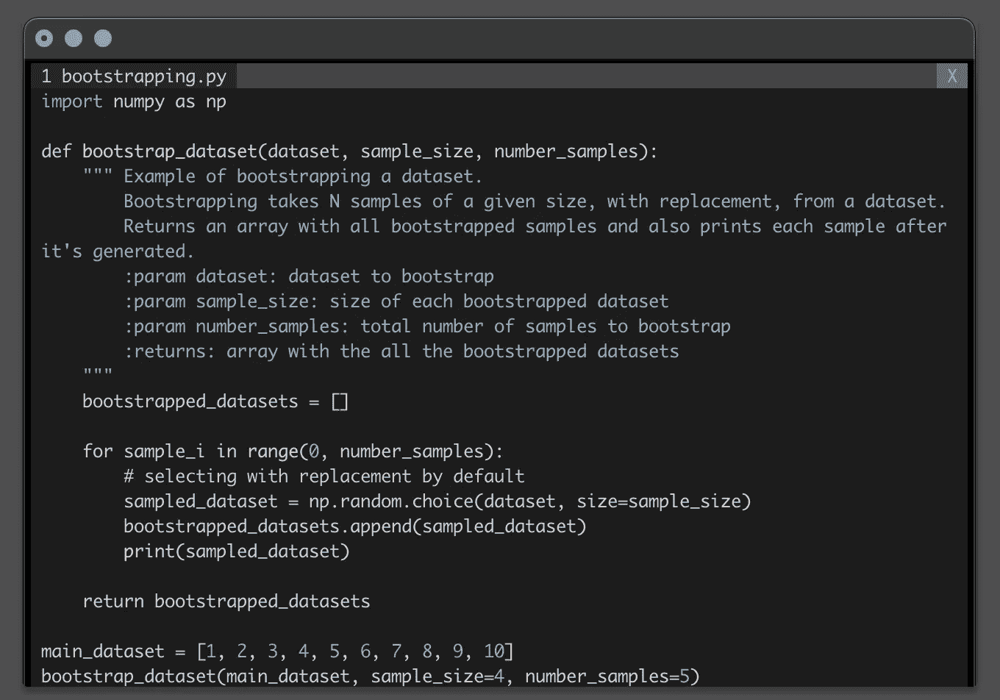
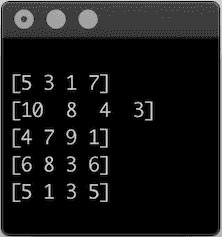
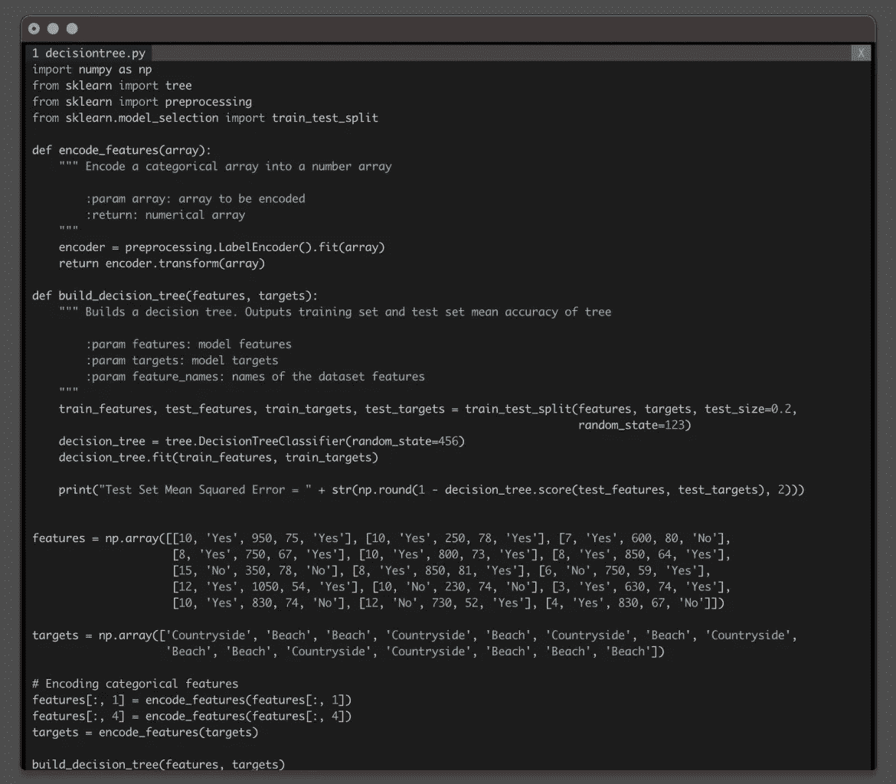
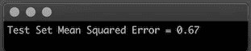
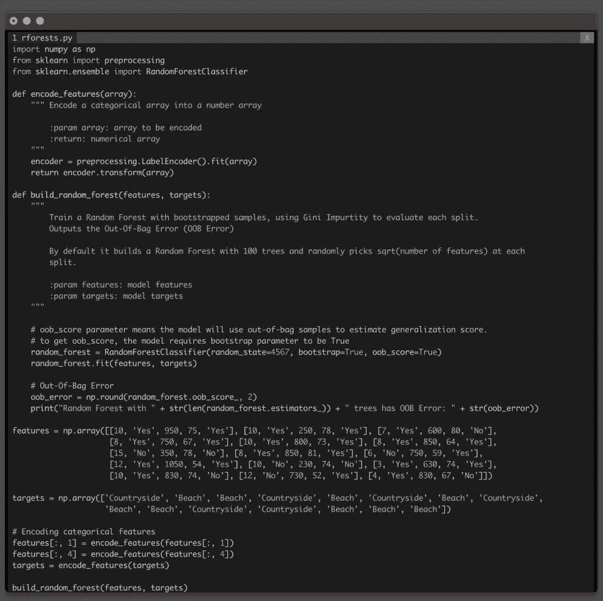
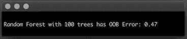
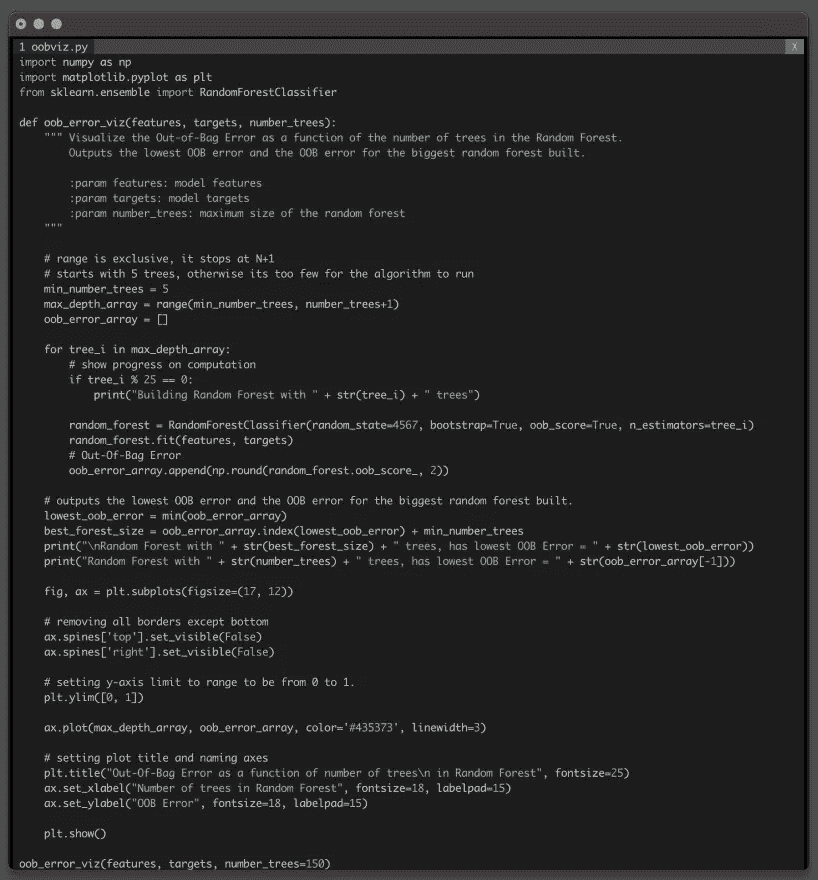
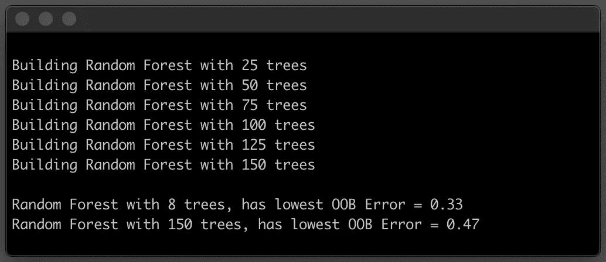
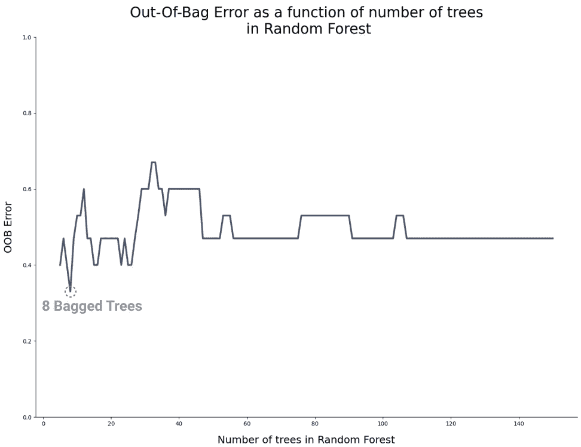

# 用一个真实的例子和一些 Python 代码解释了随机森林算法

> 原文：<https://towardsdatascience.com/random-forests-algorithm-explained-with-a-real-life-example-and-some-python-code-affbfa5a942c?source=collection_archive---------2----------------------->

## 随机森林是一种机器学习算法，它解决了[决策树](/decision-tree-classifier-explained-in-real-life-picking-a-vacation-destination-6226b2b60575) : **方差**的最大问题之一。

图片作者。

*这是致力于基于树的算法系列的第二篇文章，基于树的算法是一组广泛使用的监督机器学习算法。*

*第一篇是关于* [*决策树*](/decision-tree-classifier-explained-in-real-life-picking-a-vacation-destination-6226b2b60575) *。下一篇，也是本系列的最后一篇文章，探索梯度提升决策树。一切都用现实生活中的例子和一些 Python 代码来解释。*

*敬请期待！*

随机森林是一种机器学习算法，它解决了[决策树](/decision-tree-classifier-explained-in-real-life-picking-a-vacation-destination-6226b2b60575) : **方差**的最大问题之一。

尽管决策树简单灵活，但它是[贪婪算法](https://en.wikipedia.org/wiki/Greedy_algorithm)。它侧重于优化手头的节点分裂，而不是考虑分裂如何影响整个树。贪婪的方法使决策树运行得更快，但也容易过度拟合。

过度拟合树被高度优化以预测训练数据集中的值，从而产生具有**高方差**的学习模型。

如何在决策树中计算方差取决于您正在解决的问题。

在回归任务中，您可以计算预测与真实目标相比的实际[差异](https://en.wikipedia.org/wiki/Variance)。如果树产生的结果与它的真实目标相差太远，那么它具有高方差，因此它是过度拟合的。

> 高度过度拟合的树具有高方差。这意味着它的预测与实际目标相去甚远。

但是在分类任务中，你不能使用同样的方法。检测决策树是否过拟合的方法是查看测试错误。如果树有很高的测试误差，意味着它不擅长对没有被训练过的观察值进行分类，那么它是过度拟合的。

> 在回归任务中，通过高方差来检测过度拟合，而在分类任务中，通过高泛化误差来检测过度拟合。

为了解决过度拟合，并减少决策树的差异， [Leo Breiman](https://en.wikipedia.org/wiki/Leo_Breiman) 开发了[随机森林](https://en.wikipedia.org/wiki/Random_forest)算法【1】。这是一种创新的算法，因为它首次利用了[自举](https://en.wikipedia.org/wiki/Bootstrapping_(statistics))的统计技术，并将多个模型的训练结果合并成一个更强大的学习模型。

但是，在您看到随机森林的运行和代码之前，让我们绕道探索一下随机森林的独特之处。

# Bagging:引导聚合

**Bagging** ，是 [Bootstrap Aggregation](https://en.wikipedia.org/wiki/Bootstrap_aggregating) 的简称，是 Leo Breiman 开发的一种技术，目标是减少一个学习模型的方差。Bagging 也是模型不可知的，所以不管你使用什么类型的模型，过程都是一样的。

Bagging 的**引导**部分指的是从数据集[3]中抽取几个随机样本进行替换的重采样方法。因此，Bootstrapping 会从同一分布中创建多个更小的随机数据集。

每个自举数据集用于训练一个模型，然后输出被**聚集**成一个最终结果。

但是聚合也意味着不同的东西，这取决于你正在解决的问题的类型。

当你在处理一个回归问题时，聚合意味着对所有模型的每个观察结果进行平均。而在分类中，聚合意味着为每个观察选择最常见的类，就像进行*多数投票*。

这令人印象深刻但是，*这实际上如何帮助减少模型方差呢？*

每个模型都在不同的数据集上训练，因为它们是引导的。所以不可避免地，每个模型都会犯*不同的*错误，并且有明显的误差和方差。误差和方差都在聚合步骤中减少，在回归的情况下，它们被平均化。

而且因为你最终得到的是一个单一的模型，它结合了多个模型的输出，Bagging 被称为**集成技术**。

# 拔靴带

有了自举，你就遵循了*少花钱多办事的座右铭*。你把一个数据集乘以几个更小的随机数据集。

启动数据集的代码示例。

最初的数据集只有 10 个元素，但是最终产生了 5 个大小为 4 的采样数据集。

在某种程度上，**乘以了数据集**，当你合计单个自举数据集时，从仅仅 10 个观测值增加到 4x5=20 个观测值。

*引导数据集的结果，生成 5 个样本，每个样本包含 4 个元素。*

自举之所以有效，是因为你在用 **替换****采样** **。**

您可以*多次选择*相同的数据点，就像在最后两个样本中一样，但是每个采样数据集与前一个略有不同。

如果没有替换，您将很快用完数据点，并且只能生成有限数量的样本。

这次绕道的重点是随机森林的独特之处。

让我们回到主题，*随机森林如何减少模型方差。*

# 随机森林

随机森林是专门为解决决策树中的高方差问题而开发的。顾名思义，你不是在训练一个单独的决策树，而是在训练整个森林！在这种情况下，一个袋装决策树的森林。

在高层次上，在*伪代码*中，随机森林算法遵循以下步骤:

1.  获取原始数据集并创建大小为 *n* 的 *N* 个袋装样本，其中 *n* 小于原始数据集。
2.  使用每个 *N 个*袋装数据集作为输入来训练决策树。但是，在进行结点分割时，不要浏览数据集中的所有要素。从训练集中的所有特征中随机选择一个较小的数， *M* 个特征。然后使用杂质指标，比如基尼系数或熵，挑选出最佳分割。
3.  将各个决策树的结果汇总到一个输出中。
4.  如果您正在进行回归任务，请对每棵树生成的每个观察值进行平均。
5.  如果你正在做一个分类任务，对每一个观察，在所有的树上进行多数投票。

虽然随机森林的*森林*部分指的是训练多棵树，但是*随机*部分出现在算法中的两个不同点。

装袋过程中存在随机性。但是，您也可以选择一个随机的要素子集来评估结点分裂。这保证了每棵树都是不同的，因此，确保了每个模型产生的结果略有不同。

虽然您可能认为在每次分割时随机采样特性会引入另一个您可能需要调整的[超参数](https://en.wikipedia.org/wiki/Hyperparameter_(machine_learning))，但事实并非如此。模特帮你打理！

您当然可以调整这个超参数。然而，对于随机选取等于数据集中可用要素总数的平方根的多个要素，存在数学共识[2]。

# 为什么使用随机森林？

与训练单个决策树相比，随机森林有几个优点。

## 决策树的所有优点，但更强大

这个算法的核心是一个决策树，所以随机森林分享了它的所有优点。

这是一个数据健壮的算法，能够处理不同类型的数据，并且不需要任何数据预处理。

随机森林的真正潜力来自于组合不同决策树的结果。

## 每个型号都不一样

像决策树一样，该算法针对局部分裂进行优化。但是，它不是探索数据集中每个要素的所有可能分割，而是随机选取这些要素的子集。

这减少了算法在每次分割时需要评估的结果的数量，并且使得每个训练的树略有不同。

## 不需要维持集

在机器学习中，你通常将数据集分成训练集和测试集，努力用它从未见过的观察来评估模型性能。

当数据集很小，或者收集更多数据的成本和工作量很高时，这就成了一个具有挑战性的问题。

但是对于随机森林，您可以使用整个数据集来训练和评估模型。装袋过程会帮你搞定的！由于您正在生成 N 个较小的随机数据集，这些数据集是通过替换选取的，因此总会有一组点没有用于创建树。

看看前面的例子，它引导了数据集[1，2，3，4，5，6，7，8，9，10]。

*引导数据集的结果，生成 5 个样本，每个样本包含 4 个元素。*

如果你要使用这些样本中的每一个来训练一个决策树，有一些观察结果这些树根本*不知道，*因为它们不是它们训练集的一部分。

对于随机森林，您可以使用整个数据集来训练模型，并直接根据其结果计算测试误差。你不需要仅仅为了测试而留出数据集的一部分。

这种新类型的误差直接从训练树的结果中计算出来，被称为[出袋误差](https://en.wikipedia.org/wiki/Out-of-bag_error)。

# 🛩🏝用随机森林减少模型方差

计划假期很有挑战性。这一次，你将把你的机器学习技能付诸实践，并获得关于你下一个度假目的地的算法意见。

每当你开始计划假期时，你总是会考虑到:

*   假期的持续时间，
*   个人预算，
*   天气预报，
*   如果你的大家庭要加入，
*   如果你喜欢冒险，想要探索新的地方。

据说决策树是模仿人类做决定的方式。但是正如你在本系列的前一篇文章[中看到的，一个单独的决策树并不是一个非常强大的预测器。](/decision-tree-classifier-explained-in-real-life-picking-a-vacation-destination-6226b2b60575)

随机森林是对决策树的改进，但是它真的好很多吗？

只有一个办法可以知道！

但是首先，再看一下单个决策树的性能。

# 单个决策树的测试错误

如果只训练一个决策树，测试误差大约为 70%。

用于训练单个决策树来预测您的下一个度假目的地的代码示例。

测试误差，也称为泛化误差，相当高。高方差的标志。

决策树模型的测试错误。

好吧，你被说服了！决策树绝对不是帮助你选择下一个度假目的地的最佳算法。

让我们使用 [ScikitLearn](https://scikit-learn.org/stable/modules/generated/sklearn.ensemble.RandomForestClassifier.html) ，完全*开箱即用*并且没有任何超参数调整来训练一个随机森林模型。

代码来训练一个随机的森林来预测你的下一个度假目的地。

随机森林立即减少了 30%的测试误差！

与单个决策树的性能相比，这是一个令人印象深刻的结果。

随机森林模型的出袋误差，即测试误差。

你注意到的一件事是，默认情况下，该算法训练并结合了 100 袋树木的结果。这是您可以在[随机森林](https://scikit-learn.org/stable/modules/generated/sklearn.ensemble.RandomForestClassifier.html)中调整的众多超参数之一。

好奇心刚刚爆发了！

*为什么是 100 棵树？*

*使用不同数量的树，算法的性能会更好还是更差？*

*可以减少多少泛化误差？*

# 找出树木的最佳数量

您没有通过试凑法来调整这个超参数，而是决定将*超出误差*绘制为随机森林中树木数量的函数。

你决定训练任意数量的 150 棵树。但是你开始只有 5 个，慢慢地增加到 150 个，建立一个新的模型，每次增加一棵树。

将袋外误差绘制为随机森林中的树木数量的代码示例。

训练一大片森林并不能改善模型。

在这个过程中，你已经为你的任务找到了性能最佳点。你只需要随机森林中的 8 棵树就可以将泛化误差降低到 33%。

绘制作为随机森林中树木数量的函数的*出袋误差*的输出。

看一下这个图，很容易看出超出 8 棵树的*最佳点*后，这个误差变得越来越大。然后，当*森林*大于 50 棵树时，模型达到了*性能稳定期*。

# 结论

您成功降低了模型的方差！

现在，您可以更加自信地使用随机森林来预测您的下一个度假目的地。而不是训练一个单独的决策树。

这是一个简单的例子，但是你可以看到泛化误差显著下降，从 67%下降到 33%。

随机森林是一个强大的算法，但它有一个明显的缺点。你无法*看到*模型如何决策。

决策树的一个很酷的方面是，在模型被训练之后，你实际上可以可视化模型如何做出决策。有了一棵足够小的树，你可以追踪整个*决策*过程，以获得新的观察结果。

> 但是对于随机森林，您需要牺牲可解释性来换取性能。

一旦你开始组合多棵树的决策，决策过程*就会变得更加复杂，并且难以想象。*

希望你喜欢学习随机森林，以及为什么它比[决策树](/decision-tree-classifier-explained-in-real-life-picking-a-vacation-destination-6226b2b60575)更强大。

*敬请期待本系列的下一篇也是最后一篇文章！这是关于梯度增强决策树的。用一个真实的例子和一些 Python 代码来解释。*

# 参考

1.  随机森林。*机器学习* **45，**5–32(2001)
2.  加雷斯·詹姆斯，丹妮拉·威滕，特雷弗·哈斯蒂，罗伯特·蒂布拉尼。(2013).统计学习导论:在 r .纽约的应用
3.  Breiman，L. [装袋预测器](https://link.springer.com/article/10.1007/BF00058655)。*马赫学*24、123–140(1996)