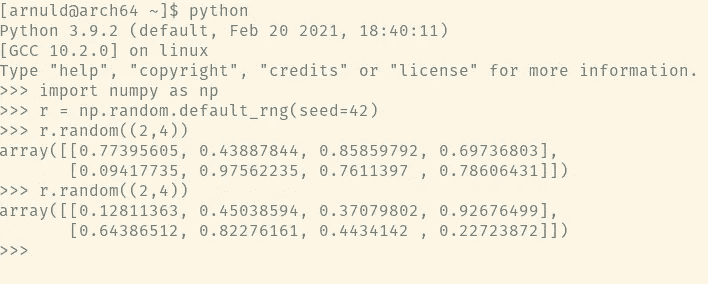
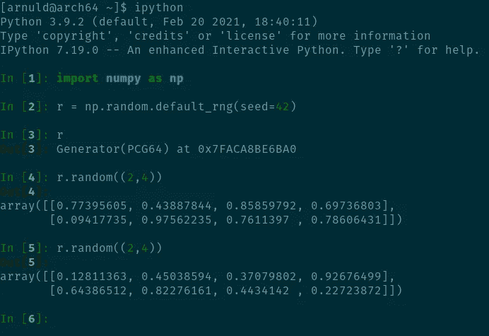
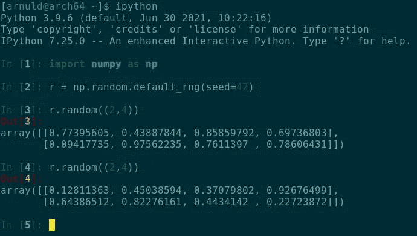
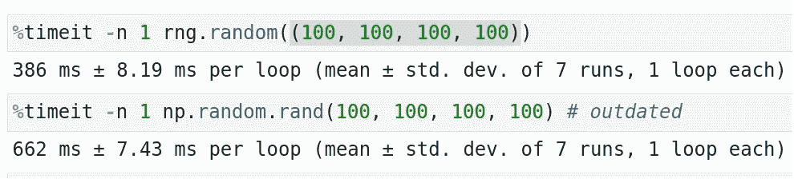
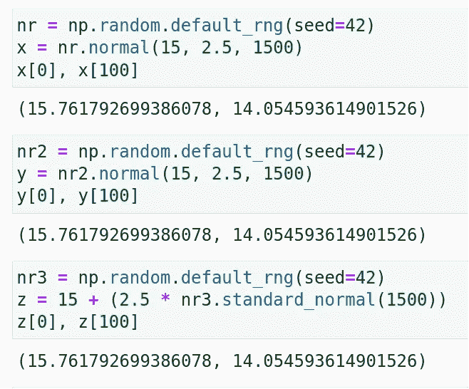
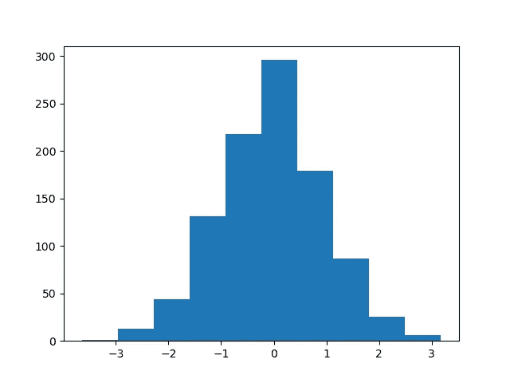
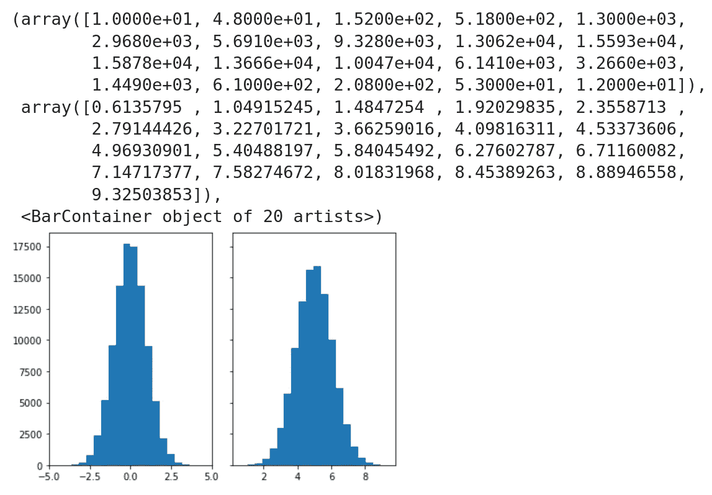

# NumPy 中的随机数

> 原文：<https://towardsdatascience.com/random-numbers-in-numpy-89172d6eac16?source=collection_archive---------28----------------------->

## 如何使用 NumPy 的更新方法在 Python 中生成随机数

照片由 [**黑冰**](https://www.pexels.com/@black-ice-551383?utm_content=attributionCopyText&utm_medium=referral&utm_source=pexels) 发自 [**Pexels**](https://www.pexels.com/photo/white-numbers-on-red-background-1314529/?utm_content=attributionCopyText&utm_medium=referral&utm_source=pexels)

> 按通常的理解，“1 2 3 4 5”不如“3 5 2 1 4”随机，当然也不如“47 88 1 32 41”随机，但“我们不能权威地说第一个序列不是随机的……它可能是偶然产生的。”— [维基百科](https://en.wikipedia.org/wiki/Random_number)

如果你在网上搜索如何在 Python NumPy 中生成[随机数，你很可能会看到这样的代码:](https://duckduckgo.com/?q=python+random+numbers+numpy&t=newext&atb=v1-1&ia=web)

作者 GitHub 要点

不久前，NumPy 已经更新了它生成随机数的方法，但是几乎所有的搜索结果都充斥着上述过时的代码，即使在今天也是如此。所以我决定写一篇小博文来解释这个更新的方法。过时的方法(在 NumPy 文档中称为 **legacy RandomState** )仍然有效，但是比新方法慢 2-10 倍。

那么，现在怎么产生随机数呢？

# 生成浮点数和整数

你可以复制粘贴代码并直接在 Jupyter 笔记本或 Python 解释器中运行它(在我的 [Arch Linux](https://en.wikipedia.org/wiki/Arch_Linux) 安装中，我默认使用了**Python 3 . 9 . 2**&**NumPy 1 . 20 . 1**)

作者 GitHub 要点

像往常一样， **seed=(some number)** 选项可以用来创建可重复的随机数，它工作得很好。在这里，前两个截图是在我的终端的两个不同的标签中同时拍摄的，而第三个截图是在几个月后在不同的 Python 版本中拍摄的。一个来自默认的 Python 解释器，另一个来自 IPython 解释器。检查随机方法调用的第二次运行是如何再现完全相同的数字的:

作者图片

作者图片

作者图片

你可以在第二张截图中看到**发生器(PCG64)** 。我们稍后会谈到这一点。首先，让我们探索更多的浮点数和整数随机数生成:

作者 GitHub 要点

这个可选参数" **out"** 并不适用于对 random 的每次调用。只对少数人开放。查看本文末尾的链接[4]

作者 GitHub 要点

下面是我的 Jupyter 实验室的截图，显示了两种方法在速度方面的比较:

作者图片

您在互联网上找到的基准测试通常依赖于上下文。尽管如此，这种更新的方法更快。

# 生成正态分布

如果我们不生成正态分布，任何关于随机数的对话都是不完整的。这是一个 [Google 数据科学面试问题](https://www.interviewquery.com/blog-google-data-science-interview-questions-and-solutions/)摘自面试查询( [Jay Feng](https://medium.com/u/6e9ddfaee83d?source=post_page-----89172d6eac16--------------------------------) ):

> 编写一个函数，从正态分布中生成 N 个样本，并绘制直方图

它由两部分组成。首先，我们将使用更新的 NumPy 方法生成正态分布，然后我们将使用 **matplotlib** 绘制直方图。问题中缺少的一点是，问题陈述告诉你从正态分布中抽取 N 个样本，但没有告诉你面试官需要什么样的均值和标准差。所以我们可以想出两种方法:

1.  编写一个函数，从标准正态分布中抽取 N 个样本(标准正态分布的平均值为 0，标准差为 1)
2.  编写一个函数，它有三个参数:平均值、标准差和 N。它从正态分布中生成 N 个样本。

作者 GitHub 要点

同样，如果您使用相同的**种子=(某个数字)**，那么您可以复制分布:

作者图片

现在让我们使用 **matplotlib** 绘制一个直方图:

这是它看起来的样子:

作者图片

我们可以使用正态分布绘制相同的图，其中有些值是平均值**和标准偏差**的值**。你只需要用 _normal()** 把函数替换成**就可以了。**

# Matplotlib 直方图示例

Matplotlib.org 在其图库部分有一个[直方图示例](https://matplotlib.org/stable/gallery/statistics/hist.html)。要使用更新的方法，您只需更改 3 行代码:

matplotlib 的原始代码(作者修改)

这是输出结果:

作者图片

如你所见，直方图显示了正态分布。如果与 matplotlib 库中的原始输出和图形进行比较，即使我们使用了相同的种子编号，输出值和图形都发生了变化。为什么？

这是因为新旧方法使用不同的方式生成随机数。 **Mersenne Twister 伪随机数发生器** (MT19937)就是老办法用的(现在还能用)。更新的方法使用**排列同余发生器** (PCG-64)。不涉及技术细节:他们之间的主要区别是 PCG-64 有更好的(想一想“远面糊”)统计性能相比，梅森图斯特。它速度更快，也更节省空间。

这就是 NumPy 中产生随机数的新方法。如果您需要完整的技术细节，请查看以下内容:

[1][https://numpy . org/doc/stable/reference/random/bit _ generators/PCG 64 . html](https://numpy.org/doc/stable/reference/random/bit_generators/pcg64.html)

[2][https://numpy . org/doc/stable/reference/random/bit _ generators/mt 19937 . html](https://numpy.org/doc/stable/reference/random/bit_generators/mt19937.html)

[https://www.pcg-random.org/](https://www.pcg-random.org/)

[4][https://numpy . org/doc/stable/reference/random/new-or-different . html](https://numpy.org/doc/stable/reference/random/new-or-different.html)

[5][https://en . Wikipedia . org/wiki/Permuted _ congential _ generator](https://en.wikipedia.org/wiki/Permuted_congruential_generator#cite_note-ONeill-5)

[https://en.wikipedia.org/wiki/Mersenne_Twister](https://en.wikipedia.org/wiki/Mersenne_Twister)